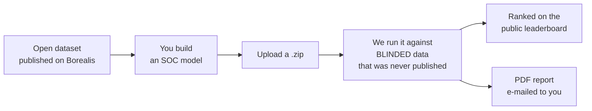
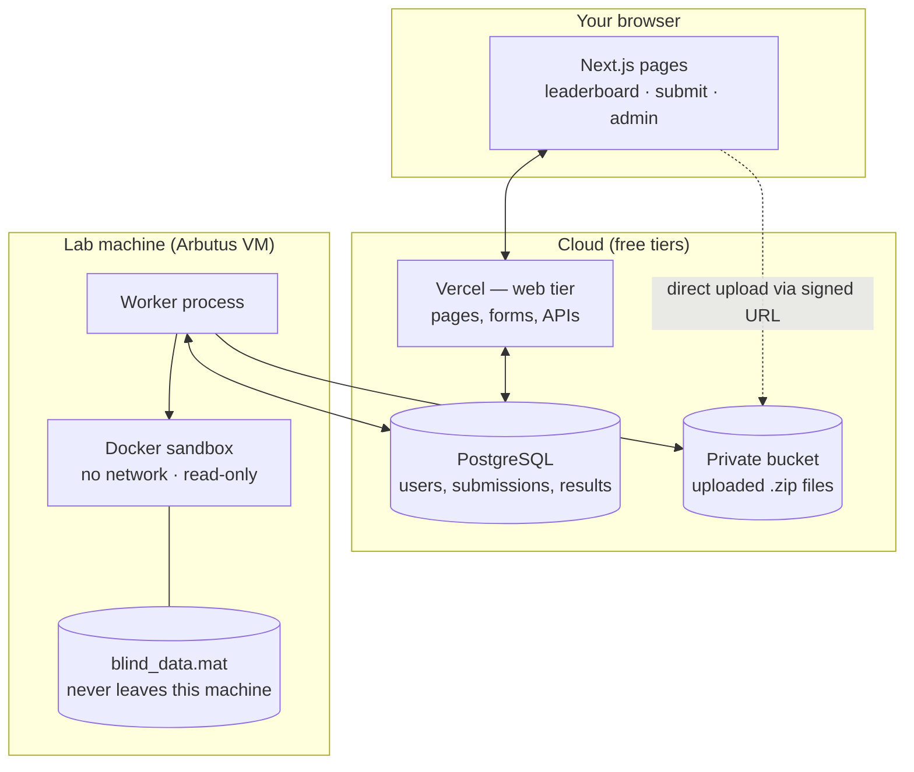

# Battery SOC Benchmark

Upload a battery **state-of-charge (SOC) estimation** algorithm. We run it against a **hidden dataset** measured on Tesla Model 3 2170 cells and publish the score on a public leaderboard.

**Live site:** https://battery-soc-benchmark.vercel.app

Built for Dr. Phillip Kollmeyer's battery research group, McMaster University. Based on *"A Blind Modeling Tool for Standardized Evaluation of Battery State of Charge Estimation Algorithms"* (IEEE ITEC+EATS 2022, [doi:10.1109/ITEC53557.2022.9813996](https://doi.org/10.1109/ITEC53557.2022.9813996)).

---

## Contents

1. [The idea](#1-the-idea) · 2. [Submit a model](#2-submit-a-model) · 3. [What happens when you submit](#3-what-happens-when-you-submit) · 4. [How the pieces connect](#4-how-the-pieces-connect) · 5. [How scoring works](#5-how-scoring-works) · 6. [Run it locally](#6-run-it-locally) · 7. [Run an evaluation worker](#7-run-an-evaluation-worker) · 8. [Repository map](#8-repository-map) · 9. [Troubleshooting](#9-troubleshooting)

---

## 1. The idea

A battery management system cannot measure how full a battery is — it has to *estimate* SOC from current, voltage and temperature. Hundreds of algorithms exist, but every paper reports results on its own data, so nobody can tell which is actually better.

This benchmark is the neutral referee:



Every model is scored on the **same hidden data** with the **same code**, so the numbers are directly comparable. That is the whole point.

**The blinded data** lives only on the evaluation machine. It is never in this repository, never on the website, and never sent anywhere. Your uploaded model is deleted immediately after it is scored.

---

## 2. Submit a model

### Your package

A `.zip` with **one** of these at the top level, plus any parameter files it loads:

| File | Runtime |
| --- | --- |
| `Model.py` | Python (numpy, scipy; PyTorch on request) |
| `Model.m` or `Model.p` | MATLAB (any toolbox the lab licence covers) |

### The function

Your model is called **once per sample**, in order, and carries its own memory `z` between calls — exactly as a real BMS would run it.

**Input** `X = [current, voltage, temperature]` — amps (negative = discharging), volts, °C.
**Return** the SOC estimate (0–1) and whatever state you want handed back next call.

```python
# Model.py — online Coulomb counter
CAPACITY_AH = 4.6

def Model(X, z=None):
    current = float(X[0])
    if z is None:                 # first sample: assume fully charged
        soc = 1.0
    else:
        soc = float(z) + current * (1 / 3600) / CAPACITY_AH
    return soc, soc               # (estimate, memory for next call)
```

```matlab
% Model.m — the same thing in MATLAB
function [Y_est, z] = Model(X, z)
    Current  = X(1);              % [A], negative = discharging
    Capacity = 4.6;               % [Ah]
    if nargin == 1                % first sample
        SOC = 1;
    else
        SOC = z + Current*(1/3600)/Capacity;
    end
    Y_est = SOC;  z = SOC;
end
```

Working examples of a Coulomb counter, EKF, FNN and LSTM — in both languages — are on the site's **Examples** page and in [`evaluator/examples/`](evaluator/examples/). Download one, unzip it, and start from there.

### The four steps

1. **Register** and confirm your e-mail.
2. **Test your package** on the `/submit` page. A *dry run* executes it against 2 hours of *open* data in seconds and shows the live console — this catches format and runtime errors before you spend a real submission.
3. **Submit.** You get a queue position and a live progress bar.
4. **Read the results.** Scores appear on your submission page and the leaderboard, and a PDF report is e-mailed to you and any co-authors you added.

---

## 3. What happens when you submit

```mermaid
sequenceDiagram
    participant You
    participant Web as Website (Vercel)
    participant DB as Database
    participant Worker as Worker (lab machine)
    participant Box as Docker sandbox

    You->>Web: upload package (.zip)
    Web->>Web: validate zip, check daily limit
    Web->>DB: create submission (QUEUED) + job
    Worker->>DB: poll every 2 s, claim oldest job
    Worker->>Box: run model against blinded data
    Box-->>Worker: progress lines, streamed
    Worker->>DB: live console, % complete, ETA
    Box-->>Worker: results.json
    Worker->>DB: scores + traces, mark COMPLETED
    Worker-->>You: PDF report by e-mail
    Note over Worker,Box: uploaded package is deleted
```

If a run fails it is retried once — unless the fault is in the package itself, in which case you get the exact error message instead.

---

## 4. How the pieces connect



**The one rule that explains the whole design:** the website never runs anyone's code and never sees the blinded data. It only reads and writes database rows. All dangerous work happens on the worker — and even the worker hands model execution to a throw-away Docker container with no network access and a read-only filesystem.

The two tiers share nothing but the database. Add another worker machine and it simply starts claiming jobs; nothing needs reconfiguring.

| Piece | Technology |
| --- | --- |
| Website | Next.js 15, React 19, TypeScript, Tailwind CSS 4, hosted on Vercel |
| Database | PostgreSQL (Supabase) through Prisma — `prisma/schema.prisma` is the single source of truth |
| File storage | Supabase Storage, private bucket; browser uploads via short-lived signed URL |
| Auth | Auth.js v5 — e-mail + password with verification |
| Worker | Node.js + Python (`socbench_eval`) + MATLAB, isolated with Docker |
| Reports | pdfkit (server-side vector charts), e-mail over SMTP |

---

## 5. How scoring works

For each submission the evaluator runs:

- a **validation cycle** first — if the model crashes here, you get the error in seconds instead of after 45 minutes;
- **144 blinded drive cycles** — 4 cells × 6 temperatures × 6 cycles — plus charging cycles;
- **robustness sweeps** — the model started at the wrong initial SOC (90 / 60 / 30 % instead of 100 %) and with current-sensor offsets (±0.05 / 0.1 / 0.3 A).

Each cycle is preceded by an hour of rest so models with internal state (filters, RNNs) can settle; that part is excluded from the metrics.

That produces **18 numbers** — mean RMSE per test case (blinded cell, non-blinded cells, charging, payload/HVAC conditions, standard vs non-standard cycles, each temperature from −20 to 40 °C, initial-SOC error, sensor offset).

> **Weighted error** = Σ (weight × RMSE), using the published weights, which sum to exactly 1. **Lower is better.** Ties break by submission time.

You also get a **complexity** bin (1–10) from measured time-per-sample relative to a plain Coulomb counter, so a cheap model and an expensive one are visibly different rather than judged on accuracy alone.

Full definitions and the current weights are on the site's **Methodology** page and in [`src/lib/test-cases.ts`](src/lib/test-cases.ts).

---

## 6. Run it locally

You need **Node.js 20+**, **Docker Desktop** and **Git**.

```bash
git clone https://github.com/McMaster-Battery-Research-Group/battery-soc-benchmark.git
cd battery-soc-benchmark
cp .env.example .env      # defaults work for local development
npm install
npm run setup             # Postgres in Docker + schema + demo data
npm run dev               # website at http://localhost:3000
npm run worker            # second terminal — processes jobs (fake scores by default)
```

Seeded local accounts: `admin@batterysocbenchmark.ca` / `Admin123!` (admin) and `a.rahman@example.edu` / `Password1` (user).

With no `SMTP_HOST` set, e-mails go to a throw-away **Ethereal** inbox and the preview link is printed in the terminal.

The local setup uses `EVALUATOR=mock`, which invents plausible scores in a few seconds so you can work on the website without the blinded data. Every setting is annotated in [`.env.example`](.env.example).

**Useful scripts:** `npm run dev` · `npm run worker` · `npm run typecheck` · `npm run lint` · `npm run smoke` (Playwright) · `npm run db:studio` (browse the database).

---

## 7. Run an evaluation worker

A worker is any machine with the blinded data that runs `npm run worker`. One process per machine; add machines to add throughput, since jobs are claimed atomically.

```bash
EVALUATOR=real                    # not the mock scorer
SOCBENCH_BLIND_DATA=/path/to/blind_data.mat
WORKER_RUNTIMES=python,matlab     # what this machine can execute
docker build -t socbench-eval evaluator     # the Python sandbox image
npm run worker
```

Each worker reports in every 15 seconds and appears on **Admin → Evaluation workers** with its CPU, memory, runtimes and live console. A worker only claims packages whose runtime it declares, so a machine without MATLAB will leave MATLAB submissions for one that has it.

Production today runs on an Alliance Cloud (Arbutus) VM that handles both Python and MATLAB, updates itself from `main` every 10 minutes, and is watched by an alerting job that e-mails administrators if it stops reporting in. Setup and operations are documented in the private `socbench-internal` repository.

---

## 8. Repository map

```
src/app/            pages, one folder per URL
  (marketing)/      dataset, methodology, examples, glossary, help, about, contests
  (auth)/           register, login, verify, password reset
  (app)/            leaderboard, compare, submit, submissions, profile
  (admin)/admin/    submissions, users, contests, messages, workers
  api/              status polling, PDF report, uploads
src/components/     React components — ui/, charts/, leaderboard/, layout/
src/lib/            shared logic: queries, scoring, storage, mail, PDF, validation
src/evaluator/      the worker: job claiming, sandbox launch, result parsing
evaluator/python/   THE BENCHMARK — numpy implementation of the scoring pipeline
evaluator/examples/ runnable reference packages (CC, EKF, FNN, LSTM)
matlab/             Run_Model.m (executes a MATLAB model) and the blind-data exporter
prisma/schema.prisma  every database table
scripts/            setup and operations scripts
```

To debug a package by hand:

```bash
cd evaluator/python
python -m socbench_eval package.zip outDir --data ../../blind-data/blind_data.mat
python -m socbench_eval package.zip outDir --dry-run     # open data only
```

---

## 9. Troubleshooting

| Symptom | Cause and fix |
| --- | --- |
| Submission stuck in **Queued** | No worker is online, or none declares that package's runtime. Check Admin → Evaluation workers. |
| "No evaluator for MATLAB packages is online" | A MATLAB-capable worker needs to be started; the job resumes on its own when one reports in. |
| Dry run fails instantly | `Model.py` / `Model.m` is not at the top level of the zip, or the function is not named `Model`. |
| Worker logs "Can't reach database server" | Network problem between the worker and the database. The worker retries every loop and recovers by itself. |
| E-mails not arriving | Without `SMTP_HOST` they go to Ethereal — look for the preview URL in the terminal. |
| `prisma generate` fails on Windows | Stop the dev server and worker first; a running process locks the generated client. |

---

## More

- **Methodology, dataset and glossary** — on the live site under *Learn*.
- **Dataset** — [doi:10.5683/SP3/ZVTR4B](https://doi.org/10.5683/SP3/ZVTR4B) (Borealis, CC-BY 4.0).
- **`socbench-internal`** (private, same organization) — operations runbook, security status, compliance notes and the open-work roadmap. Ask an organization owner for access.
