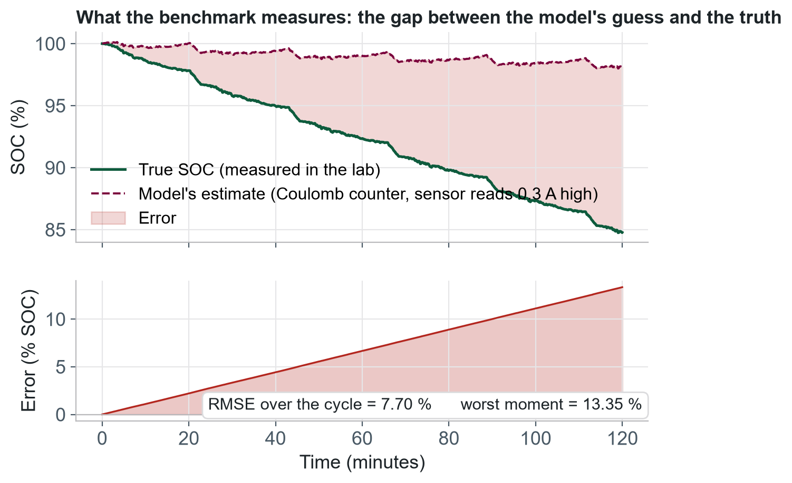

## 1. The estimation problem

> **In this chapter.** Why the state of charge of a lithium-ion cell must be estimated rather than measured, what drive-cycle data is and why the benchmark is built on it, how estimation error is defined, and why part of the dataset is withheld.

### 1.1 A quantity that cannot be measured

The **state of charge** (**SOC**) of a battery is the fraction of its usable capacity that remains, conventionally expressed as a percentage from 0 to 100. It is the quantity behind the range indicator of an electric vehicle, and it is an input to nearly every other decision a **battery management system** (**BMS**) makes: how much power may be drawn, how fast the pack may be charged, and when the vehicle must be protected from over-discharge. Yet no sensor measures it. What the BMS can observe, at rates of a few hertz, is the terminal current, the terminal voltage and the cell temperature. The state of charge must be inferred from these signals by an **estimator**, an algorithm executed continuously on the vehicle's battery controller.

The consequences of estimation error are practical. An estimate that reads high exposes the driver to a battery that is emptier than indicated; one that reads low forces the manufacturer to reserve capacity as a safety margin, capacity the customer has paid for but can never use. Estimators are also notoriously sensitive to operating conditions: an approach that performs well at room temperature may drift severely at sub-zero temperatures, where the cell's internal resistance rises and the relationship between voltage and state of charge flattens. A substantial research literature is therefore devoted to improving estimation methods, ranging from Coulomb counting and Kalman filtering to recurrent and transformer neural networks. This benchmark exists to evaluate those methods on a common footing.

### 1.2 Drive-cycle data

A **drive cycle** is a standardised speed-versus-time profile representing a particular kind of driving. Regulatory bodies have used a small set of them for decades to certify fuel economy and emissions, which makes them well characterised and reproducible. The benchmark uses six:

- **UDDS**, the Urban Dynamometer Driving Schedule, representing stop-and-go city driving.
- **HWFET**, the Highway Fuel Economy Test, representing steady highway driving.
- **LA92** and **US06**, more aggressive profiles with higher speeds, harder acceleration and harder braking.
- **HWCUST** and **HWGRADE**, two highway profiles designed by the laboratory. Neither has been published.

To generate the dataset, the laboratory took Tesla 2170 cylindrical cells, the cell format used in the Model 3, and subjected each to these profiles in a thermal chamber. A vehicle model translated the speed profile into the current the cell would deliver in a Model 3 at each instant: large discharge currents during acceleration, regenerative charging during braking, and no current at rest. Terminal voltage, cell temperature and the true state of charge were logged throughout. Figure 1.2 shows one such recording.

Each profile was repeated at six chamber temperatures from −20 °C to 40 °C, and on four cells that had each been cycled with a different simulated vehicle payload: a single occupant, a full passenger load with and without cabin climate control, and a trailer. The result is a dataset that exercises an estimator under the loads a battery actually experiences in a vehicle, across the temperature range where estimators are known to fail, with a measured ground truth against which every estimate can be compared.

### 1.3 Estimation error

For every sample of every drive cycle the true state of charge is known from the laboratory measurement. The model under test, given only current, voltage and temperature, produces its own estimate for the same sample. The difference between the two is the **estimation error**, and it is the sole quantity the benchmark measures. Every number on the leaderboard is an aggregate of it.

The error over a cycle is summarised by its **root-mean-square error** (**RMSE**): the error at each sample is squared, the squares are averaged over the cycle, and the square root is taken. RMSE penalises large excursions more heavily than a mean absolute error would. A model that is consistently 2 % high scores an RMSE of 2 %; a model that is exact for most of a cycle but wrong by 20 % for a few minutes scores considerably worse. This weighting is deliberate, since in a vehicle a bounded, predictable error is far more useful than an occasional large one.

The conditions under which error occurs matter as much as its magnitude. A model that is accurate at 25 °C but drifts at −20 °C is of limited use in a cold climate, and a model that is accurate only when initialised with the exact starting state of charge is of limited use in a vehicle, which does not know it. The scoring methodology therefore does not simply average error over the dataset. It reports error separately by cell, temperature and cycle type, and it includes two deliberate perturbations: a wrong initial state of charge and a constant bias on the current measurement. Chapter 5 sets out the full methodology.

### 1.4 Open and withheld data

Publishing the entire dataset and inviting groups to report their own results would not produce comparable numbers. Each group would select its own test cycles and its own error definition, and a model trained on published data can memorise it and appear far better than it is. The benchmark addresses both problems with a held-out evaluation set.

The **open dataset**, published on the Borealis research data repository, contains characterisation tests and drive cycles for three of the four cells. Researchers develop and train on it without restriction. The **withheld dataset** (referred to in the code as the *blinded* data) contains the entire fourth cell, m448, together with cycles and conditions absent from the open set. It has never been published and it never touches the web tier. Every submitted model is scored on the withheld data, and the leaderboard reports the withheld-cell error beside the open-cell error. A model that performs well on the open cells and poorly on the withheld one has fitted the published data rather than learned the underlying behaviour, and the comparison makes this visible.

### 1.5 What the benchmark provides

The benchmark provides a single, fixed evaluation: the same withheld data, the same evaluation code, the same error definition and the same published weights for every model. A researcher packages an estimator as a single Python or MATLAB function together with its parameter files, uploads the package, and receives within minutes a weighted score, a per-test breakdown, per-cycle traces and a PDF report. The score is placed on a public leaderboard where it is directly comparable with every other entry. The uploaded package is deleted as soon as it has been evaluated.

