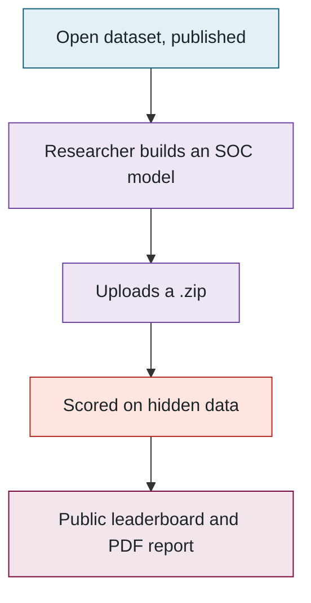
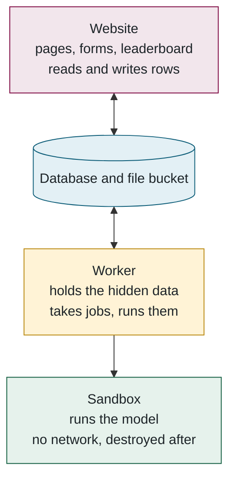

## 1. The five-minute version

> **Plain English.** Researchers upload a small program that guesses how full a battery is. We run it against battery data that has never been published, score it with a fixed public formula, and put the score on a public leaderboard. Everyone is scored on the same hidden data with the same code, so the numbers are comparable. The uploaded program is deleted the moment it is scored, and it never touches the website.

### The problem

Every battery paper reports its own accuracy on its own data, so nobody can tell whose method is actually better. The benchmark fixes the data and the test: same hidden cycles, same scoring code, every model. Read the diagram top to bottom — it is the whole idea in five steps:

### Three programs, and what each may touch

The design comes down to one rule: **the website never runs anyone's code and never sees the hidden data.** A separate worker machine does that, and even the worker hands the model to a throw-away container. Three words will come up on every page from here on — *website*, *worker*, *sandbox* — and this is what each one is. The arrows show who is allowed to talk to whom:

The website and the worker share nothing but the database; they never talk to each other. That is why a second worker machine needs no configuration (it just starts taking jobs), why the site stayed up during a ten-hour network outage that cut the worker off, and why the queue is a database table rather than a separate service.

### Where things run

| What | Where | Why |
|---|---|---|
| Website | Vercel (free tier) | Hosts Next.js with no servers to manage |
| Database and file bucket | Supabase (free tier) | PostgreSQL and file storage in one account |
| Worker, hidden data, MATLAB | A VM on Arbutus, the Alliance research cloud | The lab controls it; it is the only place the hidden data exists |
| Source code | GitHub, `McMaster-Battery-Research-Group` | Collaborators can read and propose; only the owner merges |

**Files to open:** [README.md](../../README.md) → [prisma/schema.prisma](../../prisma/schema.prisma) → [src/evaluator/worker.ts](../../src/evaluator/worker.ts).

