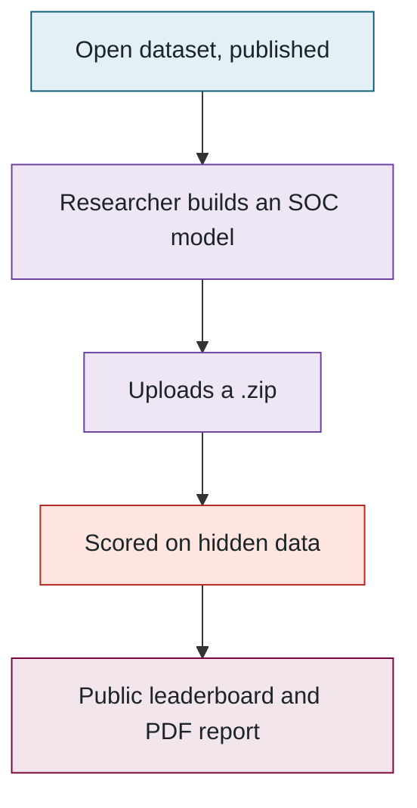
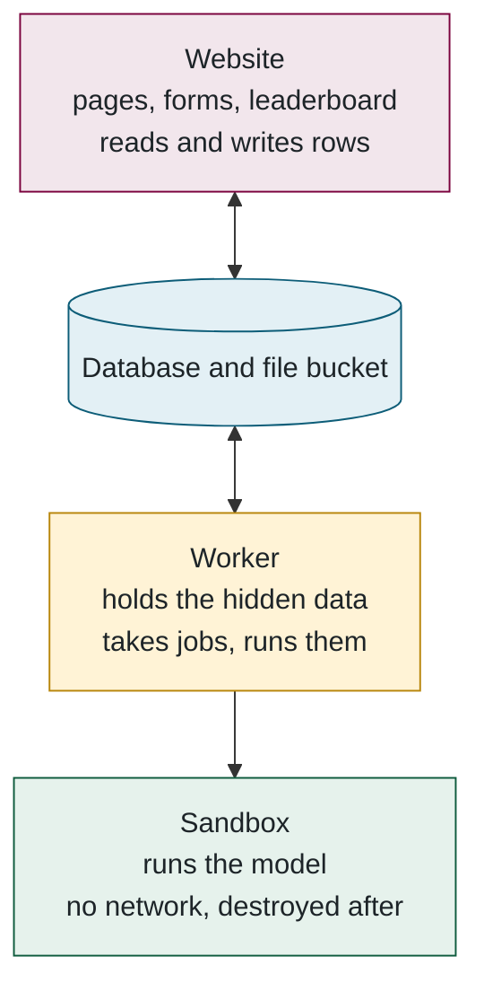

## 1. The five-minute version

> **Plain English.** An electric car has no way to measure how much charge is left in its battery. There is no float in the tank; the only things it can measure are the current flowing in and out, the voltage, and the temperature, and from those it has to *estimate* the state of charge. Get it wrong and a driver is stranded with a gauge that said 20 %, or a carmaker has to hide part of the battery as a safety margin. So a lot of research goes into the algorithm that makes that estimate.
>
> The trouble is that every research group tests its own algorithm on its own battery, its own driving data and its own definition of error, and then reports a number. Nobody can tell whether a claimed 1.5 % is better than someone else's 2 %, because they were measured on different things.
>
> This benchmark gives everyone the same test. A researcher uploads their algorithm as a small program. We run it against real battery data that has never been published, score it with one fixed and public formula, and put the score on a public leaderboard next to everyone else's. Same hidden data, same code, so the numbers finally mean the same thing. The uploaded program is deleted the moment it has been scored, and it never touches the website.

### The idea in five steps

Read the diagram top to bottom. The first step is public, the fourth is secret, and everything the benchmark promises rests on that difference:

### The data: drive cycles

A drive cycle is a recording of a real kind of trip: how fast a car goes, second by second, through a standard pattern of driving. Some are stop-and-go city traffic, some are steady highway, some are aggressive with hard acceleration and braking. The industry has used the same handful of these for decades to test fuel economy, so they are well known and repeatable.

For this benchmark the lab took real Tesla battery cells and put each one through those trips in a thermal chamber, drawing exactly the current a Tesla Model 3 would draw from that cell at each moment — high current when the car accelerates, current flowing back in when it brakes, nothing when it idles — while recording voltage, temperature and the true state of charge the whole time. Every cycle was repeated at six temperatures from −20 °C to 40 °C, because a cold battery behaves very differently from a warm one.

That is what makes the data useful. A model is judged on the messy, realistic loads a battery sees in a car, not on a tidy laboratory discharge; it is judged at the cold temperatures where estimators usually fail; and because the recordings include the true state of charge, every guess the model makes can be checked exactly. Some of the trips, and one whole cell, were never published, so no model can have memorised them.

### Three programs, and what each may touch

The design comes down to one rule: **the website never runs anyone's code and never sees the hidden data.** A separate worker machine does that, and even the worker hands the model to a throw-away container. Three words will come up on every page from here on — *website*, *worker*, *sandbox* — and this is what each one is. The arrows show who is allowed to talk to whom:

The website and the worker share nothing but the database; they never talk to each other. That is why a second worker machine needs no configuration (it just starts taking jobs), why the site stayed up during a ten-hour network outage that cut the worker off, and why the queue is a database table rather than a separate service.

### Where things run

| What | Where | Why |
|---|---|---|
| Website | Vercel (free tier) | Hosts Next.js with no servers to manage |
| Database and file bucket | Supabase (free tier) | PostgreSQL and file storage in one account |
| Worker, hidden data, MATLAB | A VM on Arbutus, the Alliance research cloud | The lab controls it; it is the only place the hidden data exists |
| Source code | GitHub, `McMaster-Battery-Research-Group` | Collaborators can read and propose; only the owner merges |

**Files to open:** [README.md](../../README.md) → [prisma/schema.prisma](../../prisma/schema.prisma) → [src/evaluator/worker.ts](../../src/evaluator/worker.ts).

