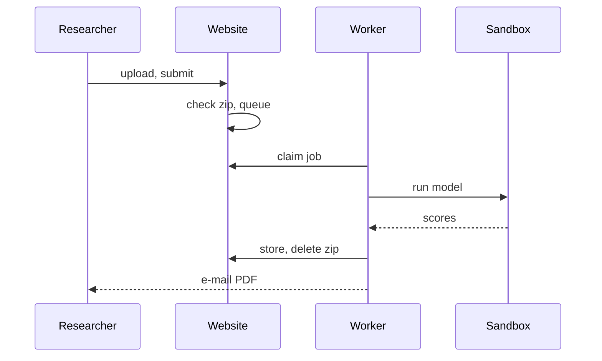
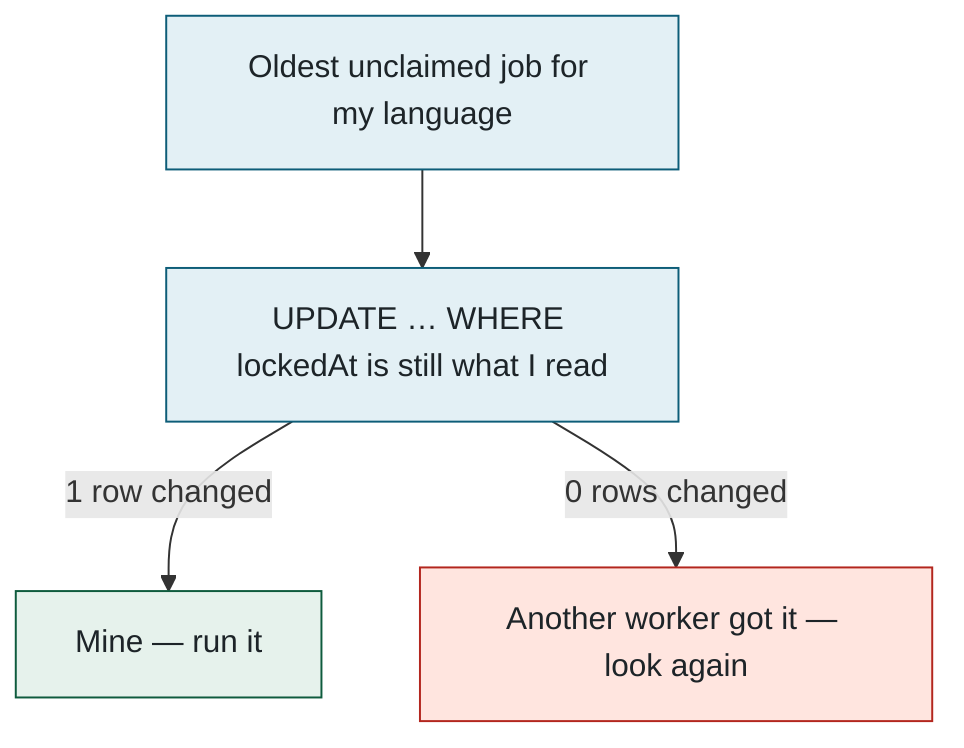
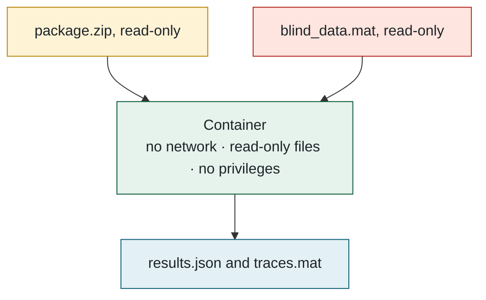
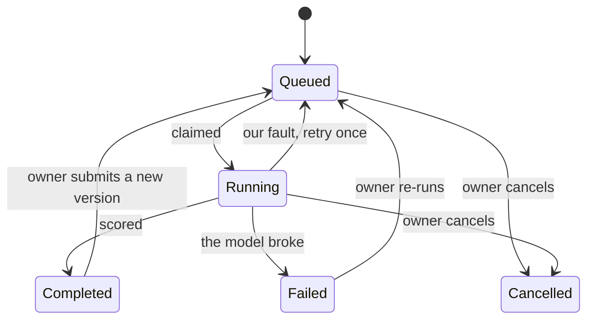

## 2. How a submission is evaluated

> **Plain English.** A researcher uploads a zip. The website checks it and puts a ticket in a queue. A worker takes the ticket, downloads the zip, runs the model inside a sealed box against the secret data, saves the scores, deletes the zip, and e-mails a PDF. If anything goes wrong, the researcher is told exactly what.

Part 1 introduced the three programs. This part follows one submission through all three, in order; the numbered steps after the diagram explain each arrow.

### The journey

Time runs downward. Solid arrows are actions; dashed arrows are things coming back.

### Step by step

**1. Upload.** The browser sends the zip straight to the file bucket using a short-lived signed link, because the website's host only accepts requests under 4.5 MB and packages can be 50 MB. The form then carries only the file's key.

**2. Check.** One server action does everything, cheapest check first: signed in? under the daily cap of 3? name and description valid? Then it fetches the zip back and inspects it — size and entry limits, no folders, no path tricks, exactly one `Model.py` or `Model.m`/`Model.p` at the top level. Any failure deletes the upload and shows the exact reason. Passing creates the `Submission` and its `EvaluationJob` (the queue ticket) in one insert, and records whether it is a Python or MATLAB package.

**3. Wait.** The submission page polls every 2.5 s and shows the queue position, an estimated start time, and whether a worker for this package's language is online. All of it is derived from two tables: the workers' heartbeats and the job queue.

**4. Claim.** Workers poll every 2 s. Taking a job is a single conditional update — lock this row *only if it is still unlocked* — so two workers can never take the same job. The diagram is one attempt; the two branches are the only outcomes:

Every progress line the model prints refreshes the lock, so a live job is never mistaken for a dead one; a job whose worker died becomes claimable again after 30 quiet minutes, with two attempts in total.

**5. Run.** The worker starts one Docker container with three mounts and nothing else: the package (read-only), the hidden data (read-only), and an output folder. Everything the container prints streams into the job log, which is what the website shows as the live console. A timer (default 6 h) and the owner's Cancel button both kill the container and any MATLAB inside it. What the container is *not* allowed to do is the subject of Part 5. Two things go in, one thing comes out:

**6. Store.** The worker checks that all 18 metrics are finite numbers, re-derives the headline score with the active weights as a cross-check, writes the result and marks the submission complete in one transaction, uploads the full-resolution traces file, appends a line to the submission's score history, and **deletes the package**. Only then does it build the PDF and e-mail the owner and any confirmed co-authors.

**7. The other endings.** Every state a submission can be in, and what moves it between them:

A failure caused by the package (it crashed, returned NaN, ran out of time) is final and the message is stored verbatim; a failure caused by us (Docker down, a bug) is retried once. Stopping the worker hands its job back to the queue without using up an attempt.

**Files to open:** [submit/actions.ts](../../src/app/(app)/submit/actions.ts) → [package-check.ts](../../src/lib/package-check.ts) → [run-job.ts](../../src/evaluator/run-job.ts) → [python-evaluator.ts](../../src/evaluator/python-evaluator.ts).

