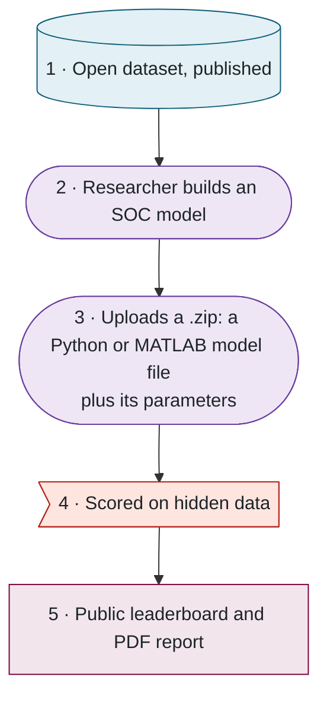

## 2. The benchmark in one picture

> **In this chapter.** The five steps from open data to leaderboard, the three programs that make them happen, the one rule that keeps the hidden data safe, and where each piece physically runs.

### 2.1 Five steps

The whole benchmark is five steps, and the difference between the first and the fourth is what it rests on:

Figure 2.2. The five steps. Step 1 is public, step 4 is secret, and the benchmark's credibility is the gap between them.

### 2.2 Three programs and one rule

Behind the website there are three separate programs, and the design comes down to one rule: **the website never runs anyone's code and never sees the hidden data.** A different computer, the **worker**, does both of those things. Even the worker does not run a model directly; it hands the model to a **sandbox**, a sealed temporary environment inside the machine with the network switched off and the files locked, which is thrown away afterwards.

The website and the worker never talk to each other. Everything passes through the database, so a second worker machine needs no configuration (it simply starts taking jobs), the site stays up if the worker goes offline (as it did during a ten-hour network outage in September 2026), and the queue of work is an ordinary database table rather than a separate service.

### 2.3 Where things run

| What | Where | Why |
|---|---|---|
| Website | Vercel, a hosting service (free tier) | Runs the site with no servers of our own to look after |
| Database and file bucket | Supabase, a hosted database service (free tier) | The PostgreSQL database and file storage in one account |
| Worker, hidden data, MATLAB | A virtual machine (a rented computer in the cloud) on Arbutus, the Digital Research Alliance of Canada's research cloud | The lab controls it, and it is the only place the hidden data exists |
| Source code | GitHub, in the `McMaster-Battery-Research-Group` organisation | Collaborators can read and propose changes; only the owner merges |

### 2.4 How to read the figures

Every diagram from here on uses one set of colours and shapes, so a kind of thing looks the same on every page and still reads in black and white:

```mermaid
flowchart LR
    W["Website"] ~~~ K[["Worker"]] ~~~ S{{"Sandbox"}} ~~~ D[("Data")] ~~~ E[/"Outside service"/] ~~~ P(["Person"]) ~~~ X>"Hidden data or risk"]
    classDef web fill:#F2E6EC,stroke:#7A003C,color:#1d2428
    classDef worker fill:#FFF3D6,stroke:#B8860B,color:#1d2428
    classDef sandbox fill:#E6F2EC,stroke:#0E5B3D,color:#1d2428
    classDef data fill:#E3F0F5,stroke:#0D5D78,color:#1d2428
    classDef ext fill:#F0F0F0,stroke:#495965,color:#1d2428
    classDef person fill:#EFE6F5,stroke:#6B3FA0,color:#1d2428
    classDef danger fill:#FFE5DF,stroke:#B3261E,color:#1d2428
    class W web
    class K worker
    class S sandbox
    class D data
    class E ext
    class P person
    class X danger
```

Figure 2.4. The shapes and colours used in every diagram.

**Files to open:** [README.md](../../README.md) → [prisma/schema.prisma](../../prisma/schema.prisma) → [src/evaluator/worker.ts](../../src/evaluator/worker.ts).

