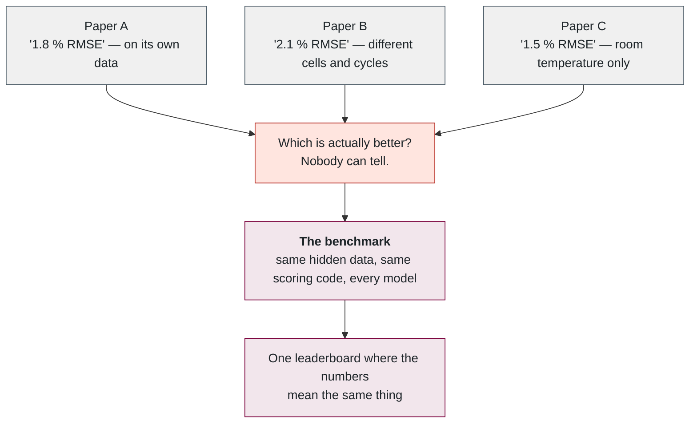
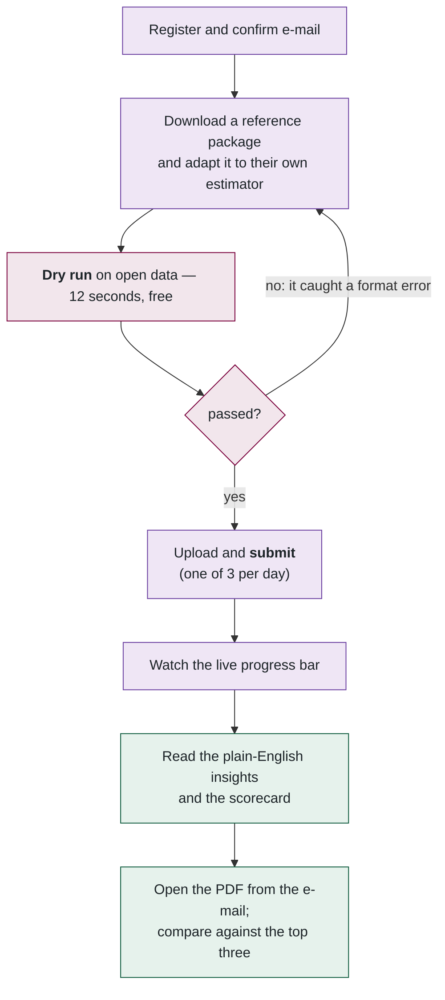
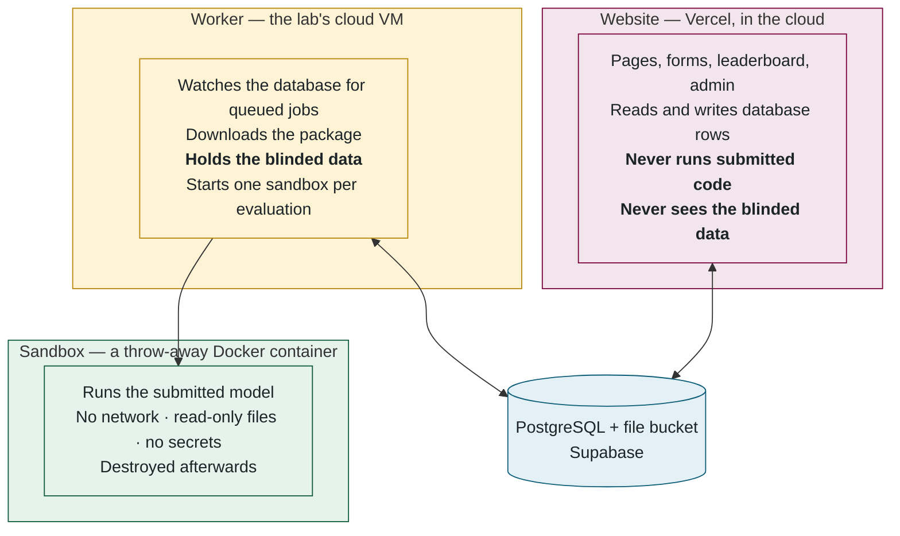

## 2. The five-minute version

> **Plain English.** Researchers upload a small program that guesses how full a battery is. We run that program against battery data that has never been published, score it with a fixed public formula, and put the score on a public leaderboard. Everyone is scored on the same hidden data with the same code, so for the first time the numbers are comparable. The uploaded program is deleted the moment it has been scored, and it never touches the website.

### The problem it solves

### A researcher's experience, start to finish

### The three tiers, and what each may touch

Everything in the system is one of three kinds of program. The most important fact about the design is *what each is allowed to reach*.

The website and the worker share **nothing but the database**. They never talk to each other. That one fact explains a great deal of what follows: why adding a second worker machine needs zero configuration (it simply starts claiming jobs), why the website stayed up during a ten-hour network outage that cut the worker off, and why the queue is a database table rather than a queue service.

### What could go wrong, and what stops it

| Worry | What stops it |
|---|---|
| A malicious model steals the blinded data | It can read it (it must, to be scored) but cannot send it anywhere: no network, and the container is destroyed afterwards |
| A malicious model attacks the website or database | It cannot reach them — they are on different machines, and the sandbox has no network |
| A model runs forever | Hard timeout (360 min), enforced both inside and outside the container |
| A researcher's code is kept and misused | The package is deleted the moment it is scored; only scores and traces remain |
| Someone floods the queue | 3 submissions per person per day; uploads and dry runs rate-limited |
| Two workers evaluate the same model | Atomic claim (Part 4) |
| A worker crashes mid-run | Lock goes stale after 30 min; another worker picks the job up; two attempts per job |
| The worker loses its network | It retries every 2 s and resumes by itself; admins are e-mailed after 3 minutes of silence |
| Someone guesses passwords | bcrypt hashing plus 10 attempts per 15 min per account |

### Where each thing physically is

| What | Where | Why there |
|---|---|---|
| Website | Vercel, free tier | Zero-ops hosting for Next.js; scales itself |
| Database + file bucket | Supabase, free tier | PostgreSQL and object storage in one account |
| Worker | Arbutus VM, Ubuntu 24.04, 8 vCPU / 12 GB | The lab controls it; MATLAB can be licensed there; the only place the blinded data exists |
| MATLAB | Inside a Docker image on that VM | So MATLAB models run in the same kind of sandbox as Python ones |
| Source code | GitHub, `McMaster-Battery-Research-Group` organization | Read-only collaborators can read and propose; only the owner merges |
| E-mail | Gmail SMTP today; Resend once a domain exists | Configuration only — the code is provider-agnostic |

**Files to open, in order:** [README.md](../../README.md) → [prisma/schema.prisma](../../prisma/schema.prisma) → [src/evaluator/worker.ts](../../src/evaluator/worker.ts).

