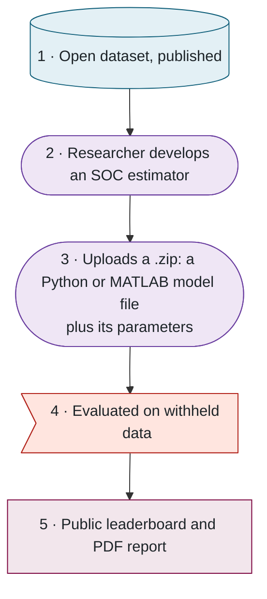

## 2. The platform in outline

> **In this chapter.** The five stages from open data to leaderboard, the three programs that implement them, the architectural rule that protects the withheld data, and where each component is hosted.

### 2.1 Five stages

The platform reduces to five stages, and its credibility rests on the separation between the first and the fourth:

Figure 2.2. The five stages. Stage 1 is public and stage 4 is confidential; the benchmark's validity depends on keeping them apart.

### 2.2 Three programs and one rule

Behind the website are three separate programs, and the architecture follows from one rule:

> **The web tier never executes submitted code and never has access to the withheld data.**

The three programs divide the work as follows:

- **The website** serves pages and forms, records submissions, and shows results. It reads and writes the database and nothing else.
- **The worker** is a separate machine under the laboratory's control. It holds the withheld data, claims queued submissions and runs each evaluation.
- **The sandbox** is an isolated container the worker starts for every evaluation: no network access, a read-only filesystem, discarded when the run ends. It is the only place a submitted model is ever executed.

The website and the worker never communicate directly; all coordination passes through the database. Three consequences of this recur throughout the manual:

1. An additional worker can be added with no configuration, since it simply begins claiming jobs.
2. The website remains fully available when no worker is reachable, as it did during a ten-hour network outage in September 2026.
3. The job queue is an ordinary database table rather than a separate message-queue service.

### An analogy: the sealed examination

The arrangement is easier to remember as the way a university runs a written examination. Figure 2.4 draws the comparison.

- **The registrar's office is the website.** Candidates enrol, hand in a sealed script, and later read their mark on the noticeboard. The clerks never open a script and have never seen the answer key.
- **The filing room is the database.** The registrar drops each script in the IN tray; the examiner collects it from there and returns the mark to the DONE tray. The two never meet, so a second examiner can start work simply by collecting from the same tray.
- **The locked marking room is the worker.** It holds the only copy of the answer key. Nobody but the examiner enters, and the examiner never leaves with it.
- **The sealed exam booth is the sandbox.** The script is answered against the key one at a time, in a booth with no phone and no window, and is shredded the moment it has been marked. Nothing that happens in the booth can reach the outside, and nothing is kept.

A submitted model is the candidate. It is given the questions (the withheld drive cycles), writes its answers (the estimates), and is marked against the key (the reference state of charge). It never sees the key, and no copy of it survives the examination.

### 2.3 Where the components are hosted

Each program runs on a different service, chosen so that the platform costs nothing to host and so that the withheld data stays on a machine the laboratory controls. Figure 2.5 shows the four.

### 2.4 Visual conventions

Every diagram in this manual uses one icon, one colour and one shape for each kind of thing, so a component looks the same on every page. The pictures use the icons; the flow diagrams, which are drawn with a diagramming tool that cannot show icons, use the shapes and colours. Figure 2.6 is the key to both.

**Files to open:** [README.md](../../README.md) → [prisma/schema.prisma](../../prisma/schema.prisma) → [src/evaluator/worker.ts](../../src/evaluator/worker.ts).

