## 2. The platform in outline

> **In this chapter.** The five stages from open data to leaderboard, the three programs that implement them, the architectural rule that protects the withheld data, and where each component is hosted.

### 2.1 Five stages

The platform reduces to five stages, and its credibility rests on the separation between the first and the fourth:

Figure 2.2. The five stages. Stage 1 is public and stage 4 is confidential; the benchmark's validity depends on keeping them apart.

### 2.2 Three programs and one rule

Behind the website are three separate programs, and the architecture follows from one rule: **the web tier never executes submitted code and never has access to the withheld data.** Both of those responsibilities belong to a separate machine, the **worker**. The worker in turn does not execute a model directly; it delegates execution to a **sandbox**, an isolated container with no network access and a read-only filesystem, which is discarded after each evaluation.

The website and the worker never communicate directly. All coordination passes through the database. This has three consequences that recur throughout the manual: an additional worker can be added with no configuration, since it simply begins claiming jobs; the website remains fully available when no worker is reachable, as it did during a ten-hour network outage in September 2026; and the job queue is an ordinary database table rather than a separate message-queue service.

### 2.3 Where the components are hosted

| Component | Host | Rationale |
|---|---|---|
| Website | Vercel, a managed hosting service (free tier) | Serverless hosting with automatic deployment from the repository; no servers to administer |
| Database and object storage | Supabase, a managed PostgreSQL service (free tier) | Database and file storage under one account |
| Worker, withheld data, MATLAB | A virtual machine on Arbutus, the Digital Research Alliance of Canada's research cloud | Under the laboratory's control, and the only location where the withheld data exists |
| Source code | GitHub, `McMaster-Battery-Research-Group` organisation | Collaborators may read and propose changes; only the owner merges |

### 2.4 Visual conventions

Every diagram in this manual uses a single set of colours and shapes, so that a given kind of component looks the same on every page and remains distinguishable in monochrome:

```mermaid
flowchart LR
    W["Website"] ~~~ K[["Worker"]] ~~~ S{{"Sandbox"}} ~~~ D[("Data")] ~~~ E[/"External service"/] ~~~ P(["Person"]) ~~~ X>"Withheld data or risk"]
    classDef web fill:#F2E6EC,stroke:#7A003C,color:#1d2428
    classDef worker fill:#FFF3D6,stroke:#B8860B,color:#1d2428
    classDef sandbox fill:#E6F2EC,stroke:#0E5B3D,color:#1d2428
    classDef data fill:#E3F0F5,stroke:#0D5D78,color:#1d2428
    classDef ext fill:#F0F0F0,stroke:#495965,color:#1d2428
    classDef person fill:#EFE6F5,stroke:#6B3FA0,color:#1d2428
    classDef danger fill:#FFE5DF,stroke:#B3261E,color:#1d2428
    class W web
    class K worker
    class S sandbox
    class D data
    class E ext
    class P person
    class X danger
```

Figure 2.4. The shapes and colours used in every diagram.

**Files to open:** [README.md](../../README.md) → [prisma/schema.prisma](../../prisma/schema.prisma) → [src/evaluator/worker.ts](../../src/evaluator/worker.ts).

