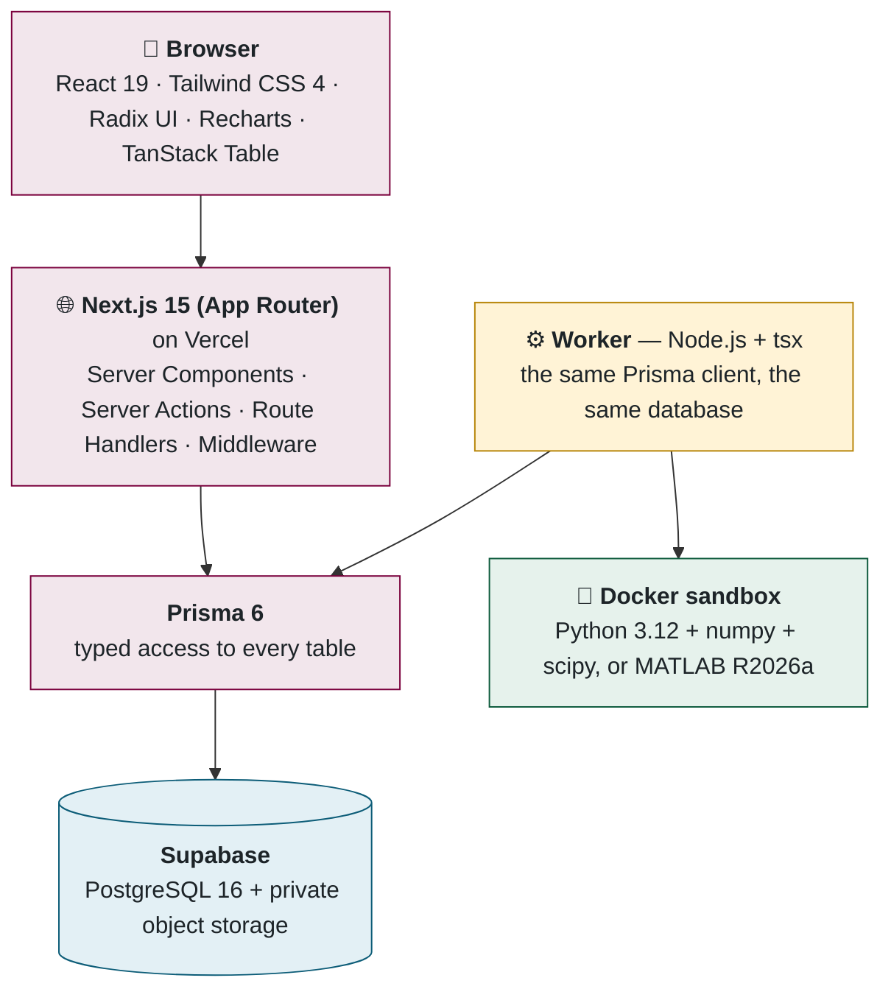
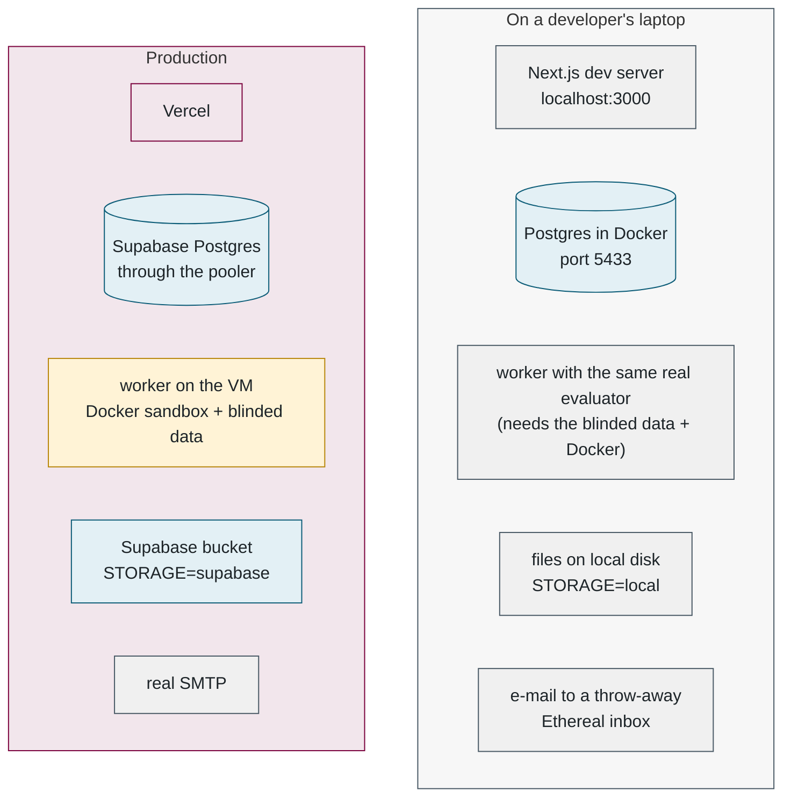

## 2. 🧰 The tools and libraries, and why each one

> 💡 **Plain English.** Software is assembled from existing building blocks. This part names each block, says what it is in one sentence, why we chose it over the alternatives, and — for non-developers — what it is analogous to. The short version: everything runs on free tiers, the website and the worker are written in the same language, and MATLAB is used for exactly one job.

### 🧱 The stack as layers

### 🧪 Development versus production

The same code runs in two very different environments. Knowing which is which explains most "works on my machine" confusion.

Switching between them is entirely `.env` configuration — `STORAGE`, `DATABASE_URL`, `SMTP_HOST`, `SOCBENCH_BLIND_DATA` — never a code change. There is no fake scorer: a developer's worker runs the same evaluator as production, so local results are real results.

### 🌐 Web application

| Tool | What it is | Why we use it | Analogy |
|---|---|---|---|
|  **TypeScript 5** | JavaScript with a type system that catches mistakes before the code runs | One language for the website *and* the worker; refactoring is safe | Spell-check for code |
|  **Node.js 22** | Runs JavaScript/TypeScript outside a browser | The server side and the worker | The engine |
|  **Next.js 15** (App Router) | The web framework: pages, forms and small APIs in one project, rendered on the server | Free hosting on Vercel; server rendering keeps database access off the browser; one project instead of "front end + API" | The chassis everything bolts onto |
|  **React 19** | The library for building interfaces from components | Next.js is built on it | Lego bricks for screens |
| **Server Components** | React components that run *only on the server* and can read the database directly | No API layer to build or secure for reading | A page that fills itself in before it is sent |
| **Server Actions** | Functions that run on the server but are called like ordinary functions from a form | No API layer for writing either; validation and auth sit beside the logic | A form that knows where to go |
| **Route Handlers** | Plain URL endpoints (`/api/…`) for the few things that need one | Status polling, PDF download, upload URLs, the health check | Doors for other programs |
| **Middleware** | Code that runs before a page, at the network edge | Redirects signed-out users away from protected pages | A bouncer at the door |
|  **Tailwind CSS 4** | Styling as small utility classes in the markup | Fast to build; McMaster maroon and gold defined once as tokens | Paint by numbers |
|  **Radix UI** | Unstyled, accessible dialogs, menus, tooltips, switches | Keyboard and screen-reader behaviour done right, our look on top | Door hinges that just work |
| **Recharts 3** | Charts as SVG | Vector charts, PNG export, a custom MATLAB-style zoom for SOC traces | The graph paper |
| **TanStack Table 8** | A "headless" table engine: sorting, filtering, column visibility, no visuals | The leaderboard's column picker and filters | The spreadsheet brain without the spreadsheet |
|  **zod 4** | Declares what an input must look like and validates it | One schema per form, run in the browser *and* the server action | The form's rulebook |
| **Auth.js v5** | Login sessions for Next.js | E-mail + password with verification, no third-party identity provider | The ID card office |
| **bcryptjs** | Password hashing | Slow on purpose, so guessing passwords is expensive | A one-way scrambler |
| **nodemailer** | Sends e-mail over SMTP | Provider-agnostic — swapping Gmail for Resend is configuration | The post room |
| **pdfkit** | Draws PDFs programmatically, including vector charts | The report attached to results e-mails, no browser needed | A plotter |
| **adm-zip** | Reads zip files | Validating the package before anything runs | The parcel inspector |
| **Playwright** | Drives a real browser to test pages | Catches the class of bug only a real browser shows | A robot tester |

### 🗄️ Data

| Tool | What it is | Why we use it |
|---|---|---|
|  **PostgreSQL 16** | The relational database | Robust, free on Supabase, and the data (users → submissions → results) is naturally relational |
|  **Prisma 6** | The ORM: `prisma/schema.prisma` describes every table; the generated client gives typed queries | Website and worker share one schema and one client; changing a column is one edit |
|  **Supabase** | Hosted PostgreSQL + object storage + a connection pooler, one free account | One dashboard; the bucket and the database live together |
| **Supavisor (the pooler)** | Sits in front of PostgreSQL and funnels thousands of short-lived connections through a few real ones | Serverless functions each open their own connection; Postgres would run out in seconds |

### 🧮 Evaluation

| Tool | What it is | Why we use it |
|---|---|---|
|  **Python 3.12 + numpy + scipy** | The numerical language and its array/science libraries | The benchmark maths is numpy: exact, fast, no licence, runs anywhere. scipy reads and writes `.mat` files |
| **MATLAB R2026a** | The lab's native language; many submissions are `.m`/`.p` | Used *only* to execute MATLAB models — 40 lines of MATLAB, nothing else |
|  **Docker** | Runs each evaluation in an isolated container | Submitted code is untrusted; isolation is non-negotiable |
| **`mathworks/matlab-deep-learning:r2026a`** | MathWorks' official MATLAB container with the deep-learning toolboxes | No MATLAB install on the VM; every toolbox submissions have needed is inside (24.5 GB) |
| **MathWorks online licensing** | Licensing MATLAB through a MathWorks account instead of a licence server | The only way to license MATLAB on a headless cloud machine without a campus licence server |

### 🏗️ Operations

| Tool | What it is | Why we use it |
|---|---|---|
|  **Vercel** | Hosting for Next.js | Free tier, automatic deploys from GitHub, serverless scaling |
|  **Arbutus / OpenStack** | The Alliance's research cloud | Free allocation for the lab; a persistent VM we control |
| **systemd** | Linux service manager | Runs the worker on boot, restarts it on crash, applies sandbox hardening |
|  **GitHub Actions** | CI runner | One job: ping the health endpoint every 10 minutes |
|  **ufw** | Linux firewall | Default-deny inbound; SSH only |
|  **tsx** | Runs TypeScript directly | The worker starts as `node --import tsx src/evaluator/worker.ts`, no build step |
|  **dotenv** | Loads `.env` files into environment variables | Local development configuration |

📌 **Files to open, in order:** [package.json](../../package.json) → [.env.example](../../.env.example) → [next.config.ts](../../next.config.ts).

