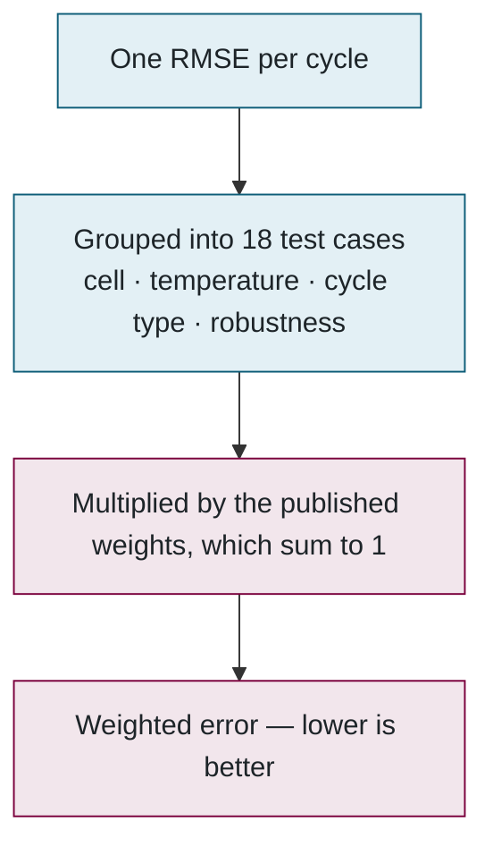
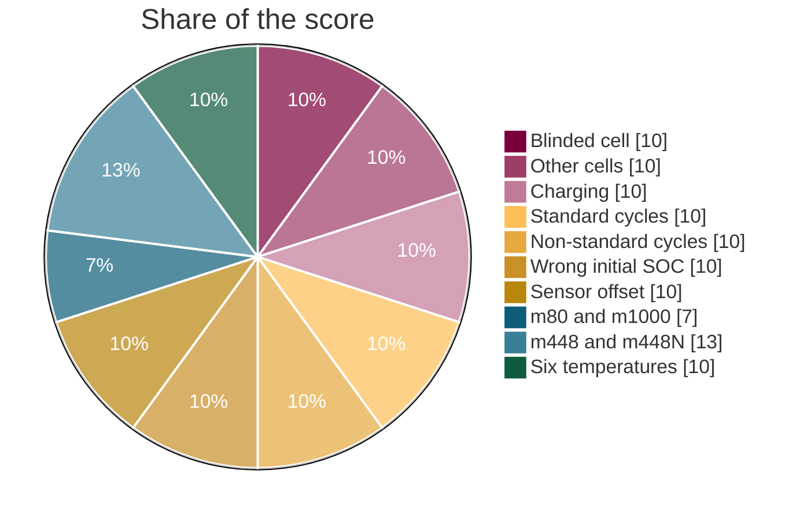

<a id="part-3"></a>
## 3. How the score is computed

> **Plain English.** The model is run over every hidden drive cycle exactly the way a car's battery computer would run it: one measurement at a time, carrying its own memory. Each cycle gives one error number. Those are grouped into 18 test cases, and the 18 are combined with published weights into one score. Lower is better. This is the ~800 lines of Python that *are* the benchmark, and they reproduce the lab's original MATLAB tool to three decimal places.

Part 2 ended with a container producing scores. This part opens that container: what the model is asked to do, what data it is run on, and how the errors turn into a single number.

### What the model is asked to do

A model is one function, called once per second of data, returning its estimate and whatever memory it wants back next time. It cannot look ahead.

```python
def Model(X, z=None):          # X = [current, voltage, temperature]
    current = float(X[0])
    soc = 1.0 if z is None else float(z) + current / 3600 / 4.6
    return soc, soc            # (estimate 0..1, memory for the next call)
```

Python models are imported and looped in-process; MATLAB models run through one `matlab -batch` session executing a 40-line script that does nothing but loop. Both produce identical scores, verified on the four reference models.

### What it is run on

| | |
|---|---|
| Cells | 4 Tesla 2170 cells: `m80`, `m448` (fully hidden), `m448N`, `m1000` |
| Temperatures | −20, −10, 0, 10, 25, 40 °C |
| Drive cycles | UDDS, HWFET, LA92, US06, plus two custom ones (HWCUST, HWGRADE) |
| Total | **144 test cycles** plus charging cycles |
| Robustness | 9 runs started at the wrong initial SOC (90 / 60 / 30 %), 18 runs with a current-sensor offset (±0.05 / 0.1 / 0.3 A) |
| Padding | One hour of the first sample repeated before every cycle so filters and RNNs settle; excluded from the metrics |

A short **validation run** goes first so a broken model fails in seconds instead of after 45 minutes.

### From errors to one number

The scoring pipeline, in four steps:



RMSE for one cycle: the estimate's distance from the true SOC at every second, squared, averaged, square-rooted. Being 2 % off all the time scores 2; being perfect except for one bad minute scores worse than that minute's share suggests, which is the point.

The weights: seven categories carry a tenth each (blinded cell, other cells, charging, standard cycles, non-standard cycles, wrong initial SOC, sensor offset); the four cells' individual scores share a fifth; the six temperatures share a tenth. "All cells" is shown but weighs zero, because it would double-count everything else. The chart shows how much of the final score each group contributes:



Two more things come out. A **complexity** bin from 1 to 10 — time per sample relative to a plain Coulomb counter, answering "would this fit on a real battery controller?"; it never affects rank. And a **suspicious** flag when the mean error exceeds 25 %, which is logged for an administrator rather than hidden as the old tool did.

### What goes back to the website

The 18 metrics and the score; one row per cycle (RMSE, MAE, max error); down-sampled traces of 13 illustrative cycles, the robustness runs and the model's own worst cycle — down-sampled so that every spike survives, so the chart agrees with the max-error number; and a 6 MB `.mat` of every run at full resolution for anyone who wants the raw curves.

**Files to open:** [pipeline.py](../../evaluator/python/socbench_eval/pipeline.py) (`score`, `complexity`) → [runner.py](../../evaluator/python/socbench_eval/runner.py) → [Run_Model.m](../../matlab/Run_Model.m) → [test-cases.ts](../../src/lib/test-cases.ts).

