## 4. 📦 Life of a submission, end to end

> 💡 **Plain English.** A researcher uploads a zip. The website checks that it is well-formed and puts a ticket in a queue. A worker machine takes the ticket, downloads the zip, runs the model inside a sealed box against the secret data, saves the scores, deletes the zip, and e-mails a PDF. If anything goes wrong the researcher is told exactly what. Follow this part once with the files open and you can answer almost any question about the system.

### 🗺️ The whole journey in one picture

First half — on the website:

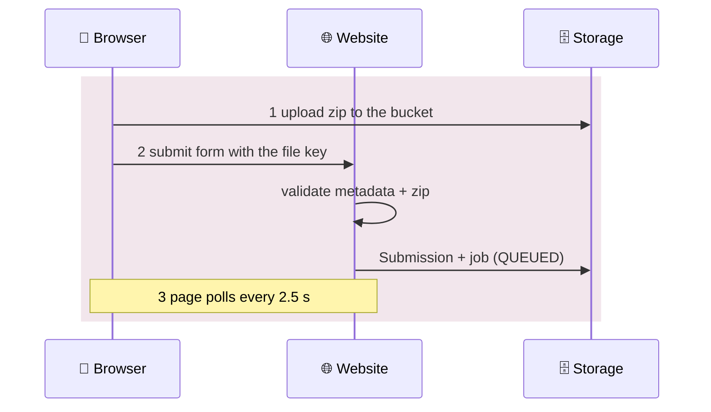

Second half — on the worker:

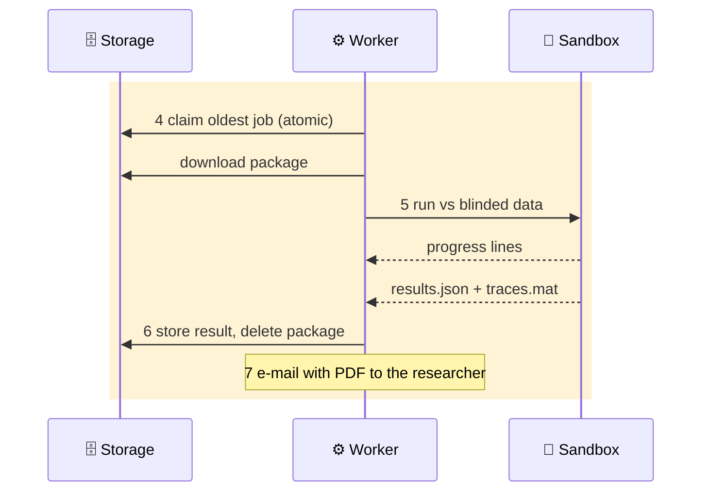

### 👤 What the researcher sees at each step

| Step | On screen | Behind it |
|---|---|---|
| Upload | A progress bar to 100 %, then "checking the package structure" | Direct PUT to the bucket; then the server re-downloads and validates |
| Queued | "Position 2 in the queue · about 25 min · evaluator online" | Heartbeat table + job table + the ETA simulation |
| Running | A live console, a percentage, a stage name, an ETA | Every line the sandbox prints, streamed into the job log |
| Done | Confetti, the plain-English insights, the scorecard, an e-mail with a PDF | One database transaction, then package deletion, then mail |
| Failed | The exact error, with the model's own traceback lines | `EvaluationError` marked user-facing — never retried |

### ⏱️ An evaluation on a clock

Rough proportions for a mid-weight model (a heavy LSTM in MATLAB can take 45 minutes; a Coulomb counter in Python takes 10 seconds):

```mermaid
%%{init: {"gantt": {"fontSize": 15, "sectionFontSize": 15, "barHeight": 28, "barGap": 6, "leftPadding": 110}}}%%
gantt
    title One evaluation, roughly to scale
    dateFormat HH:mm:ss
    axisFormat %M:%S
    section Set-up
    unzip + import the model        :a1, 00:00:00, 5s
    validation cycle (fail fast)    :a2, after a1, 20s
    section Model runs
    144 blinded drive cycles        :b1, after a2, 6m
    charging cycles                 :b2, after b1, 30s
    9 wrong-initial-SOC runs        :b3, after b2, 40s
    18 sensor-offset runs           :b4, after b3, 60s
    section Wrap-up
    scoring + traces.mat            :c1, after b4, 10s
    store, PDF, e-mail (worker)     :c2, after c1, 15s
```

### 📤 Step 1 — Upload: browser → bucket, bypassing the website

Vercel caps the body of a serverless request at 4.5 MB; packages can be 50 MB. So the file never passes through our server on the way in.

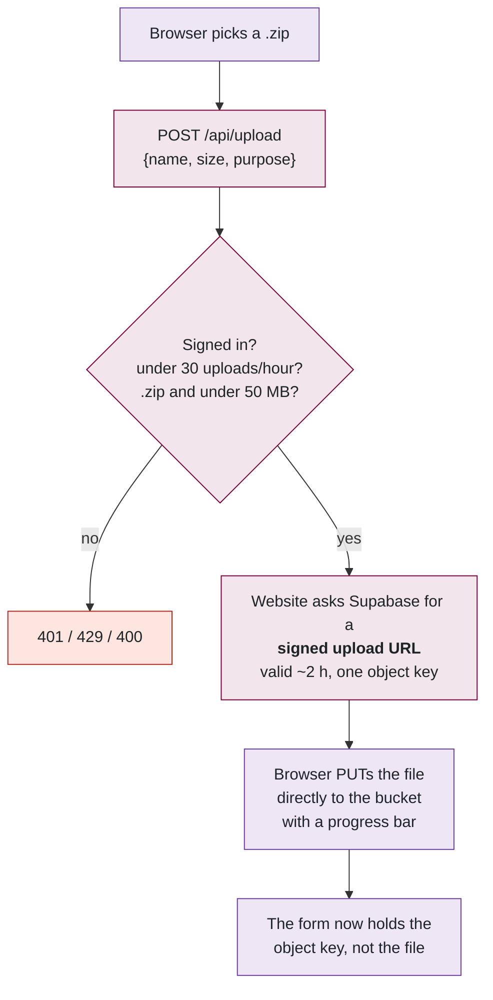

Files: [api/upload/route.ts](../../src/app/api/upload/route.ts), `uploadPackage()` in [upload-client.ts](../../src/lib/upload-client.ts), `createSignedUpload()` in [storage.ts](../../src/lib/storage.ts). Keys look like `submissions/1724600000000-ab12cd.zip`; the website accepts only keys matching `OBJECT_KEY_RE`, so a tampered form cannot point at some other object. In local development (`STORAGE=local`) the file simply travels inside the form.

### ✅ Step 2 — Validate and create

Everything below happens inside one server action, `createSubmissionAction` in [submit/actions.ts](../../src/app/(app)/submit/actions.ts), in this order. Cheap checks come first, and the pre-uploaded object is deleted on any rejection so the bucket never fills with rejects.

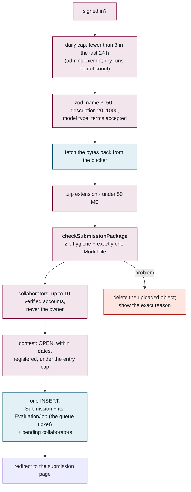

**Zip hygiene** ([package-check.ts](../../src/lib/package-check.ts)) is mirrored line for line by `safe_extract` in the Python evaluator, so a package that passes the website cannot surprise the worker:

| Check | Limit | Why |
|---|---|---|
| Entry count | ≤ 500 | Bounded work |
| Uncompressed total | ≤ 512 MB | Disk |
| Single entry | ≤ 256 MB | Disk |
| Compression ratio | ≤ 200 : 1 | Zip bombs are ~1000 : 1 |
| Paths | no `/…`, no `C:`, no `..` | Path traversal |
| Symlinks | none (checked in the attribute bits) | Escaping the extraction folder |
| Sub-folders | none — zip the *files*, not the folder | The single most common user mistake |
| Model file | exactly one of `Model.m` / `Model.p` / `Model.py` at top level, with a regex check on the function signature | The contract |

The `runtime` column (`python` or `matlab`) is set here, from which model file was found, so the right kind of worker claims the job later.

### ⏳ Step 3 — Waiting: where the numbers on the status page come from

The page polls `/api/submissions/[id]/status` — first after 1 s, then every 2.5 s. Everything it shows derives from two tables:

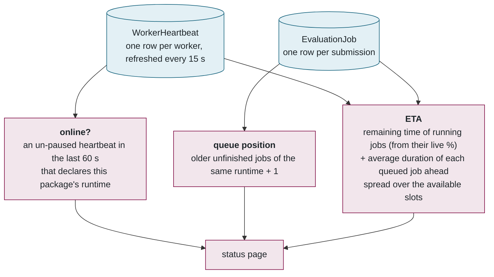

The average duration comes from the last 10 completed runs of the same model type (`averageRunSec` in [worker-status.ts](../../src/lib/worker-status.ts)), falling back to 45 minutes. If no worker can run this runtime, the page says so plainly — "no evaluator for MATLAB packages is online" — rather than showing an ETA that will never arrive.

*Worked example:* two slots, one job running with 12 minutes left, two queued jobs ahead of yours averaging 20 minutes each. Slot A: 12 min → then queued job 1 (ends at 32). Slot B: queued job 2 (ends at 20). Your job starts on the first free slot: **about 20 minutes**.

### 🔒 Step 4 — Claim: how two workers never take the same job

The worker ([worker.ts](../../src/evaluator/worker.ts)) polls every 2 s. Dry runs are claimed first — they are short and someone is watching. Then `claimJob()` in [run-job.ts](../../src/evaluator/run-job.ts):

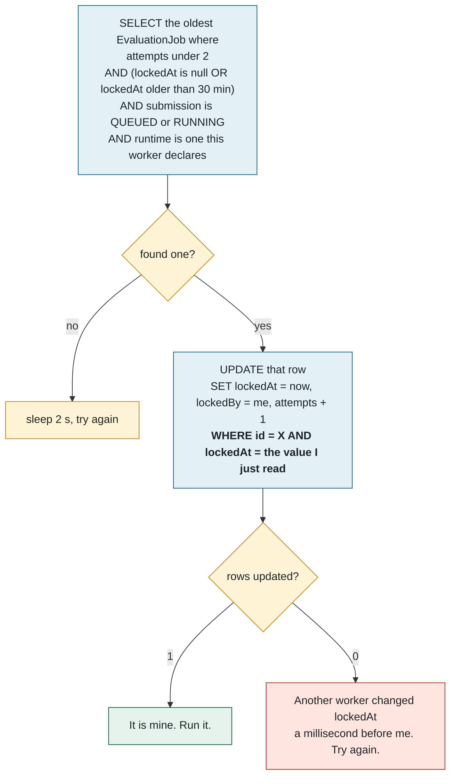

In code, the whole trick is one `WHERE` clause:

```ts
// run-job.ts — claimJob()
const candidate = await db.evaluationJob.findFirst({ where: { /* the SELECT above */ }, orderBy: { createdAt: "asc" } });
const { count } = await db.evaluationJob.updateMany({
  where: { id: candidate.id, lockedAt: candidate.lockedAt },   // only if nobody touched it since I looked
  data:  { lockedAt: new Date(), lockedBy: workerId(), attempts: { increment: 1 } },
});
return count === 1 ? candidate : null;                          // 0 means I lost the race — loop again
```

No transaction, no advisory lock, no queue service — a **compare-and-swap** on one column. If another worker won, the row no longer matches and the update touches zero rows.

**Why a 30-minute stale lock is safe for a 6-hour evaluation:** every progress line the evaluator prints is written to the job log, and *that write also refreshes `lockedAt`*. A live job is never stale. A job whose worker died stops being refreshed and becomes reclaimable after 30 quiet minutes.

### 🐳 Step 5 — Evaluate: the sandbox

`runJob` marks the submission RUNNING, downloads the package to a temporary file (`storage.materialize`), and hands off to `PythonEvaluator.spawn()` in [python-evaluator.ts](../../src/evaluator/python-evaluator.ts), which builds exactly one `docker run` command.

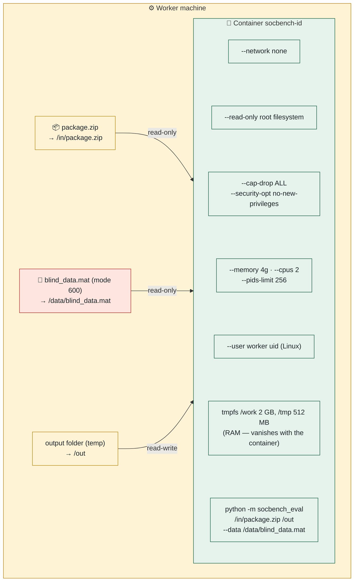

Three mounts and nothing else. The container never sees the host's environment variables, so no database password, SMTP credential or storage key can leak. For MATLAB packages the image is `socbench-eval-matlab`, the network is `bridge` (only so MATLAB can check out its licence), a tmpfs `/home/matlab` is added because MATLAB insists on writing preferences at start-up, and a 24-hour licence token is passed in — never the year-long one. The full command is written to the job log with licence values **redacted**.

Every line the container prints is streamed into the job log by `input.log`. That log is what the website shows as the live console, and where the progress bar comes from.

**Two independent kill switches**, both calling `killTree` (a `docker kill` plus a process-group kill so a MATLAB child dies with its parent):

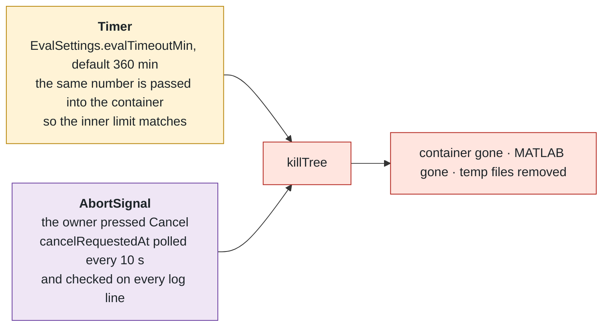

**Host mode** (`EVAL_SANDBOX=none`, or a MATLAB package on a machine with no MATLAB image — this is how the laptop ran MATLAB natively during the outage): the same Python entry point, run directly, with an *allow-listed environment* — only `SOCBENCH_*`, `MATLAB_*`, `PATH` and locale variables reach it. Faster, not isolated. Dedicated low-privilege account only.

### 🏁 Step 6 — Score and store

Back in `runJob`, [results.ts](../../src/evaluator/results.ts) parses `results.json`: all 18 metric keys must be finite numbers. The website **re-derives** the weighted error from them with the *active* weights and logs a note if it disagrees with the evaluator by more than 0.01 (it never has, with default weights; when an admin has overridden the weights, the website's value wins).

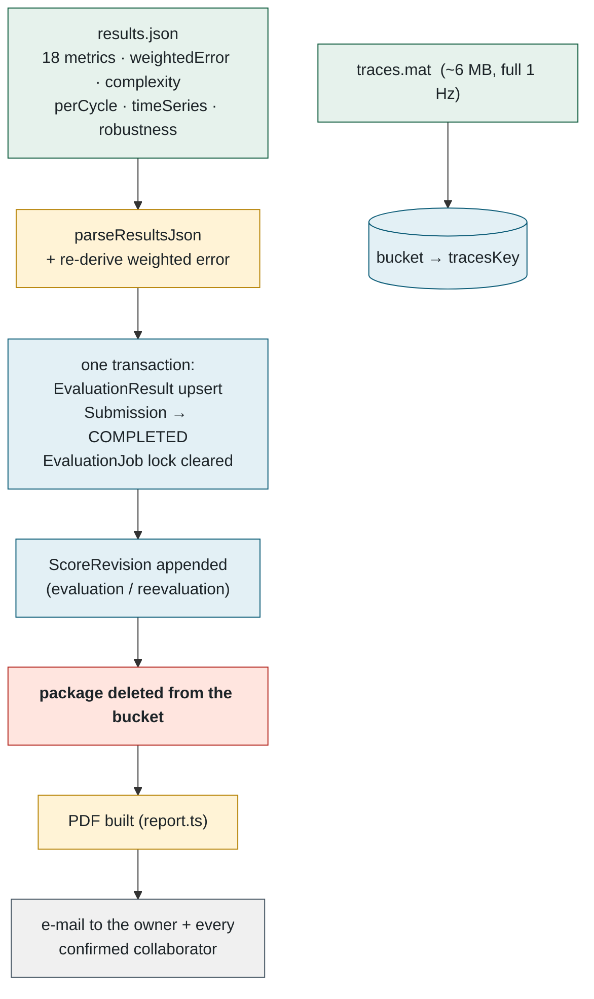

The large trace file goes to the bucket, not the database row, and replaces the previous one on a re-evaluation. The package is deleted *before* the e-mail step — nothing that happens afterwards can leave it behind.

### 🔁 Step 7 — The branches people forget

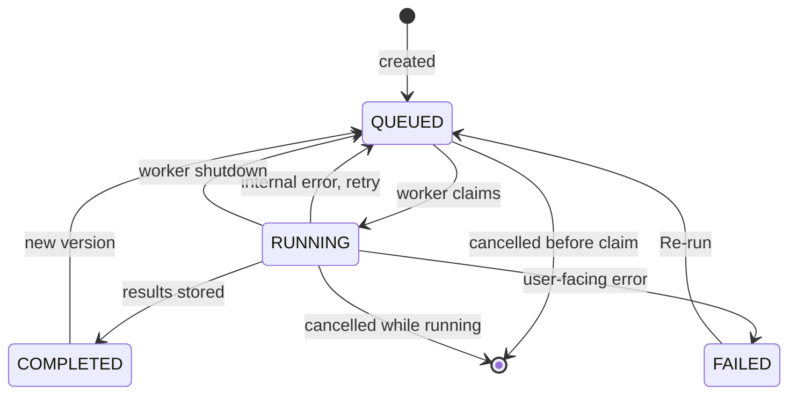

- **Retry happens only for our faults.** An `EvaluationError` marked `userFacing` — bad package, the model threw, timeout — is final; the exact message is stored and e-mailed. An internal error (Docker daemon down, a crash in our code) with `attempts < 2` unlocks the job and someone claims it again.
- **Cancel** while unclaimed → deleted outright. Once claimed → `cancelRequestedAt` is set; the worker notices within 10 s, aborts, and then either deletes the submission or — if this was a resubmitted v2+ — restores the previous version's score.
- **Worker shutdown** (Ctrl+C, `systemctl stop`, admin "stop"): in-flight evaluations are aborted with the reason `SHUTDOWN`; the job is handed back *with the attempt refunded* and the heartbeat row is deleted so the admin page does not show a ghost.

📌 **Files to open, in order:** [submit/actions.ts](../../src/app/(app)/submit/actions.ts) → [package-check.ts](../../src/lib/package-check.ts) → [worker.ts](../../src/evaluator/worker.ts) → [run-job.ts](../../src/evaluator/run-job.ts) → [python-evaluator.ts](../../src/evaluator/python-evaluator.ts) → [results.ts](../../src/evaluator/results.ts) → [worker-status.ts](../../src/lib/worker-status.ts).

