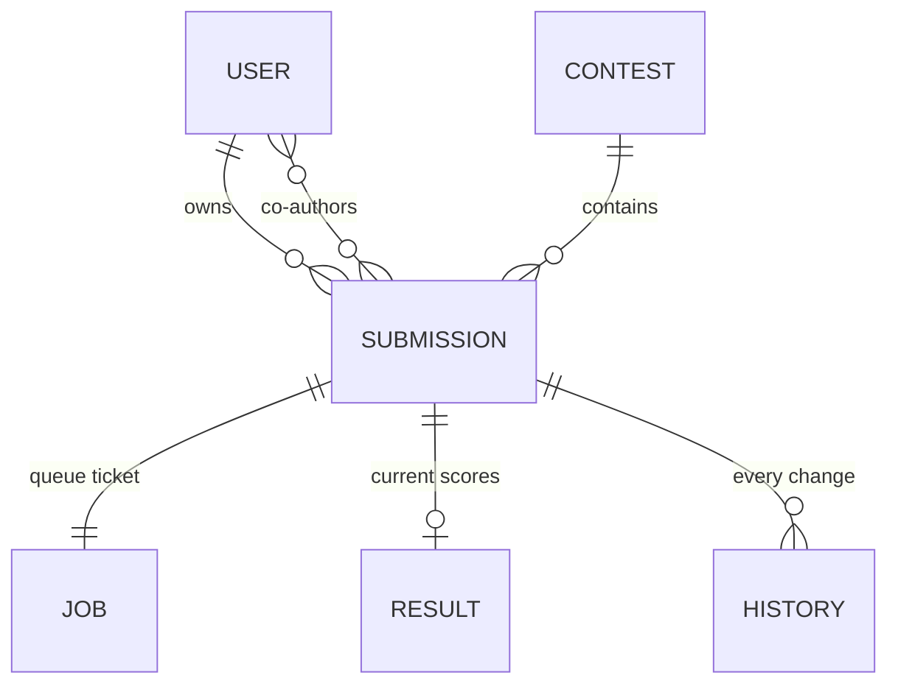

## 4. The database

> **Plain English.** A person has submissions. Each submission has one queue ticket, one current result, and a history of everything that ever happened to it. Separate tables hold contests, the worker machines' heartbeats, settings and the admin activity feed. One file describes all of it, and the website and the worker both read that file.

Everything in Parts 2 and 3 was reading or writing rows in this database. Read each line in the diagram as "has": a user has many submissions, a submission has exactly one job and at most one result.

Two habits recur everywhere. **Cascade deletes:** delete a user and their submissions, jobs, results and history go with them, so nothing is ever orphaned. **Append-only history:** score revisions, weight changes and admin events are never edited, only added to.

The stand-alone tables: `WorkerHeartbeat` (one row per worker, refreshed every 15 s with its load, languages and last console lines), `EvalSettings` (one row: timeouts and the daily cap, editable by admins), `ScoringConfig` (weight overrides, newest wins), `AdminEvent` (the activity feed), `RateLimitHit` (abuse counters), `ContactMessage` (the feedback inbox). Column-level detail is in the appendix.

**Files to open:** [prisma/schema.prisma](../../prisma/schema.prisma) — read it top to bottom once; it is the best map of the system.

