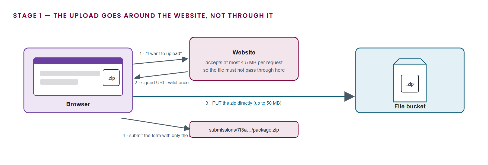
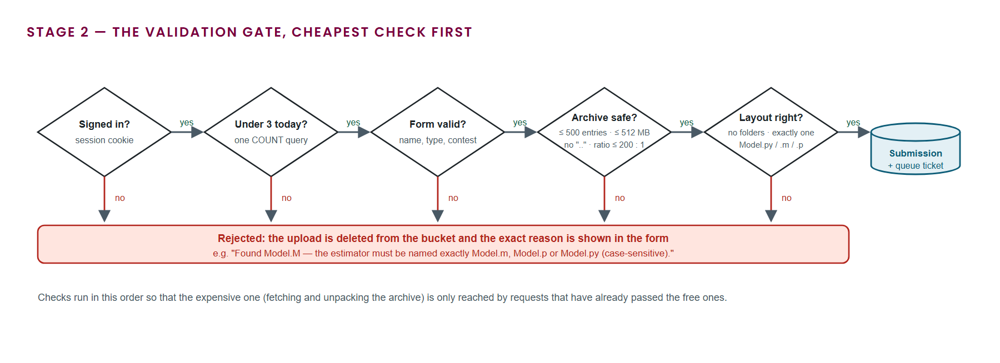
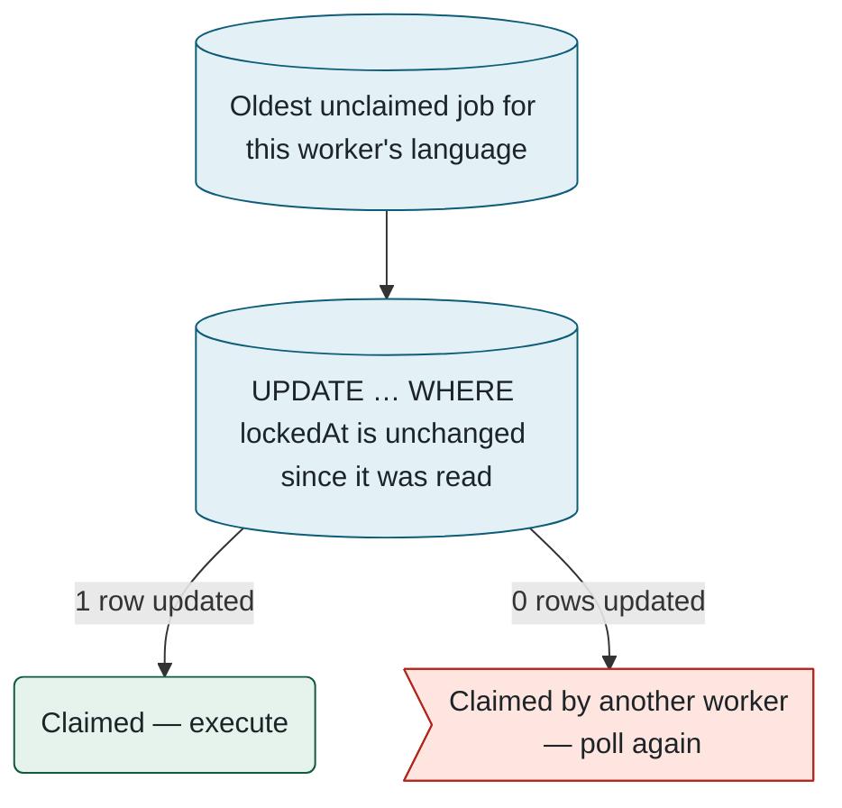
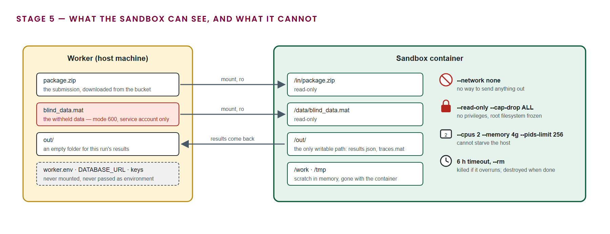
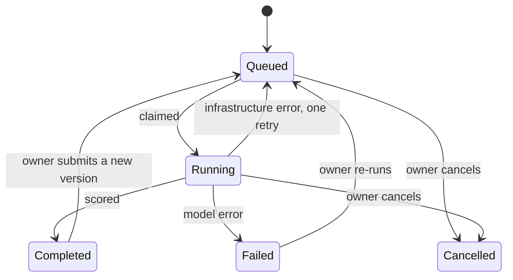

<a id="part-4"></a>
## 4. The life of a submission

> **In this chapter.** The path of a package from the browser to the leaderboard: validation, queueing, atomic claiming by a worker, sandboxed execution, storage and reporting, and the handling of failure.

### 4.1 Overview


### 4.2 The stages in detail

#### Stage 1 · Upload

Most web hosts limit the size of a single request, and Vercel's limit is 4.5 MB. A submission package can be ten times that, so the archive cannot travel through the website at all. Instead the browser asks the website for permission, receives a **signed URL** (a storage address that authorises exactly one upload and then expires), and sends the file straight to the bucket. Figure 4.2 shows the four exchanges.



1. The browser calls `POST /api/upload` with the file's name and size. The route refuses anything that is not a `.zip`, anything over the configured maximum, and any caller who is not signed in.
2. The website asks the storage service for a signed upload URL and returns it together with the **object key**, the path the file will have in the bucket (for example `submissions/7f3a….zip`).
3. The browser sends the archive to that URL with an HTTP `PUT`. The website is not involved; the transfer is between the browser and the bucket.
4. The submission form is posted with the object key in a hidden field. The form itself is a few hundred bytes.

The same route serves the test-run panel, with a different prefix so that test uploads and real submissions never share a folder.

#### Stage 2 · Validation

The form is handled by one **server action**, a function that runs on the web server when the form is posted. It performs every check in order of cost, so that the expensive step of fetching and unpacking the archive is reached only by requests that have already passed the free ones. Figure 4.3 lays the gate out.



1. **Signed in?** The session cookie is verified. An anonymous request is redirected to the sign-in page.
2. **Under the daily limit?** One database count of the user's submissions in the last 24 hours. Three is the default; administrators are exempt.
3. **Form valid?** The model name, description, type, privacy flag, contest and co-author addresses are checked against the same rules the browser applied.
4. **Archive safe?** The archive is fetched from the bucket and its table of contents inspected without unpacking. It is rejected if it has more than 500 entries, would exceed 512 MB unpacked, contains any entry over 256 MB, contains a path with `..` or an absolute path, or has any entry whose compression ratio exceeds 200 to 1 (the signature of a decompression bomb).
5. **Layout right?** There must be no sub-directories, and exactly one of `Model.py`, `Model.m` or `Model.p` at the top level. A MATLAB file is additionally checked for the required function signature.

The check code is deliberately specific about what it found, because a rejected submission should not need a support request:

```ts
if (n.startsWith("/") || /^[A-Za-z]:/.test(n) || n.split("/").includes(".."))
  problems.push(`Unsafe path in archive: "${e.entryName}".`);
if (size / comp > MAX_RATIO && size > 1024 * 1024)
  problems.push(`"${e.entryName}" has an implausible compression ratio; the package was rejected.`);
```

On any failure the uploaded object is deleted from the bucket and the form is redisplayed with the message. On success the `Submission` row and its `EvaluationJob` are created in one write, with the package's language recorded so that only a worker capable of running it will claim it.

#### Stage 3 · Queueing

The researcher is redirected to the submission's page, which polls `GET /api/submissions/{id}/status` every 2.5 seconds. The response is assembled from two tables and nothing else:

- the **job queue**, which gives the submission's position among unclaimed jobs of the same language and an estimated wait derived from recent evaluation times;
- the **worker heartbeats**, one row per worker, refreshed every fifteen seconds with the languages it supports, what it is running, and its last console lines. A worker whose heartbeat is older than a minute is shown as offline.

```json
{ "status": "QUEUED", "runtime": "matlab", "queuePosition": 2, "queueWaitSec": 540,
  "evaluator": { "online": true, "queued": 2, "running": 1, "capacity": 1 } }
```

If no online worker supports the package's language, the page says so rather than showing an estimate that cannot be met.

#### Stage 4 · Claiming

Every worker polls the queue every two seconds. Claiming has to be safe when two workers poll at the same instant, and the platform uses no locking service; the database's own atomic update is enough. The worker reads the oldest unclaimed job for its language, then issues one conditional update: set the lock, but only if the row's lock timestamp is still what was just read. Either exactly one row changes, and the job is this worker's, or zero rows change, and another worker got there first.

```ts
const { count } = await db.evaluationJob.updateMany({
  where: { id: candidate.id, lockedAt: candidate.lockedAt },   // unchanged since we read it
  data:  { lockedAt: new Date(), lockedBy: workerId(), attempts: { increment: 1 } },
});
return count === 1 ? candidate : null;                          // 1 = ours, 0 = someone else's
```



Figure 4.4. Claiming a job by compare-and-swap. One attempt has exactly two outcomes.

Two further rules keep the queue honest:

- Every progress line the model prints refreshes the lock timestamp, so a job that is genuinely running is never mistaken for an abandoned one, however long it takes.
- A lock older than thirty minutes with no progress is treated as abandoned (the worker crashed or lost power) and the job becomes claimable again. Each job is allowed two attempts in total.

#### Stage 5 · Execution

The worker unpacks the package into a scratch directory and starts one Docker container for the run. Figure 4.5 shows exactly what the container is given and what it is denied.



The `docker run` invocation the worker issues, reduced to its essentials:

```sh
docker run --rm --name eval-7f3a \
  --network none \
  --read-only --tmpfs /work:rw,exec,size=2g --tmpfs /tmp:rw,size=512m \
  --cap-drop ALL --security-opt no-new-privileges \
  --user 998:998 --pids-limit 256 --memory 4g --cpus 2 \
  -v /var/lib/socbench/jobs/7f3a/package.zip:/in/package.zip:ro \
  -v /var/lib/socbench/jobs/7f3a/out:/out:rw \
  -v /var/lib/socbench/blind-data/blind_data.mat:/data/blind_data.mat:ro \
  socbench-eval /in/package.zip /out --data /data/blind_data.mat
```

Reading the flags in order:

- `--network none` removes the network interface. The model can read the withheld data, as it must, but has no way to transmit anything.
- `--read-only` with two in-memory `--tmpfs` scratch areas means the container's filesystem cannot be modified except in places that vanish with it.
- `--cap-drop ALL` and `no-new-privileges` remove every Linux capability and forbid escalation, and `--user` runs the process as the worker's own unprivileged account.
- The CPU, memory and process-count limits stop a runaway model from starving the host or the other evaluation.
- The three `-v` mounts are the whole of the container's contact with the host. The worker's environment, which holds the database and mail credentials, is never passed in. For MATLAB packages the worker adds a single 24-hour licence token and nothing else.

Everything the container writes to its console is appended to the job's log row, which is what the submission page shows as the live console and what refreshes the lock. A timeout (six hours by default, changeable by an administrator) and the owner's **Cancel** button both stop the container, and stopping it also ends any MATLAB process inside.

#### Stage 6 · Storage and reporting

When the container exits, the worker reads `results.json` from the output directory and proceeds through a fixed sequence. The order matters: the package is deleted only after the result is safely stored, and the e-mail is sent only after the package is gone.

1. **Verify.** All eighteen metrics must be finite numbers, and the weighted score is recomputed from the active weights as a cross-check against the evaluator's own figure.
2. **Store the traces.** The full-resolution traces file (about 6 MB) goes to the bucket, replacing the previous one if this is a re-evaluation.
3. **Commit.** The result row is written (or updated) and the submission is marked complete in a single **transaction**, a group of database writes that either all succeed or all fail. A partial result can never be visible.
4. **Record history.** A `ScoreRevision` entry is appended with the score, the metrics and the evaluator version, so the result can be reconstructed after any later re-scoring.
5. **Delete the package.** The uploaded archive is removed from the bucket. From this point no copy of the submitted model exists anywhere in the platform.
6. **Report.** The PDF is generated and e-mailed to the owner and every confirmed co-author.

The line the worker appends to the job log when it is done is the one to look for when watching a job from the workers page:

```
completed — weighted error 2.401 %
```

### 4.3 Timing


### 4.4 States and transitions



Figure 4.7. Every state a submission can occupy, and the events that move it between them.

A failure attributable to the package (an exception, an invalid return value, or a timeout) is final, and the error message is stored verbatim for the author. A failure attributable to the infrastructure (the container runtime unavailable, or a defect in the worker) is retried once. Stopping a worker returns its current job to the queue without consuming an attempt.

**Files to open:** [submit/actions.ts](../../src/app/(app)/submit/actions.ts) → [package-check.ts](../../src/lib/package-check.ts) → [run-job.ts](../../src/evaluator/run-job.ts) → [python-evaluator.ts](../../src/evaluator/python-evaluator.ts).

