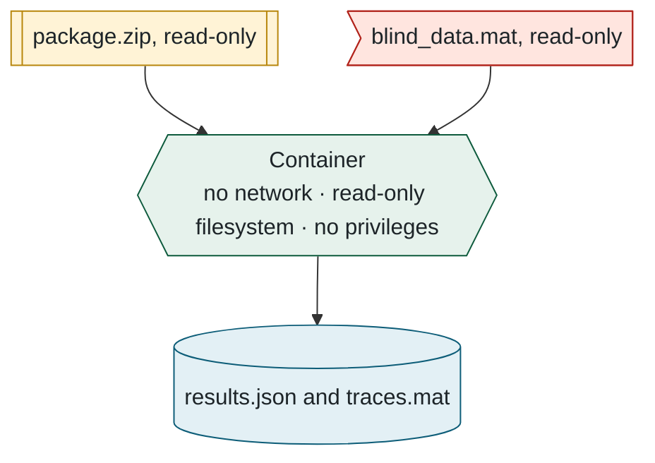
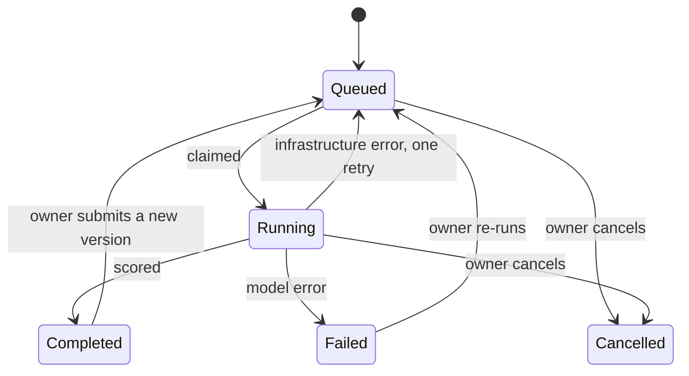

## 4. The life of a submission

> **In this chapter.** The path of a package from the browser to the leaderboard: validation, queueing, atomic claiming by a worker, sandboxed execution, storage and reporting, and the handling of failure.

### 4.1 Overview

### 4.2 The stages in detail

**1. Upload.** The browser uploads the archive directly to object storage using a **signed URL**, a single-use address that authorises one upload and then expires. This bypasses the web host's 4.5 MB request limit, since packages may be up to 50 MB. The form that follows carries only the storage key of the uploaded object.

**2. Validation.** A single **server action** (a function executed on the web server in response to a form submission) performs every check, least expensive first:

- Is the user authenticated, and below the daily limit of three submissions?
- Are the model name and description well formed?
- Does the archive pass inspection? It is retrieved from storage and checked against the entry and size limits, for the absence of sub-directories and path-traversal sequences, and for exactly one model file at the top level.

Any failure deletes the upload and reports the precise reason. Success creates the `Submission` row and its `EvaluationJob` (the queue entry) in a single write, recording whether the package is Python or MATLAB.

**3. Queueing.** The submission page polls the server every 2.5 seconds and displays the queue position, an estimated start time and whether a worker for the package's language is online. All of this is derived from two tables: the job queue, and the workers' **heartbeats**, records each worker refreshes every fifteen seconds to report that it is alive and what it is doing.

**4. Claiming.** Workers poll the queue every two seconds. A job is claimed with a single conditional update, "lock this row only if it is still unlocked", so that two workers can never claim the same job:

Figure 4.2. Claiming a job by compare-and-swap. One attempt has exactly two outcomes.

Every progress line the model emits refreshes the lock, so an active job is never mistaken for an abandoned one. A job whose worker has died becomes claimable again after thirty minutes without progress, and each job is allowed two attempts in total.

**5. Execution.** The worker starts one Docker container (Docker is the runtime that creates containers) with exactly three directories mounted:

- the package, read-only,
- the withheld data, read-only,
- an output directory for the results.

Everything the container writes to its console is streamed into the job log, which the website presents as the live console. A timeout (six hours by default) and the owner's **Cancel** control both terminate the container and any MATLAB process within it.

Figure 4.3. The sandbox's inputs and outputs. Chapter 7 covers the restrictions placed on the container.

**6. Storage and reporting.** When the container exits, the worker proceeds through a fixed sequence:

1. Verify that all eighteen metrics are finite, and recompute the weighted score from the active weights as a cross-check.
2. Write the result and mark the submission complete within one **transaction** (a group of database writes that either all succeed or all fail).
3. Upload the full-resolution traces and append an entry to the submission's score history.
4. **Delete the package** from storage.
5. Generate the PDF report and e-mail it to the owner and any confirmed co-authors.

### 4.3 Timing

### 4.4 States and transitions

Figure 4.5. Every state a submission can occupy, and the events that move it between them.

A failure attributable to the package (an exception, an invalid return value, or a timeout) is final, and the error message is stored verbatim for the author. A failure attributable to the infrastructure (the container runtime unavailable, or a defect in the worker) is retried once. Stopping a worker returns its current job to the queue without consuming an attempt.

**Files to open:** [submit/actions.ts](../../src/app/(app)/submit/actions.ts) → [package-check.ts](../../src/lib/package-check.ts) → [run-job.ts](../../src/evaluator/run-job.ts) → [python-evaluator.ts](../../src/evaluator/python-evaluator.ts).

