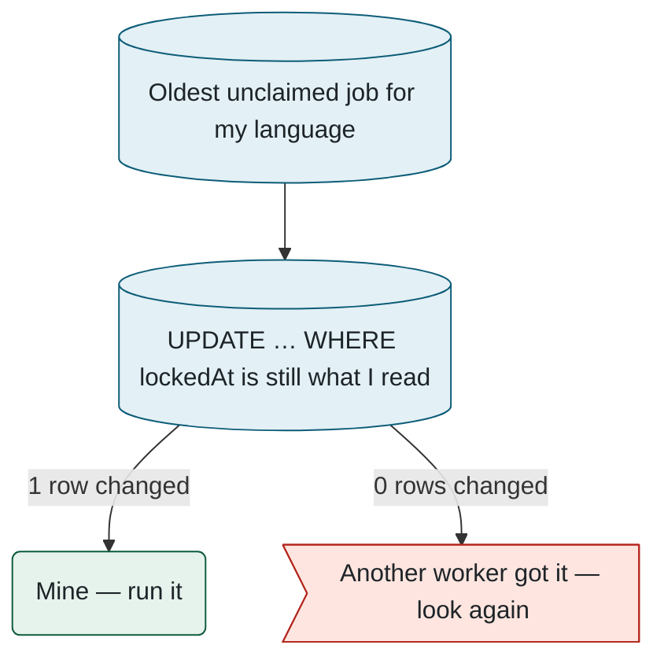
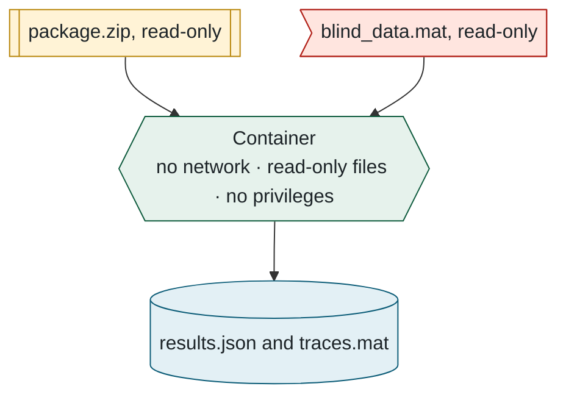
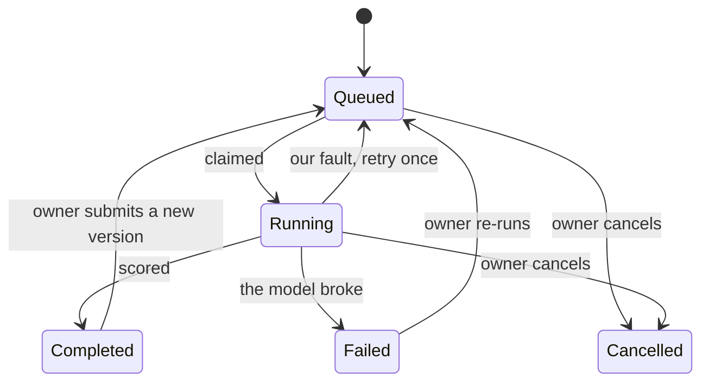

## 4. What happens to a submission

> **In this chapter.** The path of one zip file from the browser to the leaderboard: how it is checked, queued, claimed by a worker, run in a sandbox, scored, deleted and reported, and what happens when something goes wrong.

### 4.1 The journey

### 4.2 Stage by stage

**1. Upload.** The browser sends the zip straight to the file bucket using a **signed link**, a one-off web address that permits a single upload and then expires. It does this because the website's host only accepts requests under 4.5 MB and packages can be 50 MB. The form that follows carries only the file's key, not the file.

**2. Check.** One **server action** (a function that runs on the website's server when a form is submitted) does everything, cheapest check first: is the user signed in, under the daily cap of three, with a valid name and description? Then it fetches the zip back and inspects it: size and entry limits, no folders, no path tricks, exactly one model file at the top level. Any failure deletes the upload and shows the exact reason. Passing creates the `Submission` row and its `EvaluationJob` (the queue ticket) in one write, and records whether it is a Python or a MATLAB package.

**3. Wait.** The submission page asks the server for an update every 2.5 seconds and shows the queue position, an estimated start time, and whether a worker for this language is online. All of it is derived from two tables: the job queue and the workers' **heartbeats**, a note each worker writes every fifteen seconds to say it is alive and what it is doing.

**4. Claim.** Workers check the queue every two seconds. Taking a job is a single conditional update, "lock this row only if it is still unlocked", so two workers can never take the same job:

Figure 4.2. Claiming a job. One attempt, two possible outcomes.

Every progress line the model prints refreshes the lock, so a live job is never mistaken for a dead one. A job whose worker died becomes claimable again after thirty quiet minutes, with two attempts in total.

**5. Run.** The worker starts one Docker container (Docker is the tool that creates containers) with three folders made visible inside it and nothing else: the package (read-only), the hidden data (read-only), and an output folder. Everything the container prints streams into the job log, which is what the website shows as the live console. A timer (six hours by default) and the owner's **Cancel** button both kill the container and any MATLAB inside it.

Figure 4.3. What goes into the sandbox and what comes out. Chapter 7 covers what the container is not allowed to do.

**6. Store and report.** The worker checks that all eighteen metrics are finite numbers, re-derives the headline score with the active weights as a cross-check, then writes the result and marks the submission complete in one **transaction** (a group of database writes that either all happen or none do). It uploads the full-resolution traces, appends a line to the submission's score history, and **deletes the package**. Only then does it build the PDF and e-mail the owner and any confirmed co-authors.

### 4.3 How long it takes

### 4.4 The other endings

Figure 4.5. Every state a submission can be in, and what moves it between them.

A failure caused by the package (it crashed, returned an invalid number, ran out of time) is final, and the message is stored word for word so the author can see it. A failure caused by us (Docker down, a bug in the worker) is retried once. Stopping the worker hands its job back to the queue without using up an attempt.

**Files to open:** [submit/actions.ts](../../src/app/(app)/submit/actions.ts) → [package-check.ts](../../src/lib/package-check.ts) → [run-job.ts](../../src/evaluator/run-job.ts) → [python-evaluator.ts](../../src/evaluator/python-evaluator.ts).

