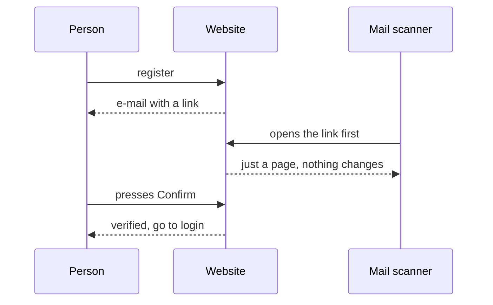

## 5. Accounts and security

> **Plain English.** Register with e-mail and password, prove you own the address by clicking a confirmation, then sign in. Passwords are stored scrambled. Sensitive actions are limited to a few attempts per hour. Submitted code runs inside several layers of protection, and the hidden data can be read by a model but never sent anywhere.

The database holds accounts as well as submissions; this part covers how people get in, and what keeps a hostile submission from doing harm.

### Why the confirmation e-mail has a button

Corporate mail scanners open every link before the person does, and used to consume the one-time token. So opening the link only shows a page; pressing its button is what verifies the account. The scanner's visit is the third arrow — notice that nothing changes until the person acts:

### Signing in

Ten attempts per 15 minutes per account (forty per address), then the password is checked against its bcrypt hash — a deliberately slow scramble, so guessing a million passwords is ruinous while one login is instant. A verified user gets a signed cookie — a small token the browser keeps and sends with every request, signed so it cannot be forged — good for 14 days; the site never looks the session up in the database. Pages under `/submit`, `/profile` and `/admin` redirect signed-out visitors before the page is even built, but that is a convenience: the real check runs again inside every action.

### What stops a bad submission

| Worry | What stops it |
|---|---|
| The model steals the hidden data | It can read it (it must) but has no network and is destroyed afterwards |
| The model attacks the machine | Read-only filesystem, no privileges, memory and CPU caps, runs as an unprivileged user |
| The model reads our secrets | The container never receives the worker's environment; MATLAB gets only a 24-hour licence token |
| A zip bomb (a tiny file that expands to fill the disk) or a path trick (a file name that tries to write outside its folder) | Entry, size and ratio limits, no folders, no `..` — checked on the website *and* again in the evaluator |
| A model runs forever | Hard timeout inside and outside the container |
| Someone floods the queue | 3 submissions per day, 5 dry runs per hour |
| Password guessing | bcrypt plus the attempt limits above |
| Someone finds out who has an account | "Forgot password" and "resend" answer identically whether or not the address exists |
| One compromised admin deletes the others | Admins cannot be deleted until demoted; nobody can change their own role |

Secrets live in exactly three places — Vercel's environment, a mode-600 file on the VM, and a GitHub secret — and never in the repository, an image, a log or an e-mail.

**Files to open:** [auth.ts](../../src/lib/auth.ts) → [middleware.ts](../../src/middleware.ts) → [(auth)/actions.ts](../../src/app/(auth)/actions.ts) → [rate-limit.ts](../../src/lib/rate-limit.ts) → [python-evaluator.ts](../../src/evaluator/python-evaluator.ts).

