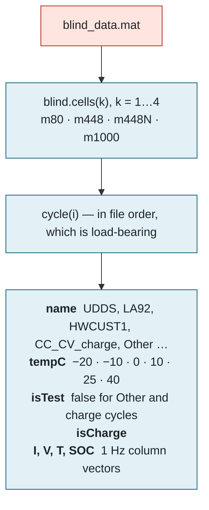
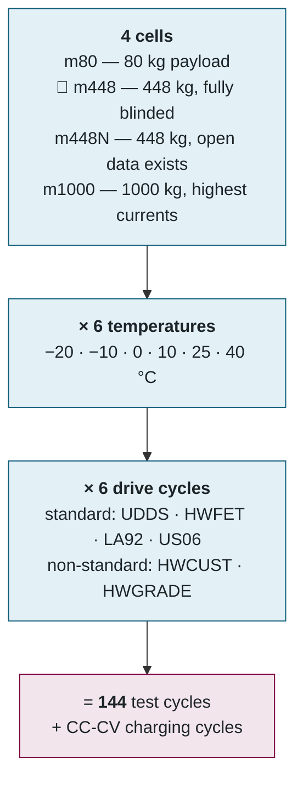
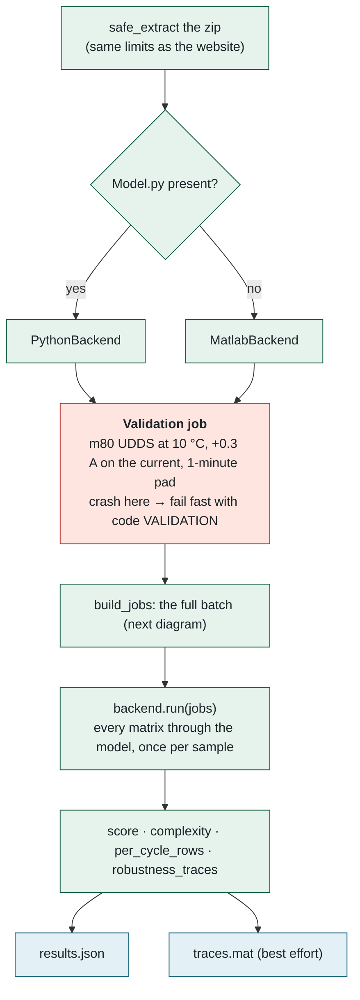
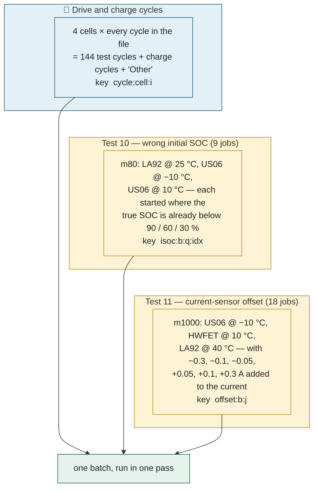
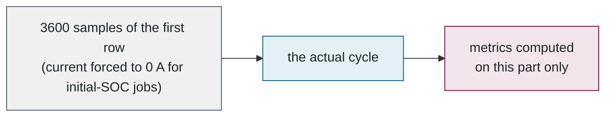
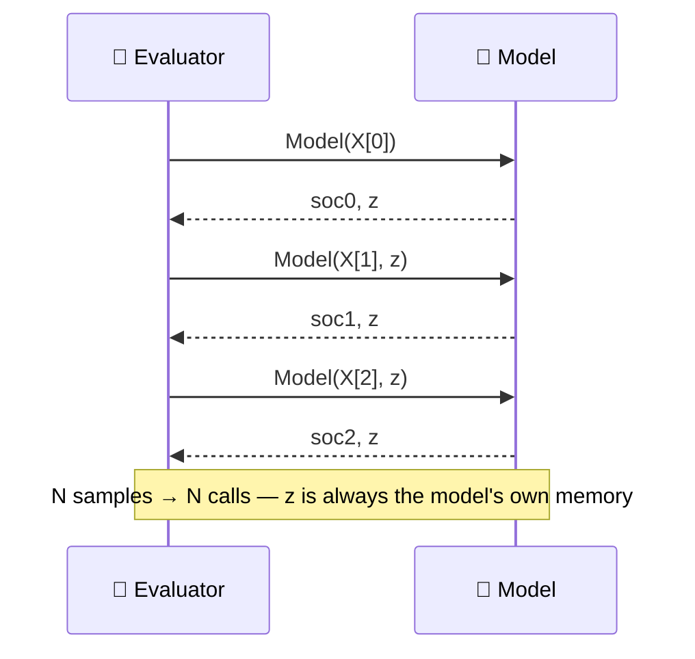

## 5. The evaluation engine — running the model

> 💡 **Plain English.** This and the next part describe the ~800 lines of Python that *are* the benchmark. They reproduce the lab's original MATLAB scoring tool exactly — checked against the real hidden data: the four reference models match every column of the old leaderboard to three decimal places, and the Python and MATLAB paths agree with each other. This part is about *running* the model: what data it is fed, in what order, and how. The next part is about turning the errors into a score.

Directory: [evaluator/python/socbench_eval/](../../evaluator/python/socbench_eval/) — `__main__.py` (the run), `data.py` (load the .mat), `runner.py` (execute models), `pipeline.py` (jobs, scoring, complexity, traces).

### 🔐 The answer key: `blind_data.mat`

The lab's data lives in MATLAB *tables*, which Python cannot read. [Export_Blind_Data.m](../../matlab/Export_Blind_Data.m) is run **once** to convert them to plain arrays in a version-7 `.mat` that scipy understands. **The cycle order is preserved and load-bearing** — every grouping in the scorer is positional, exactly as the original tool relied on.



### 🚗 The test grid

Every model faces the same grid. Each square is one drive cycle of roughly one to three hours of one-second measurements.



### ▶️ The run, in order (`__main__.py`)



The validation job exists for one reason: a broken model fails in seconds with its real error message instead of after 45 minutes.

### 🧾 What `build_jobs` produces



Only the ±0.3 A offset runs enter the score; the others are kept for the RMSE-vs-offset chart.

**Padding.** Every job is prefixed with one hour (3 600 samples) of its first row repeated, so estimators with internal memory — Kalman filters, RNNs — settle before scoring begins. The pad is stripped from the prediction before metrics.



### 🔋 How the model is executed (`runner.py`)

Both backends honour the same contract: **call `Model(X[i], z)` once per sample, in order, carrying `z` forward.** That is how a BMS runs an estimator, and it is why a model cannot cheat by looking ahead.



This is what a submitted model looks like — the reference Coulomb counter, in full:

```python
# Model.py
CAPACITY_AH = 4.6

def Model(X, z=None):
    """X = [current (A, negative = discharge), voltage (V), temperature (C)]
    Returns (SOC estimate 0..1, memory z for the next call)."""
    current = float(X[0])
    if z is None:                      # first sample: assume fully charged
        soc = 1.0
    else:
        soc = float(z) + current * (1 / 3600) / CAPACITY_AH
    return soc, soc                    # memory z = previous SOC
```

| Backend | How | Errors |
|---|---|---|
| `PythonBackend` | imports `Model.py` with `importlib`, loops in-process | re-raised as `ModelError` with the traceback trimmed to the submitter's own frames |
| `MatlabBackend` | writes every input matrix to one `in.mat`, starts **one** `matlab -batch` session running [Run_Model.m](../../matlab/Run_Model.m) (40 lines: loop over matrices, `tic/toc` around each), reads `out.mat` back | "Undefined function 'butter'" is translated to "that is the Signal Processing Toolbox, not installed here" via a lookup table |

`Run_Model.m` prints `[Run_Model] k/n done` after every matrix; the Python side turns that into the same `NN.N% | key` progress lines the Python backend emits, so the website's progress bar is identical for both. Progress is weighted by *samples*, not matrix count, so long cycles move the bar proportionally.

### 🧪 Dry run and mock

`--dry-run` uses **open** data shipped with the repo (`dryrun_data.mat`, 2 h of public m80 data): the +0.3 A validation, then one padded cycle. No blinded data is mounted, no leaderboard row. This replaced the lab's downloadable "Model Submission Test Tool".

`EVALUATOR=mock` ([mock-evaluator.ts](../../src/evaluator/mock-evaluator.ts)) fabricates plausible numbers from a seeded random generator — per-family baselines (LSTM ≈ 2.6 %, EKF ≈ 9 %, Coulomb counter ≈ 30 %) with temperature, cycle and cell factors — deterministically, so the same submission always "evaluates" identically. It exists so the entire website can be developed with no blinded data and no Docker.

📌 **Files to open, in order:** [__main__.py](../../evaluator/python/socbench_eval/__main__.py) → [data.py](../../evaluator/python/socbench_eval/data.py) → [runner.py](../../evaluator/python/socbench_eval/runner.py) → [Run_Model.m](../../matlab/Run_Model.m) → [Export_Blind_Data.m](../../matlab/Export_Blind_Data.m).

