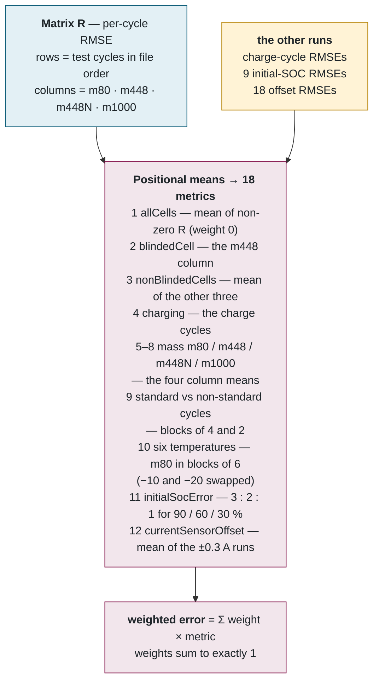
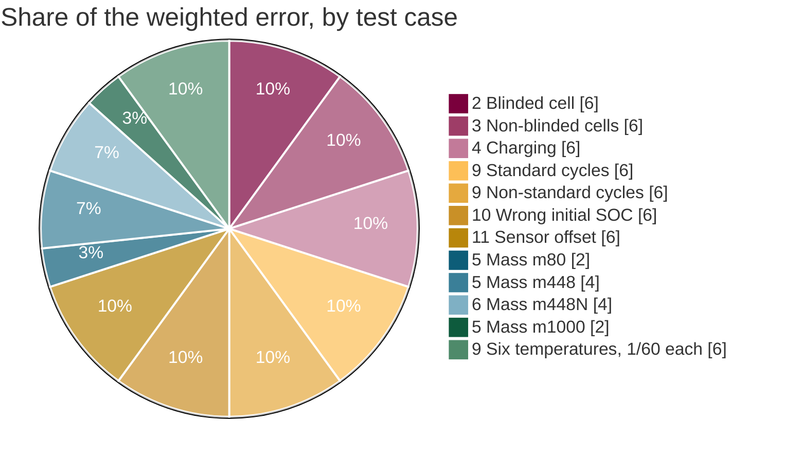
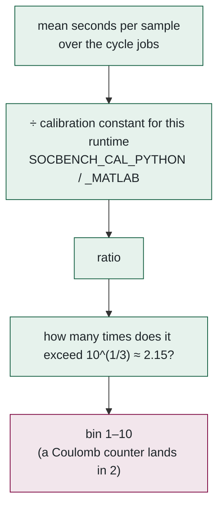
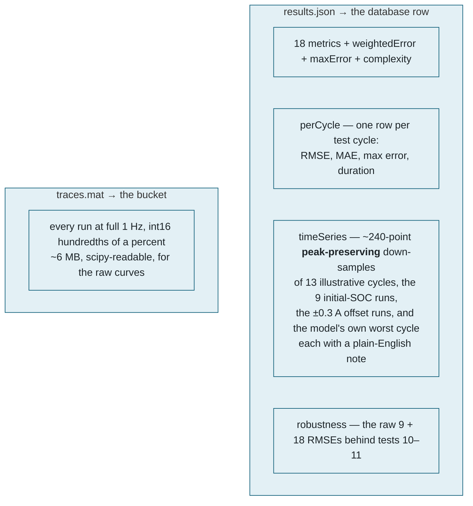
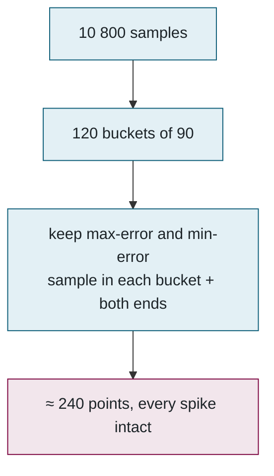

## 5. 🧮 The evaluation engine — scoring, complexity and outputs

> 💡 **Plain English.** After the model has run on every cycle, the evaluator has one error number per cycle. This part shows how those become the 18 numbers on the scorecard, how the 18 become one leaderboard score, what "complexity" means, and what gets sent back to the website for the charts.

### 📊 From one number per cycle to 18 metrics

Per-cycle RMSE (in % SOC) is arranged as a matrix `R` — rows are test cycles in file order, columns are the four cells — and the metrics are positional means over it, mirroring the original `Obtain_Output_Data.m`.

### ⚖️ The weights

The weights in metric order: `[0, 1/10, 1/10, 1/10, 1/30, 2/30, 2/30, 1/30, 1/10, 1/10, 1/60 ×6, 1/10, 1/10]`. Seven categories carry a tenth each; the four payloads share a fifth; the six temperatures share a tenth. `allCells` has weight zero — it is the headline number people recognise from the paper, but it would double-count everything else.

**A worked example.** A model with these RMSEs (all in % SOC): blinded cell 3.0, non-blinded 2.0, charging 4.0, standard 2.5, non-standard 3.5, initial-SOC 5.0, offset 6.0, the four masses 2.0 / 2.5 / 3.0 / 4.0, the six temperatures 6, 4, 3, 2, 1.5, 1.5:

| Group | Contribution |
|---|---|
| Seven categories at 1/10 | 0.1 × (3.0 + 2.0 + 4.0 + 2.5 + 3.5 + 5.0 + 6.0) = **2.60** |
| Four masses at 1/30, 2/30, 2/30, 1/30 | (2.0 + 2×2.5 + 2×3.0 + 4.0) / 30 = **0.57** |
| Six temperatures at 1/60 | (6 + 4 + 3 + 2 + 1.5 + 1.5) / 60 = **0.30** |
| **Weighted error** | **3.47** |

Two extras the scorer emits: `suspicious = mean(R) > 25` (the original tool *withheld* such results; we flag it in the log and leave the decision to an administrator), and `maxError` = the single worst instantaneous error across all test cycles.

### 📏 RMSE, in words

For one cycle: take the difference between the estimated and true SOC at every second, square each difference (so misses in both directions count and big misses count more), average them, and take the square root to get back to % SOC. A model that is always 2 % off scores an RMSE of 2. A model that is perfect most of the time but 30 % off for a minute scores worse than that minute's share would suggest — which is the point.

### ⏱️ Complexity

Informational only — it never enters the weighted error. The constants are per evaluation host. A caveat worth knowing: MATLAB's JIT is ~20× faster inside a function than in a script, so the MATLAB constant can only be re-measured by calling the model the way `Run_Model.m` does. For a researcher, complexity answers "would this fit on a real battery controller?" — a bin of 2 is a few arithmetic operations per second; a bin of 9 is a neural network that would need a much larger processor.

### 📤 What leaves the engine

**Peak-preserving down-sampling.** A three-hour cycle has 10 800 points; a chart can show about 240. Taking every 45th point would hide the very spike that produced the max-error number. Instead `display_indices` splits the cycle into 120 buckets and keeps the sample with the largest *and* the smallest signed error in each — so every spike survives and the plotted line agrees with the scorecard.

📌 **Files to open, in order:** [pipeline.py](../../evaluator/python/socbench_eval/pipeline.py) (`score`, `complexity`, `display_indices`, `per_cycle_rows`, `robustness_traces`, `write_full_traces`) → [test-cases.ts](../../src/lib/test-cases.ts) (the same 18 with labels and descriptions for the website).

