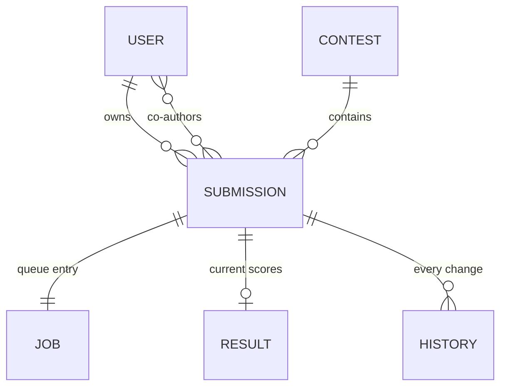

## 6. The data model

> **In this chapter.** The tables on which every other component operates, the two conventions that keep them consistent, and the single schema file that defines them.

Every operation described in Chapters 4 and 5 reads or writes rows in this database. A user owns submissions. Each submission has exactly one queue entry, at most one current result, and an append-only history of every change made to it. Further tables hold contests, worker heartbeats, evaluation settings and the administrative activity log. One file, the Prisma schema, defines all of them, and both the website and the worker are generated from it.

Figure 6.1. The core tables. Each line reads as "has": a user has many submissions; a submission has exactly one job and at most one result.

Two conventions apply throughout:

- **Cascading deletion.** Deleting a user removes that user's submissions, jobs, results and history, so no orphaned rows can exist.
- **Append-only history.** Score revisions, weight changes and administrative events are never modified after they are written, so any past state can be reconstructed.

Several tables stand outside the diagram:

- `WorkerHeartbeat`: one row per worker, refreshed every fifteen seconds with its load, supported languages and most recent console lines.
- `EvalSettings`: a single row of timeouts and the daily submission limit, editable by administrators.
- `ScoringConfig`: weight overrides; the most recent row is authoritative.
- `AdminEvent`: the administrative activity log.
- `RateLimitHit`: counters supporting the rate limits of Chapter 7.
- `ContactMessage`: messages received through the contact form.

Column-level detail is given in the appendix.

**Files to open:** [prisma/schema.prisma](../../prisma/schema.prisma). A single top-to-bottom reading is the most efficient introduction to the system.

