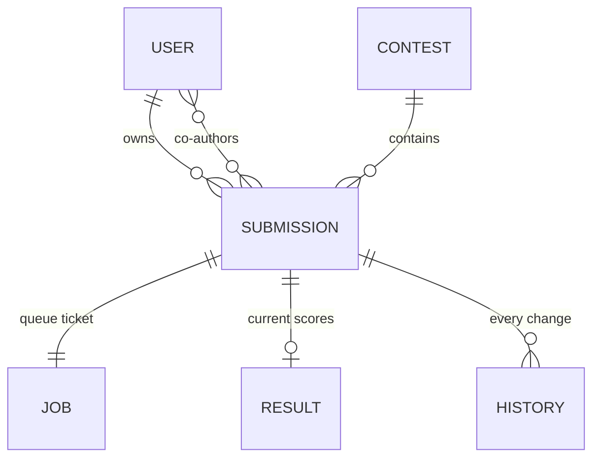

## 6. The database

> **In this chapter.** The tables that everything else reads and writes, the two habits that keep them tidy, and the one file that describes all of it.

Everything in Chapters 4 and 5 was reading or writing rows in this database. A person has submissions. Each submission has one queue ticket, one current result, and a history of everything that has ever happened to it. Separate tables hold contests, the workers' heartbeats, settings and the administrators' activity feed. One file, the Prisma schema, describes all of it, and the website and the worker both read that file.

Figure 6.1. The core tables. Read each line as "has": a user has many submissions; a submission has exactly one job and at most one result.

Two habits recur everywhere. **Cascade deletes:** delete a user and their submissions, jobs, results and history go with them, so nothing is ever orphaned. **Append-only history:** score revisions, weight changes and admin events are never edited, only added to, so the past can always be reconstructed.

The stand-alone tables are `WorkerHeartbeat` (one row per worker, refreshed every fifteen seconds with its load, languages and last console lines), `EvalSettings` (one row of timeouts and the daily cap, editable by administrators), `ScoringConfig` (weight overrides, newest wins), `AdminEvent` (the activity feed), `RateLimitHit` (abuse counters) and `ContactMessage` (the feedback inbox). Column-level detail is in the appendix.

**Files to open:** [prisma/schema.prisma](../../prisma/schema.prisma). Read it top to bottom once; it is the best map of the system.

