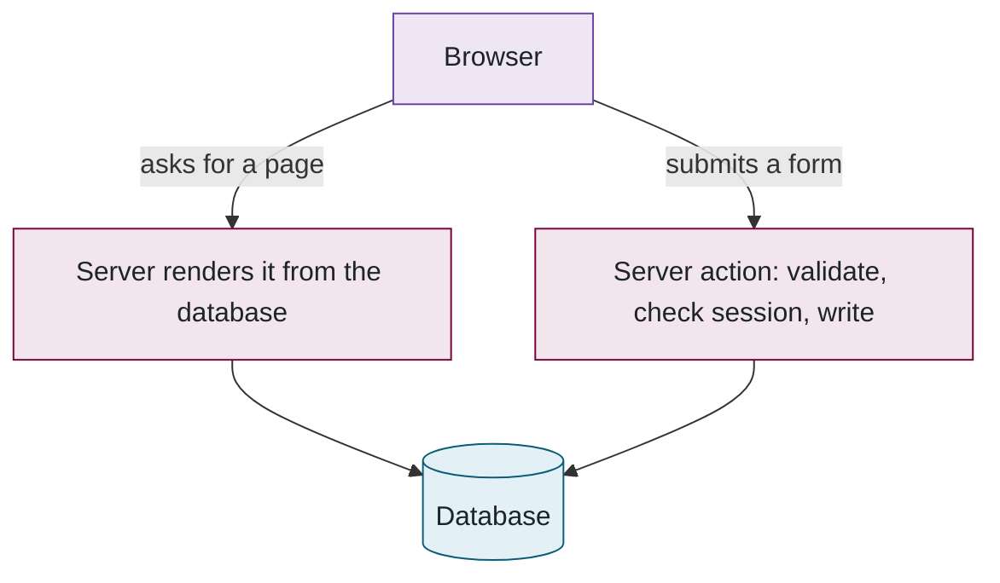

## 6. The website

> **Plain English.** The submit page lets you test a package for free before spending one of your three daily submissions. The results page explains the score in plain language first, then the numbers, then the charts. The leaderboard ranks public models; your private ones get a "ghost" rank so you can see where you would stand without displacing anyone.

With the pieces in place, this part is about what a visitor actually sees and how the pages are built.

### How pages get their data

There is no separate API — no machine-facing interface that programs call instead of people. A page reads the database on the server and arrives as finished HTML; a form calls a server action directly, which validates, checks the session, writes, and re-renders what changed. The few URLs that exist under `/api/` are for things that genuinely need one: status polling, the PDF download, upload links, the health check. The two paths from a browser:

### Submitting

A **dry run** executes the package against two hours of *open* data in about twelve seconds, shows the live console and its error, and costs nothing; that is where format mistakes get caught. (It is separate from the validation run in Part 3, which is the first thing a *full* evaluation does on hidden data.) Submitting proper asks for a name, description, model type, whether it is private, an optional contest, and co-authors; the form checks itself with the same rules the server uses, so a rejection appears before the upload.

### Reading results

The results page is ordered *why*, then *what*, then *detail*: plain-English insights first (what drove the score, whether the model over-fits the open data, how it copes with cold and with bad sensors), then the 18-row scorecard that sums to the score, then the key traces, then everything else behind folds — all 144 cycles, the score history, the downloads (PDF, JSON, traces). The PDF is the same content arranged for printing: the scorecard, an explanation of how the score was computed, the traces and every per-cycle error, with the citation and funding acknowledgement on each page; it is generated on the worker and attached to the results e-mail.

### The leaderboard

Public, completed, non-hidden models scored by the current benchmark version, ranked by weighted error; ties break on all-cells error, then earlier submission. The same ordering is applied on the server for the rank badge and in the browser for the table, so they cannot disagree. A signed-in user's private models appear with a dashed "~7" — the rank they *would* have — without moving anyone else. Results from an older version of the scoring maths stay listed but unranked, and their authors are asked to resubmit; packages are deleted after evaluation on purpose, so nothing can be re-run automatically.

### Co-authors and contests

A co-author is invited by e-mail, accepts with a button (never a plain link, for the same scanner reason), and only then appears publicly and receives the results. A contest is a time-boxed event with its own leaderboard that freezes at the deadline; entries must stay public, and their name and type freeze once the contest closes.

**Files to open:** [submit-form.tsx](../../src/app/(app)/submit/submit-form.tsx) → [submissions/[id]/page.tsx](../../src/app/(app)/submissions/[id]/page.tsx) → [queries.ts](../../src/lib/queries.ts) → [leaderboard-table.tsx](../../src/components/leaderboard/leaderboard-table.tsx).

