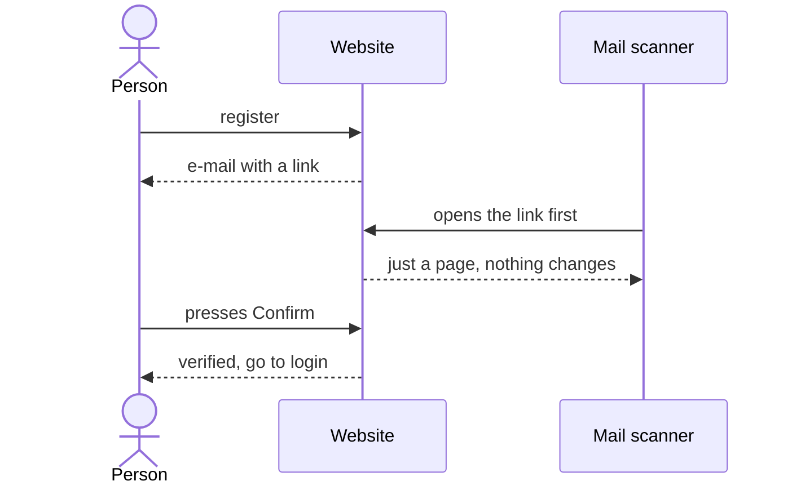

## 7. Accounts and security

> **In this chapter.** How people get in, why the confirmation e-mail has a button, and the layers that keep a hostile submission from doing any harm.

### 7.1 Why the confirmation e-mail has a button

Corporate mail scanners open every link in an e-mail before the person does, and they used to consume the one-time verification token. So opening the link now only shows a page, and pressing the button on it is what verifies the account. In Figure 7.1 the scanner's visit is the third arrow; notice that nothing changes until the person acts.

Figure 7.1. Verification survives a mail scanner because the link alone does nothing.

### 7.2 Signing in

An account gets ten sign-in attempts per fifteen minutes (forty per network address), after which it waits. The password is checked against its **bcrypt** hash, a deliberately slow one-way scramble: one login is instant, but guessing a million passwords is ruinously slow. A verified user receives a **signed cookie**, a small token the browser keeps and sends with every request, signed so it cannot be forged and good for fourteen days; the site never looks the session up in the database. Pages under `/submit`, `/profile` and `/admin` turn signed-out visitors away before the page is even built, but that is a convenience: the real check runs again inside every action.

### 7.3 What stops a bad submission

| Worry | What stops it |
|---|---|
| The model steals the hidden data | It can read it (it must) but has no network and is destroyed afterwards |
| The model attacks the machine | Read-only filesystem, no privileges, memory and CPU caps, runs as an unprivileged user |
| The model reads our secrets | The container never receives the worker's environment; MATLAB gets only a 24-hour licence token |
| A zip bomb (a tiny file that expands to fill the disk) or a path trick (a file name that tries to write outside its folder) | Entry, size and ratio limits, no folders, no `..`, checked on the website *and* again in the evaluator |
| A model runs forever | Hard timeout inside and outside the container |
| Someone floods the queue | Three submissions per day, five test runs per hour |
| Password guessing | bcrypt plus the attempt limits above |
| Someone finds out who has an account | "Forgot password" and "resend" answer identically whether or not the address exists |
| One compromised administrator deletes the others | Administrators cannot be deleted until demoted, and nobody can change their own role |

Secrets live in exactly three places (Vercel's environment, a file on the VM that only the worker's account can read, and a GitHub secret) and never in the repository, an image, a log or an e-mail.

**Files to open:** [auth.ts](../../src/lib/auth.ts) → [middleware.ts](../../src/middleware.ts) → [(auth)/actions.ts](../../src/app/(auth)/actions.ts) → [rate-limit.ts](../../src/lib/rate-limit.ts) → [python-evaluator.ts](../../src/evaluator/python-evaluator.ts).

