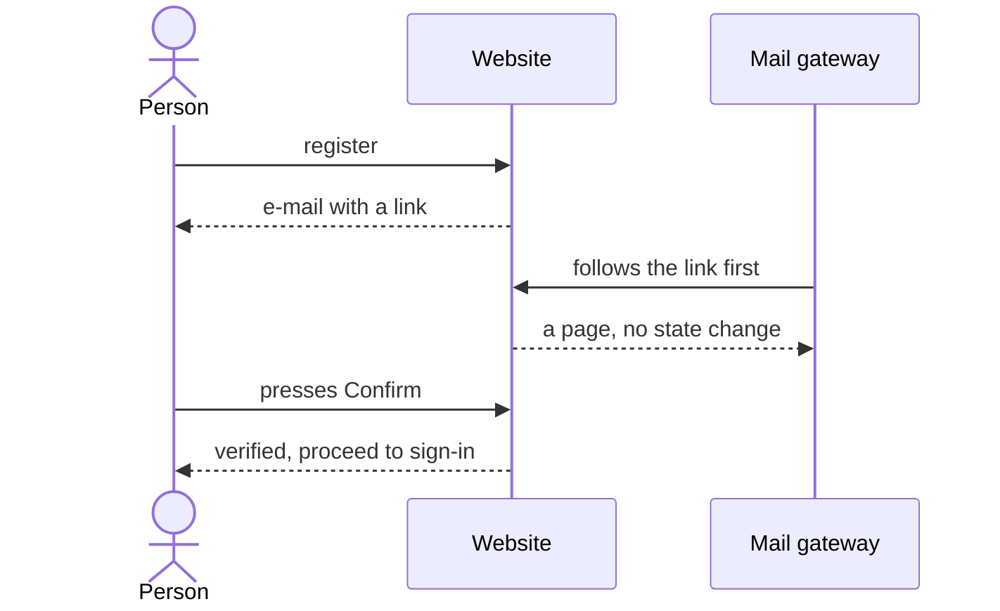

## 7. Accounts and security

> **In this chapter.** Authentication and session handling, the reason e-mail verification requires an explicit action, and the layered controls that contain a hostile submission.

### 7.1 Why verification requires a button

Corporate mail-security gateways follow every link in an incoming message before the recipient opens it. When the verification link itself performed the verification, these gateways consumed the single-use token and the recipient found it already invalid. The current design separates the two steps:

1. The link in the e-mail leads to a page and changes nothing.
2. The account is verified only when the person presses the **Confirm** button on that page.

In Figure 7.1 the gateway's visit is the third message; the account's state does not change until the person acts.

Figure 7.1. Verification is robust to mail gateways because following the link has no side effect.

### 7.2 Authentication and sessions

Sign-in follows four rules:

1. **Attempt limits.** An account may attempt sign-in ten times per fifteen minutes, and a network address forty times, after which further attempts are refused for the remainder of the window.
2. **Password storage.** Passwords are stored as **bcrypt** hashes, a deliberately slow one-way function: a single verification is imperceptible, but an exhaustive guessing attack is impractical.
3. **Sessions.** A successful sign-in issues a signed **session token** held in a browser cookie and valid for fourteen days. Requests are authenticated by verifying the signature, without a database lookup.
4. **Authorisation.** Routes under `/submit`, `/profile` and `/admin` redirect unauthenticated visitors before rendering, but this is a convenience only. The authoritative check is repeated inside every server action.

### 7.3 Containing a hostile submission

Secrets are held in exactly three locations: Vercel's environment configuration, a file on the virtual machine readable only by the worker's service account, and a GitHub repository secret. They appear in no repository file, container image, log or e-mail. The remaining threats, and the control that addresses each, are set out in the table below.

| Threat | Control |
|---|---|
| The model exfiltrates the withheld data | The container has read access (it must) but no network interface, and is destroyed after the run |
| The model attacks the host | Read-only filesystem, no capabilities, CPU and memory limits, execution as an unprivileged user |
| The model reads the worker's secrets | The container does not inherit the worker's environment; MATLAB receives only a 24-hour licence token |
| A decompression bomb or a path-traversal entry | Limits on entry count, unpacked size and compression ratio; no sub-directories; no `..` components; checked in the web tier and again in the evaluator |
| The model never terminates | A timeout enforced both inside and outside the container |
| Queue flooding | Three submissions per day and five test runs per hour per account |
| Password guessing | bcrypt hashing and the attempt limits above |
| Account enumeration | Password-reset and resend-verification requests respond identically whether or not the address exists |
| A compromised administrator removes the others | Administrators cannot be deleted until demoted, and no user can change their own role |

**Files to open:** [auth.ts](../../src/lib/auth.ts) → [middleware.ts](../../src/middleware.ts) → [(auth)/actions.ts](../../src/app/(auth)/actions.ts) → [rate-limit.ts](../../src/lib/rate-limit.ts) → [python-evaluator.ts](../../src/evaluator/python-evaluator.ts).

