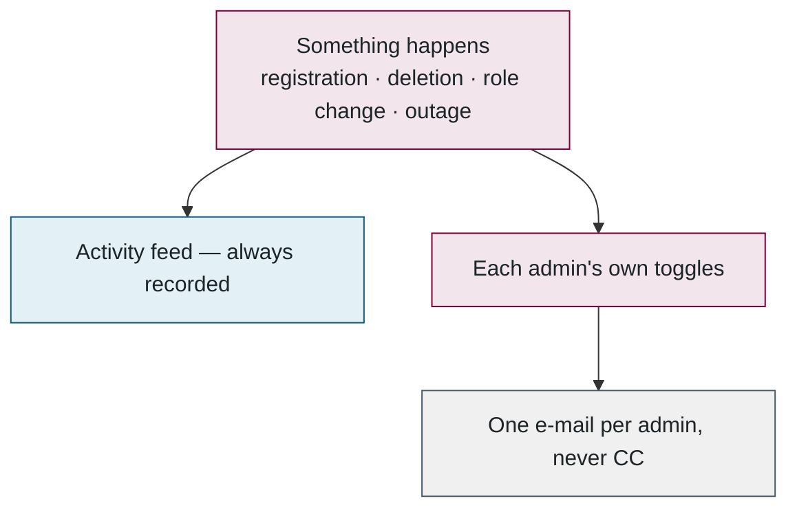
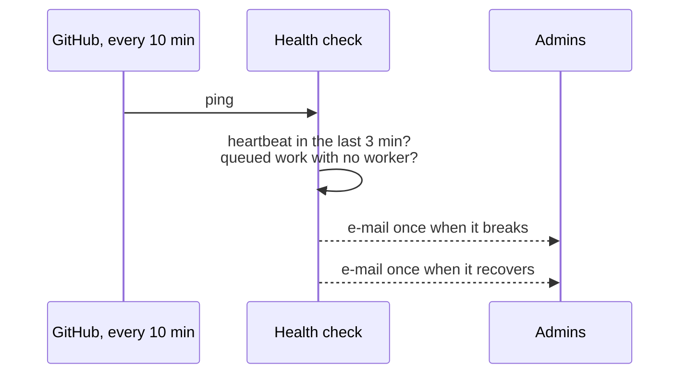

## 7. Administration and monitoring

> **Plain English.** Administrators can moderate submissions, manage users and contests, change the evaluation limits and the scoring weights, and watch the worker machines. Everything they do is recorded in an activity feed; e-mail is only a copy of it, and each admin chooses which kinds they want. A robot checks every ten minutes that a worker is alive and e-mails once if it is not, and once when it comes back.

The previous parts were the researcher's view. This part is the administrators' view, and how the system tells them when something is wrong.

### The admin pages

Overview (counts and the activity feed) · Submissions (moderate, bulk delete, retry) · Users (verify, roles, delete) · Contests · Messages (the feedback inbox) · Evaluation workers (machines, queue, limits) · Scoring weights · My notifications. Every action begins by re-checking that the caller is an admin, and each has a safety rail; the list is in the appendix.

### Changing the weights

An admin edits the 18 weights (they must sum to 1), previews how many stored scores would move, saves with a reason, and every result is re-scored from its stored metrics — no model is re-run. Authors can be e-mailed the old and new score with a fresh PDF. The previous weights stay in history.

### Notifications

Every event takes two routes — one always, one optional:

One rule that is easy to get wrong: the website's host freezes a request the instant it has answered, so an e-mail that is sent "in the background" without being waited for is silently dropped. Every such send is wrapped in `after()`, which keeps the request alive until it finishes. This was learned the hard way.

### The outage monitor

Born from a real outage: the worker was healthy but could not reach the database for ten hours, and nobody knew. The website is the one place that can always see both the database and e-mail, so it does the watching. The whole loop:

Only *changes* are e-mailed — one alert per outage, one all-clear — and the state lives in the activity feed, so it is visible on the site too.

**Files to open:** [admin/actions.ts](../../src/app/(admin)/admin/actions.ts) → [admin-notify.ts](../../src/lib/admin-notify.ts) → [worker-health/route.ts](../../src/app/api/ops/worker-health/route.ts).

