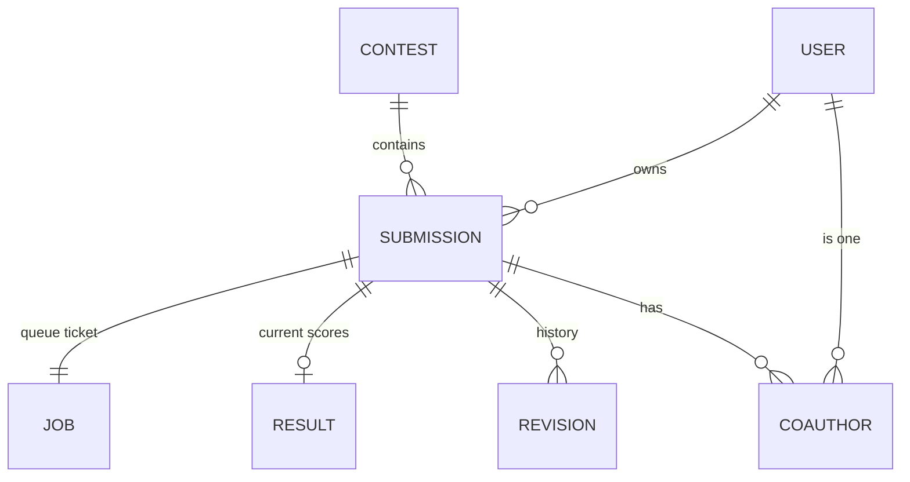
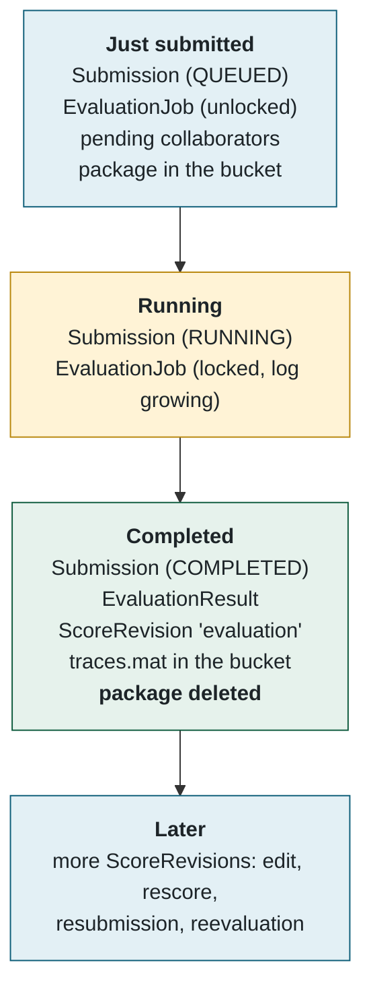
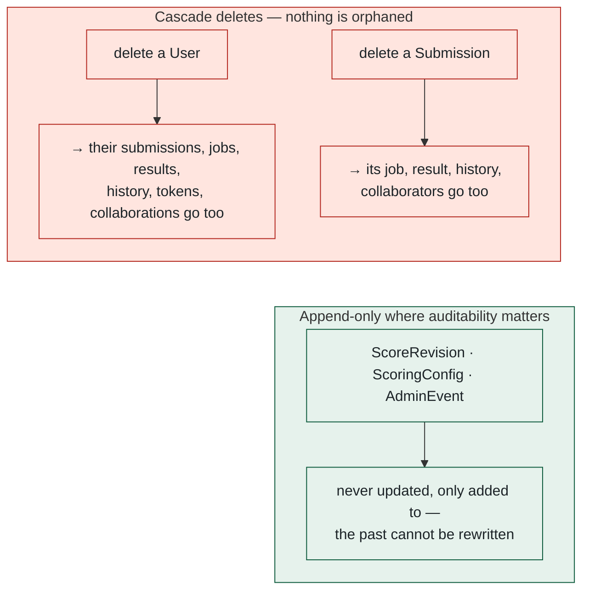

## 7. The data model

> 💡 **Plain English.** The database is a set of tables. A person has submissions; each submission has one queue ticket, one current result, and a history of everything that ever happened to it. Separate tables track contests, worker machines, settings and the admin activity feed. One file — `prisma/schema.prisma` — describes all of it, and both the website and the worker read that same description.

The picture shows only how the tables relate; the names are shortened for space — `JOB` is `EvaluationJob`, `RESULT` is `EvaluationResult`, `REVISION` is `ScoreRevision`, `COAUTHOR` is `SubmissionCollaborator`. Each table's columns are listed just below.

### 🗄️ Which rows exist at each moment

One submission's footprint grows as it moves through its life:

### 🗂️ The columns that matter

| Table | Key columns |
|---|---|
| `User` | `email`, `passwordHash` (bcrypt), `role` USER/ADMIN, `emailVerified` (a *timestamp*, not a boolean), public-profile fields, `adminNotify` JSON of e-mail toggles, `avatar` bytes ≤ 400 KB |
| `Submission` | `seq` (the human-visible #), `modelName`/`description`/`modelType`, `isPrivate`, `isHidden` (admin moderation), `fileKey` into the bucket, `runtime` (`python`/`matlab`, set at upload), `status`, `version` (bumped by "submit new version"), optional `contestId` |
| `EvaluationJob` | `attempts`, `lockedAt`/`lockedBy` (the compare-and-swap lock), `log` (the live console text), `cancelRequestedAt` |
| `EvaluationResult` | `weightedError`, `complexity`, the 18 metric columns `allCells … currentSensorOffset`, `maxError`, `perCycle` JSON, down-sampled `timeSeries` JSON, `robustness` JSON, `tracesKey`, `evaluatorVersion` stamp |
| `ScoreRevision` | `kind` (evaluation · failure · rescore · reevaluation · resubmission · edit · cancelled · legacy), the score and 18 metrics at that moment, `note`, `by` |
| `SubmissionCollaborator` | `notifiedAt` (invited), `acceptedAt` (public), `inviteToken` for the e-mail links |
| `DryRun` | its own status/lock, `result` JSON, `log` — never touches blinded data, never on the leaderboard |

Tables that stand alone:

| Table | Role |
|---|---|
| `WorkerHeartbeat` | One row per worker process (`hostname-pid`), refreshed every 15 s: liveness, what it is busy with, its runtimes, a pending admin command, machine diagnostics, the last 200 console lines |
| `EvalSettings` | A single row (`id = 1`): evaluation timeout 360 min, dry-run timeout 10 min, submissions per day 3. Read with a 15 s cache by both website and worker |
| `ScoringConfig` | Append-only weight overrides; the newest row is active; absent = the published defaults |
| `AdminEvent` | The activity feed on Admin → Overview — also the memory for outage alerting |
| `RateLimitHit` | One row per rate-limited attempt; counted per key per window |
| `ContactMessage` | The feedback inbox |
| `Contest`, `ContestEntry` | A time-boxed event with its own frozen leaderboard, and who registered for it |

### 📐 Two conventions that recur everywhere

📌 **Files to open, in order:** [prisma/schema.prisma](../../prisma/schema.prisma) (read it top to bottom once — it is the best map of the system) → [src/lib/db.ts](../../src/lib/db.ts) → [src/lib/history.ts](../../src/lib/history.ts).

