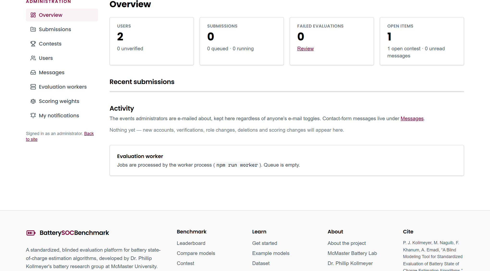
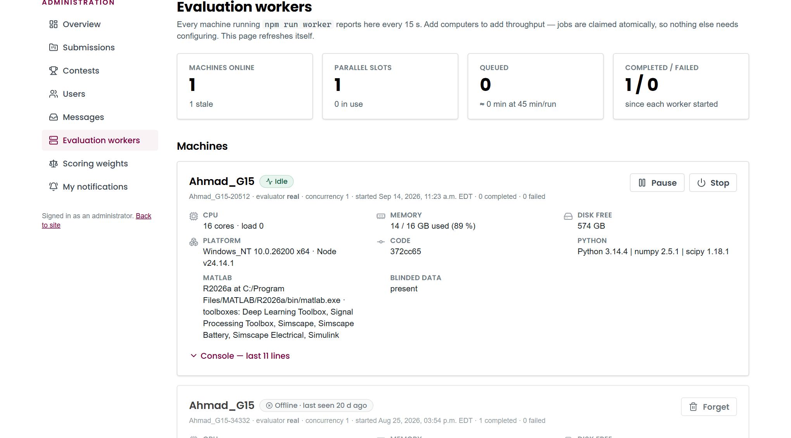
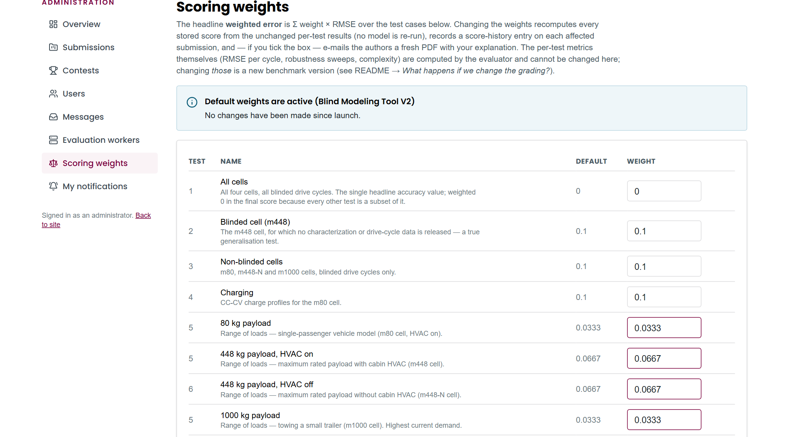
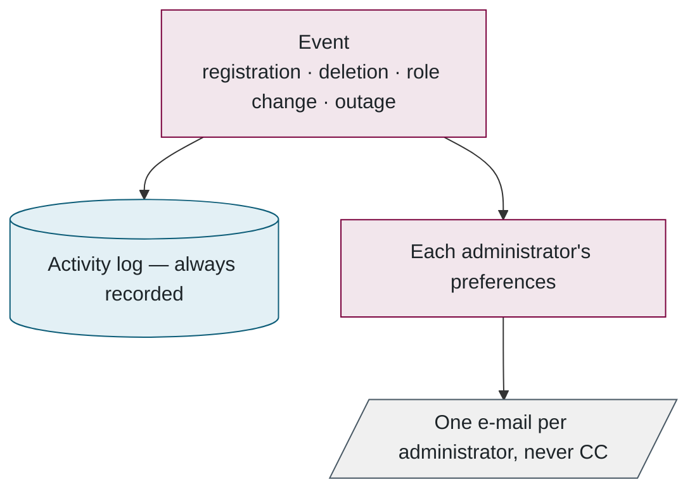
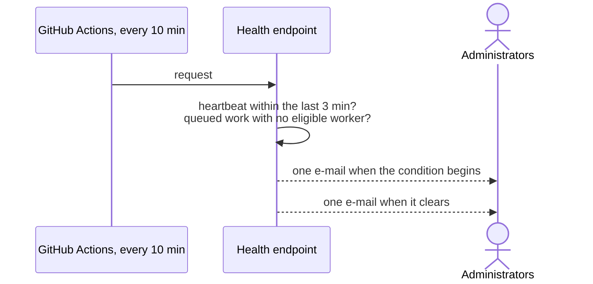

## 8. Administration and monitoring

> **In this chapter.** The administrative interface, the procedure for revising scoring weights without re-evaluating any model, the notification model, and the automated check that detects an unreachable worker.

### 8.1 The administrative pages

The left-hand navigation enumerates the interface:

- **Overview**: summary counts, recent submissions and the activity log.
- **Submissions**: moderation, retry and bulk deletion.
- **Users**: verification, role assignment and deletion.
- **Contests**: creation and closure.
- **Messages**: the contact-form inbox.
- **Evaluation workers**: every registered machine, the queue, and the evaluation limits.
- **Scoring weights**: the subject of Section 8.2.
- **My notifications**: each administrator's own e-mail preferences.

Every administrative action re-verifies the caller's role before proceeding, and each is subject to a safeguard. The safeguards are tabulated in the appendix.

### 8.2 Revising the weights

An administrator edits the eighteen weights, which must sum to one, previews how many stored scores would change, and saves with a written justification. Every stored result is then re-scored from its persisted per-test metrics; no model is re-executed, since the metrics were retained and the packages were deleted. Authors may optionally be notified of the previous and revised scores with a regenerated PDF. The superseded weights remain in the history.

### 8.3 Notifications

Every administrative event follows two paths, one unconditional and one configurable:

Figure 8.4. The activity log is the record; e-mail is a copy that each administrator enables per category.

One property of the hosting platform deserves emphasis. A serverless request is frozen the instant a response is returned, so any e-mail dispatched asynchronously without being awaited is silently lost. Every such dispatch is therefore wrapped in `after()`, which keeps the request alive until the send completes. This behaviour was discovered in production.

### 8.4 The outage monitor

The monitor was introduced after an incident in which the worker remained healthy but was unable to reach the database for ten hours, with no indication to anyone. The web tier is the one component that can always observe both the database and the mail service, so it performs the check. A GitHub Actions workflow calls a health endpoint every ten minutes; the endpoint evaluates two conditions and sends an e-mail only when the answer changes.

Figure 8.5. One alert per outage and one all-clear. The state is recorded in the activity log, so it is also visible on the site.

**Files to open:** [admin/actions.ts](../../src/app/(admin)/admin/actions.ts) → [admin-notify.ts](../../src/lib/admin-notify.ts) → [worker-health/route.ts](../../src/app/api/ops/worker-health/route.ts).

