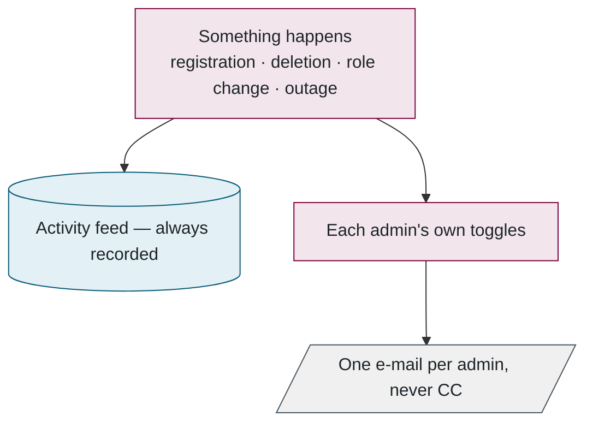
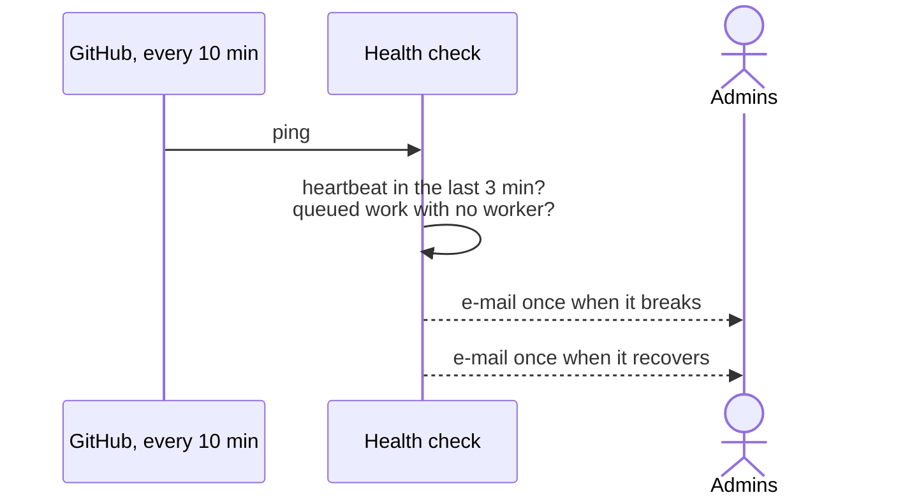

## 8. Administration and monitoring

> **In this chapter.** The administrators' pages, how the scoring weights are changed without re-running anything, how notifications work, and the robot that notices when the worker goes quiet.

### 8.1 The admin pages

The left-hand menu is the whole of it. **Overview** shows counts and the activity feed. **Submissions** moderates, retries and bulk-deletes. **Users** verifies, changes roles and deletes. **Contests** creates and closes them. **Messages** is the feedback inbox. **Evaluation workers** shows every machine, the queue and the evaluation limits. **Scoring weights** is Section 8.2. **My notifications** is where each administrator chooses which e-mails they want. Every action begins by re-checking that the caller is an administrator, and each has a safety rail; the list is in the appendix.

### 8.2 Changing the weights

An administrator edits the eighteen weights (they must sum to one), previews how many stored scores would move, and saves with a reason. Every result is then re-scored from its stored metrics; no model is re-run, because the metrics were saved and the packages were deleted. Authors can be e-mailed the old and new score with a fresh PDF, and the previous weights stay in the history.

### 8.3 Notifications

Every notable event takes two routes, one always and one optional:

Figure 8.4. The feed is the record; e-mail is a copy of it that each administrator can switch on or off by kind.

One rule that is easy to get wrong: the website's host freezes a request the instant it has answered, so an e-mail sent "in the background" without being waited for is silently dropped. Every such send is wrapped in `after()`, which keeps the request alive until it finishes. This was learned the hard way.

### 8.4 The outage monitor

This was born from a real outage: the worker was healthy but could not reach the database for ten hours, and nobody knew. The website is the one place that can always see both the database and e-mail, so it does the watching. A GitHub Action pings a health-check address every ten minutes; the check asks two questions, and e-mails once when the answer changes.

Figure 8.5. One alert per outage, one all-clear. The state lives in the activity feed, so it is visible on the site too.

**Files to open:** [admin/actions.ts](../../src/app/(admin)/admin/actions.ts) → [admin-notify.ts](../../src/lib/admin-notify.ts) → [worker-health/route.ts](../../src/app/api/ops/worker-health/route.ts).

