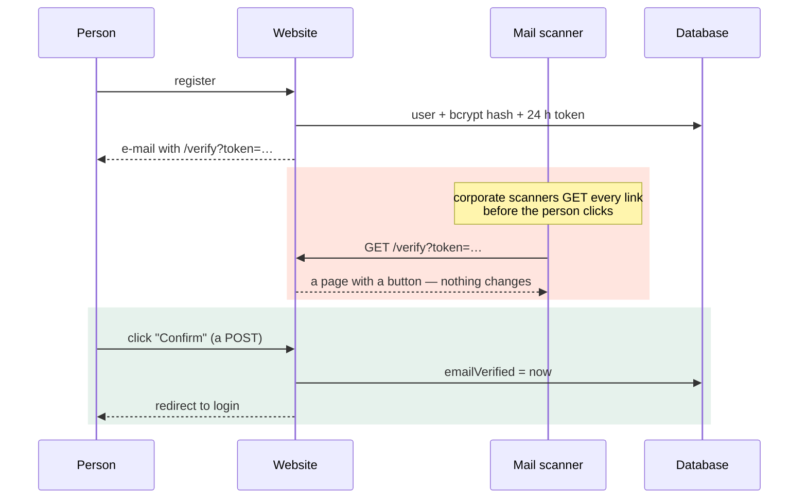
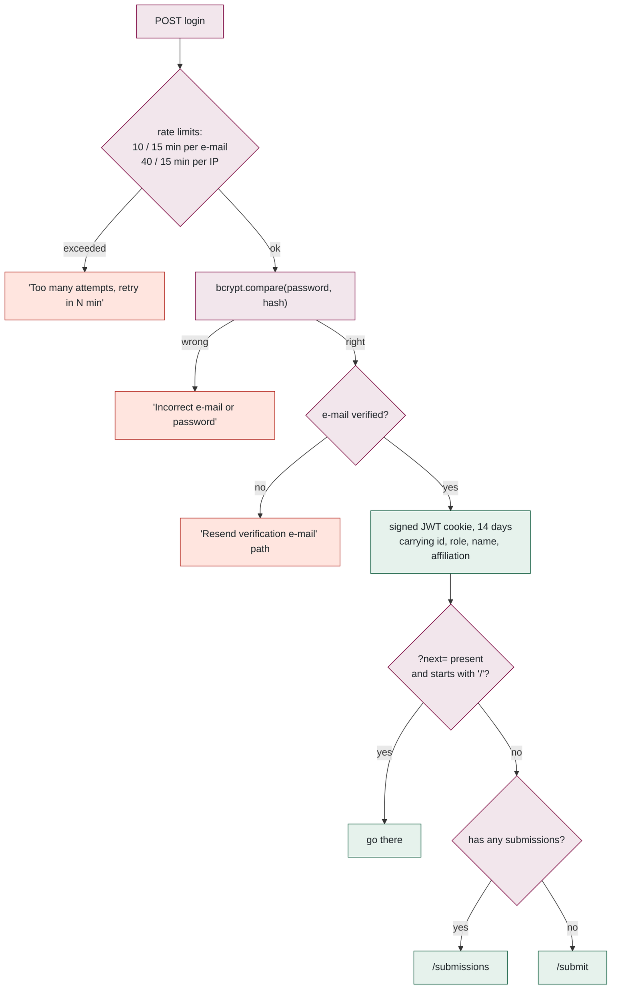
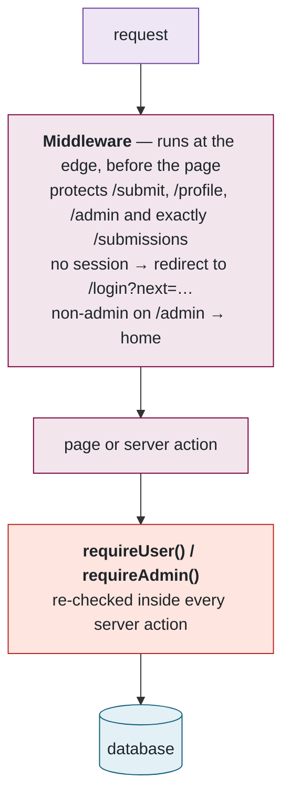
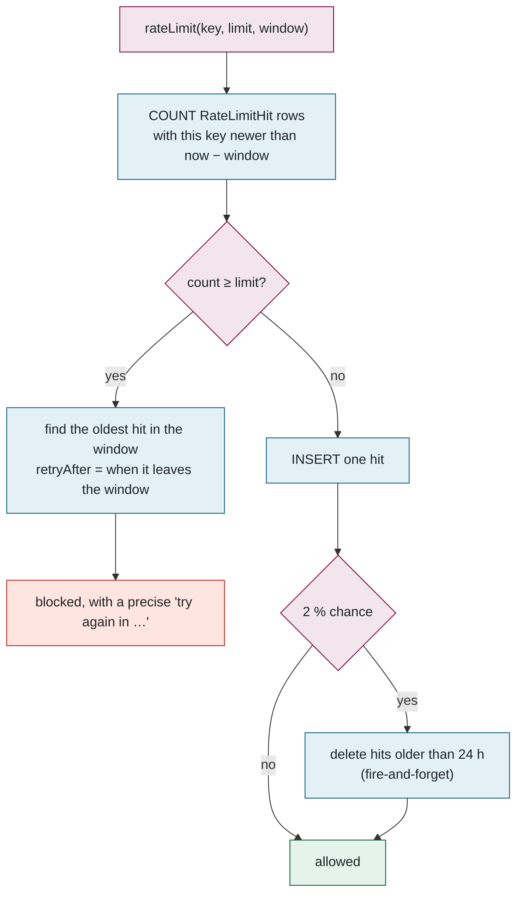

## 8. Authentication and accounts

> **Plain English.** Register with e-mail and password, prove you own the e-mail address by clicking a confirmation, then sign in. Passwords are stored scrambled, never in the clear. Administrators are either promoted on the admin page or listed in a configuration variable. Every sensitive action is limited to a few attempts per hour so nobody can guess passwords by brute force.

Files: [auth.ts](../../src/lib/auth.ts), [auth.config.ts](../../src/lib/auth.config.ts), [middleware.ts](../../src/middleware.ts), [(auth)/actions.ts](../../src/app/(auth)/actions.ts), [verify/actions.ts](../../src/app/(auth)/verify/actions.ts), [rate-limit.ts](../../src/lib/rate-limit.ts).

### Register and verify — and why the verification link is a button

The GET is side-effect free on purpose: before this change, mail scanners (Microsoft Safe Links, Proofpoint, Gmail) were consuming the one-time token before the person clicked. The token is also deliberately **left in place after success**, so a scanner firing after the click, or a double-click, lands on "already verified" instead of an error. The page even tells the user why: "This extra click keeps automated e-mail security scanners from activating accounts on your behalf."

### Login, and where you land afterwards

The `startsWith('/')` check blocks open redirects to other sites. Sessions are signed JWT cookies — no session table, so the database is not touched to verify a request. The `next` parameter is how a deep link survives login: open `/submissions/abc` while signed out and you come back to exactly that page.

### Authorization has two layers, and the first is not the boundary

Middleware is a convenience that keeps signed-out users off the pages; the real check is inside each action. Two details worth knowing: `auth.config.ts` is split from `auth.ts` because middleware runs at the *edge* where Prisma cannot load; and the `ADMIN_EMAILS` variable is **re-read on every call** and applied in the session callback, so adding an address there makes that person an admin on their next request — no waiting for a token to expire.

### Rate limiting without a memory

Vercel functions are stateless — an in-memory counter would reset on every request — so the counter is the database.

The 2 % probabilistic prune means there is no clean-up cron to run or forget. Configured limits:

| Action | Limit |
|---|---|
| Register | 5 / hour / IP |
| Resend verification | 3 / hour / e-mail |
| Login | 10 / 15 min per e-mail **and** 40 / 15 min per IP |
| Password reset request | 3 / hour / e-mail, 10 / hour / IP |
| Contact form | 5 / hour / IP |
| Upload URLs | 30 / hour / user |
| Resend a collaborator invite | 1 / 12 h per person |
| Dry runs (separate quota, from real rows) | 5 / hour; admins unlimited |

### Other account details

- Password policy: ≥ 8 characters with an upper-case letter, a lower-case letter and a digit. Hash: bcrypt, cost 11 (about a tenth of a second per check — trivial for one login, ruinous for a million guesses).
- Tokens: 256-bit random, one live token per purpose per user; verification 24 h, reset 1 h. A successful password reset also sets `emailVerified` — proving mailbox control is treated as equivalent to clicking the verification link.
- Resend-verification and forgot-password always answer "if that address is registered…" so they cannot be used to discover accounts. Registration reports a duplicate e-mail explicitly — a deliberate usability trade-off.
- Avatars are resized in the browser to 256 px JPEG, capped at 400 KB on the server, stored as bytes in Postgres, served with a 24 h cache and an ETag derived from `avatarUpdatedAt`.

**Files to open, in order:** [auth.config.ts](../../src/lib/auth.config.ts) → [auth.ts](../../src/lib/auth.ts) → [middleware.ts](../../src/middleware.ts) → [(auth)/actions.ts](../../src/app/(auth)/actions.ts) → [verify/actions.ts](../../src/app/(auth)/verify/actions.ts) → [rate-limit.ts](../../src/lib/rate-limit.ts).

