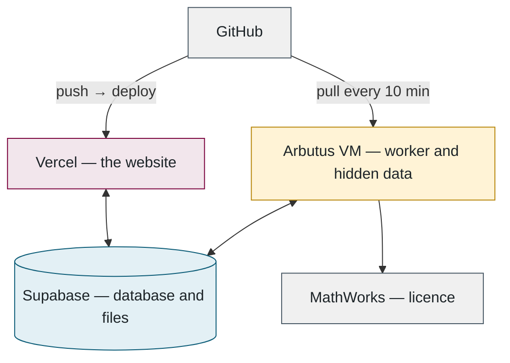
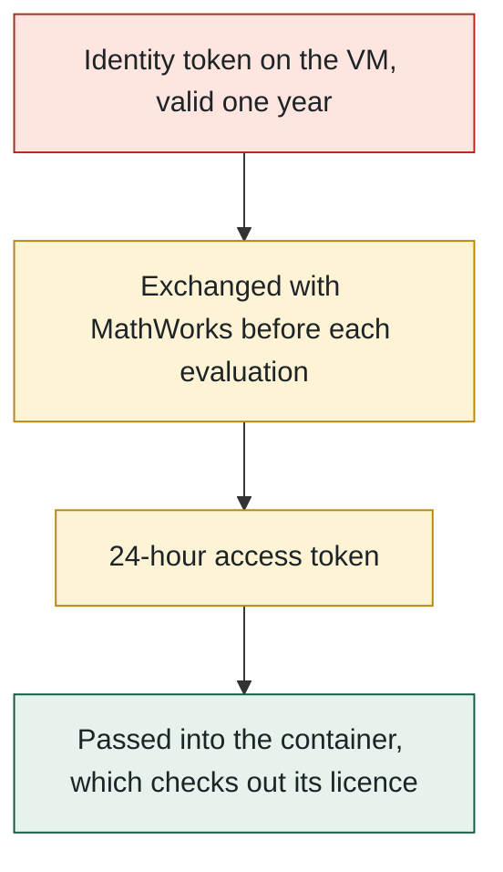

## 8. Infrastructure

> **Plain English.** The website deploys itself whenever code is pushed. The worker is a rented Linux computer in the Alliance research cloud that updates itself every ten minutes, restarts only when idle, and runs MATLAB inside a container licensed through the lab's MathWorks account. Secrets sit in files only the worker's own account can read.

Everything so far has described the software; this part is where it physically runs, and how it keeps itself up to date. The diagram is the same three programs as Part 1, now with the services around them:

**The VM** is set up by one script: Docker, Node, a no-login service account, the repo checked out with a read-only key, a hardened background service, a firewall that allows only SSH. Secrets and the hidden data are placed by hand afterwards, owned by the service account, readable by nobody else.

**Self-update** runs every ten minutes: fetch the code; if anything changed, rebuild only what it touched (packages, the database client, the sandbox images); then restart the worker — but only if no evaluation is running, otherwise wait for the next tick.

**MATLAB** runs inside MathWorks' own container image, licensed through the lab's account rather than a licence server. A one-time browser sign-in produced a year-long identity token that lives on the VM; for each evaluation the worker exchanges it for a 24-hour token, and only that short-lived token enters the container. The chain, from the long-lived secret to the container:

**Running it on a laptop** is the same code with different settings: a local Postgres in Docker, files on disk, e-mail to a test inbox. There is no fake scorer; a developer's worker runs the real evaluator, which needs the hidden data and the sandbox image. The seed creates an admin account and one test user, nothing else.

**Files to open:** [provision-arbutus-worker.sh](../../scripts/provision-arbutus-worker.sh) → [vm-update.sh](../../scripts/vm-update.sh) → [Dockerfile.matlab](../../evaluator/Dockerfile.matlab) → [.env.example](../../.env.example).

