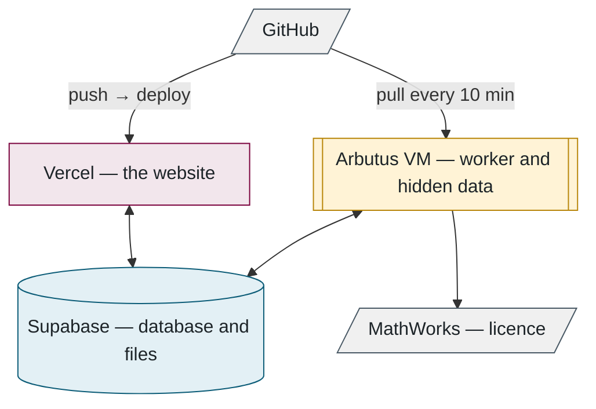

## 9. Infrastructure

> **In this chapter.** Where the software physically runs, how it deploys and updates itself, how MATLAB is licensed inside a container, and how to run everything on a laptop.

### 9.1 The services

The website deploys itself whenever code is pushed. The worker is a rented Linux computer in the Alliance research cloud that updates itself every ten minutes, restarts only when idle, and runs MATLAB inside a container licensed through the lab's MathWorks account.

Figure 9.1. The same three programs as Chapter 2, with the services around them.

### 9.2 The virtual machine

One script sets the machine up: Docker; Node.js, which runs the website's language outside a browser; a service account with no login that exists only to run the worker; the code checked out with a key that can download but never change it; a hardened background service; and a firewall that allows nothing but SSH. Secrets and the hidden data are placed by hand afterwards, owned by the service account and readable by nobody else.

**Self-update** runs every ten minutes: fetch the code; if anything changed, rebuild only what it touched (packages, the database client, the sandbox images); then restart the worker, but only if no evaluation is running, otherwise wait for the next tick.

### 9.3 MATLAB inside a container

MATLAB runs inside MathWorks' own container image (the template a container is started from) and is licensed through the lab's account rather than a licence server. A one-time browser sign-in produced a year-long identity token that lives on the VM. For each evaluation the worker exchanges it for a 24-hour token, and only that short-lived token enters the container.

Figure 9.2. The licence chain. The long-lived secret never enters the sandbox.

### 9.4 Before code reaches production

A push that touches the website runs a browser test pass over the main pages (using Playwright) and is refused if any page errors. The site then deploys itself, and the VM picks the change up within ten minutes.

### 9.5 Running it on a laptop

It is the same code with different settings: a local PostgreSQL database in Docker, files on disk, e-mail to a test inbox. There is no fake scorer; a developer's worker runs the real evaluator, which needs the hidden data and the sandbox image. The **seed**, the script that fills an empty database with starter rows, creates an administrator account and one test user and nothing else. The README has the five commands.

**Files to open:** [provision-arbutus-worker.sh](../../scripts/provision-arbutus-worker.sh) → [vm-update.sh](../../scripts/vm-update.sh) → [Dockerfile.matlab](../../evaluator/Dockerfile.matlab) → [.env.example](../../.env.example).

