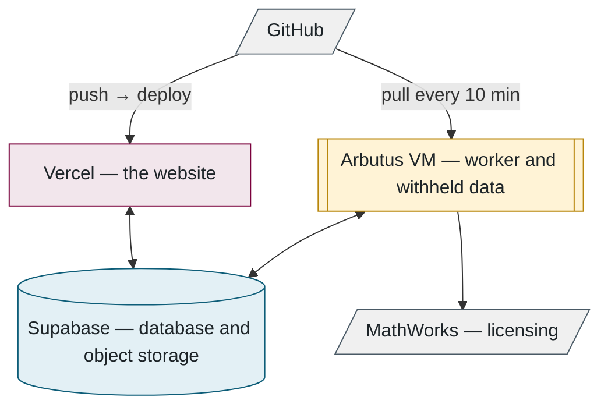

## 9. Infrastructure

> **In this chapter.** Where the software is deployed, how the website and the worker update themselves, how MATLAB is licensed inside a container, and how the system is run on a development machine.

### 9.1 The deployed services

The website deploys automatically on every push to the repository. The worker is a Linux virtual machine in the Alliance research cloud that pulls the repository every ten minutes, restarts only when idle, and runs MATLAB inside a container licensed through the laboratory's MathWorks account.

Figure 9.1. The three programs of Chapter 2 in their hosting context.

### 9.2 The virtual machine

A single provisioning script prepares the machine. It installs and configures:

- Docker, which provides the sandboxes;
- Node.js, the runtime for the worker;
- a service account with no interactive login, whose sole purpose is to run the worker;
- a checkout of the repository using a deploy key with read-only access;
- a hardened systemd service that keeps the worker running;
- a firewall that admits SSH and nothing else.

Secrets and the withheld data are placed manually after provisioning. They are owned by the service account and readable by no other user.

**Self-update** runs every ten minutes:

1. Fetch the repository.
2. If anything changed, rebuild only the affected components: dependencies, the database client, or the sandbox images.
3. Restart the worker, but only if no evaluation is in progress; otherwise defer to the next interval.

### 9.3 MATLAB in a container

MATLAB runs inside MathWorks' own container image and is licensed through the laboratory's MathWorks account rather than a licence server. A one-time interactive sign-in produced an identity token valid for one year, which is stored on the virtual machine. Before each evaluation the worker exchanges it for a 24-hour access token, and only that short-lived token is passed into the container, as Figure 9.2 shows:

Figure 9.2. The licensing chain. The long-lived credential never enters the sandbox.

### 9.4 Continuous integration

A push that modifies the web tier triggers a browser test pass over the principal pages using Playwright, and the push is refused if any page fails to render. On success the site deploys automatically, and the virtual machine adopts the change within ten minutes.

### 9.5 Running the system locally

The same code runs on a development machine with different configuration. There is no simulated evaluator: a developer's worker runs the real evaluation pipeline, which requires the withheld data and the sandbox image. The repository README lists the five commands required, and the configuration differs from production in four respects:

- a local PostgreSQL instance in Docker,
- uploaded files stored on the local disk,
- e-mail delivered to a test inbox rather than to real addresses,
- a **seed** script that populates the empty database with one administrator account and one test user, and nothing else.

**Files to open:** [provision-arbutus-worker.sh](../../scripts/provision-arbutus-worker.sh) → [vm-update.sh](../../scripts/vm-update.sh) → [Dockerfile.matlab](../../evaluator/Dockerfile.matlab) → [.env.example](../../.env.example).

