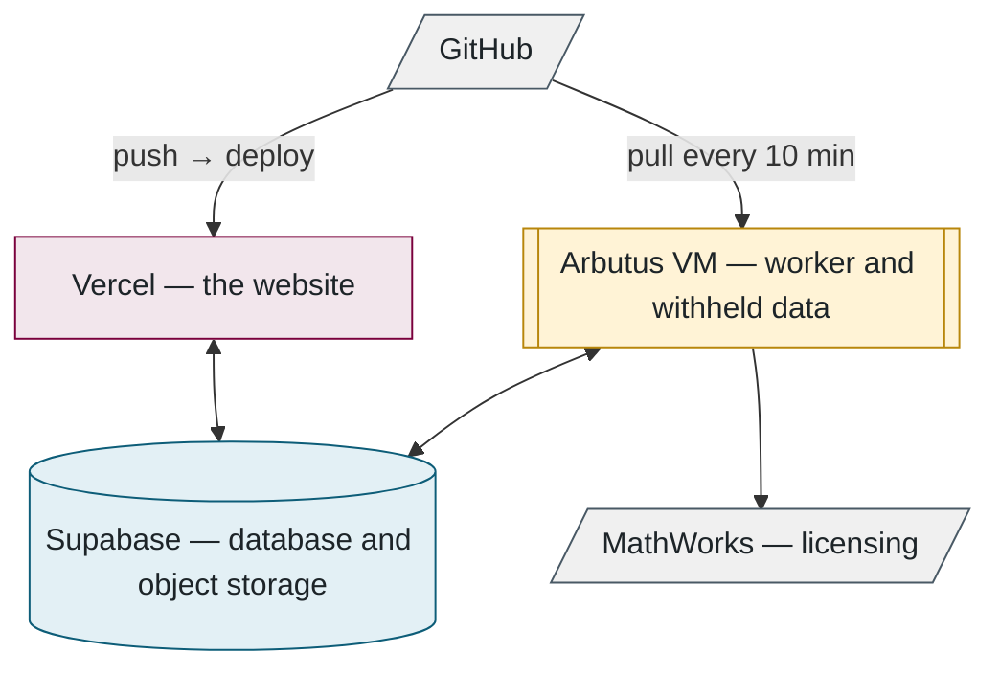
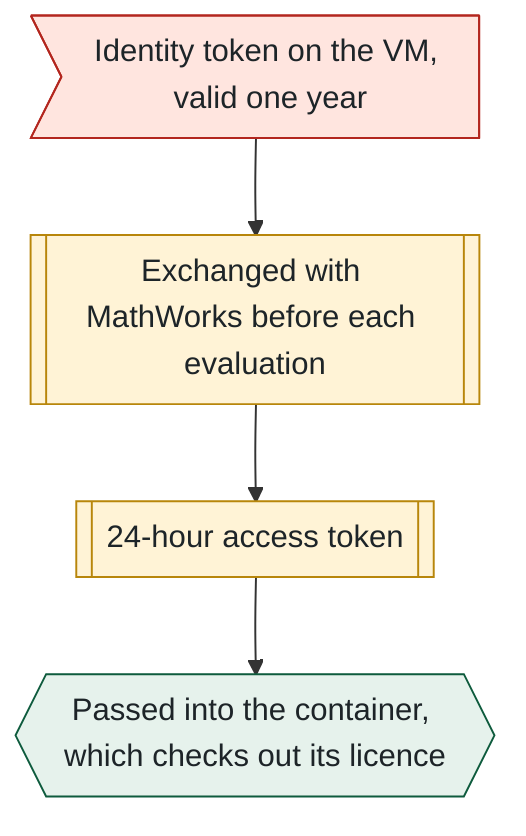
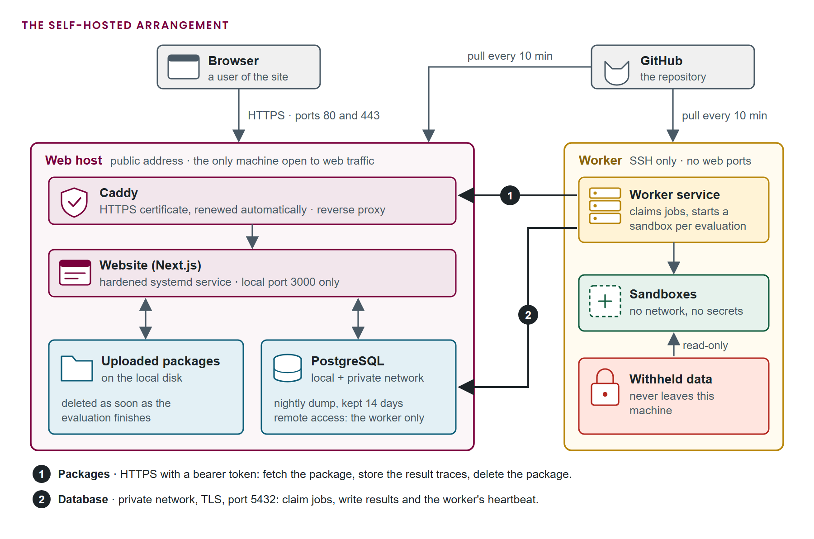

## 9. Infrastructure

> **In this chapter.** Where the software is deployed, how the website and the worker update themselves, how MATLAB is licensed inside a container, how the system is run on a development machine, and how the whole platform can be hosted inside the research cloud.

### 9.1 The deployed services

The two deployed programs update themselves in different ways:

- **The website** deploys automatically on every push to the repository.
- **The worker** is a Linux virtual machine in the Alliance research cloud. It pulls the repository every ten minutes, restarts only when idle, and runs MATLAB inside a container licensed through the laboratory's MathWorks account.

Figure 9.1. The three programs of Chapter 2 in their hosting context.

### 9.2 The virtual machine

A single provisioning script prepares the machine. It installs and configures:

- Docker, which provides the sandboxes;
- Node.js, the runtime for the worker;
- a service account with no interactive login, whose sole purpose is to run the worker;
- a checkout of the repository using a deploy key with read-only access;
- a hardened systemd service that keeps the worker running;
- a firewall that admits SSH and nothing else.

Secrets and the withheld data are placed manually after provisioning. They are owned by the service account and readable by no other user.

**Self-update** runs every ten minutes:

1. Fetch the repository.
2. If anything changed, rebuild only the affected components: dependencies, the database client, or the sandbox images.
3. Restart the worker, but only if no evaluation is in progress; otherwise defer to the next interval.

### 9.3 MATLAB in a container

MATLAB runs inside MathWorks' own container image and is licensed through the laboratory's MathWorks account rather than a licence server. A one-time interactive sign-in produced an identity token valid for one year, which is stored on the virtual machine. Before each evaluation the worker exchanges it for a 24-hour access token, and only that short-lived token is passed into the container, as Figure 9.2 shows:

Figure 9.2. The licensing chain. The long-lived credential never enters the sandbox.

### 9.4 Continuous integration

A push that modifies the web tier triggers a browser test pass over the principal pages using Playwright, and the push is refused if any page fails to render. On success the site deploys automatically, and the virtual machine adopts the change within ten minutes.

### 9.5 Running the system locally

The same code runs on a development machine with different configuration. There is no simulated evaluator: a developer's worker runs the real evaluation pipeline, which requires the withheld data and the sandbox image. The repository README lists the five commands required, and the configuration differs from production in four respects:

- a local PostgreSQL instance in Docker,
- uploaded files stored on the local disk,
- e-mail delivered to a test inbox rather than to real addresses,
- a **seed** script that populates the empty database with one administrator account and one test user, and nothing else.

**Files to open:** [provision-arbutus-worker.sh](../../scripts/provision-arbutus-worker.sh) → [vm-update.sh](../../scripts/vm-update.sh) → [Dockerfile.matlab](../../evaluator/Dockerfile.matlab) → [.env.example](../../.env.example).

### 9.6 The self-hosted deployment

The platform can also run entirely inside the Alliance research cloud, with no commercial hosting. A second virtual machine, the **web host**, then carries the website, the database and the uploaded packages, and the worker of Section 9.2 is unchanged apart from its configuration. At the time of writing this arrangement serves the staging address, and the production site still runs on the hosted services of Section 9.1.

The web host is prepared by one provisioning script, which installs and configures:

- Node.js and a hardened systemd service that runs the website on a local port;
- PostgreSQL, listening on the local machine and on the private network only;
- Caddy, a web server that terminates HTTPS and obtains and renews its certificate without intervention;
- a firewall that admits SSH, HTTP and HTTPS from anywhere, and PostgreSQL from the worker's private address alone;
- a nightly database dump retained for fourteen days;
- a self-update timer equivalent to the worker's: every ten minutes it fetches the repository and, if anything changed, applies additive schema changes, rebuilds the site and restarts it.

The database password and the session secret are generated on the machine during provisioning and are never transmitted elsewhere.

Two machines cannot share a local disk, so package storage acquires a third mode. Section 9.5 described files kept on the local disk, and Section 9.1 a hosted object store; in the self-hosted arrangement the web host keeps the files on its own disk and the worker reaches them through an internal endpoint:

1. The website saves an uploaded package to its disk and records the key in the database, exactly as it does on a development machine.
2. The worker claims the job and requests the package from the endpoint, presenting a shared token in the request header.
3. After the evaluation the worker uploads the result traces through the same endpoint and deletes the package.

The endpoint does not exist unless the token is configured, compares the token in constant time, and accepts only keys of the form the website itself generates, so a request cannot name an arbitrary file.

Moving an existing installation from the hosted services is a four-step procedure, each step a script in the repository:

1. **Import the data.** The hosted database is copied into the web host's PostgreSQL, data only, and row counts are compared table by table.
2. **Repoint the worker.** Its configuration receives the new database address and the remote storage mode.
3. **Move the domain.** The DNS records are changed first; the web host then obtains a certificate for the new name and rebuilds, since the public address is fixed into the site at build time.
4. **Retire the hosted services** after a period of parallel running.

**Files to open:** [provision-arbutus-web.sh](../../scripts/provision-arbutus-web.sh) → [web-update.sh](../../scripts/web-update.sh) → [storage.ts](../../src/lib/storage.ts) → [internal storage route](../../src/app/api/internal/storage/route.ts) → [cutover-import-db.sh](../../scripts/cutover-import-db.sh).

