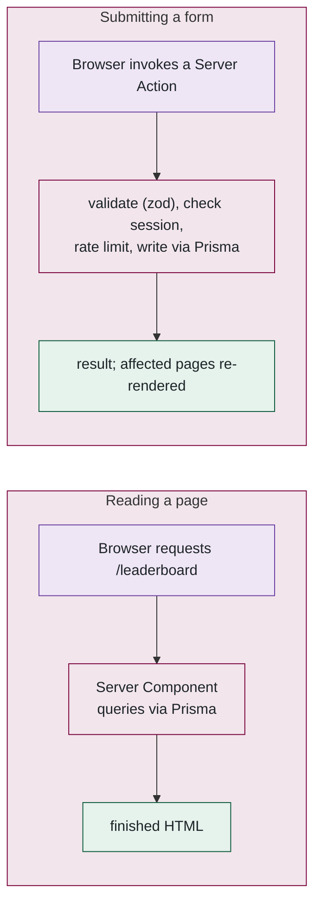
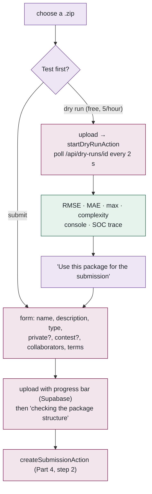
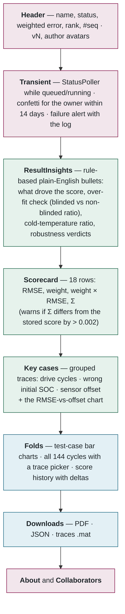
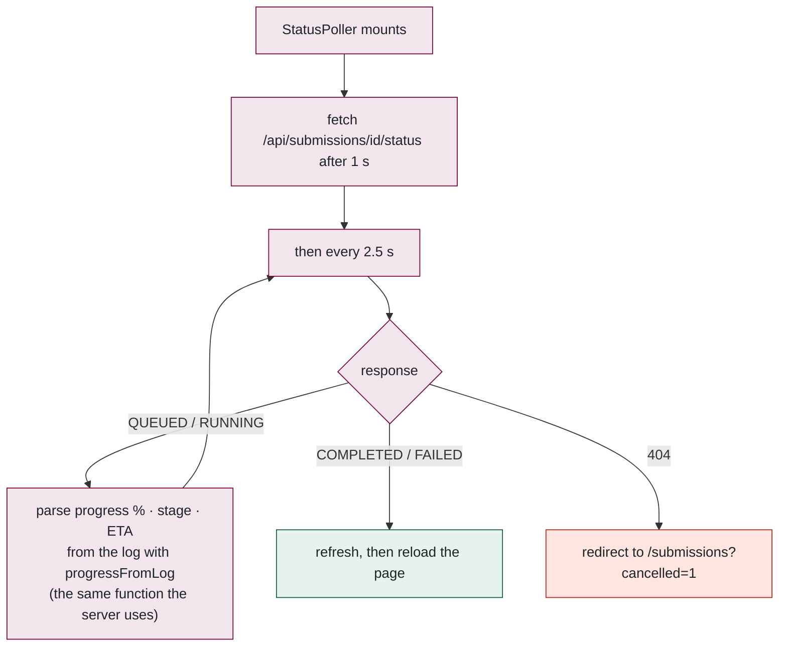
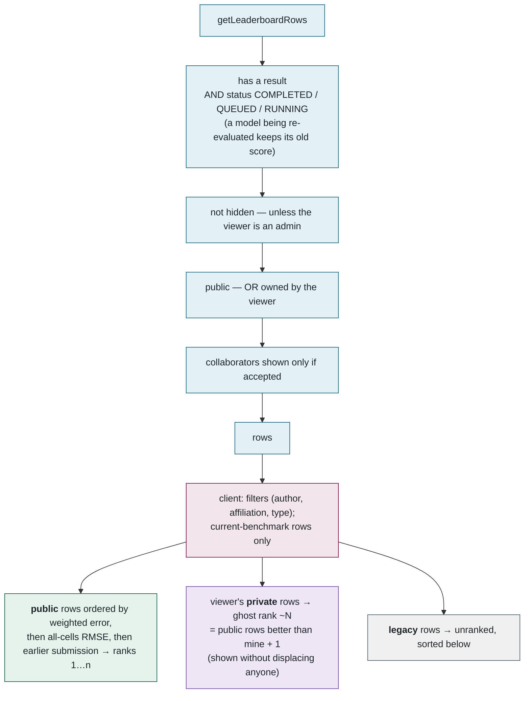
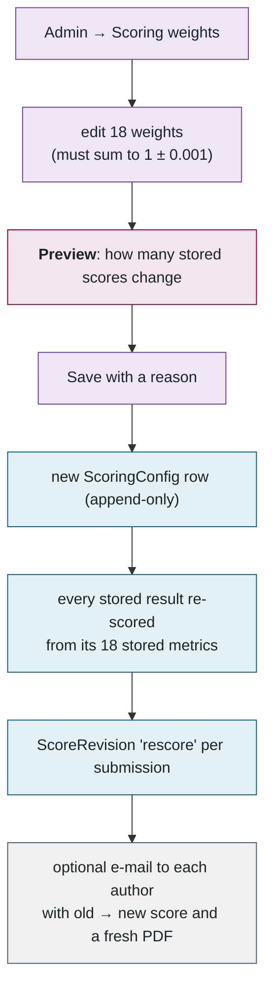
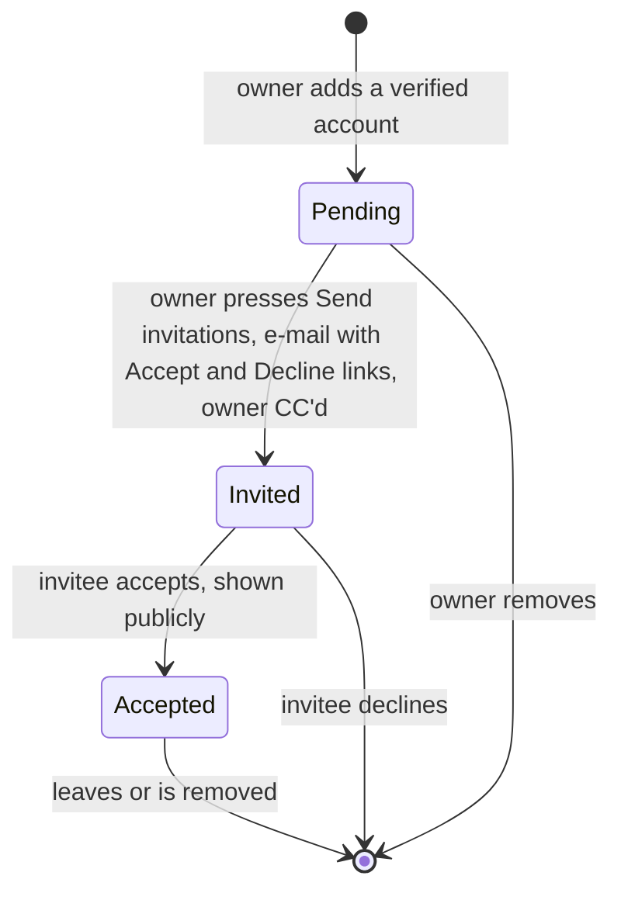
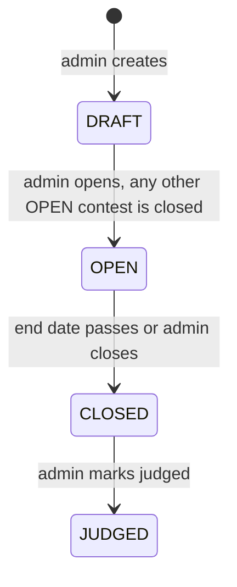

## 9. The web tier: submitting, results, leaderboard

> **Plain English.** The submit page lets you test a package for free before spending one of your three daily submissions. The results page explains the score in plain language first, then shows the numbers, then the charts. The leaderboard ranks public models; your private ones show a "ghost" rank so you can see where you would stand without displacing anyone.

### There is no REST API

Pages read the database directly in Server Components and return finished HTML. Forms call Server Actions. This is the pattern that surprises people coming from an API-first codebase:

Route handlers under `src/app/api/` exist only for the handful of things that genuinely need a URL: status polling, the PDF and JSON downloads, upload URLs, avatars, the health check.

### The submit page

The form is fully controlled — React 19 resets uncontrolled inputs after an action — and validates with the *same* zod schema the server uses, so a rejection is caught before the upload. Picking a contest force-clears *private*: contest entries must stay public for the frozen contest leaderboard.

### The results page, top to bottom

The order is deliberate: *why* before *what* before *detail*. A researcher who reads only the insights and the scorecard knows what to fix. Access is decided by `canViewSubmission`: admin, owner, collaborator, or public-and-not-hidden. The **Manage** menu (owner or admin) offers: edit name/description/type (name and type freeze once a contest closes); submit a new version (same submission, `version + 1`, previous score kept in history); make private/public (hidden for contest entries); re-run when FAILED; cancel while queued/running; delete.

### Live status while waiting

The progress line format is `NN.N% | cycle:m80:3`; the regex, the "validation stage pinned to 1 %" rule and the ETA formula all live in one file, [progress.ts](../../src/lib/progress.ts), so the page and the queue estimator can never disagree. *The ETA formula:* if reaching 40 % took 8 minutes, the remaining 60 % is estimated at 8 × 60 / 40 = 12 minutes, minus however long since the last progress line, floored at 30 s.

### The leaderboard: which rows, and how they are ranked

**A worked ranking.** Five models, and you are signed in as the owner of the private one:

| Model | Weighted error | All-cells | Submitted | Public? | Shown as |
|---|---|---|---|---|---|
| A | 2.10 | 2.4 | Mar 3 | yes | **1** |
| B | 2.35 | 2.8 | Mar 9 | yes | **2** — tie on weighted error… |
| C | 2.35 | 2.6 | Apr 1 | yes | **2** …no: C's all-cells is lower, so C is 2 and B is 3 |
| D | 3.00 | 3.1 | Feb 1 | yes | **4** |
| Mine | 2.50 | 2.7 | Apr 5 | private | **~4** — three public rows are better; nobody moves |

The tie-break is applied identically on the client (`rankById`) and on the server (`publicRankOf`, which produces the rank badge on a results page), so the two can never disagree. Column visibility persists in `localStorage`; CSV export renders rank as `N`, `~N (private)` or `unranked (legacy scoring)`.

### Scoring on the web side, and changing the grading

`weightedError()` in [scoring.ts](../../src/lib/scoring.ts) is Σ(w·v)/Σw over the 18 cases defined in [test-cases.ts](../../src/lib/test-cases.ts). Administrators can override the weights:

Everything that shows or computes a score — page, PDF, JSON, worker — reads `getActiveWeights()` (30 s cache), so they can never disagree.

**Benchmark versioning** is the other kind of change. Results are stamped `socbench-eval-0.1.0/<runtime>`. If the evaluator's *maths* changes, bump `__version__` and `BENCHMARK_VERSION`; older results become "legacy · unranked" and authors are e-mailed to resubmit. They cannot be re-run automatically because packages are deleted after evaluation on purpose — that is the price of not retaining third-party IP.

### Collaborators

Links land on `/collab/[token]`; decisions are POSTs, never GETs, so scanners cannot answer on someone's behalf; only the invited account can respond even though the owner holds the same link. Results e-mails go to the owner and every *confirmed* collaborator.

### Contests

While OPEN and within its dates: register (`ContestEntry`), then submit; up to `maxSubmissionsPerUser` non-failed entries; entries must stay public. `/contest/[slug]` freezes its leaderboard by showing only submissions with `submittedAt <= endsAt`. Once closed, resubmission is blocked and name/type are frozen.

### Compare

`/compare?ids=a,b,c,d` — at most 4, filtered to rows the viewer may see: a metric table with the best value per row highlighted, the same bar charts as the results page, and overlaid SOC traces when all selected models have them.

**Files to open, in order:** [submit-form.tsx](../../src/app/(app)/submit/submit-form.tsx) → [submissions/[id]/page.tsx](../../src/app/(app)/submissions/[id]/page.tsx) → [status-poller.tsx](../../src/app/(app)/submissions/[id]/status-poller.tsx) → [progress.ts](../../src/lib/progress.ts) → [queries.ts](../../src/lib/queries.ts) → [leaderboard-table.tsx](../../src/components/leaderboard/leaderboard-table.tsx) → [scoring-config.ts](../../src/lib/scoring-config.ts).

