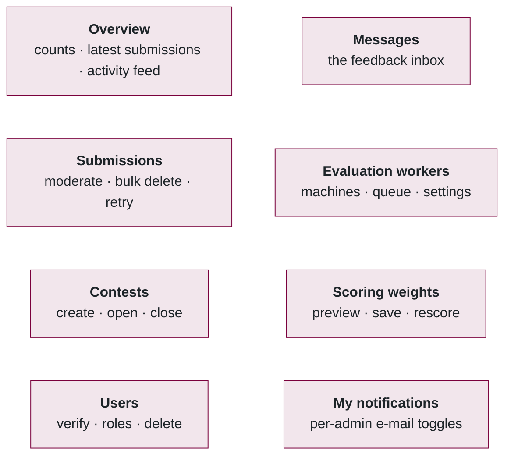
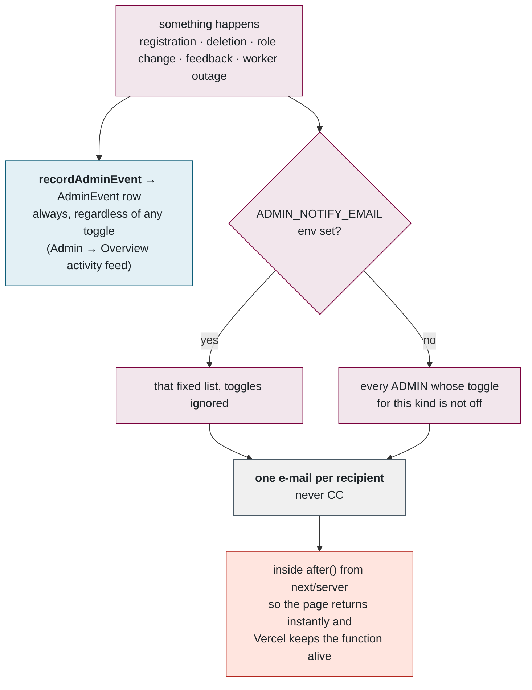
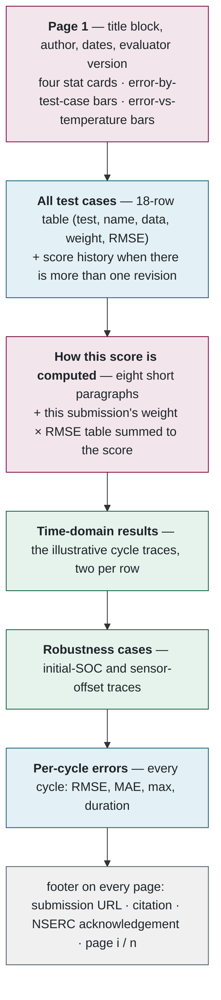
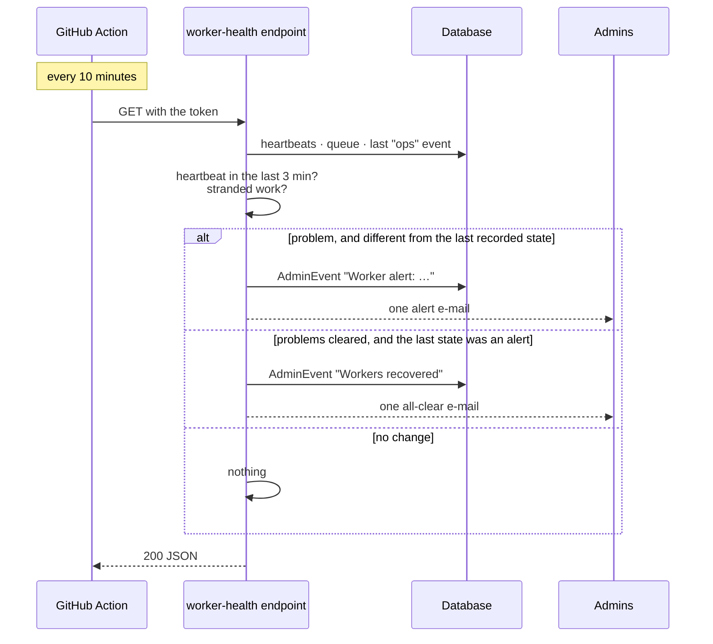
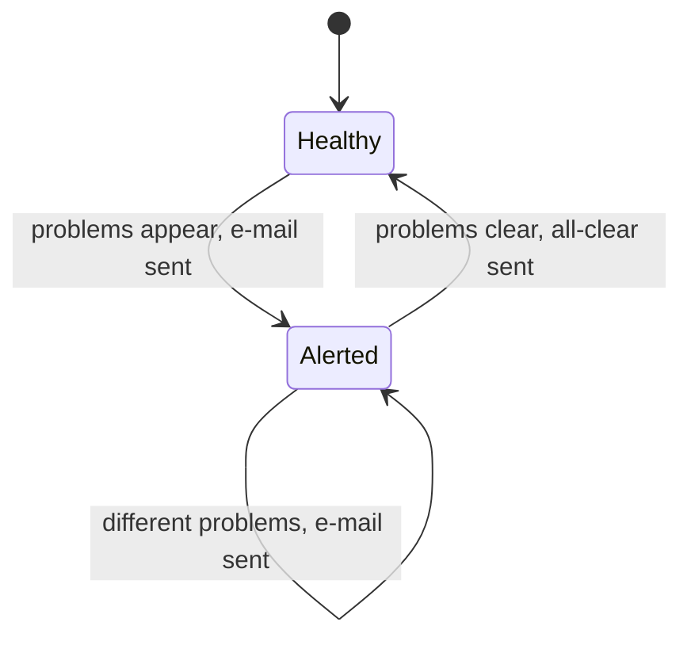

## 10. Administration, notifications, reports, monitoring

> **Plain English.** Administrators can moderate submissions, manage users and contests, tune the evaluation limits, change the scoring weights, and watch the worker machines. Every admin action is recorded in an activity feed on the site; e-mail is only a copy of that feed, and each admin chooses which kinds of e-mail they want. A robot checks every ten minutes that a worker is alive and e-mails the admins once if it isn't, and once when it comes back.

### The admin area



### The admin actions and their safety rails

All in [admin/actions.ts](../../src/app/(admin)/admin/actions.ts); every one begins with `requireAdmin()`.

| Action | Rails |
|---|---|
| Moderate a submission (private / public / hide / unhide / delete) | reason ≥ 10 characters; delete blocked while RUNNING; private/public blocked for contest entries ("hide it instead") |
| Bulk delete | up to 100 ids; RUNNING ones skipped; one activity line; authors optionally e-mailed |
| Delete a user | no self-delete; **cannot delete an admin — revoke admin first** (one compromised admin cannot wipe the others); blocked if any of their submissions is RUNNING; storage objects removed, database rows cascade |
| Change a role | cannot change your own |
| Worker commands (pause / resume / stop) | written to `WorkerHeartbeat.command`, picked up at the next heartbeat (≤ 15 s); *forget* offered only for offline rows |
| Release a job's lock | behind a confirm — a live worker would then double-evaluate |
| Evaluation settings | timeout 10–1440 min, dry-run 2–60 min, per-day 1–100 |
| Scoring weights | preview first; must sum to 1; identical-to-active rejected |
| Contests | only one OPEN at a time |

### Notifications: who gets told, and how



Five kinds each admin toggles for themselves on *My notifications*: feedback, accounts, roles, deletions, workers. **Never CC** because a CC leaks addresses to everyone on the thread and cannot respect per-person toggles. **`after()`** because Vercel freezes a serverless function the instant it returns its response — an un-awaited promise is silently dropped, which is exactly how a batch of admin notifications went missing before this was found. In code:

```ts
// the rule, everywhere a server action sends mail it does not wait for
import { after } from "next/server";
after(() => accountDeletedEmail(user, reason, adminName, counts, notifyUser).catch(() => {}));
```

All templates live in [mail.ts](../../src/lib/mail.ts): a maroon header, the McMaster and NSERC logo row and acknowledgement in the footer; the results e-mail embeds a confetti GIF as an inline attachment so it shows even where remote images are blocked. With no `SMTP_HOST` configured, mail goes to a throw-away Ethereal inbox and the preview link is printed — how development works.

### The PDF report

Built by [report.ts](../../src/lib/report.ts) with pdfkit — A4, entirely vector, no browser involved.



### Outage monitoring

Born from the 1 September Arbutus routing outage: the worker was healthy but could not reach the database for ten hours, and nobody was told. The website is the one vantage point that always sees both the database and SMTP, so it does the watching.





Three minutes = twelve missed 15-second heartbeats — long enough that the routine 10-minute update restart never trips it. Counts (how many queued) go into the details, never into the problem text, so a growing queue cannot read as a new outage. A **red** Action run means the *website* was unreachable — GitHub reports that separately. The Workers admin page uses a stricter 60 s window for its "online" badge; the two thresholds are deliberately different (display versus alerting).

**Files to open, in order:** [admin/actions.ts](../../src/app/(admin)/admin/actions.ts) → [admin-notify.ts](../../src/lib/admin-notify.ts) → [mail.ts](../../src/lib/mail.ts) → [report.ts](../../src/lib/report.ts) → [api/ops/worker-health/route.ts](../../src/app/api/ops/worker-health/route.ts) → [.github/workflows/worker-health.yml](../../.github/workflows/worker-health.yml).

