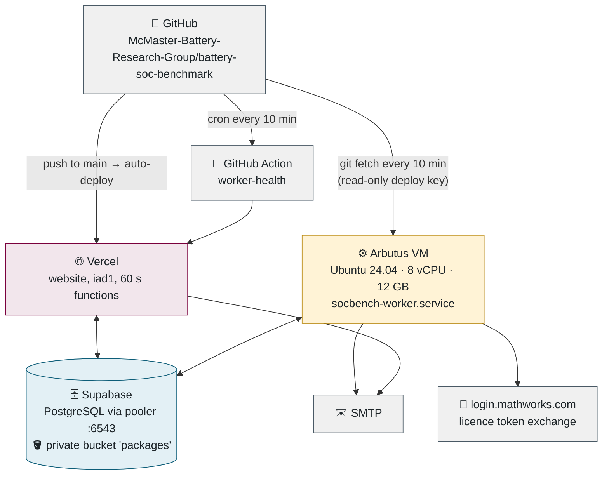
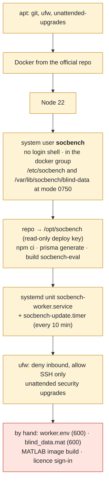
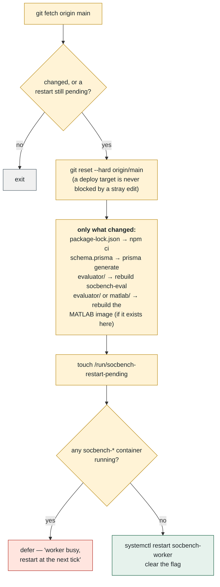
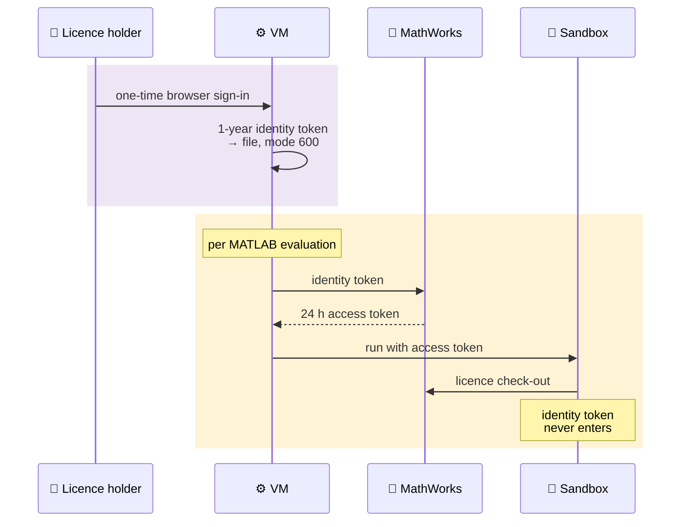
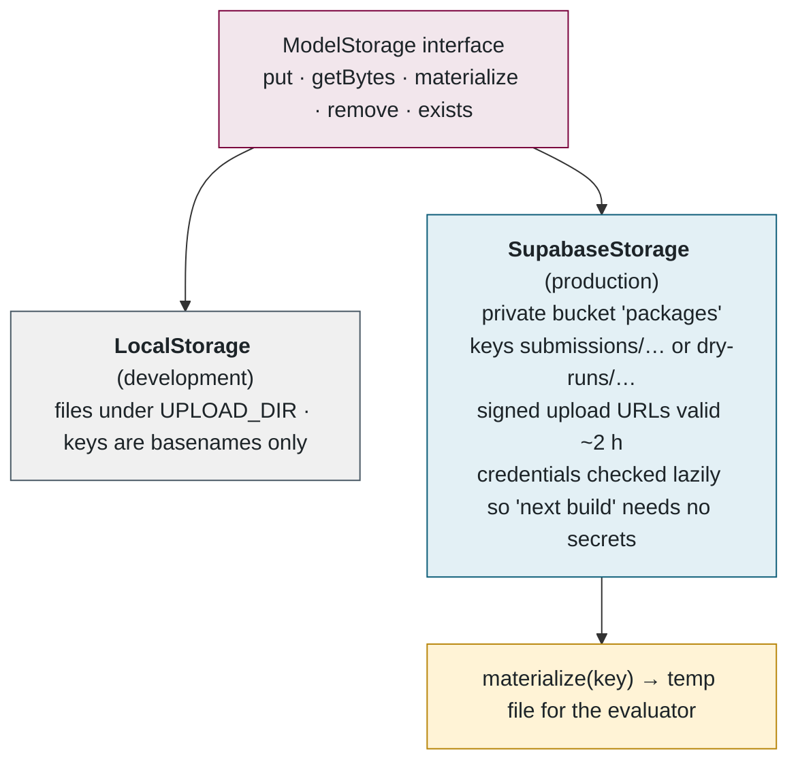
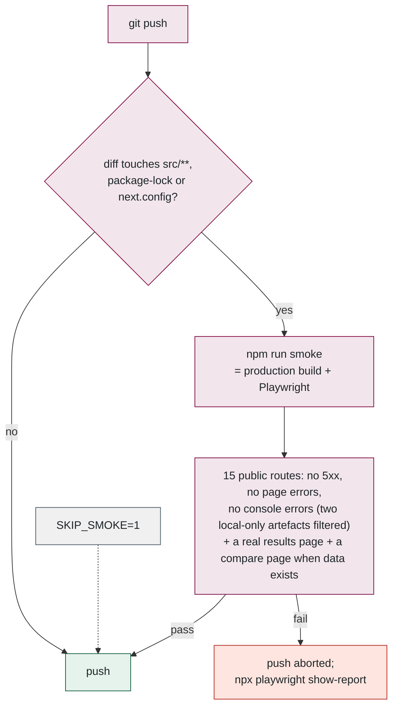

<a id="part-10"></a>
## 10. 🏗️ Infrastructure and operations

> 💡 **Plain English.** The website is hosted by Vercel and deploys itself whenever code is pushed. The database and file storage are hosted by Supabase. The worker is a rented Linux computer in the Alliance research cloud that updates itself every ten minutes, restarts only when idle, and runs MATLAB inside a container licensed through Dr. Kollmeyer's MathWorks account. Secrets live in files only the worker's own account can read.

### 🗺️ Deployment topology



### 🏗️ The VM, as provisioned by one script

[provision-arbutus-worker.sh](../../scripts/provision-arbutus-worker.sh) is idempotent — safe to re-run — and copies **no secrets and no blinded data**; those are placed by hand afterwards.



The systemd unit is hardened: `NoNewPrivileges`, `ProtectSystem=strict`, `ProtectHome=read-only`, write access only to its own state directory and `/tmp`, `ConditionPathExists=/etc/socbench/worker.env` so it cannot start before secrets land, `Restart=always`, and `KillSignal=SIGINT` so the worker's graceful shutdown hands jobs back to the queue rather than abandoning them.

### 🔁 Self-update, without killing an evaluation

[vm-update.sh](../../scripts/vm-update.sh) runs from a timer every 10 minutes.



### 🔑 MATLAB inside the sandbox, and how it is licensed

The image `socbench-eval-matlab` is MathWorks' `matlab-deep-learning:r2026a` (24.5 GB, every toolbox submissions have needed) plus Python and the harness, with the image's `matlab` user **remapped to the `socbench` uid** so the blinded data can stay mode 600 and the licence file is owned by the same account. No licence material is baked into the image.



The worst a malicious MATLAB submission can do is read a token that expires within a day and licenses nothing but MATLAB. The identity token's expiry date is shown on the Workers page; renewal is repeating the sign-in.

### 🐳 The two sandbox images

| | `socbench-eval` (Python) | `socbench-eval-matlab` |
|---|---|---|
| Base | `python:3.12-slim` | `mathworks/matlab-deep-learning:r2026a` |
| Adds | numpy, scipy; optional `--build-arg TORCH=1` (+ ~800 MB CPU PyTorch) | Python 3, numpy, scipy, `Run_Model.m` |
| User | `evaluator`, uid 1000, no login | `matlab`, remapped to the worker's uid |
| Entrypoint | `python -m socbench_eval` | `python3 -m socbench_eval` (Python still drives MATLAB) |
| Build context | `evaluator/` | repo root (needs `matlab/`) |
| Baked in | `dryrun_data.mat` — dry runs mount nothing | same |

### 🪣 Storage abstraction



### ⚙️ Configuration: the environment variables, by purpose

| Group | Variables |
|---|---|
| Database | `DATABASE_URL` (pooler, 6543), `DIRECT_URL` (5432, migrations only) |
| Web / auth | `AUTH_SECRET`, `AUTH_URL`, `NEXT_PUBLIC_SITE_URL`, `ADMIN_EMAILS`, `CRON_SECRET` |
| Mail | `SMTP_HOST/PORT/USER/PASS`, `MAIL_FROM`, `ADMIN_NOTIFY_EMAIL` |
| Storage | `STORAGE` (local / supabase), `UPLOAD_DIR`, `MAX_UPLOAD_MB`, `SUPABASE_URL`, `SUPABASE_SERVICE_KEY`, `SUPABASE_BUCKET` |
| Evaluator | `SOCBENCH_BLIND_DATA`, `SOCBENCH_PYTHON`, `MATLAB_BIN`, `WORKER_CONCURRENCY`, `WORKER_RUNTIMES` |
| Sandbox | `EVAL_SANDBOX`, `EVAL_SANDBOX_IMAGE`, `EVAL_SANDBOX_MATLAB_IMAGE`, `EVAL_MATLAB_MHLM_FILE`, `EVAL_MATLAB_NETWORK`, `EVAL_CPUS`, `EVAL_MEMORY`, `EVAL_PIDS` |
| Calibration | `SOCBENCH_CAL_PYTHON`, `SOCBENCH_CAL_MATLAB` |

Every line is annotated in [.env.example](../../.env.example). Production values live only on Vercel (website) and in `/etc/socbench/worker.env` (worker, mode 600).

### ✅ Tests and the push hook



### ⚠️ The 1 September outage, as it unfolded

The event that shaped the monitoring design. Nothing on the VM was wrong; the route between the research cloud and the part of the internet where the database lives had disappeared overnight.

```mermaid
%%{init: {"gantt": {"fontSize": 15, "sectionFontSize": 15, "barHeight": 28, "barGap": 6, "leftPadding": 90}}}%%
gantt
    title 1 September 2026 (UTC)
    dateFormat HH:mm
    axisFormat %H:%M
    section Worker
    normal heartbeats                :done, 00:00, 06:56
    cannot reach database, retrying  :crit, 07:01, 17:20
    laptop worker takes the MATLAB job :active, 17:55, 18:20
    section People
    nobody is told                   :07:01, 17:10
    admin notices "offline 10 h"     :milestone, 17:10, 0m
    diagnosed as upstream routing    :17:12, 17:40
    section Outcome
    outage alerting built + deployed :18:00, 19:00
```



### 🚀 Developer bootstrap

```
git clone …
cp .env.example .env
npm install
npm run setup     # Postgres in Docker on port 5433 + schema + seed accounts
npm run dev       # website
npm run worker    # in a second terminal — needs the blinded data and the sandbox image
```

The seed wipes and creates an admin account, one test user (`user@example.com` / `Password1`) and one open contest — and **no submissions or results**, because there is no fake scorer; the leaderboard fills as real evaluations run. Two things that bite on Windows: stop the dev server and the worker before `prisma generate` (a running process locks the generated client), and PowerShell 5.1 has no `&&` — run commands on separate lines.

📌 **Files to open, in order:** [provision-arbutus-worker.sh](../../scripts/provision-arbutus-worker.sh) → [vm-update.sh](../../scripts/vm-update.sh) → [Dockerfile](../../evaluator/Dockerfile) → [Dockerfile.matlab](../../evaluator/Dockerfile.matlab) → [matlab-mhlm-setup.sh](../../scripts/matlab-mhlm-setup.sh) → [storage.ts](../../src/lib/storage.ts) → [playwright.smoke.config.ts](../../playwright.smoke.config.ts).

