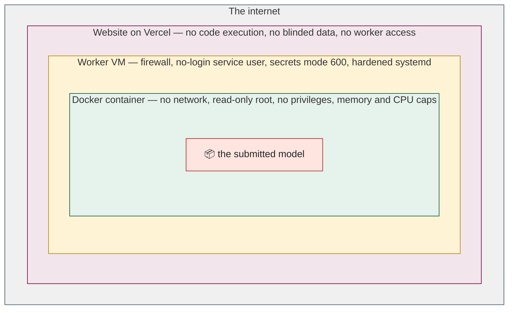
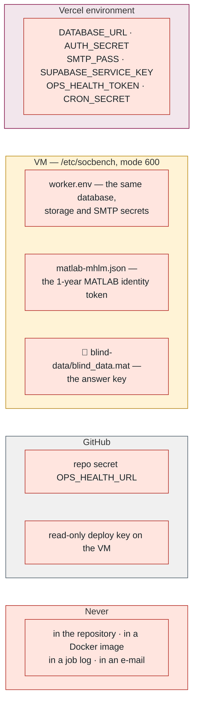

## 11. 🛡️ Security: threats and what stops them

> 💡 **Plain English.** The system runs code written by strangers, on a machine that holds a secret dataset, and it does so in public. This part lists what could go wrong and, for each, the specific thing that prevents it. Most defences are layers: a model would have to break out of several boxes in a row to do any harm.

### 🧅 The onion

### 🔑 Where every secret lives

### 🛡️ Threats and defences

| Threat | Defence | Where |
|---|---|---|
| Model exfiltrates the blinded data | `--network none`; container destroyed after the run; only `/out` is writable and only results are read from it | python-evaluator.ts |
| Model attacks the host | read-only root, `--cap-drop ALL`, `no-new-privileges`, runs as the unprivileged worker uid, pid/memory/CPU caps | python-evaluator.ts |
| Model reads worker secrets | the container never receives the host environment; in host mode only an allow-list of variables is passed | `HOST_ENV_ALLOW` |
| Model steals the MATLAB licence | only a 24-hour access token enters the container; the year-long identity token never does | `mhlmLicenseEnv()` |
| Zip bomb / path traversal / symlink escape | entry, size and ratio limits; path and attribute checks — on the website *and* again in the evaluator | package-check.ts, `safe_extract` |
| Runaway evaluation | hard timeout inside and outside the container; `docker kill` + process-group kill | `killTree` |
| Queue flooding | 3 submissions/day, 5 dry runs/hour, 30 upload URLs/hour | eval-settings, dry-run-quota, rate-limit |
| Password guessing | bcrypt cost 11; 10 attempts / 15 min per account, 40 per IP | auth.ts, rate-limit.ts |
| Account enumeration | reset and resend endpoints answer identically whether or not the address exists | (auth)/actions.ts |
| Link scanners consuming one-time tokens | verification and invitation decisions are POSTs; GETs are side-effect free | verify/actions.ts, collab |
| Open redirect after login | `next` must start with `/` | loginAction |
| Tampered upload key | keys must match `OBJECT_KEY_RE` | submit/actions.ts |
| Forged form data | zod on every input; `requireUser`/`requireAdmin` inside every action, not just middleware | validation.ts, auth.ts |
| One compromised admin wipes the rest | admins cannot be deleted until demoted; nobody can change their own role | admin/actions.ts |
| Secrets in logs | licence values redacted from the docker command before it is logged; `CRON_SECRET` accepted only in a header, never a URL | python-evaluator.ts, jobs/run |
| Browser-side attacks | strict CSP, HSTS, `frame-ancestors 'none'`, nosniff | next.config.ts |
| Worker VM exposure | ufw default-deny, SSH only from listed addresses, no-login service user, `ProtectSystem=strict` | provision script |
| Silent outage | health endpoint + GitHub Action; one alert per transition | worker-health |

### ⚠️ What is deliberately *not* defended, and why

- **A model can burn its full time budget doing nothing.** Accepted: the cap is per submission and per day, so the cost is bounded.
- **A model can read the blinded data into memory.** Unavoidable — it has to, to be scored. The defence is that nothing it computes can leave except the SOC estimates we read back.
- **Host-mode MATLAB (the laptop fallback) is not sandboxed.** Documented as "dedicated low-privilege account only"; the production path is always the container.
- **The worker VM has general outbound network access.** On the roadmap: an egress allow-list to the database, SMTP and MathWorks only.

📌 **Files to open, in order:** [python-evaluator.ts](../../src/evaluator/python-evaluator.ts) → [package-check.ts](../../src/lib/package-check.ts) → [rate-limit.ts](../../src/lib/rate-limit.ts) → [next.config.ts](../../next.config.ts) → [provision-arbutus-worker.sh](../../scripts/provision-arbutus-worker.sh).

