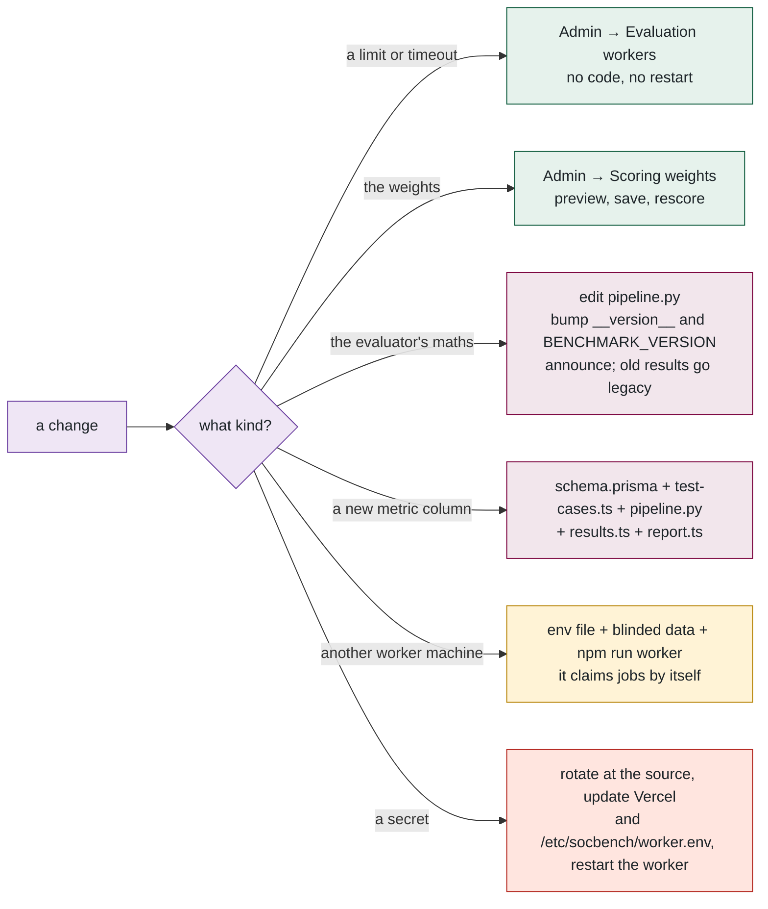

## 14. 🛠️ How to change things — recipes

> 💡 **Plain English.** The most common changes, each as a short checklist. If a change is not here, the *Files to open* lists at the end of each part say where to look.

**Change a limit** (timeout, dry-run timeout, submissions per day): Admin → Evaluation workers → Evaluation settings. Takes effect within 15 s on the website and the worker. No deploy.

**Change the scoring weights**: Admin → Scoring weights → edit → Preview (see how many scores move) → Save with a reason → optionally notify authors. Append-only; the previous weights remain in `ScoringConfig` history.

**Change the evaluator's maths** (a metric definition, padding, a sweep): edit [pipeline.py](../../evaluator/python/socbench_eval/pipeline.py); re-run the four reference packages and confirm the scores you *expect* to change changed and nothing else did; bump `__version__` in `socbench_eval/__init__.py` and `BENCHMARK_VERSION` in [benchmark-version.ts](../../src/lib/benchmark-version.ts); push (the VM rebuilds the images within 10 minutes); run `npx tsx scripts/announce-benchmark-version.ts --note "…" --send` so affected authors are told to resubmit.

**Add a metric column**: `EvaluationResult` in [schema.prisma](../../prisma/schema.prisma) → `npm run db:push` → the entry in [test-cases.ts](../../src/lib/test-cases.ts) (key, label, weight, group) → compute it in `score()` → it flows through `METRIC_KEYS` to results.ts, the scorecard, the PDF and the CSV automatically. Re-check the weights still sum to 1.

**Add a model type**: the `ModelType` enum in [schema.prisma](../../prisma/schema.prisma) → `db:push` → `MODEL_TYPES` in [validation.ts](../../src/lib/validation.ts) → a baseline in [mock-evaluator.ts](../../src/evaluator/mock-evaluator.ts) so seeded data covers it.

**Add a worker machine**: a machine with Docker (or MATLAB), the blinded data at mode 600, and a copy of `worker.env` → `WORKER_RUNTIMES` set to what it can run → `npm run worker:prod`. It registers a heartbeat and starts claiming jobs; nothing else changes. On Linux, use the provisioning script.

**Rotate a secret**: rotate at the source (Supabase, Gmail/Resend, MathWorks) → update the Vercel environment and redeploy → update `/etc/socbench/worker.env` on the VM → `systemctl restart socbench-worker`. The MATLAB identity token is the exception: repeat the browser sign-in and `matlab-mhlm-setup.sh`.

**Add an e-mail**: a function in [mail.ts](../../src/lib/mail.ts) using `layout()` and `sendMail()` → if it is an admin notification, route recipients through `adminNotifyTargets(kind)` and record it with `recordAdminEvent` → call it inside `after()` from any server action.

**Add an admin page**: a folder under `src/app/(admin)/admin/` → the layout already enforces `requireAdmin()` → add the tab to `admin-nav.tsx` → every action in `actions.ts` starts with `await requireAdmin()`.

**Change who is an admin**: Admin → Users → Make admin / Revoke admin. Or add the address to `ADMIN_EMAILS` on Vercel — effective on their next request.

**Renew the MATLAB licence** (yearly): the Workers page shows the expiry; repeat the browser sign-in through the SSH tunnel and run `scripts/matlab-mhlm-setup.sh` on the VM.

