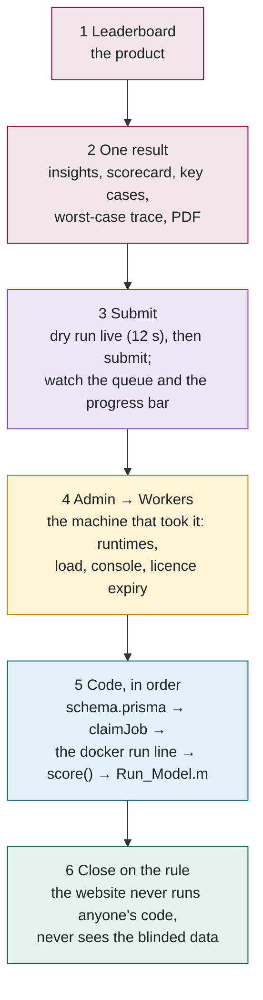

## 15. 🎬 A demo order that tells the story

About ten minutes.

1. **Leaderboard** — rank, weighted error, complexity, the column groups.
2. **Open one result** — the plain-English insights, the 18-row scorecard summing to the score, key cases (blinded vs non-blinded cell, cold temperature, wrong initial SOC, sensor offset), the worst-case trace, the PDF.
3. **`/submit` with a reference package** — run a dry run live, watch the console stream, then submit. Show the queue position and the live progress bar.
4. **Admin → Workers** — the machine that just picked it up. Mention the outage alerting.
5. **Code, in this order**: `schema.prisma` (the tables you just saw) → `run-job.ts` `claimJob` (the compare-and-swap) → `python-evaluator.ts` (the `docker run` line) → `pipeline.py` `score()` (the matrix R and the weights) → `Run_Model.m` (all 40 lines of MATLAB).
6. **Close on the design rule.**
