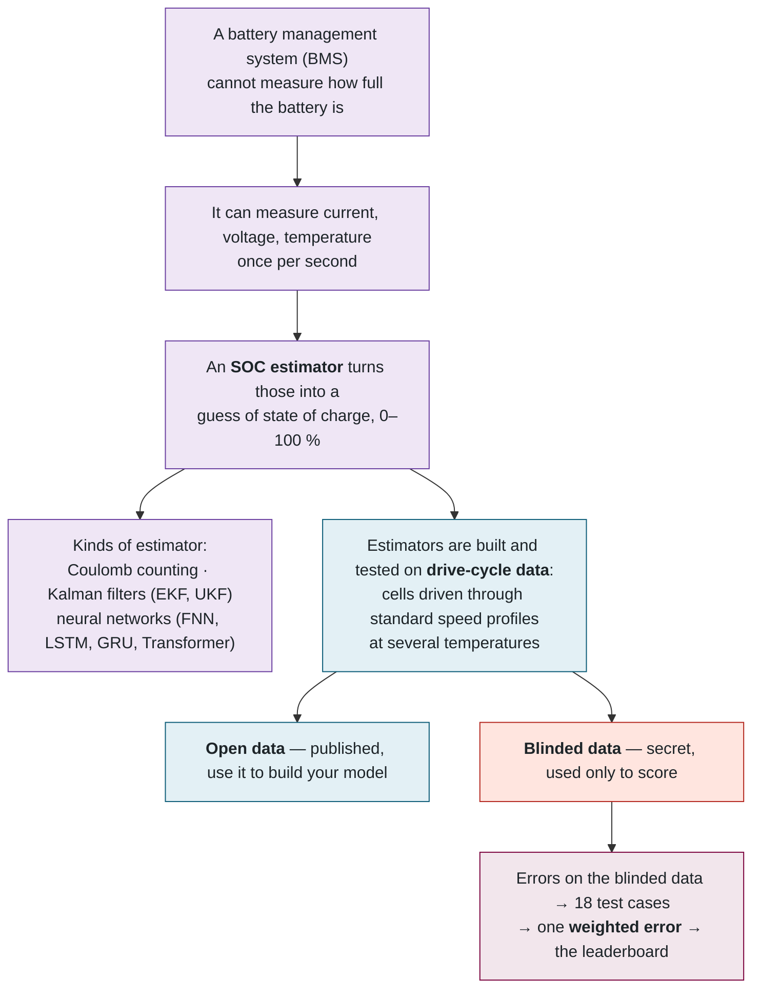

## 15. 🏷️ Glossary

> 💡 **Plain English.** Two vocabularies meet in this project: battery science and web software. Nobody is expected to know both. This part defines every word the rest of the document uses, in one line each, and shows how the concepts hang together.

### 🔋 How the battery concepts fit together

### 🔋 Battery and benchmark terms

| Term | Meaning |
|---|---|
| **SOC — state of charge** | How full a battery is, 0–100 %. The fuel gauge. It cannot be measured directly; it must be *estimated* from what can be measured: current, voltage and temperature. Every model in the benchmark is an SOC estimator. |
| **BMS — battery management system** | The electronics in an electric vehicle or phone that watch the battery. The SOC estimator runs inside it, one measurement at a time. Our evaluator calls models the same way, which is why a model cannot "look ahead". |
| **Cell** | One physical battery. The dataset has four Tesla 2170 cells, named after the vehicle-mass profile each was driven with: `m80`, `m448`, `m448N`, `m1000` (80 kg, 448 kg, a second 448 kg variant, 1000 kg — heavier means larger currents). `m448` is the *fully blinded* cell: no data about it was ever published, so it is the purest test of whether a model generalises. |
| **Drive cycle** | A standard speed-vs-time profile a car is tested against, converted into the current a cell would see. Standard ones: **UDDS** (urban stop-and-go), **HWFET** (steady highway), **LA92** (aggressive urban), **US06** (aggressive highway). Custom ones the model has never seen in the open data: **HWCUST**, **HWGRADE** (highway with road grade — long high-current stretches and regeneration). |
| **Temperature** | Each cycle was run at −20, −10, 0, 10, 25 and 40 °C. Cold is hard: internal resistance rises and the voltage response becomes strongly non-linear. |
| **Open data / blinded data** | *Open* = published on Borealis; researchers use it to build and train models. *Blinded* = kept secret and used only to score. The file `blind_data.mat` is the answer key; it exists only on the evaluation machine. |
| **Coulomb counting** | The simplest estimator: integrate the current over time. Cheap and it drifts badly. Used as the *reference point* for the complexity scale. |
| **EKF / UKF** | Extended / Unscented Kalman Filter — classical estimators that fuse a physics model of the cell with the measurements. |
| **FNN / LSTM / GRU / Transformer** | Neural-network estimators: a plain feed-forward network and three kinds of sequence model that keep memory of past samples. |
| **RMSE / MAE / max error** | Root-mean-square error, mean absolute error, and the worst single-sample error between estimated and true SOC, in % SOC. RMSE is the per-cycle headline; max error tells you the worst moment. |
| **Test case** | One of the 18 published scoring categories (blinded cell, charging, each temperature, sensor offset, …). Each has a weight. |
| **Weighted error** | The single leaderboard score: the sum of weight × test-case RMSE. Lower is better. |
| **Robustness sweep** | Deliberately breaking the model's assumptions: starting it at the wrong initial SOC (test 10) or feeding it current with a constant sensor offset (test 11). The cases that separate good estimators from lucky ones. |
| **Padding** | One hour of the first measurement repeated before every cycle, so models with internal memory settle before scoring starts. |
| **Complexity** | A 1–10 bin of how much computation the model needs per sample, relative to a Coulomb counter. Informational; never part of the score. |
| **Dry run** | A free pre-submission test on *open* data: does the package run, what error does it make, how expensive is it. No leaderboard entry. |
| **Package** | The `.zip` a researcher uploads: `Model.py` (Python) or `Model.m`/`Model.p` (MATLAB) at the top level plus any parameter files. |
| **Legacy result** | A score produced by an older version of the evaluator's maths. Still shown, but unranked; the author is asked to resubmit. |

### 💻 Software terms

| Term | Meaning |
|---|---|
| **Repository (repo)** | The folder of source code, tracked by **git** so every change is recorded and reversible. Hosted on **GitHub**. |
| **Front end / back end** | Front end = what runs in your browser. Back end = what runs on a server. In this project the line runs *inside* Next.js. |
| **Server** | A computer that answers requests. **Serverless** = the hosting provider starts a tiny short-lived server *per request* and freezes it the instant it answers. Cheap, scales itself, and has quirks this document points out. |
| **Container / Docker / image** | A container is a lightweight isolated box a program runs in, with its own filesystem and no view of the host. Docker runs them. An **image** is the frozen template a container starts from. |
| **Sandbox** | A container configured to be as harmless as possible: no network, read-only files, no privileges. Where submitted models run. |
| **Database / table / row** | PostgreSQL stores everything as tables of rows, like spreadsheets with strict columns. |
| **ORM (Prisma)** | A library that lets TypeScript talk to the database with typed function calls instead of hand-written SQL, and keeps one schema file as the description of every table. |
| **Migration / `db push`** | Applying a schema change to a real database. |
| **API / endpoint / route** | A URL a *program* calls to get or send data, as opposed to a page a human reads. **REST** is one common style of API; this project mostly does not use one. |
| **JSON** | The text format programs use to exchange structured data: `{"rmse": 3.2}`. |
| **Environment variable / `.env`** | Configuration and secrets handed to a program from outside its code, so the same code runs in development and production with different settings. |
| **Secret / token / key** | Any string that grants access: a database password, an API key, a licence token. Never in the repo; always in environment variables or files with restricted permissions. |
| **Session / JWT / cookie** | After login the browser holds a signed cookie — a JSON Web Token — proving who you are; the server verifies the signature on every request instead of looking you up. |
| **Hash (bcrypt)** | A one-way scramble of a password. We store the scramble, never the password; bcrypt is deliberately slow so guessing is expensive. |
| **Rate limit** | "At most N attempts per time window" — the defence against brute force and abuse. |
| **Queue / job / worker** | A queue is a list of work waiting to be done; a job is one item; a worker is the program that takes jobs off the queue and does them. |
| **Lock / atomic / compare-and-swap** | Ways to make sure two workers never take the same job. *Atomic* = happens in one indivisible step. Compare-and-swap = "update this row only if it still looks the way I last saw it". |
| **Heartbeat** | A periodic "I am alive" signal a worker writes so everyone else can tell if it died. |
| **Polling** | Asking "anything new?" every few seconds, rather than being pushed a notification. |
| **Cron / scheduled job** | Something that runs on a timer. |
| **CI — continuous integration** | Automated checks that run on the code-hosting platform (GitHub Actions here). |
| **SMTP** | The protocol for sending e-mail. |
| **Object storage / bucket / signed URL** | A cloud service for storing *files* (not tables). A bucket is a named store; a signed URL is a temporary pre-authorised link that lets a browser upload directly without our server in the middle. |
| **VM — virtual machine** | A rented computer in the cloud. Ours is on **Arbutus**, the Digital Research Alliance of Canada's cloud at the University of Victoria, built on **OpenStack**. |
| **systemd / service** | Linux's way of running a program as a background service that starts on boot and restarts on crash. |
| **SSH** | Secure remote terminal access to a machine. |
| **uid / gid / mode 600** | Linux file ownership (user id, group id) and permissions. `600` = only the owner can read or write. |
| **tmpfs** | A folder that lives in RAM and vanishes when the container stops. |
| **TypeScript / Node.js / npm / tsx** | TypeScript is JavaScript with types. Node.js runs JavaScript outside a browser. npm installs libraries and runs scripts. tsx runs TypeScript files directly with no build step. |
| **Zod schema** | A declaration of what a form input must look like, checked at runtime, reused in the browser and on the server. |

### 🔢 Numbers worth remembering

| | |
|---|---|
| 4 cells × 6 temperatures × 6 cycles | **144** blinded test cycles, plus charging cycles |
| Robustness runs | 9 initial-SOC + 18 sensor-offset |
| Scoring | **18** test cases; weights sum to exactly **1** |
| Daily cap | **3** submissions per person per rolling 24 h (dry runs free, 5 per hour) |
| Evaluation limit | **360 min**; dry run **10 min** |
| Worker rhythm | polls every **2 s**, heartbeat every **15 s** |
| Job safety | lock goes stale after **30 min** of silence; **2** attempts per job |
| Website "online" window | **60 s**; outage alert after **3 min** |
| Upload cap | **50 MB**; browser uploads straight to the bucket because Vercel accepts only 4.5 MB |

