> **Single-file version** for reading straight through offline or in an editor. GitHub's web view cannot render this many diagrams on one page, so for the rendered version use the numbered pages in this folder or the PDF beside this file (`codebase-walkthrough.pdf`).

# Battery SOC Benchmark — the complete codebase walkthrough

This is the full explanation of the system: what it does, how every part works, why it was built the way it was, and where to look in the code. It is written for three readers at once.

- **Non-developers** (lab members, supervisors, collaborators from other fields): each part opens with a *Plain English* box, and the diagrams are drawn so the picture makes sense without the prose. Skip anything in `monospace`.
- **Developers new to this project**: read in order once. Every term, library and tool is defined the first time it appears, and Part 1 is a glossary to come back to. Each part ends with *Files to open, in order*.
- **Developers who know the stack**: Parts 4, 6, 8 and 14 contain the decisions you would not guess from the code alone; Part 13 is the list of questions people ask.

Every claim is anchored to a file path so it can be checked. Diagrams are Mermaid and render on GitHub.

**Colour key used in every diagram**

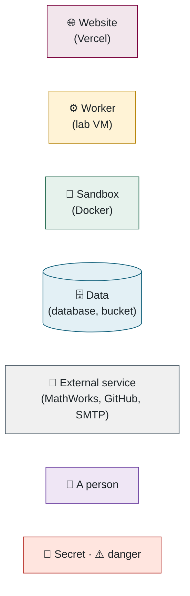
```mermaid
flowchart LR
    W["🌐 Website<br/>(Vercel)"]
    K["⚙️ Worker<br/>(lab VM)"]
    S["🐳 Sandbox<br/>(Docker)"]
    D[("🗄️ Data<br/>(database, bucket)")]
    E["🔗 External service<br/>(MathWorks, GitHub, SMTP)"]
    P["👤 A person"]
    X["🔑 Secret · ⚠️ danger"]
    classDef web fill:#F2E6EC,stroke:#7A003C,color:#1d2428
    classDef worker fill:#FFF3D6,stroke:#B8860B,color:#1d2428
    classDef sandbox fill:#E6F2EC,stroke:#0E5B3D,color:#1d2428
    classDef data fill:#E3F0F5,stroke:#0D5D78,color:#1d2428
    classDef ext fill:#F0F0F0,stroke:#495965,color:#1d2428
    classDef person fill:#EFE6F5,stroke:#6B3FA0,color:#1d2428
    classDef danger fill:#FFE5DF,stroke:#B3261E,color:#1d2428
    class W web
    class K worker
    class S sandbox
    class D data
    class E ext
    class P person
    class X danger
```


**Icon key** — the same symbol always means the same thing, in prose and in diagrams

| | Meaning | | Meaning | | Meaning |
|---|---|---|---|---|---|
| 🌐 | Website / web tier | ⚙️ | Worker | 🐳 | Sandbox (Docker container) |
| 🗄️ | Database | 🪣 | File bucket / storage | 👤 | A person (researcher, admin) |
| 🔐 | Blinded data — the answer key | 🔑 | A secret or token | ⚠️ | Danger / a risk |
| 📦 | A submitted package (.zip) | 🧪 | Dry run / validation | 📊 | Scores, leaderboard, charts |
| 🔋 | Battery / SOC | 🌡️ | Temperature | 🚗 | Drive cycle |
| ⏱️ | Timer / timeout | 💓 | Heartbeat | 🔁 | Retry / polling |
| 🏁 | Completed | ❌ | Failed | ✉️ | E-mail |
| 📄 | PDF report | 🔒 | Locked / protected | 🛡️ | Security |
| 💡 | Plain-English summary | 📌 | Files to open | 🧭 | Navigation |

---

## Contents

1. 🏷️ Glossary
2. ⚡ The five-minute version
3. 🧰 The tools and libraries, and why each one
4. 📦 Life of a submission, end to end
5. ▶️ The evaluation engine — running the model
6. 🧮 The evaluation engine — scoring, complexity and outputs
7. 🗄️ The data model
8. 🪪 Authentication and accounts
9. 🖥️ The web tier: submitting, results, leaderboard
10. 🛎️ Administration, notifications, reports, monitoring
11. 🏗️ Infrastructure and operations
12. 🛡️ Security: threats and what stops them
13. ❓ Questions you will probably get
14. 🛠️ How to change things — recipes
15. 🎬 A demo order that tells the story

---

## 1. 🏷️ Glossary

> 💡 **Plain English.** Two vocabularies meet in this project: battery science and web software. Nobody is expected to know both. This part defines every word the rest of the document uses, in one line each, and shows how the concepts hang together.

### 🔋 How the battery concepts fit together

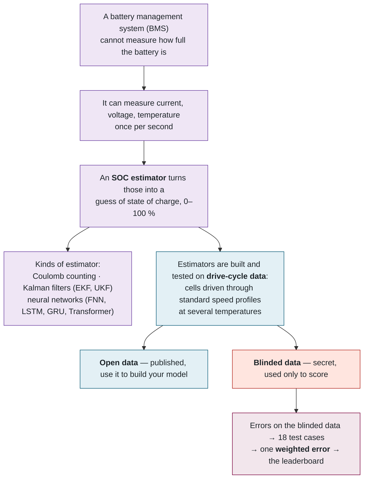
```mermaid
flowchart TB
    BMS["A battery management system (BMS)<br/>cannot measure how full the battery is"]
    MEAS["It can measure current, voltage, temperature<br/>once per second"]
    EST["An <b>SOC estimator</b> turns those into a<br/>guess of state of charge, 0–100 %"]
    KINDS["Kinds of estimator:<br/>Coulomb counting · Kalman filters (EKF, UKF)<br/>neural networks (FNN, LSTM, GRU, Transformer)"]
    DATA["Estimators are built and tested on <b>drive-cycle data</b>:<br/>cells driven through standard speed profiles<br/>at several temperatures"]
    OPEN["<b>Open data</b> — published, use it to build your model"]
    BLIND["<b>Blinded data</b> — secret, used only to score"]
    SCORE["Errors on the blinded data → 18 test cases<br/>→ one <b>weighted error</b> → the leaderboard"]
    BMS --> MEAS --> EST --> KINDS
    EST --> DATA
    DATA --> OPEN
    DATA --> BLIND
    BLIND --> SCORE
    classDef person fill:#EFE6F5,stroke:#6B3FA0,color:#1d2428
    classDef data fill:#E3F0F5,stroke:#0D5D78,color:#1d2428
    classDef danger fill:#FFE5DF,stroke:#B3261E,color:#1d2428
    classDef web fill:#F2E6EC,stroke:#7A003C,color:#1d2428
    class BMS,MEAS,EST,KINDS person
    class DATA,OPEN data
    class BLIND danger
    class SCORE web
```

### 🔋 Battery and benchmark terms

| Term | Meaning |
|---|---|
| **SOC — state of charge** | How full a battery is, 0–100 %. The fuel gauge. It cannot be measured directly; it must be *estimated* from what can be measured: current, voltage and temperature. Every model in the benchmark is an SOC estimator. |
| **BMS — battery management system** | The electronics in an electric vehicle or phone that watch the battery. The SOC estimator runs inside it, one measurement at a time. Our evaluator calls models the same way, which is why a model cannot "look ahead". |
| **Cell** | One physical battery. The dataset has four Tesla 2170 cells, named after the vehicle-mass profile each was driven with: `m80`, `m448`, `m448N`, `m1000` (80 kg, 448 kg, a second 448 kg variant, 1000 kg — heavier means larger currents). `m448` is the *fully blinded* cell: no data about it was ever published, so it is the purest test of whether a model generalises. |
| **Drive cycle** | A standard speed-vs-time profile a car is tested against, converted into the current a cell would see. Standard ones: **UDDS** (urban stop-and-go), **HWFET** (steady highway), **LA92** (aggressive urban), **US06** (aggressive highway). Custom ones the model has never seen in the open data: **HWCUST**, **HWGRADE** (highway with road grade — long high-current stretches and regeneration). |
| **Temperature** | Each cycle was run at −20, −10, 0, 10, 25 and 40 °C. Cold is hard: internal resistance rises and the voltage response becomes strongly non-linear. |
| **Open data / blinded data** | *Open* = published on Borealis; researchers use it to build and train models. *Blinded* = kept secret and used only to score. The file `blind_data.mat` is the answer key; it exists only on the evaluation machine. |
| **Coulomb counting** | The simplest estimator: integrate the current over time. Cheap and it drifts badly. Used as the *reference point* for the complexity scale. |
| **EKF / UKF** | Extended / Unscented Kalman Filter — classical estimators that fuse a physics model of the cell with the measurements. |
| **FNN / LSTM / GRU / Transformer** | Neural-network estimators: a plain feed-forward network and three kinds of sequence model that keep memory of past samples. |
| **RMSE / MAE / max error** | Root-mean-square error, mean absolute error, and the worst single-sample error between estimated and true SOC, in % SOC. RMSE is the per-cycle headline; max error tells you the worst moment. |
| **Test case** | One of the 18 published scoring categories (blinded cell, charging, each temperature, sensor offset, …). Each has a weight. |
| **Weighted error** | The single leaderboard score: the sum of weight × test-case RMSE. Lower is better. |
| **Robustness sweep** | Deliberately breaking the model's assumptions: starting it at the wrong initial SOC (test 10) or feeding it current with a constant sensor offset (test 11). The cases that separate good estimators from lucky ones. |
| **Padding** | One hour of the first measurement repeated before every cycle, so models with internal memory settle before scoring starts. |
| **Complexity** | A 1–10 bin of how much computation the model needs per sample, relative to a Coulomb counter. Informational; never part of the score. |
| **Dry run** | A free pre-submission test on *open* data: does the package run, what error does it make, how expensive is it. No leaderboard entry. |
| **Package** | The `.zip` a researcher uploads: `Model.py` (Python) or `Model.m`/`Model.p` (MATLAB) at the top level plus any parameter files. |
| **Legacy result** | A score produced by an older version of the evaluator's maths. Still shown, but unranked; the author is asked to resubmit. |

### 💻 Software terms

| Term | Meaning |
|---|---|
| **Repository (repo)** | The folder of source code, tracked by **git** so every change is recorded and reversible. Hosted on **GitHub**. |
| **Front end / back end** | Front end = what runs in your browser. Back end = what runs on a server. In this project the line runs *inside* Next.js. |
| **Server** | A computer that answers requests. **Serverless** = the hosting provider starts a tiny short-lived server *per request* and freezes it the instant it answers. Cheap, scales itself, and has quirks this document points out. |
| **Container / Docker / image** | A container is a lightweight isolated box a program runs in, with its own filesystem and no view of the host. Docker runs them. An **image** is the frozen template a container starts from. |
| **Sandbox** | A container configured to be as harmless as possible: no network, read-only files, no privileges. Where submitted models run. |
| **Database / table / row** | PostgreSQL stores everything as tables of rows, like spreadsheets with strict columns. |
| **ORM (Prisma)** | A library that lets TypeScript talk to the database with typed function calls instead of hand-written SQL, and keeps one schema file as the description of every table. |
| **Migration / `db push`** | Applying a schema change to a real database. |
| **API / endpoint / route** | A URL a *program* calls to get or send data, as opposed to a page a human reads. **REST** is one common style of API; this project mostly does not use one. |
| **JSON** | The text format programs use to exchange structured data: `{"rmse": 3.2}`. |
| **Environment variable / `.env`** | Configuration and secrets handed to a program from outside its code, so the same code runs in development and production with different settings. |
| **Secret / token / key** | Any string that grants access: a database password, an API key, a licence token. Never in the repo; always in environment variables or files with restricted permissions. |
| **Session / JWT / cookie** | After login the browser holds a signed cookie — a JSON Web Token — proving who you are; the server verifies the signature on every request instead of looking you up. |
| **Hash (bcrypt)** | A one-way scramble of a password. We store the scramble, never the password; bcrypt is deliberately slow so guessing is expensive. |
| **Rate limit** | "At most N attempts per time window" — the defence against brute force and abuse. |
| **Queue / job / worker** | A queue is a list of work waiting to be done; a job is one item; a worker is the program that takes jobs off the queue and does them. |
| **Lock / atomic / compare-and-swap** | Ways to make sure two workers never take the same job. *Atomic* = happens in one indivisible step. Compare-and-swap = "update this row only if it still looks the way I last saw it". |
| **Heartbeat** | A periodic "I am alive" signal a worker writes so everyone else can tell if it died. |
| **Polling** | Asking "anything new?" every few seconds, rather than being pushed a notification. |
| **Cron / scheduled job** | Something that runs on a timer. |
| **CI — continuous integration** | Automated checks that run on the code-hosting platform (GitHub Actions here). |
| **SMTP** | The protocol for sending e-mail. |
| **Object storage / bucket / signed URL** | A cloud service for storing *files* (not tables). A bucket is a named store; a signed URL is a temporary pre-authorised link that lets a browser upload directly without our server in the middle. |
| **VM — virtual machine** | A rented computer in the cloud. Ours is on **Arbutus**, the Digital Research Alliance of Canada's cloud at the University of Victoria, built on **OpenStack**. |
| **systemd / service** | Linux's way of running a program as a background service that starts on boot and restarts on crash. |
| **SSH** | Secure remote terminal access to a machine. |
| **uid / gid / mode 600** | Linux file ownership (user id, group id) and permissions. `600` = only the owner can read or write. |
| **tmpfs** | A folder that lives in RAM and vanishes when the container stops. |
| **TypeScript / Node.js / npm / tsx** | TypeScript is JavaScript with types. Node.js runs JavaScript outside a browser. npm installs libraries and runs scripts. tsx runs TypeScript files directly with no build step. |
| **Zod schema** | A declaration of what a form input must look like, checked at runtime, reused in the browser and on the server. |

### 🔢 Numbers worth remembering

| | |
|---|---|
| 4 cells × 6 temperatures × 6 cycles | **144** blinded test cycles, plus charging cycles |
| Robustness runs | 9 initial-SOC + 18 sensor-offset |
| Scoring | **18** test cases; weights sum to exactly **1** |
| Daily cap | **3** submissions per person per rolling 24 h (dry runs free, 5 per hour) |
| Evaluation limit | **360 min**; dry run **10 min** |
| Worker rhythm | polls every **2 s**, heartbeat every **15 s** |
| Job safety | lock goes stale after **30 min** of silence; **2** attempts per job |
| Website "online" window | **60 s**; outage alert after **3 min** |
| Upload cap | **50 MB**; browser uploads straight to the bucket because Vercel accepts only 4.5 MB |

---

## 2. ⚡ The five-minute version

> 💡 **Plain English.** Researchers upload a small program that guesses how full a battery is. We run that program against battery data that has never been published, score it with a fixed public formula, and put the score on a public leaderboard. Everyone is scored on the same hidden data with the same code, so for the first time the numbers are comparable. The uploaded program is deleted the moment it has been scored, and it never touches the website.

### 🎯 The problem it solves

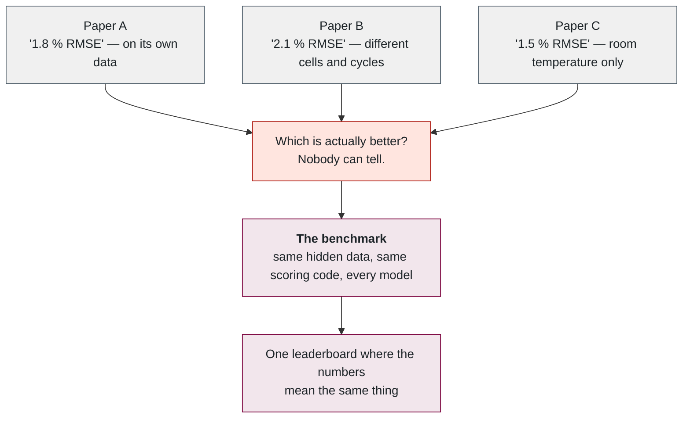
```mermaid
flowchart TB
    P1["Paper A<br/>'1.8 % RMSE' — on its own data"]
    P2["Paper B<br/>'2.1 % RMSE' — different cells and cycles"]
    P3["Paper C<br/>'1.5 % RMSE' — room temperature only"]
    Q["Which is actually better?<br/>Nobody can tell."]
    B["<b>The benchmark</b><br/>same hidden data, same scoring code, every model"]
    L["One leaderboard where the numbers<br/>mean the same thing"]
    P1 --> Q
    P2 --> Q
    P3 --> Q
    Q --> B --> L
    classDef ext fill:#F0F0F0,stroke:#495965,color:#1d2428
    classDef danger fill:#FFE5DF,stroke:#B3261E,color:#1d2428
    classDef web fill:#F2E6EC,stroke:#7A003C,color:#1d2428
    class P1,P2,P3 ext
    class Q danger
    class B,L web
```

### 👤 A researcher's experience, start to finish

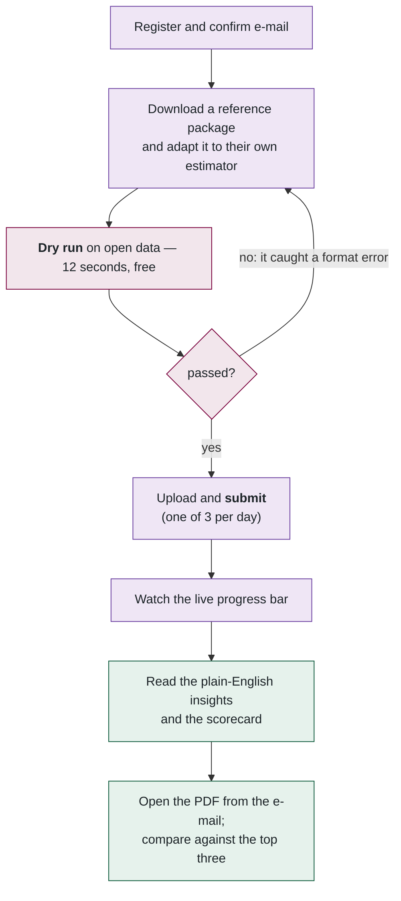
```mermaid
flowchart TB
    A["Register and confirm e-mail"] --> B["Download a reference package<br/>and adapt it to their own estimator"]
    B --> C["<b>Dry run</b> on open data — 12 seconds, free"]
    C --> D{"passed?"}
    D -- "no: it caught a format error" --> B
    D -- yes --> E["Upload and <b>submit</b><br/>(one of 3 per day)"]
    E --> F["Watch the live progress bar"]
    F --> G["Read the plain-English insights<br/>and the scorecard"]
    G --> H["Open the PDF from the e-mail;<br/>compare against the top three"]
    classDef person fill:#EFE6F5,stroke:#6B3FA0,color:#1d2428
    classDef web fill:#F2E6EC,stroke:#7A003C,color:#1d2428
    classDef good fill:#E6F2EC,stroke:#0E5B3D,color:#1d2428
    class A,B,E,F person
    class C,D web
    class G,H good
```

### 🧱 The three tiers, and what each may touch

Everything in the system is one of three kinds of program. The most important fact about the design is *what each is allowed to reach*.

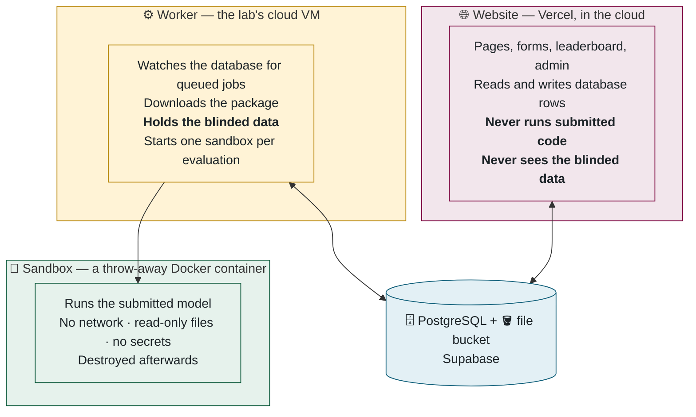
```mermaid
flowchart TB
    subgraph WEB["🌐 Website — Vercel, in the cloud"]
        W["Pages, forms, leaderboard, admin<br/>Reads and writes database rows<br/><b>Never runs submitted code<br/>Never sees the blinded data</b>"]
    end
    subgraph WORKER["⚙️ Worker — the lab's cloud VM"]
        K["Watches the database for queued jobs<br/>Downloads the package<br/><b>Holds the blinded data</b><br/>Starts one sandbox per evaluation"]
    end
    subgraph SANDBOX["🐳 Sandbox — a throw-away Docker container"]
        S["Runs the submitted model<br/>No network · read-only files · no secrets<br/>Destroyed afterwards"]
    end
    DB[("🗄️ PostgreSQL + 🪣 file bucket<br/>Supabase")]
    W <--> DB
    K <--> DB
    K --> S
    style WEB fill:#F2E6EC,stroke:#7A003C
    style WORKER fill:#FFF3D6,stroke:#B8860B
    style SANDBOX fill:#E6F2EC,stroke:#0E5B3D
    classDef web fill:#F2E6EC,stroke:#7A003C,color:#1d2428
    classDef worker fill:#FFF3D6,stroke:#B8860B,color:#1d2428
    classDef sandbox fill:#E6F2EC,stroke:#0E5B3D,color:#1d2428
    classDef data fill:#E3F0F5,stroke:#0D5D78,color:#1d2428
    class W web
    class K worker
    class S sandbox
    class DB data
```

The website and the worker share **nothing but the database**. They never talk to each other. That one fact explains a great deal of what follows: why adding a second worker machine needs zero configuration (it simply starts claiming jobs), why the website stayed up during a ten-hour network outage that cut the worker off, and why the queue is a database table rather than a queue service.

### ⚠️ What could go wrong, and what stops it

| Worry | What stops it |
|---|---|
| A malicious model steals the blinded data | It can read it (it must, to be scored) but cannot send it anywhere: no network, and the container is destroyed afterwards |
| A malicious model attacks the website or database | It cannot reach them — they are on different machines, and the sandbox has no network |
| A model runs forever | Hard timeout (360 min), enforced both inside and outside the container |
| A researcher's code is kept and misused | The package is deleted the moment it is scored; only scores and traces remain |
| Someone floods the queue | 3 submissions per person per day; uploads and dry runs rate-limited |
| Two workers evaluate the same model | Atomic claim (Part 4) |
| A worker crashes mid-run | Lock goes stale after 30 min; another worker picks the job up; two attempts per job |
| The worker loses its network | It retries every 2 s and resumes by itself; admins are e-mailed after 3 minutes of silence |
| Someone guesses passwords | bcrypt hashing plus 10 attempts per 15 min per account |

### 📍 Where each thing physically is

| What | Where | Why there |
|---|---|---|
|  Website | Vercel, free tier | Zero-ops hosting for Next.js; scales itself |
|  Database + file bucket | Supabase, free tier | PostgreSQL and object storage in one account |
| Worker | Arbutus VM, Ubuntu 24.04, 8 vCPU / 12 GB | The lab controls it; MATLAB can be licensed there; the only place the blinded data exists |
| MATLAB | Inside a Docker image on that VM | So MATLAB models run in the same kind of sandbox as Python ones |
|  Source code | GitHub, `McMaster-Battery-Research-Group` organization | Read-only collaborators can read and propose; only the owner merges |
| E-mail | Gmail SMTP today; Resend once a domain exists | Configuration only — the code is provider-agnostic |

📌 **Files to open, in order:** [README.md](../../README.md) → [prisma/schema.prisma](../../prisma/schema.prisma) → [src/evaluator/worker.ts](../../src/evaluator/worker.ts).

---

## 3. 🧰 The tools and libraries, and why each one

> 💡 **Plain English.** Software is assembled from existing building blocks. This part names each block, says what it is in one sentence, why we chose it over the alternatives, and — for non-developers — what it is analogous to. The short version: everything runs on free tiers, the website and the worker are written in the same language, and MATLAB is used for exactly one job.

### 🧱 The stack as layers

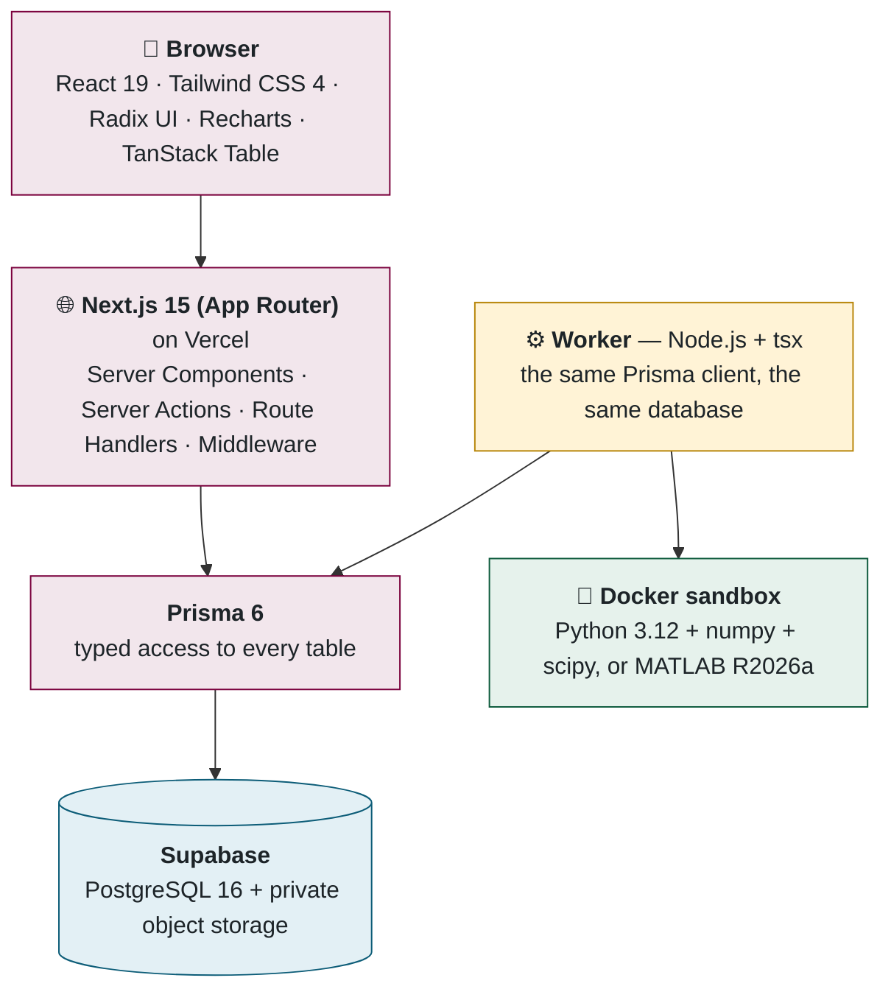
```mermaid
flowchart TB
    A["👤 <b>Browser</b><br/>React 19 · Tailwind CSS 4 · Radix UI · Recharts · TanStack Table"]
    B["🌐 <b>Next.js 15 (App Router)</b> on Vercel<br/>Server Components · Server Actions · Route Handlers · Middleware"]
    C["<b>Prisma 6</b><br/>typed access to every table"]
    D[("<b>Supabase</b><br/>PostgreSQL 16 + private object storage")]
    E["⚙️ <b>Worker</b> — Node.js + tsx<br/>the same Prisma client, the same database"]
    F["🐳 <b>Docker sandbox</b><br/>Python 3.12 + numpy + scipy, or MATLAB R2026a"]
    A --> B --> C --> D
    E --> C
    E --> F
    classDef web fill:#F2E6EC,stroke:#7A003C,color:#1d2428
    classDef worker fill:#FFF3D6,stroke:#B8860B,color:#1d2428
    classDef sandbox fill:#E6F2EC,stroke:#0E5B3D,color:#1d2428
    classDef data fill:#E3F0F5,stroke:#0D5D78,color:#1d2428
    class A,B,C web
    class D data
    class E worker
    class F sandbox
```

### 🧪 Development versus production

The same code runs in two very different environments. Knowing which is which explains most "works on my machine" confusion.

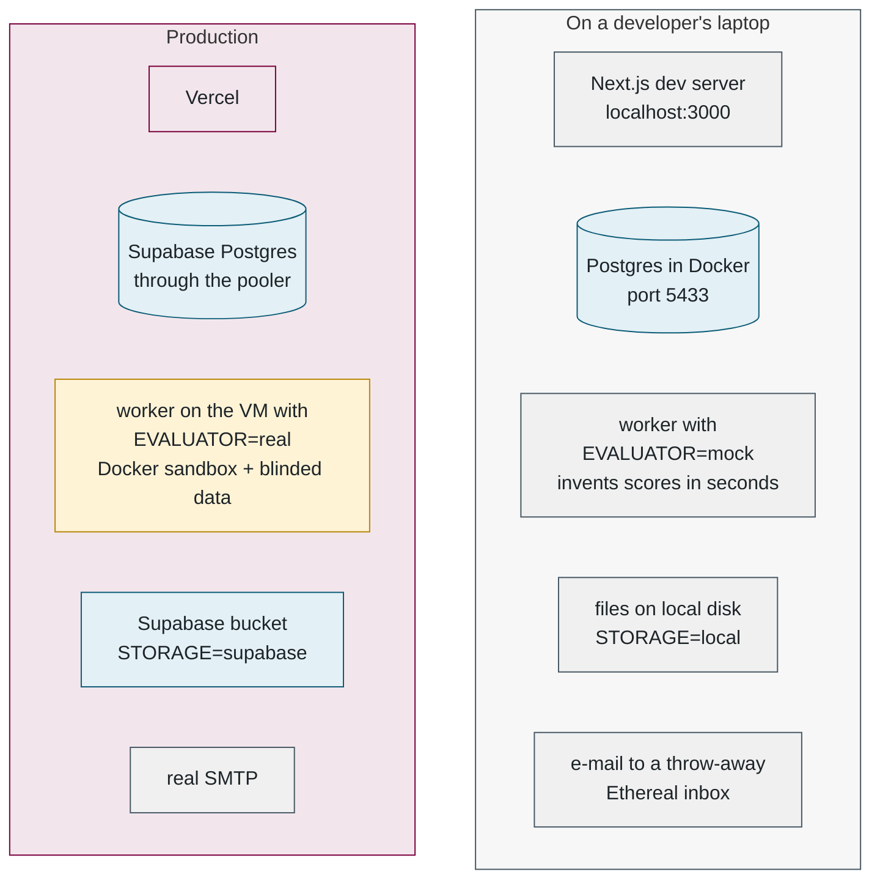
```mermaid
flowchart TB
    subgraph DEV["On a developer's laptop"]
        D1["Next.js dev server<br/>localhost:3000"]
        D2[("Postgres in Docker<br/>port 5433")]
        D3["worker with<br/>EVALUATOR=mock<br/>invents scores in seconds"]
        D4["files on local disk<br/>STORAGE=local"]
        D5["e-mail to a throw-away<br/>Ethereal inbox"]
    end
    subgraph PROD["Production"]
        P1["Vercel"]
        P2[("Supabase Postgres<br/>through the pooler")]
        P3["worker on the VM with<br/>EVALUATOR=real<br/>Docker sandbox + blinded data"]
        P4["Supabase bucket<br/>STORAGE=supabase"]
        P5["real SMTP"]
    end
    style DEV fill:#F7F7F7,stroke:#495965
    style PROD fill:#F2E6EC,stroke:#7A003C
    classDef ext fill:#F0F0F0,stroke:#495965,color:#1d2428
    classDef web fill:#F2E6EC,stroke:#7A003C,color:#1d2428
    classDef worker fill:#FFF3D6,stroke:#B8860B,color:#1d2428
    classDef data fill:#E3F0F5,stroke:#0D5D78,color:#1d2428
    class D1,D3,D4,D5 ext
    class D2 data
    class P1 web
    class P2,P4 data
    class P3 worker
    class P5 ext
```

Switching between them is entirely `.env` configuration — `EVALUATOR`, `STORAGE`, `DATABASE_URL`, `SMTP_HOST` — never a code change.

### 🌐 Web application

| Tool | What it is | Why we use it | Analogy |
|---|---|---|---|
|  **TypeScript 5** | JavaScript with a type system that catches mistakes before the code runs | One language for the website *and* the worker; refactoring is safe | Spell-check for code |
|  **Node.js 22** | Runs JavaScript/TypeScript outside a browser | The server side and the worker | The engine |
|  **Next.js 15** (App Router) | The web framework: pages, forms and small APIs in one project, rendered on the server | Free hosting on Vercel; server rendering keeps database access off the browser; one project instead of "front end + API" | The chassis everything bolts onto |
|  **React 19** | The library for building interfaces from components | Next.js is built on it | Lego bricks for screens |
| **Server Components** | React components that run *only on the server* and can read the database directly | No API layer to build or secure for reading | A page that fills itself in before it is sent |
| **Server Actions** | Functions that run on the server but are called like ordinary functions from a form | No API layer for writing either; validation and auth sit beside the logic | A form that knows where to go |
| **Route Handlers** | Plain URL endpoints (`/api/…`) for the few things that need one | Status polling, PDF download, upload URLs, the health check | Doors for other programs |
| **Middleware** | Code that runs before a page, at the network edge | Redirects signed-out users away from protected pages | A bouncer at the door |
|  **Tailwind CSS 4** | Styling as small utility classes in the markup | Fast to build; McMaster maroon and gold defined once as tokens | Paint by numbers |
|  **Radix UI** | Unstyled, accessible dialogs, menus, tooltips, switches | Keyboard and screen-reader behaviour done right, our look on top | Door hinges that just work |
| **Recharts 3** | Charts as SVG | Vector charts, PNG export, a custom MATLAB-style zoom for SOC traces | The graph paper |
| **TanStack Table 8** | A "headless" table engine: sorting, filtering, column visibility, no visuals | The leaderboard's column picker and filters | The spreadsheet brain without the spreadsheet |
|  **zod 4** | Declares what an input must look like and validates it | One schema per form, run in the browser *and* the server action | The form's rulebook |
| **Auth.js v5** | Login sessions for Next.js | E-mail + password with verification, no third-party identity provider | The ID card office |
| **bcryptjs** | Password hashing | Slow on purpose, so guessing passwords is expensive | A one-way scrambler |
| **nodemailer** | Sends e-mail over SMTP | Provider-agnostic — swapping Gmail for Resend is configuration | The post room |
| **pdfkit** | Draws PDFs programmatically, including vector charts | The report attached to results e-mails, no browser needed | A plotter |
| **adm-zip** | Reads zip files | Validating the package before anything runs | The parcel inspector |
| **Playwright** | Drives a real browser to test pages | Catches the class of bug only a real browser shows | A robot tester |

### 🗄️ Data

| Tool | What it is | Why we use it |
|---|---|---|
|  **PostgreSQL 16** | The relational database | Robust, free on Supabase, and the data (users → submissions → results) is naturally relational |
|  **Prisma 6** | The ORM: `prisma/schema.prisma` describes every table; the generated client gives typed queries | Website and worker share one schema and one client; changing a column is one edit |
|  **Supabase** | Hosted PostgreSQL + object storage + a connection pooler, one free account | One dashboard; the bucket and the database live together |
| **Supavisor (the pooler)** | Sits in front of PostgreSQL and funnels thousands of short-lived connections through a few real ones | Serverless functions each open their own connection; Postgres would run out in seconds |

### 🧮 Evaluation

| Tool | What it is | Why we use it |
|---|---|---|
|  **Python 3.12 + numpy + scipy** | The numerical language and its array/science libraries | The benchmark maths is numpy: exact, fast, no licence, runs anywhere. scipy reads and writes `.mat` files |
| **MATLAB R2026a** | The lab's native language; many submissions are `.m`/`.p` | Used *only* to execute MATLAB models — 40 lines of MATLAB, nothing else |
|  **Docker** | Runs each evaluation in an isolated container | Submitted code is untrusted; isolation is non-negotiable |
| **`mathworks/matlab-deep-learning:r2026a`** | MathWorks' official MATLAB container with the deep-learning toolboxes | No MATLAB install on the VM; every toolbox submissions have needed is inside (24.5 GB) |
| **MathWorks online licensing** | Licensing MATLAB through a MathWorks account instead of a licence server | The only way to license MATLAB on a headless cloud machine without a campus licence server |

### 🏗️ Operations

| Tool | What it is | Why we use it |
|---|---|---|
|  **Vercel** | Hosting for Next.js | Free tier, automatic deploys from GitHub, serverless scaling |
|  **Arbutus / OpenStack** | The Alliance's research cloud | Free allocation for the lab; a persistent VM we control |
| **systemd** | Linux service manager | Runs the worker on boot, restarts it on crash, applies sandbox hardening |
|  **GitHub Actions** | CI runner | One job: ping the health endpoint every 10 minutes |
|  **ufw** | Linux firewall | Default-deny inbound; SSH only |
|  **tsx** | Runs TypeScript directly | The worker starts as `node --import tsx src/evaluator/worker.ts`, no build step |
|  **dotenv** | Loads `.env` files into environment variables | Local development configuration |

📌 **Files to open, in order:** [package.json](../../package.json) → [.env.example](../../.env.example) → [next.config.ts](../../next.config.ts).

---

## 4. 📦 Life of a submission, end to end

> 💡 **Plain English.** A researcher uploads a zip. The website checks that it is well-formed and puts a ticket in a queue. A worker machine takes the ticket, downloads the zip, runs the model inside a sealed box against the secret data, saves the scores, deletes the zip, and e-mails a PDF. If anything goes wrong the researcher is told exactly what. Follow this part once with the files open and you can answer almost any question about the system.

### 🗺️ The whole journey in one picture

First half — on the website:

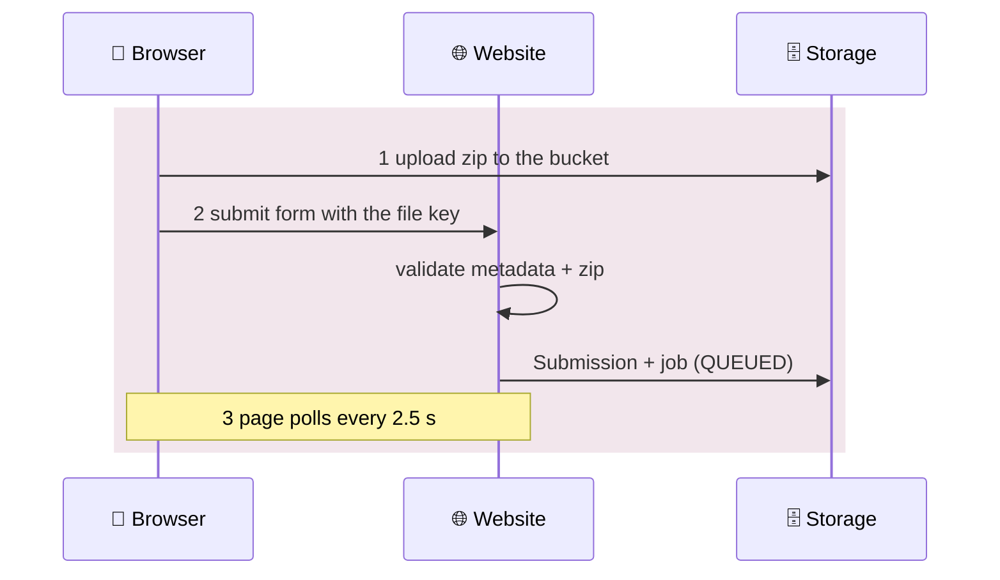
```mermaid
sequenceDiagram
    participant R as 👤 Browser
    participant W as 🌐 Website
    participant DB as 🗄️ Storage

    rect rgb(242,230,236)
    R->>DB: 1 upload zip to the bucket
    R->>W: 2 submit form with the file key
    W->>W: validate metadata + zip
    W->>DB: Submission + job (QUEUED)
    Note over R,W: 3 page polls every 2.5 s
    end
```

Second half — on the worker:

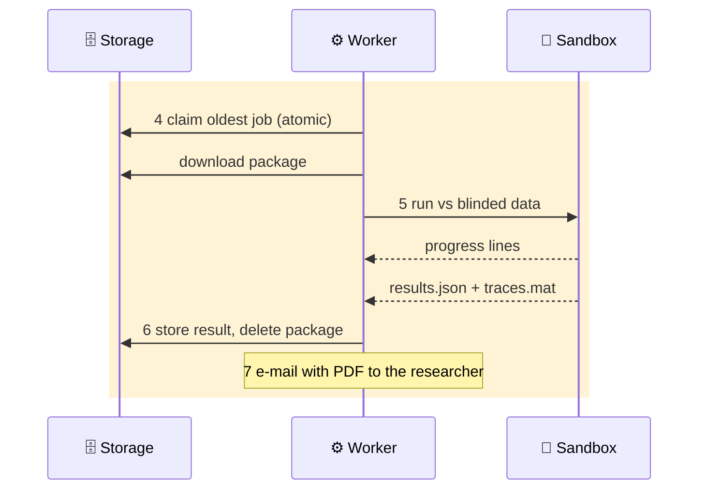
```mermaid
sequenceDiagram
    participant DB as 🗄️ Storage
    participant K as ⚙️ Worker
    participant S as 🐳 Sandbox

    rect rgb(255,243,214)
    K->>DB: 4 claim oldest job (atomic)
    K->>DB: download package
    K->>S: 5 run vs blinded data
    S-->>K: progress lines
    S-->>K: results.json + traces.mat
    K->>DB: 6 store result, delete package
    Note over K: 7 e-mail with PDF to the researcher
    end
```

### 👤 What the researcher sees at each step

| Step | On screen | Behind it |
|---|---|---|
| Upload | A progress bar to 100 %, then "checking the package structure" | Direct PUT to the bucket; then the server re-downloads and validates |
| Queued | "Position 2 in the queue · about 25 min · evaluator online" | Heartbeat table + job table + the ETA simulation |
| Running | A live console, a percentage, a stage name, an ETA | Every line the sandbox prints, streamed into the job log |
| Done | Confetti, the plain-English insights, the scorecard, an e-mail with a PDF | One database transaction, then package deletion, then mail |
| Failed | The exact error, with the model's own traceback lines | `EvaluationError` marked user-facing — never retried |

### ⏱️ An evaluation on a clock

Rough proportions for a mid-weight model (a heavy LSTM in MATLAB can take 45 minutes; a Coulomb counter in Python takes 10 seconds):


```mermaid
%%{init: {"gantt": {"fontSize": 15, "sectionFontSize": 15, "barHeight": 28, "barGap": 6, "leftPadding": 110}}}%%
gantt
    title One evaluation, roughly to scale
    dateFormat HH:mm:ss
    axisFormat %M:%S
    section Set-up
    unzip + import the model        :a1, 00:00:00, 5s
    validation cycle (fail fast)    :a2, after a1, 20s
    section Model runs
    144 blinded drive cycles        :b1, after a2, 6m
    charging cycles                 :b2, after b1, 30s
    9 wrong-initial-SOC runs        :b3, after b2, 40s
    18 sensor-offset runs           :b4, after b3, 60s
    section Wrap-up
    scoring + traces.mat            :c1, after b4, 10s
    store, PDF, e-mail (worker)     :c2, after c1, 15s
```

### 📤 Step 1 — Upload: browser → bucket, bypassing the website

Vercel caps the body of a serverless request at 4.5 MB; packages can be 50 MB. So the file never passes through our server on the way in.

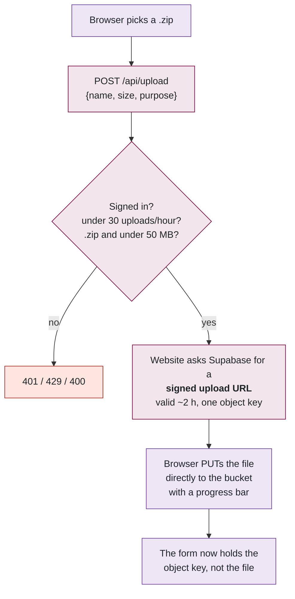
```mermaid
flowchart TB
    A["Browser picks a .zip"] --> B["POST /api/upload<br/>{name, size, purpose}"]
    B --> C{"Signed in?<br/>under 30 uploads/hour?<br/>.zip and under 50 MB?"}
    C -- no --> X["401 / 429 / 400"]
    C -- yes --> D["Website asks Supabase for a<br/><b>signed upload URL</b><br/>valid ~2 h, one object key"]
    D --> E["Browser PUTs the file<br/>directly to the bucket<br/>with a progress bar"]
    E --> F["The form now holds the<br/>object key, not the file"]
    classDef person fill:#EFE6F5,stroke:#6B3FA0,color:#1d2428
    classDef web fill:#F2E6EC,stroke:#7A003C,color:#1d2428
    classDef data fill:#E3F0F5,stroke:#0D5D78,color:#1d2428
    classDef danger fill:#FFE5DF,stroke:#B3261E,color:#1d2428
    class A,E,F person
    class B,C,D web
    class X danger
```

Files: [api/upload/route.ts](../../src/app/api/upload/route.ts), `uploadPackage()` in [upload-client.ts](../../src/lib/upload-client.ts), `createSignedUpload()` in [storage.ts](../../src/lib/storage.ts). Keys look like `submissions/1724600000000-ab12cd.zip`; the website accepts only keys matching `OBJECT_KEY_RE`, so a tampered form cannot point at some other object. In local development (`STORAGE=local`) the file simply travels inside the form.

### ✅ Step 2 — Validate and create

Everything below happens inside one server action, `createSubmissionAction` in [submit/actions.ts](../../src/app/(app)/submit/actions.ts), in this order. Cheap checks come first, and the pre-uploaded object is deleted on any rejection so the bucket never fills with rejects.

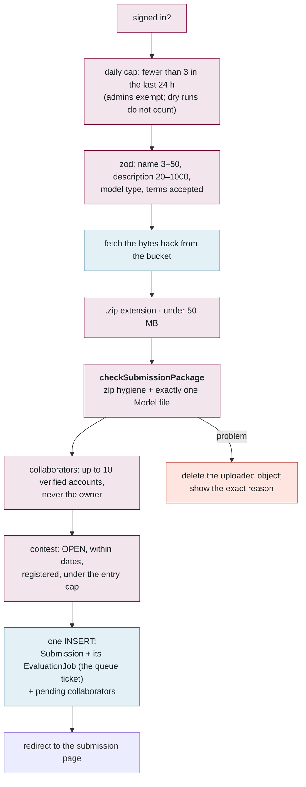
```mermaid
flowchart TB
    A["signed in?"] --> B["daily cap: fewer than 3 in the last 24 h<br/>(admins exempt; dry runs do not count)"]
    B --> C["zod: name 3–50, description 20–1000,<br/>model type, terms accepted"]
    C --> D["fetch the bytes back from the bucket"]
    D --> E[".zip extension · under 50 MB"]
    E --> F["<b>checkSubmissionPackage</b><br/>zip hygiene + exactly one Model file"]
    F --> G["collaborators: up to 10 verified accounts,<br/>never the owner"]
    G --> H["contest: OPEN, within dates,<br/>registered, under the entry cap"]
    H --> I["one INSERT:<br/>Submission + its EvaluationJob (the queue ticket)<br/>+ pending collaborators"]
    I --> J["redirect to the submission page"]
    F -- problem --> X["delete the uploaded object;<br/>show the exact reason"]
    classDef web fill:#F2E6EC,stroke:#7A003C,color:#1d2428
    classDef data fill:#E3F0F5,stroke:#0D5D78,color:#1d2428
    classDef danger fill:#FFE5DF,stroke:#B3261E,color:#1d2428
    class A,B,C,E,F,G,H web
    class D,I data
    class X danger
```

**Zip hygiene** ([package-check.ts](../../src/lib/package-check.ts)) is mirrored line for line by `safe_extract` in the Python evaluator, so a package that passes the website cannot surprise the worker:

| Check | Limit | Why |
|---|---|---|
| Entry count | ≤ 500 | Bounded work |
| Uncompressed total | ≤ 512 MB | Disk |
| Single entry | ≤ 256 MB | Disk |
| Compression ratio | ≤ 200 : 1 | Zip bombs are ~1000 : 1 |
| Paths | no `/…`, no `C:`, no `..` | Path traversal |
| Symlinks | none (checked in the attribute bits) | Escaping the extraction folder |
| Sub-folders | none — zip the *files*, not the folder | The single most common user mistake |
| Model file | exactly one of `Model.m` / `Model.p` / `Model.py` at top level, with a regex check on the function signature | The contract |

The `runtime` column (`python` or `matlab`) is set here, from which model file was found, so the right kind of worker claims the job later.

### ⏳ Step 3 — Waiting: where the numbers on the status page come from

The page polls `/api/submissions/[id]/status` — first after 1 s, then every 2.5 s. Everything it shows derives from two tables:

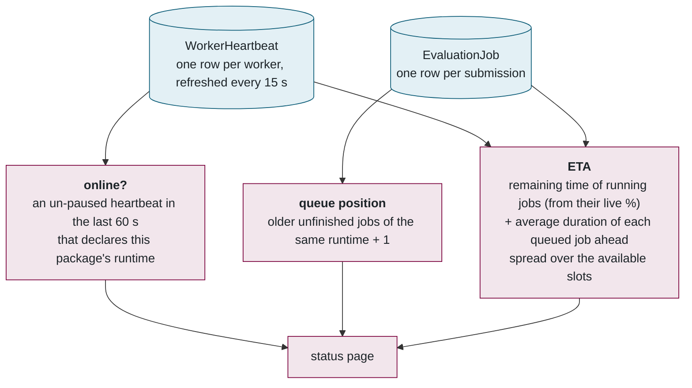
```mermaid
flowchart TB
    HB[("WorkerHeartbeat<br/>one row per worker, refreshed every 15 s")]
    JOB[("EvaluationJob<br/>one row per submission")]
    ON["<b>online?</b><br/>an un-paused heartbeat in the last 60 s<br/>that declares this package's runtime"]
    POS["<b>queue position</b><br/>older unfinished jobs of the same runtime + 1"]
    ETA["<b>ETA</b><br/>remaining time of running jobs (from their live %)<br/>+ average duration of each queued job ahead<br/>spread over the available slots"]
    PAGE["status page"]
    HB --> ON
    JOB --> POS
    HB --> ETA
    JOB --> ETA
    ON --> PAGE
    POS --> PAGE
    ETA --> PAGE
    classDef data fill:#E3F0F5,stroke:#0D5D78,color:#1d2428
    classDef web fill:#F2E6EC,stroke:#7A003C,color:#1d2428
    class HB,JOB data
    class ON,POS,ETA,PAGE web
```

The average duration comes from the last 10 completed runs of the same model type (`averageRunSec` in [worker-status.ts](../../src/lib/worker-status.ts)), falling back to 45 minutes. If no worker can run this runtime, the page says so plainly — "no evaluator for MATLAB packages is online" — rather than showing an ETA that will never arrive.

*Worked example:* two slots, one job running with 12 minutes left, two queued jobs ahead of yours averaging 20 minutes each. Slot A: 12 min → then queued job 1 (ends at 32). Slot B: queued job 2 (ends at 20). Your job starts on the first free slot: **about 20 minutes**.

### 🔒 Step 4 — Claim: how two workers never take the same job

The worker ([worker.ts](../../src/evaluator/worker.ts)) polls every 2 s. Dry runs are claimed first — they are short and someone is watching. Then `claimJob()` in [run-job.ts](../../src/evaluator/run-job.ts):

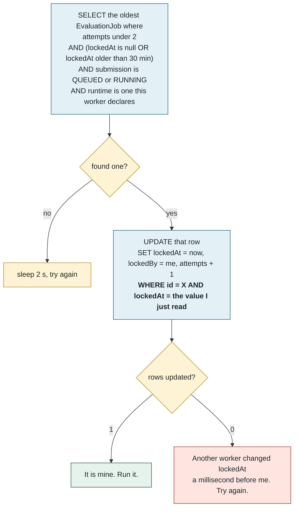
```mermaid
flowchart TB
    A["SELECT the oldest EvaluationJob where<br/>attempts under 2<br/>AND (lockedAt is null OR lockedAt older than 30 min)<br/>AND submission is QUEUED or RUNNING<br/>AND runtime is one this worker declares"] --> B{"found one?"}
    B -- no --> Z["sleep 2 s, try again"]
    B -- yes --> C["UPDATE that row<br/>SET lockedAt = now, lockedBy = me, attempts + 1<br/><b>WHERE id = X AND lockedAt = the value I just read</b>"]
    C --> D{"rows updated?"}
    D -- "1" --> E["It is mine. Run it."]
    D -- "0" --> F["Another worker changed lockedAt<br/>a millisecond before me. Try again."]
    classDef worker fill:#FFF3D6,stroke:#B8860B,color:#1d2428
    classDef data fill:#E3F0F5,stroke:#0D5D78,color:#1d2428
    classDef good fill:#E6F2EC,stroke:#0E5B3D,color:#1d2428
    classDef danger fill:#FFE5DF,stroke:#B3261E,color:#1d2428
    class A,C data
    class B,D,Z worker
    class E good
    class F danger
```

In code, the whole trick is one `WHERE` clause:

```ts
// run-job.ts — claimJob()
const candidate = await db.evaluationJob.findFirst({ where: { /* the SELECT above */ }, orderBy: { createdAt: "asc" } });
const { count } = await db.evaluationJob.updateMany({
  where: { id: candidate.id, lockedAt: candidate.lockedAt },   // only if nobody touched it since I looked
  data:  { lockedAt: new Date(), lockedBy: workerId(), attempts: { increment: 1 } },
});
return count === 1 ? candidate : null;                          // 0 means I lost the race — loop again
```

No transaction, no advisory lock, no queue service — a **compare-and-swap** on one column. If another worker won, the row no longer matches and the update touches zero rows.

**Why a 30-minute stale lock is safe for a 6-hour evaluation:** every progress line the evaluator prints is written to the job log, and *that write also refreshes `lockedAt`*. A live job is never stale. A job whose worker died stops being refreshed and becomes reclaimable after 30 quiet minutes.

### 🐳 Step 5 — Evaluate: the sandbox

`runJob` marks the submission RUNNING, downloads the package to a temporary file (`storage.materialize`), and hands off to `PythonEvaluator.spawn()` in [python-evaluator.ts](../../src/evaluator/python-evaluator.ts), which builds exactly one `docker run` command.

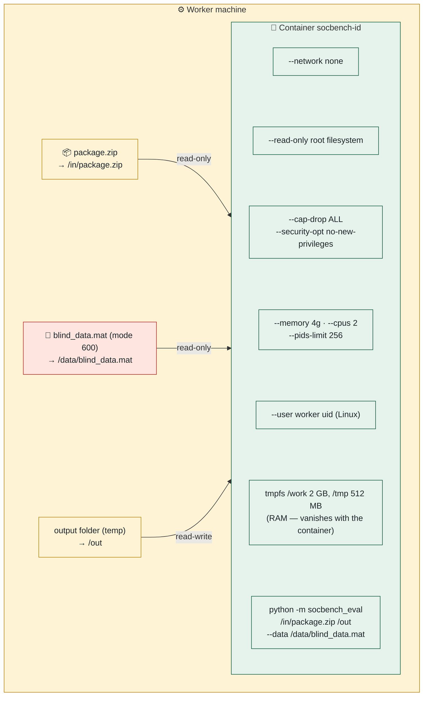
```mermaid
flowchart TB
    subgraph HOST["⚙️ Worker machine"]
        PKG["📦 package.zip<br/>→ /in/package.zip"]
        BD["🔐 blind_data.mat (mode 600)<br/>→ /data/blind_data.mat"]
        OUT["output folder (temp)<br/>→ /out"]
        subgraph C["🐳 Container socbench-id"]
            direction TB
            R1["--network none"] ~~~ R2["--read-only root filesystem"]
            R2 ~~~ R3["--cap-drop ALL<br/>--security-opt no-new-privileges"]
            R3 ~~~ R4["--memory 4g · --cpus 2<br/>--pids-limit 256"]
            R4 ~~~ R5["--user worker uid (Linux)"]
            R5 ~~~ R6["tmpfs /work 2 GB, /tmp 512 MB<br/>(RAM — vanishes with the container)"]
            R6 ~~~ EV["python -m socbench_eval<br/>/in/package.zip /out<br/>--data /data/blind_data.mat"]
        end
    end
    PKG -- "read-only" --> C
    BD -- "read-only" --> C
    OUT -- "read-write" --> C
    style HOST fill:#FFF3D6,stroke:#B8860B
    style C fill:#E6F2EC,stroke:#0E5B3D
    classDef worker fill:#FFF3D6,stroke:#B8860B,color:#1d2428
    classDef danger fill:#FFE5DF,stroke:#B3261E,color:#1d2428
    classDef sandbox fill:#E6F2EC,stroke:#0E5B3D,color:#1d2428
    class PKG,OUT worker
    class BD danger
    class R1,R2,R3,R4,R5,R6,EV sandbox
```

Three mounts and nothing else. The container never sees the host's environment variables, so no database password, SMTP credential or storage key can leak. For MATLAB packages the image is `socbench-eval-matlab`, the network is `bridge` (only so MATLAB can check out its licence), a tmpfs `/home/matlab` is added because MATLAB insists on writing preferences at start-up, and a 24-hour licence token is passed in — never the year-long one. The full command is written to the job log with licence values **redacted**.

Every line the container prints is streamed into the job log by `input.log`. That log is what the website shows as the live console, and where the progress bar comes from.

**Two independent kill switches**, both calling `killTree` (a `docker kill` plus a process-group kill so a MATLAB child dies with its parent):

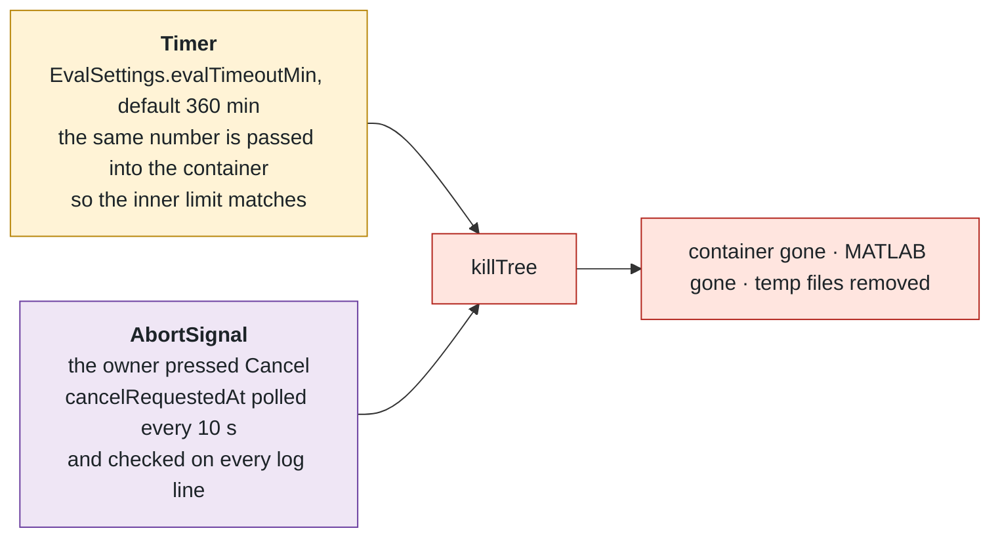
```mermaid
flowchart LR
    T["<b>Timer</b><br/>EvalSettings.evalTimeoutMin, default 360 min<br/>the same number is passed into the container<br/>so the inner limit matches"] --> K["killTree"]
    A["<b>AbortSignal</b><br/>the owner pressed Cancel<br/>cancelRequestedAt polled every 10 s<br/>and checked on every log line"] --> K
    K --> X["container gone · MATLAB gone · temp files removed"]
    classDef worker fill:#FFF3D6,stroke:#B8860B,color:#1d2428
    classDef person fill:#EFE6F5,stroke:#6B3FA0,color:#1d2428
    classDef danger fill:#FFE5DF,stroke:#B3261E,color:#1d2428
    class T worker
    class A person
    class K,X danger
```

**Host mode** (`EVAL_SANDBOX=none`, or a MATLAB package on a machine with no MATLAB image — this is how the laptop ran MATLAB natively during the outage): the same Python entry point, run directly, with an *allow-listed environment* — only `SOCBENCH_*`, `MATLAB_*`, `PATH` and locale variables reach it. Faster, not isolated. Dedicated low-privilege account only.

### 🏁 Step 6 — Score and store

Back in `runJob`, [results.ts](../../src/evaluator/results.ts) parses `results.json`: all 18 metric keys must be finite numbers. The website **re-derives** the weighted error from them with the *active* weights and logs a note if it disagrees with the evaluator by more than 0.01 (it never has, with default weights; when an admin has overridden the weights, the website's value wins).

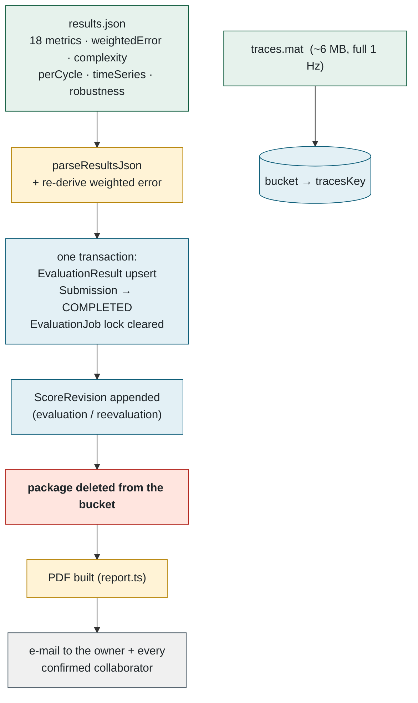
```mermaid
flowchart TB
    RJ["results.json<br/>18 metrics · weightedError · complexity<br/>perCycle · timeSeries · robustness"] --> P["parseResultsJson<br/>+ re-derive weighted error"]
    TM["traces.mat  (~6 MB, full 1 Hz)"] --> BK[("bucket → tracesKey")]
    P --> TX["one transaction:<br/>EvaluationResult upsert<br/>Submission → COMPLETED<br/>EvaluationJob lock cleared"]
    TX --> H["ScoreRevision appended<br/>(evaluation / reevaluation)"]
    H --> DEL["<b>package deleted from the bucket</b>"]
    DEL --> PDF["PDF built (report.ts)"]
    PDF --> M["e-mail to the owner + every<br/>confirmed collaborator"]
    classDef sandbox fill:#E6F2EC,stroke:#0E5B3D,color:#1d2428
    classDef worker fill:#FFF3D6,stroke:#B8860B,color:#1d2428
    classDef data fill:#E3F0F5,stroke:#0D5D78,color:#1d2428
    classDef danger fill:#FFE5DF,stroke:#B3261E,color:#1d2428
    classDef ext fill:#F0F0F0,stroke:#495965,color:#1d2428
    class RJ,TM sandbox
    class P,PDF worker
    class BK,TX,H data
    class DEL danger
    class M ext
```

The large trace file goes to the bucket, not the database row, and replaces the previous one on a re-evaluation. The package is deleted *before* the e-mail step — nothing that happens afterwards can leave it behind.

### 🔁 Step 7 — The branches people forget

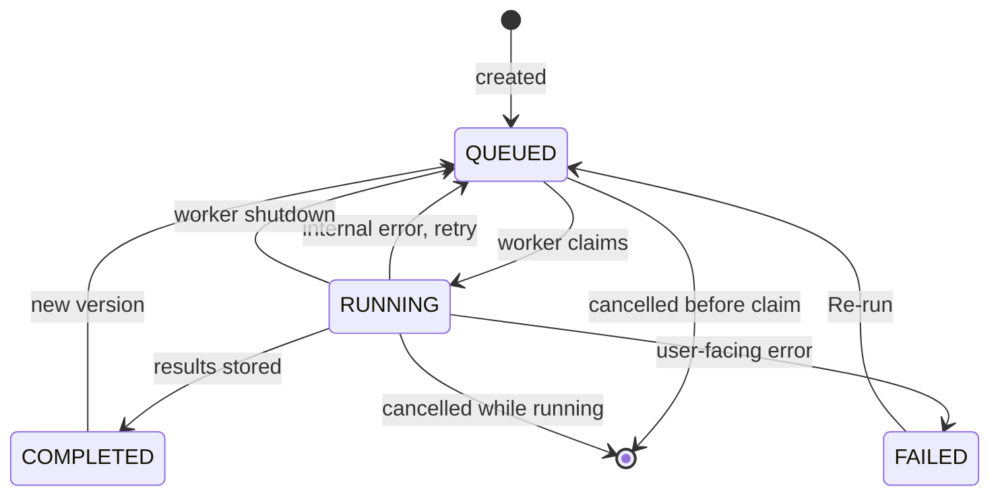
```mermaid
stateDiagram-v2
    [*] --> QUEUED : created
    QUEUED --> RUNNING : worker claims
    RUNNING --> COMPLETED : results stored
    RUNNING --> FAILED : user-facing error
    RUNNING --> QUEUED : internal error, retry
    RUNNING --> QUEUED : worker shutdown
    QUEUED --> [*] : cancelled before claim
    RUNNING --> [*] : cancelled while running
    FAILED --> QUEUED : Re-run
    COMPLETED --> QUEUED : new version
```

- **Retry happens only for our faults.** An `EvaluationError` marked `userFacing` — bad package, the model threw, timeout — is final; the exact message is stored and e-mailed. An internal error (Docker daemon down, a crash in our code) with `attempts < 2` unlocks the job and someone claims it again.
- **Cancel** while unclaimed → deleted outright. Once claimed → `cancelRequestedAt` is set; the worker notices within 10 s, aborts, and then either deletes the submission or — if this was a resubmitted v2+ — restores the previous version's score.
- **Worker shutdown** (Ctrl+C, `systemctl stop`, admin "stop"): in-flight evaluations are aborted with the reason `SHUTDOWN`; the job is handed back *with the attempt refunded* and the heartbeat row is deleted so the admin page does not show a ghost.

📌 **Files to open, in order:** [submit/actions.ts](../../src/app/(app)/submit/actions.ts) → [package-check.ts](../../src/lib/package-check.ts) → [worker.ts](../../src/evaluator/worker.ts) → [run-job.ts](../../src/evaluator/run-job.ts) → [python-evaluator.ts](../../src/evaluator/python-evaluator.ts) → [results.ts](../../src/evaluator/results.ts) → [worker-status.ts](../../src/lib/worker-status.ts).

---

## 5. ▶️ The evaluation engine — running the model

> 💡 **Plain English.** This and the next part describe the ~800 lines of Python that *are* the benchmark. They reproduce the lab's original MATLAB scoring tool exactly — checked against the real hidden data: the four reference models match every column of the old leaderboard to three decimal places, and the Python and MATLAB paths agree with each other. This part is about *running* the model: what data it is fed, in what order, and how. The next part is about turning the errors into a score.

Directory: [evaluator/python/socbench_eval/](../../evaluator/python/socbench_eval/) — `__main__.py` (the run), `data.py` (load the .mat), `runner.py` (execute models), `pipeline.py` (jobs, scoring, complexity, traces).

### 🔐 The answer key: `blind_data.mat`

The lab's data lives in MATLAB *tables*, which Python cannot read. [Export_Blind_Data.m](../../matlab/Export_Blind_Data.m) is run **once** to convert them to plain arrays in a version-7 `.mat` that scipy understands. **The cycle order is preserved and load-bearing** — every grouping in the scorer is positional, exactly as the original tool relied on.

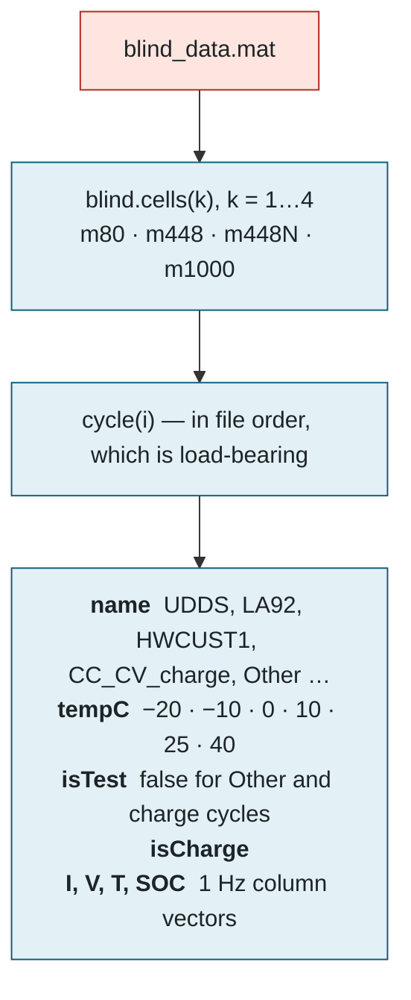
```mermaid
flowchart TB
    F["blind_data.mat"] --> B["blind.cells(k), k = 1…4<br/>m80 · m448 · m448N · m1000"]
    B --> CY["cycle(i) — in file order, which is load-bearing"]
    CY --> FLD["<b>name</b>  UDDS, LA92, HWCUST1, CC_CV_charge, Other …<br/><b>tempC</b>  −20 · −10 · 0 · 10 · 25 · 40<br/><b>isTest</b>  false for Other and charge cycles<br/><b>isCharge</b><br/><b>I, V, T, SOC</b>  1 Hz column vectors"]
    classDef danger fill:#FFE5DF,stroke:#B3261E,color:#1d2428
    classDef data fill:#E3F0F5,stroke:#0D5D78,color:#1d2428
    class F danger
    class B,CY,FLD data
```

### 🚗 The test grid

Every model faces the same grid. Each square is one drive cycle of roughly one to three hours of one-second measurements.

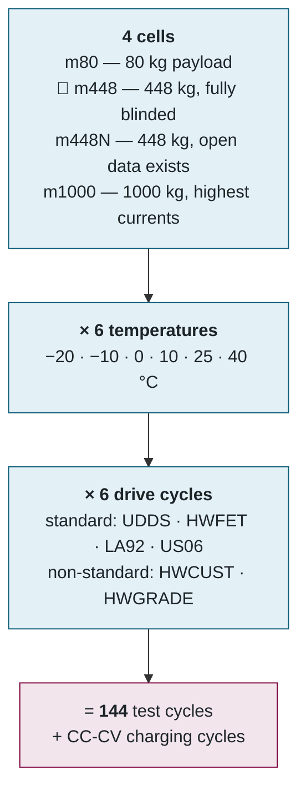
```mermaid
flowchart TB
    C["<b>4 cells</b><br/>m80 — 80 kg payload<br/>🔐 m448 — 448 kg, fully blinded<br/>m448N — 448 kg, open data exists<br/>m1000 — 1000 kg, highest currents"]
    T["<b>× 6 temperatures</b><br/>−20 · −10 · 0 · 10 · 25 · 40 °C"]
    Y["<b>× 6 drive cycles</b><br/>standard: UDDS · HWFET · LA92 · US06<br/>non-standard: HWCUST · HWGRADE"]
    TOT["= <b>144</b> test cycles<br/>+ CC-CV charging cycles"]
    C --> T --> Y --> TOT
    classDef data fill:#E3F0F5,stroke:#0D5D78,color:#1d2428
    classDef web fill:#F2E6EC,stroke:#7A003C,color:#1d2428
    class C,T,Y data
    class TOT web
```

### ▶️ The run, in order (`__main__.py`)

```mermaid
flowchart TB
    A["safe_extract the zip<br/>(same limits as the website)"] --> B{"Model.py present?"}
    B -- yes --> PB["PythonBackend"]
    B -- no --> MB["MatlabBackend"]
    PB --> V
    MB --> V["<b>Validation job</b><br/>m80 UDDS at 10 °C, +0.3 A on the current, 1-minute pad<br/>crash here → fail fast with code VALIDATION"]
    V --> J["build_jobs: the full batch (next diagram)"]
    J --> R["backend.run(jobs)<br/>every matrix through the model, once per sample"]
    R --> S["score · complexity · per_cycle_rows · robustness_traces"]
    S --> O["results.json"]
    S --> O2["traces.mat (best effort)"]
    classDef sandbox fill:#E6F2EC,stroke:#0E5B3D,color:#1d2428
    classDef danger fill:#FFE5DF,stroke:#B3261E,color:#1d2428
    classDef data fill:#E3F0F5,stroke:#0D5D78,color:#1d2428
    class A,B,PB,MB,J,R,S sandbox
    class V danger
    class O,O2 data
```

The validation job exists for one reason: a broken model fails in seconds with its real error message instead of after 45 minutes.

### 🧾 What `build_jobs` produces

```mermaid
flowchart TB
    subgraph CYC["🚗 Drive and charge cycles"]
        A["4 cells × every cycle in the file<br/>= 144 test cycles + charge cycles + 'Other'<br/>key  cycle:cell:i"]
    end
    subgraph ISOC["Test 10 — wrong initial SOC (9 jobs)"]
        B["m80: LA92 @ 25 °C, US06 @ −10 °C,<br/>US06 @ 10 °C — each started where the<br/>true SOC is already below 90 / 60 / 30 %<br/>key  isoc:b:q:idx"]
    end
    subgraph OFF["Test 11 — current-sensor offset (18 jobs)"]
        C["m1000: US06 @ −10 °C, HWFET @ 10 °C,<br/>LA92 @ 40 °C — with −0.3, −0.1, −0.05,<br/>+0.05, +0.1, +0.3 A added to the current<br/>key  offset:b:j"]
    end
    A ~~~ B ~~~ C
    A --> BATCH["one batch, run in one pass"]
    B --> BATCH
    C --> BATCH
    style CYC fill:#E3F0F5,stroke:#0D5D78
    style ISOC fill:#FFF3D6,stroke:#B8860B
    style OFF fill:#FFF3D6,stroke:#B8860B
    classDef data fill:#E3F0F5,stroke:#0D5D78,color:#1d2428
    classDef worker fill:#FFF3D6,stroke:#B8860B,color:#1d2428
    classDef sandbox fill:#E6F2EC,stroke:#0E5B3D,color:#1d2428
    class A data
    class B,C worker
    class BATCH sandbox
```

Only the ±0.3 A offset runs enter the score; the others are kept for the RMSE-vs-offset chart.

**Padding.** Every job is prefixed with one hour (3 600 samples) of its first row repeated, so estimators with internal memory — Kalman filters, RNNs — settle before scoring begins. The pad is stripped from the prediction before metrics.

```mermaid
flowchart LR
    P["3600 samples of the first row<br/>(current forced to 0 A for initial-SOC jobs)"] --> D["the actual cycle"] --> M["metrics computed<br/>on this part only"]
    classDef ext fill:#F0F0F0,stroke:#495965,color:#1d2428
    classDef data fill:#E3F0F5,stroke:#0D5D78,color:#1d2428
    classDef web fill:#F2E6EC,stroke:#7A003C,color:#1d2428
    class P ext
    class D data
    class M web
```

### 🔋 How the model is executed (`runner.py`)

Both backends honour the same contract: **call `Model(X[i], z)` once per sample, in order, carrying `z` forward.** That is how a BMS runs an estimator, and it is why a model cannot cheat by looking ahead.

```mermaid
sequenceDiagram
    participant E as 🧮 Evaluator
    participant M as 🔋 Model

    E->>M: Model(X[0])
    M-->>E: soc0, z
    E->>M: Model(X[1], z)
    M-->>E: soc1, z
    E->>M: Model(X[2], z)
    M-->>E: soc2, z
    Note over E,M: N samples → N calls — z is always the model's own memory
```

This is what a submitted model looks like — the reference Coulomb counter, in full:

```python
# Model.py
CAPACITY_AH = 4.6

def Model(X, z=None):
    """X = [current (A, negative = discharge), voltage (V), temperature (C)]
    Returns (SOC estimate 0..1, memory z for the next call)."""
    current = float(X[0])
    if z is None:                      # first sample: assume fully charged
        soc = 1.0
    else:
        soc = float(z) + current * (1 / 3600) / CAPACITY_AH
    return soc, soc                    # memory z = previous SOC
```

| Backend | How | Errors |
|---|---|---|
| `PythonBackend` | imports `Model.py` with `importlib`, loops in-process | re-raised as `ModelError` with the traceback trimmed to the submitter's own frames |
| `MatlabBackend` | writes every input matrix to one `in.mat`, starts **one** `matlab -batch` session running [Run_Model.m](../../matlab/Run_Model.m) (40 lines: loop over matrices, `tic/toc` around each), reads `out.mat` back | "Undefined function 'butter'" is translated to "that is the Signal Processing Toolbox, not installed here" via a lookup table |

`Run_Model.m` prints `[Run_Model] k/n done` after every matrix; the Python side turns that into the same `NN.N% | key` progress lines the Python backend emits, so the website's progress bar is identical for both. Progress is weighted by *samples*, not matrix count, so long cycles move the bar proportionally.

### 🧪 Dry run and mock

`--dry-run` uses **open** data shipped with the repo (`dryrun_data.mat`, 2 h of public m80 data): the +0.3 A validation, then one padded cycle. No blinded data is mounted, no leaderboard row. This replaced the lab's downloadable "Model Submission Test Tool".

`EVALUATOR=mock` ([mock-evaluator.ts](../../src/evaluator/mock-evaluator.ts)) fabricates plausible numbers from a seeded random generator — per-family baselines (LSTM ≈ 2.6 %, EKF ≈ 9 %, Coulomb counter ≈ 30 %) with temperature, cycle and cell factors — deterministically, so the same submission always "evaluates" identically. It exists so the entire website can be developed with no blinded data and no Docker.

📌 **Files to open, in order:** [__main__.py](../../evaluator/python/socbench_eval/__main__.py) → [data.py](../../evaluator/python/socbench_eval/data.py) → [runner.py](../../evaluator/python/socbench_eval/runner.py) → [Run_Model.m](../../matlab/Run_Model.m) → [Export_Blind_Data.m](../../matlab/Export_Blind_Data.m).

---

## 6. 🧮 The evaluation engine — scoring, complexity and outputs

> 💡 **Plain English.** After the model has run on every cycle, the evaluator has one error number per cycle. This part shows how those become the 18 numbers on the scorecard, how the 18 become one leaderboard score, what "complexity" means, and what gets sent back to the website for the charts.

### 📊 From one number per cycle to 18 metrics

Per-cycle RMSE (in % SOC) is arranged as a matrix `R` — rows are test cycles in file order, columns are the four cells — and the metrics are positional means over it, mirroring the original `Obtain_Output_Data.m`.

```mermaid
flowchart TB
    R["<b>Matrix R</b> — per-cycle RMSE<br/>rows = test cycles in file order<br/>columns = m80 · m448 · m448N · m1000"]
    X["<b>the other runs</b><br/>charge-cycle RMSEs<br/>9 initial-SOC RMSEs<br/>18 offset RMSEs"]
    G["<b>Positional means → 18 metrics</b><br/>1 allCells — mean of non-zero R (weight 0)<br/>2 blindedCell — the m448 column<br/>3 nonBlindedCells — mean of the other three<br/>4 charging — the charge cycles<br/>5–8 mass m80 / m448 / m448N / m1000<br/>— the four column means<br/>9 standard vs non-standard cycles<br/>— blocks of 4 and 2<br/>10 six temperatures — m80 in blocks of 6<br/>(−10 and −20 swapped)<br/>11 initialSocError — 3 : 2 : 1 for 90 / 60 / 30 %<br/>12 currentSensorOffset — mean of the ±0.3 A runs"]
    W["<b>weighted error</b> = Σ weight × metric<br/>weights sum to exactly 1"]
    R --> G
    X --> G
    G --> W
    classDef data fill:#E3F0F5,stroke:#0D5D78,color:#1d2428
    classDef worker fill:#FFF3D6,stroke:#B8860B,color:#1d2428
    classDef web fill:#F2E6EC,stroke:#7A003C,color:#1d2428
    class R data
    class X worker
    class G,W web
```

### ⚖️ The weights

```mermaid
%%{init: {"theme": "base", "themeVariables": {"pie1": "#7A003C", "pie2": "#9E3D67", "pie3": "#C27A99", "pie4": "#FDBF57", "pie5": "#E5A93E", "pie6": "#C99027", "pie7": "#B8860B", "pie8": "#0D5D78", "pie9": "#3A7F98", "pie10": "#7FB0C4", "pie11": "#0E5B3D", "pie12": "#4E8A6A", "pieStrokeColor": "#ffffff", "pieSectionTextColor": "#ffffff"}}}%%
pie showData title Share of the weighted error, by test case
    "2 Blinded cell" : 6
    "3 Non-blinded cells" : 6
    "4 Charging" : 6
    "9 Standard cycles" : 6
    "9 Non-standard cycles" : 6
    "10 Wrong initial SOC" : 6
    "11 Sensor offset" : 6
    "5 Mass m80" : 2
    "5 Mass m448" : 4
    "6 Mass m448N" : 4
    "5 Mass m1000" : 2
    "9 Six temperatures, 1/60 each" : 6
```

The weights in metric order: `[0, 1/10, 1/10, 1/10, 1/30, 2/30, 2/30, 1/30, 1/10, 1/10, 1/60 ×6, 1/10, 1/10]`. Seven categories carry a tenth each; the four payloads share a fifth; the six temperatures share a tenth. `allCells` has weight zero — it is the headline number people recognise from the paper, but it would double-count everything else.

**A worked example.** A model with these RMSEs (all in % SOC): blinded cell 3.0, non-blinded 2.0, charging 4.0, standard 2.5, non-standard 3.5, initial-SOC 5.0, offset 6.0, the four masses 2.0 / 2.5 / 3.0 / 4.0, the six temperatures 6, 4, 3, 2, 1.5, 1.5:

| Group | Contribution |
|---|---|
| Seven categories at 1/10 | 0.1 × (3.0 + 2.0 + 4.0 + 2.5 + 3.5 + 5.0 + 6.0) = **2.60** |
| Four masses at 1/30, 2/30, 2/30, 1/30 | (2.0 + 2×2.5 + 2×3.0 + 4.0) / 30 = **0.57** |
| Six temperatures at 1/60 | (6 + 4 + 3 + 2 + 1.5 + 1.5) / 60 = **0.30** |
| **Weighted error** | **3.47** |

Two extras the scorer emits: `suspicious = mean(R) > 25` (the original tool *withheld* such results; we flag it in the log and leave the decision to an administrator), and `maxError` = the single worst instantaneous error across all test cycles.

### 📏 RMSE, in words

For one cycle: take the difference between the estimated and true SOC at every second, square each difference (so misses in both directions count and big misses count more), average them, and take the square root to get back to % SOC. A model that is always 2 % off scores an RMSE of 2. A model that is perfect most of the time but 30 % off for a minute scores worse than that minute's share would suggest — which is the point.

### ⏱️ Complexity

```mermaid
flowchart TB
    A["mean seconds per sample<br/>over the cycle jobs"] --> B["÷ calibration constant for this runtime<br/>SOCBENCH_CAL_PYTHON / _MATLAB"]
    B --> C["ratio"]
    C --> D["how many times does it exceed 10^(1/3) ≈ 2.15?"]
    D --> E["bin 1–10<br/>(a Coulomb counter lands in 2)"]
    classDef sandbox fill:#E6F2EC,stroke:#0E5B3D,color:#1d2428
    classDef web fill:#F2E6EC,stroke:#7A003C,color:#1d2428
    class A,B,C,D sandbox
    class E web
```

Informational only — it never enters the weighted error. The constants are per evaluation host. A caveat worth knowing: MATLAB's JIT is ~20× faster inside a function than in a script, so the MATLAB constant can only be re-measured by calling the model the way `Run_Model.m` does. For a researcher, complexity answers "would this fit on a real battery controller?" — a bin of 2 is a few arithmetic operations per second; a bin of 9 is a neural network that would need a much larger processor.

### 📤 What leaves the engine

```mermaid
flowchart TB
    subgraph RJ["results.json → the database row"]
        A["18 metrics + weightedError + maxError + complexity"]
        B["perCycle — one row per test cycle:<br/>RMSE, MAE, max error, duration"]
        C["timeSeries — ~240-point <b>peak-preserving</b> down-samples<br/>of 13 illustrative cycles, the 9 initial-SOC runs,<br/>the ±0.3 A offset runs, and the model's own worst cycle<br/>each with a plain-English note"]
        D["robustness — the raw 9 + 18 RMSEs behind tests 10–11"]
    end
    subgraph TM["traces.mat → the bucket"]
        E["every run at full 1 Hz, int16 hundredths of a percent<br/>~6 MB, scipy-readable, for the raw curves"]
    end
    style RJ fill:#E3F0F5,stroke:#0D5D78
    style TM fill:#E3F0F5,stroke:#0D5D78
    classDef data fill:#E3F0F5,stroke:#0D5D78,color:#1d2428
    class A,B,C,D,E data
```

**Peak-preserving down-sampling.** A three-hour cycle has 10 800 points; a chart can show about 240. Taking every 45th point would hide the very spike that produced the max-error number. Instead `display_indices` splits the cycle into 120 buckets and keeps the sample with the largest *and* the smallest signed error in each — so every spike survives and the plotted line agrees with the scorecard.

```mermaid
flowchart TB
    F["10 800 samples"] --> B["120 buckets of 90"]
    B --> K["keep max-error and min-error<br/>sample in each bucket + both ends"]
    K --> O["≈ 240 points, every spike intact"]
    classDef data fill:#E3F0F5,stroke:#0D5D78,color:#1d2428
    classDef web fill:#F2E6EC,stroke:#7A003C,color:#1d2428
    class F,B,K data
    class O web
```

📌 **Files to open, in order:** [pipeline.py](../../evaluator/python/socbench_eval/pipeline.py) (`score`, `complexity`, `display_indices`, `per_cycle_rows`, `robustness_traces`, `write_full_traces`) → [test-cases.ts](../../src/lib/test-cases.ts) (the same 18 with labels and descriptions for the website).

---

## 7. 🗄️ The data model

> 💡 **Plain English.** The database is a set of tables. A person has submissions; each submission has one queue ticket, one current result, and a history of everything that ever happened to it. Separate tables track contests, worker machines, settings and the admin activity feed. One file — `prisma/schema.prisma` — describes all of it, and both the website and the worker read that same description.

```mermaid
erDiagram
    USER ||--o{ SUBMISSION : owns
    USER ||--o{ COAUTHOR : "is one"
    SUBMISSION ||--|| JOB : "queue ticket"
    SUBMISSION ||--o| RESULT : "current scores"
    SUBMISSION ||--o{ REVISION : history
    SUBMISSION ||--o{ COAUTHOR : has
    CONTEST ||--o{ SUBMISSION : contains
```

The picture shows only how the tables relate; the names are shortened for space — `JOB` is `EvaluationJob`, `RESULT` is `EvaluationResult`, `REVISION` is `ScoreRevision`, `COAUTHOR` is `SubmissionCollaborator`. Each table's columns are listed just below.

### 🗄️ Which rows exist at each moment

One submission's footprint grows as it moves through its life:

```mermaid
flowchart TB
    S1["<b>Just submitted</b><br/>Submission (QUEUED)<br/>EvaluationJob (unlocked)<br/>pending collaborators<br/>package in the bucket"]
    S2["<b>Running</b><br/>Submission (RUNNING)<br/>EvaluationJob (locked, log growing)"]
    S3["<b>Completed</b><br/>Submission (COMPLETED)<br/>EvaluationResult<br/>ScoreRevision 'evaluation'<br/>traces.mat in the bucket<br/><b>package deleted</b>"]
    S4["<b>Later</b><br/>more ScoreRevisions: edit, rescore,<br/>resubmission, reevaluation"]
    S1 --> S2 --> S3 --> S4
    classDef data fill:#E3F0F5,stroke:#0D5D78,color:#1d2428
    classDef worker fill:#FFF3D6,stroke:#B8860B,color:#1d2428
    classDef good fill:#E6F2EC,stroke:#0E5B3D,color:#1d2428
    class S1,S4 data
    class S2 worker
    class S3 good
```

### 🗂️ The columns that matter

| Table | Key columns |
|---|---|
| `User` | `email`, `passwordHash` (bcrypt), `role` USER/ADMIN, `emailVerified` (a *timestamp*, not a boolean), public-profile fields, `adminNotify` JSON of e-mail toggles, `avatar` bytes ≤ 400 KB |
| `Submission` | `seq` (the human-visible #), `modelName`/`description`/`modelType`, `isPrivate`, `isHidden` (admin moderation), `fileKey` into the bucket, `runtime` (`python`/`matlab`, set at upload), `status`, `version` (bumped by "submit new version"), optional `contestId` |
| `EvaluationJob` | `attempts`, `lockedAt`/`lockedBy` (the compare-and-swap lock), `log` (the live console text), `cancelRequestedAt` |
| `EvaluationResult` | `weightedError`, `complexity`, the 18 metric columns `allCells … currentSensorOffset`, `maxError`, `perCycle` JSON, down-sampled `timeSeries` JSON, `robustness` JSON, `tracesKey`, `evaluatorVersion` stamp |
| `ScoreRevision` | `kind` (evaluation · failure · rescore · reevaluation · resubmission · edit · cancelled · legacy), the score and 18 metrics at that moment, `note`, `by` |
| `SubmissionCollaborator` | `notifiedAt` (invited), `acceptedAt` (public), `inviteToken` for the e-mail links |
| `DryRun` | its own status/lock, `result` JSON, `log` — never touches blinded data, never on the leaderboard |

Tables that stand alone:

| Table | Role |
|---|---|
| `WorkerHeartbeat` | One row per worker process (`hostname-pid`), refreshed every 15 s: liveness, what it is busy with, its runtimes, a pending admin command, machine diagnostics, the last 200 console lines |
| `EvalSettings` | A single row (`id = 1`): evaluation timeout 360 min, dry-run timeout 10 min, submissions per day 3. Read with a 15 s cache by both website and worker |
| `ScoringConfig` | Append-only weight overrides; the newest row is active; absent = the published defaults |
| `AdminEvent` | The activity feed on Admin → Overview — also the memory for outage alerting |
| `RateLimitHit` | One row per rate-limited attempt; counted per key per window |
| `ContactMessage` | The feedback inbox |
| `Contest`, `ContestEntry` | A time-boxed event with its own frozen leaderboard, and who registered for it |

### 📐 Two conventions that recur everywhere

```mermaid
flowchart TB
    subgraph CASC["Cascade deletes — nothing is orphaned"]
        U["delete a User"] --> U2["→ their submissions, jobs, results,<br/>history, tokens, collaborations go too"]
        S["delete a Submission"] --> S2["→ its job, result, history,<br/>collaborators go too"]
    end
    subgraph APP["Append-only where auditability matters"]
        A["ScoreRevision · ScoringConfig · AdminEvent"] --> A2["never updated, only added to —<br/>the past cannot be rewritten"]
    end
    S2 ~~~ A
    style CASC fill:#FFE5DF,stroke:#B3261E
    style APP fill:#E6F2EC,stroke:#0E5B3D
    classDef danger fill:#FFE5DF,stroke:#B3261E,color:#1d2428
    classDef good fill:#E6F2EC,stroke:#0E5B3D,color:#1d2428
    class U,U2,S,S2 danger
    class A,A2 good
```

📌 **Files to open, in order:** [prisma/schema.prisma](../../prisma/schema.prisma) (read it top to bottom once — it is the best map of the system) → [src/lib/db.ts](../../src/lib/db.ts) → [src/lib/history.ts](../../src/lib/history.ts).

---

## 8. 🪪 Authentication and accounts

> 💡 **Plain English.** Register with e-mail and password, prove you own the e-mail address by clicking a confirmation, then sign in. Passwords are stored scrambled, never in the clear. Administrators are either promoted on the admin page or listed in a configuration variable. Every sensitive action is limited to a few attempts per hour so nobody can guess passwords by brute force.

Files: [auth.ts](../../src/lib/auth.ts), [auth.config.ts](../../src/lib/auth.config.ts), [middleware.ts](../../src/middleware.ts), [(auth)/actions.ts](../../src/app/(auth)/actions.ts), [verify/actions.ts](../../src/app/(auth)/verify/actions.ts), [rate-limit.ts](../../src/lib/rate-limit.ts).

### ✉️ Register and verify — and why the verification link is a button

```mermaid
sequenceDiagram
    participant P as 👤 Person
    participant W as 🌐 Website
    participant M as 🤖 Mail scanner
    participant DB as 🗄️ Database

    P->>W: register
    W->>DB: user, hash, 24 h token
    W-->>P: e-mail with a link
    rect rgb(255,229,223)
    Note over M: scanners GET every link<br/>before the person clicks
    M->>W: GET the link
    W-->>M: just a button page
    end
    rect rgb(230,242,236)
    P->>W: click Confirm (POST)
    W->>DB: emailVerified = now
    W-->>P: go to login
    end
```

The GET is side-effect free on purpose: before this change, mail scanners (Microsoft Safe Links, Proofpoint, Gmail) were consuming the one-time token before the person clicked. The token is also deliberately **left in place after success**, so a scanner firing after the click, or a double-click, lands on "already verified" instead of an error. The page even tells the user why: "This extra click keeps automated e-mail security scanners from activating accounts on your behalf."

### 🪪 Login, and where you land afterwards

```mermaid
flowchart TB
    A["POST login"] --> L{"rate limits:<br/>10 / 15 min per e-mail<br/>40 / 15 min per IP"}
    L -- exceeded --> X["too many attempts"]
    L -- ok --> B["bcrypt.compare<br/>(password, hash)"]
    B -- wrong --> Y["wrong password"]
    B -- right --> C{"e-mail verified?"}
    C -- no --> Z["resend verification"]
    C -- yes --> D["signed JWT cookie, 14 days<br/>id, role, name, affiliation"]
    D --> E{"?next= present<br/>and starts with '/'?"}
    E -- yes --> F["go there"]
    E -- no --> G{"has any submissions?"}
    G -- yes --> H["/submissions"]
    G -- no --> I["/submit"]
    classDef web fill:#F2E6EC,stroke:#7A003C,color:#1d2428
    classDef danger fill:#FFE5DF,stroke:#B3261E,color:#1d2428
    classDef good fill:#E6F2EC,stroke:#0E5B3D,color:#1d2428
    class A,L,B,C,E,G web
    class X,Y,Z danger
    class D,F,H,I good
```

The `startsWith('/')` check blocks open redirects to other sites. Sessions are signed JWT cookies — no session table, so the database is not touched to verify a request. The `next` parameter is how a deep link survives login: open `/submissions/abc` while signed out and you come back to exactly that page.

### 🛡️ Authorization has two layers, and the first is not the boundary

```mermaid
flowchart TB
    R["request"] --> MW["<b>Middleware</b> — runs at the edge, before the page<br/>protects /submit, /profile, /admin and exactly /submissions<br/>no session → redirect to /login?next=…<br/>non-admin on /admin → home"]
    MW --> PG["page or server action"]
    PG --> RQ["<b>requireUser() / requireAdmin()</b><br/>re-checked inside every server action"]
    RQ --> DBX[("database")]
    classDef person fill:#EFE6F5,stroke:#6B3FA0,color:#1d2428
    classDef web fill:#F2E6EC,stroke:#7A003C,color:#1d2428
    classDef danger fill:#FFE5DF,stroke:#B3261E,color:#1d2428
    classDef data fill:#E3F0F5,stroke:#0D5D78,color:#1d2428
    class R person
    class MW,PG web
    class RQ danger
    class DBX data
```

Middleware is a convenience that keeps signed-out users off the pages; the real check is inside each action. Two details worth knowing: `auth.config.ts` is split from `auth.ts` because middleware runs at the *edge* where Prisma cannot load; and the `ADMIN_EMAILS` variable is **re-read on every call** and applied in the session callback, so adding an address there makes that person an admin on their next request — no waiting for a token to expire.

### 🔁 Rate limiting without a memory

Vercel functions are stateless — an in-memory counter would reset on every request — so the counter is the database.

```mermaid
flowchart TB
    A["rateLimit(key, limit, window)"] --> B["COUNT RateLimitHit rows<br/>with this key newer than now − window"]
    B --> C{"count ≥ limit?"}
    C -- yes --> D["find the oldest hit in the window<br/>retryAfter = when it leaves the window"]
    D --> X["blocked, with a precise 'try again in …'"]
    C -- no --> E["INSERT one hit"]
    E --> F{"2 % chance"}
    F -- yes --> G["delete hits older than 24 h<br/>(fire-and-forget)"]
    F -- no --> H["allowed"]
    G --> H
    classDef web fill:#F2E6EC,stroke:#7A003C,color:#1d2428
    classDef data fill:#E3F0F5,stroke:#0D5D78,color:#1d2428
    classDef danger fill:#FFE5DF,stroke:#B3261E,color:#1d2428
    classDef good fill:#E6F2EC,stroke:#0E5B3D,color:#1d2428
    class A,C,F web
    class B,D,E,G data
    class X danger
    class H good
```

The 2 % probabilistic prune means there is no clean-up cron to run or forget. Configured limits:

| Action | Limit |
|---|---|
| Register | 5 / hour / IP |
| Resend verification | 3 / hour / e-mail |
| Login | 10 / 15 min per e-mail **and** 40 / 15 min per IP |
| Password reset request | 3 / hour / e-mail, 10 / hour / IP |
| Contact form | 5 / hour / IP |
| Upload URLs | 30 / hour / user |
| Resend a collaborator invite | 1 / 12 h per person |
| Dry runs (separate quota, from real rows) | 5 / hour; admins unlimited |

### 👤 Other account details

- Password policy: ≥ 8 characters with an upper-case letter, a lower-case letter and a digit. Hash: bcrypt, cost 11 (about a tenth of a second per check — trivial for one login, ruinous for a million guesses).
- Tokens: 256-bit random, one live token per purpose per user; verification 24 h, reset 1 h. A successful password reset also sets `emailVerified` — proving mailbox control is treated as equivalent to clicking the verification link.
- Resend-verification and forgot-password always answer "if that address is registered…" so they cannot be used to discover accounts. Registration reports a duplicate e-mail explicitly — a deliberate usability trade-off.
- Avatars are resized in the browser to 256 px JPEG, capped at 400 KB on the server, stored as bytes in Postgres, served with a 24 h cache and an ETag derived from `avatarUpdatedAt`.

📌 **Files to open, in order:** [auth.config.ts](../../src/lib/auth.config.ts) → [auth.ts](../../src/lib/auth.ts) → [middleware.ts](../../src/middleware.ts) → [(auth)/actions.ts](../../src/app/(auth)/actions.ts) → [verify/actions.ts](../../src/app/(auth)/verify/actions.ts) → [rate-limit.ts](../../src/lib/rate-limit.ts).

---

## 9. 🖥️ The web tier: submitting, results, leaderboard

> 💡 **Plain English.** The submit page lets you test a package for free before spending one of your three daily submissions. The results page explains the score in plain language first, then shows the numbers, then the charts. The leaderboard ranks public models; your private ones show a "ghost" rank so you can see where you would stand without displacing anyone.

### 🖥️ There is no REST API

Pages read the database directly in Server Components and return finished HTML. Forms call Server Actions. This is the pattern that surprises people coming from an API-first codebase:

```mermaid
flowchart LR
    subgraph READ["Reading a page"]
        direction TB
        R1["Browser requests /leaderboard"] --> R2["Server Component<br/>queries via Prisma"] --> R3["finished HTML"]
    end
    subgraph WRITE["Submitting a form"]
        direction TB
        W1["Browser invokes a Server Action"] --> W2["validate (zod), check session,<br/>rate limit, write via Prisma"] --> W3["result; affected pages re-rendered"]
    end
    style READ fill:#F2E6EC,stroke:#7A003C
    style WRITE fill:#F2E6EC,stroke:#7A003C
    classDef person fill:#EFE6F5,stroke:#6B3FA0,color:#1d2428
    classDef web fill:#F2E6EC,stroke:#7A003C,color:#1d2428
    classDef good fill:#E6F2EC,stroke:#0E5B3D,color:#1d2428
    class R1,W1 person
    class R2,W2 web
    class R3,W3 good
```

Route handlers under `src/app/api/` exist only for the handful of things that genuinely need a URL: status polling, the PDF and JSON downloads, upload URLs, avatars, the health check.

### 📤 The submit page

```mermaid
flowchart TB
    A["choose a .zip"] --> B{"Test first?"}
    B -- "dry run (free, 5/hour)" --> C["upload → startDryRunAction<br/>poll /api/dry-runs/id every 2 s"]
    C --> D["RMSE · MAE · max · complexity<br/>console · SOC trace"]
    D --> E["'Use this package for the submission'"]
    B -- submit --> F["form: name, description, type,<br/>private?, contest?, collaborators, terms"]
    E --> F
    F --> G["upload with progress bar (Supabase)<br/>then 'checking the package structure'"]
    G --> H["createSubmissionAction (Part 4, step 2)"]
    classDef person fill:#EFE6F5,stroke:#6B3FA0,color:#1d2428
    classDef web fill:#F2E6EC,stroke:#7A003C,color:#1d2428
    classDef good fill:#E6F2EC,stroke:#0E5B3D,color:#1d2428
    class A,B,E person
    class C,F,G,H web
    class D good
```

The form is fully controlled — React 19 resets uncontrolled inputs after an action — and validates with the *same* zod schema the server uses, so a rejection is caught before the upload. Picking a contest force-clears *private*: contest entries must stay public for the frozen contest leaderboard.

### 📊 The results page, top to bottom

```mermaid
flowchart TB
    H["<b>Header</b> — name, status, weighted error, rank, #seq · vN, author avatars"]
    T["<b>Transient</b> — StatusPoller while queued/running · confetti for the owner within 14 days · failure alert with the log"]
    I["<b>ResultInsights</b> — rule-based plain-English bullets:<br/>what drove the score, over-fit check (blinded vs non-blinded ratio),<br/>cold-temperature ratio, robustness verdicts"]
    S["<b>Scorecard</b> — 18 rows: RMSE, weight, weight × RMSE, Σ<br/>(warns if Σ differs from the stored score by > 0.002)"]
    K["<b>Key cases</b> — grouped traces: drive cycles · wrong initial SOC · sensor offset<br/>+ the RMSE-vs-offset chart"]
    F["<b>Folds</b> — test-case bar charts · all 144 cycles with a trace picker · score history with deltas"]
    D["<b>Downloads</b> — PDF · JSON · traces .mat"]
    A["<b>About</b> and <b>Collaborators</b>"]
    H --> T --> I --> S --> K --> F --> D --> A
    classDef web fill:#F2E6EC,stroke:#7A003C,color:#1d2428
    classDef good fill:#E6F2EC,stroke:#0E5B3D,color:#1d2428
    classDef data fill:#E3F0F5,stroke:#0D5D78,color:#1d2428
    class H,T,A web
    class I,S,K good
    class F,D data
```

The order is deliberate: *why* before *what* before *detail*. A researcher who reads only the insights and the scorecard knows what to fix. Access is decided by `canViewSubmission`: admin, owner, collaborator, or public-and-not-hidden. The **Manage** menu (owner or admin) offers: edit name/description/type (name and type freeze once a contest closes); submit a new version (same submission, `version + 1`, previous score kept in history); make private/public (hidden for contest entries); re-run when FAILED; cancel while queued/running; delete.

### ⏳ Live status while waiting

```mermaid
flowchart TB
    A["StatusPoller mounts"] --> B["fetch /api/submissions/id/status after 1 s"]
    B --> C["then every 2.5 s"]
    C --> D{"response"}
    D -- "QUEUED / RUNNING" --> E["parse progress % · stage · ETA<br/>from the log with progressFromLog<br/>(the same function the server uses)"]
    E --> C
    D -- "COMPLETED / FAILED" --> F["refresh, then reload the page"]
    D -- "404" --> G["redirect to /submissions?cancelled=1"]
    classDef web fill:#F2E6EC,stroke:#7A003C,color:#1d2428
    classDef good fill:#E6F2EC,stroke:#0E5B3D,color:#1d2428
    classDef danger fill:#FFE5DF,stroke:#B3261E,color:#1d2428
    class A,B,C,D,E web
    class F good
    class G danger
```

The progress line format is `NN.N% | cycle:m80:3`; the regex, the "validation stage pinned to 1 %" rule and the ETA formula all live in one file, [progress.ts](../../src/lib/progress.ts), so the page and the queue estimator can never disagree. *The ETA formula:* if reaching 40 % took 8 minutes, the remaining 60 % is estimated at 8 × 60 / 40 = 12 minutes, minus however long since the last progress line, floored at 30 s.

### 🏆 The leaderboard: which rows, and how they are ranked

```mermaid
flowchart TB
    Q["getLeaderboardRows"] --> A["has a result<br/>AND status COMPLETED / QUEUED / RUNNING<br/>(a model being re-evaluated keeps its old score)"]
    A --> B["not hidden — unless the viewer is an admin"]
    B --> C["public — OR owned by the viewer"]
    C --> D["collaborators shown only if accepted"]
    D --> R["rows"]
    R --> F["client: filters (author, affiliation, type);<br/>current-benchmark rows only"]
    F --> G["<b>public</b> rows ordered by weighted error,<br/>then all-cells RMSE, then earlier submission → ranks 1…n"]
    F --> H["viewer's <b>private</b> rows → ghost rank ~N<br/>= public rows better than mine + 1<br/>(shown without displacing anyone)"]
    F --> I["<b>legacy</b> rows → unranked, sorted below"]
    classDef data fill:#E3F0F5,stroke:#0D5D78,color:#1d2428
    classDef web fill:#F2E6EC,stroke:#7A003C,color:#1d2428
    classDef good fill:#E6F2EC,stroke:#0E5B3D,color:#1d2428
    classDef person fill:#EFE6F5,stroke:#6B3FA0,color:#1d2428
    classDef ext fill:#F0F0F0,stroke:#495965,color:#1d2428
    class Q,A,B,C,D,R data
    class F web
    class G good
    class H person
    class I ext
```

**A worked ranking.** Five models, and you are signed in as the owner of the private one:

| Model | Weighted error | All-cells | Submitted | Public? | Shown as |
|---|---|---|---|---|---|
| A | 2.10 | 2.4 | Mar 3 | yes | **1** |
| B | 2.35 | 2.8 | Mar 9 | yes | **2** — tie on weighted error… |
| C | 2.35 | 2.6 | Apr 1 | yes | **2** …no: C's all-cells is lower, so C is 2 and B is 3 |
| D | 3.00 | 3.1 | Feb 1 | yes | **4** |
| Mine | 2.50 | 2.7 | Apr 5 | private | **~4** — three public rows are better; nobody moves |

The tie-break is applied identically on the client (`rankById`) and on the server (`publicRankOf`, which produces the rank badge on a results page), so the two can never disagree. Column visibility persists in `localStorage`; CSV export renders rank as `N`, `~N (private)` or `unranked (legacy scoring)`.

### ⚖️ Scoring on the web side, and changing the grading

`weightedError()` in [scoring.ts](../../src/lib/scoring.ts) is Σ(w·v)/Σw over the 18 cases defined in [test-cases.ts](../../src/lib/test-cases.ts). Administrators can override the weights:

```mermaid
flowchart TB
    A["Admin → Scoring weights"] --> B["edit 18 weights<br/>(must sum to 1 ± 0.001)"]
    B --> C["<b>Preview</b>: how many stored scores change"]
    C --> D["Save with a reason"]
    D --> E["new ScoringConfig row (append-only)"]
    E --> F["every stored result re-scored<br/>from its 18 stored metrics"]
    F --> G["ScoreRevision 'rescore' per submission"]
    G --> H["optional e-mail to each author<br/>with old → new score and a fresh PDF"]
    classDef person fill:#EFE6F5,stroke:#6B3FA0,color:#1d2428
    classDef web fill:#F2E6EC,stroke:#7A003C,color:#1d2428
    classDef data fill:#E3F0F5,stroke:#0D5D78,color:#1d2428
    classDef ext fill:#F0F0F0,stroke:#495965,color:#1d2428
    class A,B,D person
    class C web
    class E,F,G data
    class H ext
```

Everything that shows or computes a score — page, PDF, JSON, worker — reads `getActiveWeights()` (30 s cache), so they can never disagree.

**Benchmark versioning** is the other kind of change. Results are stamped `socbench-eval-0.1.0/<runtime>`. If the evaluator's *maths* changes, bump `__version__` and `BENCHMARK_VERSION`; older results become "legacy · unranked" and authors are e-mailed to resubmit. They cannot be re-run automatically because packages are deleted after evaluation on purpose — that is the price of not retaining third-party IP.

### 👥 Collaborators

```mermaid
stateDiagram-v2
    [*] --> Pending : owner adds a verified account
    Pending --> Invited : owner presses Send invitations, e-mail with Accept and Decline links, owner CC'd
    Invited --> Accepted : invitee accepts, shown publicly
    Invited --> [*] : invitee declines
    Pending --> [*] : owner removes
    Accepted --> [*] : leaves or is removed
```

Links land on `/collab/[token]`; decisions are POSTs, never GETs, so scanners cannot answer on someone's behalf; only the invited account can respond even though the owner holds the same link. Results e-mails go to the owner and every *confirmed* collaborator.

### 🏅 Contests

```mermaid
stateDiagram-v2
    [*] --> DRAFT : admin creates
    DRAFT --> OPEN : admin opens, any other OPEN contest is closed
    OPEN --> CLOSED : end date passes or admin closes
    CLOSED --> JUDGED : admin marks judged
```

While OPEN and within its dates: register (`ContestEntry`), then submit; up to `maxSubmissionsPerUser` non-failed entries; entries must stay public. `/contest/[slug]` freezes its leaderboard by showing only submissions with `submittedAt <= endsAt`. Once closed, resubmission is blocked and name/type are frozen.

### 🔍 Compare

`/compare?ids=a,b,c,d` — at most 4, filtered to rows the viewer may see: a metric table with the best value per row highlighted, the same bar charts as the results page, and overlaid SOC traces when all selected models have them.

📌 **Files to open, in order:** [submit-form.tsx](../../src/app/(app)/submit/submit-form.tsx) → [submissions/[id]/page.tsx](../../src/app/(app)/submissions/[id]/page.tsx) → [status-poller.tsx](../../src/app/(app)/submissions/[id]/status-poller.tsx) → [progress.ts](../../src/lib/progress.ts) → [queries.ts](../../src/lib/queries.ts) → [leaderboard-table.tsx](../../src/components/leaderboard/leaderboard-table.tsx) → [scoring-config.ts](../../src/lib/scoring-config.ts).

---

## 10. 🛎️ Administration, notifications, reports, monitoring

> 💡 **Plain English.** Administrators can moderate submissions, manage users and contests, tune the evaluation limits, change the scoring weights, and watch the worker machines. Every admin action is recorded in an activity feed on the site; e-mail is only a copy of that feed, and each admin chooses which kinds of e-mail they want. A robot checks every ten minutes that a worker is alive and e-mails the admins once if it isn't, and once when it comes back.

### 🛎️ The admin area

```mermaid
flowchart TB
    O["<b>Overview</b><br/>counts · latest submissions · activity feed"]
    S["<b>Submissions</b><br/>moderate · bulk delete · retry"]
    C["<b>Contests</b><br/>create · open · close"]
    U["<b>Users</b><br/>verify · roles · delete"]
    M["<b>Messages</b><br/>the feedback inbox"]
    W["<b>Evaluation workers</b><br/>machines · queue · settings"]
    G["<b>Scoring weights</b><br/>preview · save · rescore"]
    N["<b>My notifications</b><br/>per-admin e-mail toggles"]
    O ~~~ S ~~~ C ~~~ U
    M ~~~ W ~~~ G ~~~ N
    classDef web fill:#F2E6EC,stroke:#7A003C,color:#1d2428
    class O,S,C,U,M,W,G,N web
```

### 🛡️ The admin actions and their safety rails

All in [admin/actions.ts](../../src/app/(admin)/admin/actions.ts); every one begins with `requireAdmin()`.

| Action | Rails |
|---|---|
| Moderate a submission (private / public / hide / unhide / delete) | reason ≥ 10 characters; delete blocked while RUNNING; private/public blocked for contest entries ("hide it instead") |
| Bulk delete | up to 100 ids; RUNNING ones skipped; one activity line; authors optionally e-mailed |
| Delete a user | no self-delete; **cannot delete an admin — revoke admin first** (one compromised admin cannot wipe the others); blocked if any of their submissions is RUNNING; storage objects removed, database rows cascade |
| Change a role | cannot change your own |
| Worker commands (pause / resume / stop) | written to `WorkerHeartbeat.command`, picked up at the next heartbeat (≤ 15 s); *forget* offered only for offline rows |
| Release a job's lock | behind a confirm — a live worker would then double-evaluate |
| Evaluation settings | timeout 10–1440 min, dry-run 2–60 min, per-day 1–100 |
| Scoring weights | preview first; must sum to 1; identical-to-active rejected |
| Contests | only one OPEN at a time |

### ✉️ Notifications: who gets told, and how

```mermaid
flowchart TB
    EV["something happens<br/>registration · deletion · role change · feedback · worker outage"]
    AF["<b>recordAdminEvent</b> → AdminEvent row<br/>always, regardless of any toggle<br/>(Admin → Overview activity feed)"]
    T{"ADMIN_NOTIFY_EMAIL<br/>env set?"}
    FIX["that fixed list, toggles ignored"]
    TOG["every ADMIN whose toggle<br/>for this kind is not off"]
    SEND["<b>one e-mail per recipient</b><br/>never CC"]
    AFTER["inside after() from next/server<br/>so the page returns instantly and<br/>Vercel keeps the function alive"]
    EV --> AF
    EV --> T
    T -- yes --> FIX
    T -- no --> TOG
    FIX --> SEND
    TOG --> SEND
    SEND --> AFTER
    classDef web fill:#F2E6EC,stroke:#7A003C,color:#1d2428
    classDef data fill:#E3F0F5,stroke:#0D5D78,color:#1d2428
    classDef ext fill:#F0F0F0,stroke:#495965,color:#1d2428
    classDef danger fill:#FFE5DF,stroke:#B3261E,color:#1d2428
    class EV,T,TOG,FIX web
    class AF data
    class SEND ext
    class AFTER danger
```

Five kinds each admin toggles for themselves on *My notifications*: feedback, accounts, roles, deletions, workers. **Never CC** because a CC leaks addresses to everyone on the thread and cannot respect per-person toggles. **`after()`** because Vercel freezes a serverless function the instant it returns its response — an un-awaited promise is silently dropped, which is exactly how a batch of admin notifications went missing before this was found. In code:

```ts
// the rule, everywhere a server action sends mail it does not wait for
import { after } from "next/server";
after(() => accountDeletedEmail(user, reason, adminName, counts, notifyUser).catch(() => {}));
```

All templates live in [mail.ts](../../src/lib/mail.ts): a maroon header, the McMaster and NSERC logo row and acknowledgement in the footer; the results e-mail embeds a confetti GIF as an inline attachment so it shows even where remote images are blocked. With no `SMTP_HOST` configured, mail goes to a throw-away Ethereal inbox and the preview link is printed — how development works.

### 📄 The PDF report

Built by [report.ts](../../src/lib/report.ts) with pdfkit — A4, entirely vector, no browser involved.

```mermaid
flowchart TB
    P1["<b>Page 1</b> — title block, author, dates, evaluator version<br/>four stat cards · error-by-test-case bars · error-vs-temperature bars"]
    P2["<b>All test cases</b> — 18-row table (test, name, data, weight, RMSE)<br/>+ score history when there is more than one revision"]
    P3["<b>How this score is computed</b> — eight short paragraphs<br/>+ this submission's weight × RMSE table summed to the score"]
    P4["<b>Time-domain results</b> — the illustrative cycle traces, two per row"]
    P5["<b>Robustness cases</b> — initial-SOC and sensor-offset traces"]
    P6["<b>Per-cycle errors</b> — every cycle: RMSE, MAE, max, duration"]
    FT["footer on every page: submission URL · citation · NSERC acknowledgement · page i / n"]
    P1 --> P2 --> P3 --> P4 --> P5 --> P6 --> FT
    classDef web fill:#F2E6EC,stroke:#7A003C,color:#1d2428
    classDef good fill:#E6F2EC,stroke:#0E5B3D,color:#1d2428
    classDef data fill:#E3F0F5,stroke:#0D5D78,color:#1d2428
    classDef ext fill:#F0F0F0,stroke:#495965,color:#1d2428
    class P1,P3 web
    class P2,P6 data
    class P4,P5 good
    class FT ext
```

### 💓 Outage monitoring

Born from the 1 September Arbutus routing outage: the worker was healthy but could not reach the database for ten hours, and nobody was told. The website is the one vantage point that always sees both the database and SMTP, so it does the watching.

```mermaid
sequenceDiagram
    participant GH as 🐙 GitHub Action
    participant W as 🌐 health endpoint
    participant DB as 🗄️ Database
    participant A as 👤 Admins

    Note over GH: every 10 minutes
    GH->>W: GET with token
    W->>DB: read heartbeats, queue,<br/>last "ops" event
    W->>W: heartbeat in 3 min?<br/>stranded work?
    alt new problem
        W->>DB: AdminEvent "Worker alert"
        W-->>A: one alert e-mail
    else recovered
        W->>DB: AdminEvent "recovered"
        W-->>A: one all-clear e-mail
    else no change
        W->>W: nothing
    end
    W-->>GH: 200 JSON
```

```mermaid
stateDiagram-v2
    [*] --> Healthy
    Healthy --> Alerted : problems appear, e-mail sent
    Alerted --> Alerted : same problems, silent
    Alerted --> Alerted : different problems, e-mail sent
    Alerted --> Healthy : problems clear, all-clear sent
```

Three minutes = twelve missed 15-second heartbeats — long enough that the routine 10-minute update restart never trips it. Counts (how many queued) go into the details, never into the problem text, so a growing queue cannot read as a new outage. A **red** Action run means the *website* was unreachable — GitHub reports that separately. The Workers admin page uses a stricter 60 s window for its "online" badge; the two thresholds are deliberately different (display versus alerting).

📌 **Files to open, in order:** [admin/actions.ts](../../src/app/(admin)/admin/actions.ts) → [admin-notify.ts](../../src/lib/admin-notify.ts) → [mail.ts](../../src/lib/mail.ts) → [report.ts](../../src/lib/report.ts) → [api/ops/worker-health/route.ts](../../src/app/api/ops/worker-health/route.ts) → [.github/workflows/worker-health.yml](../../.github/workflows/worker-health.yml).

---

## 11. 🏗️ Infrastructure and operations

> 💡 **Plain English.** The website is hosted by Vercel and deploys itself whenever code is pushed. The database and file storage are hosted by Supabase. The worker is a rented Linux computer in the Alliance research cloud that updates itself every ten minutes, restarts only when idle, and runs MATLAB inside a container licensed through Dr. Kollmeyer's MathWorks account. Secrets live in files only the worker's own account can read.

### 🗺️ Deployment topology

```mermaid
flowchart TB
    GH["🐙 GitHub<br/>McMaster-Battery-Research-Group/battery-soc-benchmark"]
    V["🌐 Vercel<br/>website, iad1, 60 s functions"]
    VM["⚙️ Arbutus VM<br/>Ubuntu 24.04 · 8 vCPU · 12 GB<br/>socbench-worker.service"]
    GA["💓 GitHub Action<br/>worker-health"]
    SB[("🗄️ Supabase<br/>PostgreSQL via pooler :6543<br/>🪣 private bucket 'packages'")]
    MW["🔑 login.mathworks.com<br/>licence token exchange"]
    SMTP["✉️ SMTP"]
    GH -- "push to main → auto-deploy" --> V
    GH -- "git fetch every 10 min<br/>(read-only deploy key)" --> VM
    GH -- "cron every 10 min" --> GA
    V <--> SB
    VM <--> SB
    VM --> MW
    VM --> SMTP
    V --> SMTP
    GA --> V
    classDef ext fill:#F0F0F0,stroke:#495965,color:#1d2428
    classDef web fill:#F2E6EC,stroke:#7A003C,color:#1d2428
    classDef worker fill:#FFF3D6,stroke:#B8860B,color:#1d2428
    classDef data fill:#E3F0F5,stroke:#0D5D78,color:#1d2428
    class GH,GA,MW,SMTP ext
    class V web
    class VM worker
    class SB data
```

### 🏗️ The VM, as provisioned by one script

[provision-arbutus-worker.sh](../../scripts/provision-arbutus-worker.sh) is idempotent — safe to re-run — and copies **no secrets and no blinded data**; those are placed by hand afterwards.

```mermaid
flowchart TB
    A["apt: git, ufw, unattended-upgrades"] --> B["Docker from the official repo"]
    B --> C["Node 22"]
    C --> D["system user <b>socbench</b><br/>no login shell · in the docker group<br/>/etc/socbench and /var/lib/socbench/blind-data at mode 0750"]
    D --> E["repo → /opt/socbench (read-only deploy key)<br/>npm ci · prisma generate · build socbench-eval"]
    E --> F["systemd unit socbench-worker.service<br/>+ socbench-update.timer (every 10 min)"]
    F --> G["ufw: deny inbound, allow SSH only<br/>unattended security upgrades"]
    G --> H["by hand: worker.env (600) · blind_data.mat (600)<br/>MATLAB image build · licence sign-in"]
    classDef worker fill:#FFF3D6,stroke:#B8860B,color:#1d2428
    classDef danger fill:#FFE5DF,stroke:#B3261E,color:#1d2428
    class A,B,C,D,E,F,G worker
    class H danger
```

The systemd unit is hardened: `NoNewPrivileges`, `ProtectSystem=strict`, `ProtectHome=read-only`, write access only to its own state directory and `/tmp`, `ConditionPathExists=/etc/socbench/worker.env` so it cannot start before secrets land, `Restart=always`, and `KillSignal=SIGINT` so the worker's graceful shutdown hands jobs back to the queue rather than abandoning them.

### 🔁 Self-update, without killing an evaluation

[vm-update.sh](../../scripts/vm-update.sh) runs from a timer every 10 minutes.

```mermaid
flowchart TB
    A["git fetch origin main"] --> B{"changed, or a<br/>restart still pending?"}
    B -- no --> Z["exit"]
    B -- yes --> C["git reset --hard origin/main<br/>(a deploy target is never blocked by a stray edit)"]
    C --> D["<b>only what changed:</b><br/>package-lock.json → npm ci<br/>schema.prisma → prisma generate<br/>evaluator/ → rebuild socbench-eval<br/>evaluator/ or matlab/ → rebuild the<br/>MATLAB image (if it exists here)"]
    D --> I["touch /run/socbench-restart-pending"]
    I --> J{"any socbench-* container<br/>running?"}
    J -- yes --> K["defer — 'worker busy,<br/>restart at the next tick'"]
    J -- no --> L["systemctl restart socbench-worker<br/>clear the flag"]
    classDef worker fill:#FFF3D6,stroke:#B8860B,color:#1d2428
    classDef ext fill:#F0F0F0,stroke:#495965,color:#1d2428
    classDef good fill:#E6F2EC,stroke:#0E5B3D,color:#1d2428
    classDef danger fill:#FFE5DF,stroke:#B3261E,color:#1d2428
    class A,B,C,D,I,J worker
    class Z ext
    class K danger
    class L good
```

### 🔑 MATLAB inside the sandbox, and how it is licensed

The image `socbench-eval-matlab` is MathWorks' `matlab-deep-learning:r2026a` (24.5 GB, every toolbox submissions have needed) plus Python and the harness, with the image's `matlab` user **remapped to the `socbench` uid** so the blinded data can stay mode 600 and the licence file is owned by the same account. No licence material is baked into the image.

```mermaid
sequenceDiagram
    participant O as 👤 Licence holder
    participant VM as ⚙️ VM
    participant MW as 🔑 MathWorks
    participant S as 🐳 Sandbox

    rect rgb(239,230,245)
    O->>VM: one-time browser sign-in
    VM->>VM: 1-year identity token<br/>→ file, mode 600
    end
    rect rgb(255,243,214)
    Note over VM: per MATLAB evaluation
    VM->>MW: identity token
    MW-->>VM: 24 h access token
    VM->>S: run with access token
    S->>MW: licence check-out
    Note over S: identity token<br/>never enters
    end
```

The worst a malicious MATLAB submission can do is read a token that expires within a day and licenses nothing but MATLAB. The identity token's expiry date is shown on the Workers page; renewal is repeating the sign-in.

### 🐳 The two sandbox images

| | `socbench-eval` (Python) | `socbench-eval-matlab` |
|---|---|---|
| Base | `python:3.12-slim` | `mathworks/matlab-deep-learning:r2026a` |
| Adds | numpy, scipy; optional `--build-arg TORCH=1` (+ ~800 MB CPU PyTorch) | Python 3, numpy, scipy, `Run_Model.m` |
| User | `evaluator`, uid 1000, no login | `matlab`, remapped to the worker's uid |
| Entrypoint | `python -m socbench_eval` | `python3 -m socbench_eval` (Python still drives MATLAB) |
| Build context | `evaluator/` | repo root (needs `matlab/`) |
| Baked in | `dryrun_data.mat` — dry runs mount nothing | same |

### 🪣 Storage abstraction

```mermaid
flowchart TB
    I["ModelStorage interface<br/>put · getBytes · materialize · remove · exists"]
    L["<b>LocalStorage</b> (development)<br/>files under UPLOAD_DIR · keys are basenames only"]
    S["<b>SupabaseStorage</b> (production)<br/>private bucket 'packages'<br/>keys submissions/… or dry-runs/…<br/>signed upload URLs valid ~2 h<br/>credentials checked lazily so 'next build' needs no secrets"]
    M["materialize(key) → temp file for the evaluator"]
    I --> L
    I --> S
    S --> M
    classDef web fill:#F2E6EC,stroke:#7A003C,color:#1d2428
    classDef ext fill:#F0F0F0,stroke:#495965,color:#1d2428
    classDef data fill:#E3F0F5,stroke:#0D5D78,color:#1d2428
    classDef worker fill:#FFF3D6,stroke:#B8860B,color:#1d2428
    class I web
    class L ext
    class S data
    class M worker
```

### ⚙️ Configuration: the environment variables, by purpose

| Group | Variables |
|---|---|
| Database | `DATABASE_URL` (pooler, 6543), `DIRECT_URL` (5432, migrations only) |
| Web / auth | `AUTH_SECRET`, `AUTH_URL`, `NEXT_PUBLIC_SITE_URL`, `ADMIN_EMAILS`, `CRON_SECRET` |
| Mail | `SMTP_HOST/PORT/USER/PASS`, `MAIL_FROM`, `ADMIN_NOTIFY_EMAIL` |
| Storage | `STORAGE` (local / supabase), `UPLOAD_DIR`, `MAX_UPLOAD_MB`, `SUPABASE_URL`, `SUPABASE_SERVICE_KEY`, `SUPABASE_BUCKET` |
| Evaluator | `EVALUATOR` (mock / real), `SOCBENCH_BLIND_DATA`, `SOCBENCH_PYTHON`, `MATLAB_BIN`, `WORKER_CONCURRENCY`, `WORKER_RUNTIMES` |
| Sandbox | `EVAL_SANDBOX`, `EVAL_SANDBOX_IMAGE`, `EVAL_SANDBOX_MATLAB_IMAGE`, `EVAL_MATLAB_MHLM_FILE`, `EVAL_MATLAB_NETWORK`, `EVAL_CPUS`, `EVAL_MEMORY`, `EVAL_PIDS` |
| Calibration | `SOCBENCH_CAL_PYTHON`, `SOCBENCH_CAL_MATLAB` |

Every line is annotated in [.env.example](../../.env.example). Production values live only on Vercel (website) and in `/etc/socbench/worker.env` (worker, mode 600).

### ✅ Tests and the push hook

```mermaid
flowchart TB
    A["git push"] --> B{"diff touches src/**,<br/>package-lock or next.config?"}
    B -- no --> P["push"]
    B -- yes --> C["npm run smoke<br/>= production build + Playwright"]
    C --> D["15 public routes: no 5xx, no page errors,<br/>no console errors (two local-only artefacts filtered)<br/>+ a real results page + a compare page when data exists"]
    D -- pass --> P
    D -- fail --> X["push aborted;<br/>npx playwright show-report"]
    S["SKIP_SMOKE=1"] -.-> P
    classDef web fill:#F2E6EC,stroke:#7A003C,color:#1d2428
    classDef good fill:#E6F2EC,stroke:#0E5B3D,color:#1d2428
    classDef danger fill:#FFE5DF,stroke:#B3261E,color:#1d2428
    classDef ext fill:#F0F0F0,stroke:#495965,color:#1d2428
    class A,B,C,D web
    class P good
    class X danger
    class S ext
```

### ⚠️ The 1 September outage, as it unfolded

The event that shaped the monitoring design. Nothing on the VM was wrong; the route between the research cloud and the part of the internet where the database lives had disappeared overnight.

```mermaid
%%{init: {"gantt": {"fontSize": 15, "sectionFontSize": 15, "barHeight": 28, "barGap": 6, "leftPadding": 90}}}%%
gantt
    title 1 September 2026 (UTC)
    dateFormat HH:mm
    axisFormat %H:%M
    section Worker
    normal heartbeats                :done, 00:00, 06:56
    cannot reach database, retrying  :crit, 07:01, 17:20
    laptop worker takes the MATLAB job :active, 17:55, 18:20
    section People
    nobody is told                   :07:01, 17:10
    admin notices "offline 10 h"     :milestone, 17:10, 0m
    diagnosed as upstream routing    :17:12, 17:40
    section Outcome
    outage alerting built + deployed :18:00, 19:00
```

### 🚀 Developer bootstrap

```
git clone …
cp .env.example .env
npm install
npm run setup     # Postgres in Docker on port 5433 + schema + seed
npm run dev       # website
npm run worker    # in a second terminal, mock evaluator by default
```

The seed wipes and creates 7 users, one open contest with 4 entries, 15 completed submissions scored by the deterministic mock evaluator, and one failed one — so every page has something to show. Two things that bite on Windows: stop the dev server and the worker before `prisma generate` (a running process locks the generated client), and PowerShell 5.1 has no `&&` — run commands on separate lines.

📌 **Files to open, in order:** [provision-arbutus-worker.sh](../../scripts/provision-arbutus-worker.sh) → [vm-update.sh](../../scripts/vm-update.sh) → [Dockerfile](../../evaluator/Dockerfile) → [Dockerfile.matlab](../../evaluator/Dockerfile.matlab) → [matlab-mhlm-setup.sh](../../scripts/matlab-mhlm-setup.sh) → [storage.ts](../../src/lib/storage.ts) → [playwright.smoke.config.ts](../../playwright.smoke.config.ts).

---

## 12. 🛡️ Security: threats and what stops them

> 💡 **Plain English.** The system runs code written by strangers, on a machine that holds a secret dataset, and it does so in public. This part lists what could go wrong and, for each, the specific thing that prevents it. Most defences are layers: a model would have to break out of several boxes in a row to do any harm.

### 🧅 The onion

```mermaid
flowchart TB
    subgraph L0["The internet"]
        subgraph L1["Website on Vercel — no code execution, no blinded data, no worker access"]
            subgraph L2["Worker VM — firewall, no-login service user, secrets mode 600, hardened systemd"]
                subgraph L3["Docker container — no network, read-only root, no privileges, memory and CPU caps"]
                    M["📦 the submitted model"]
                end
            end
        end
    end
    style L0 fill:#F0F0F0,stroke:#495965
    style L1 fill:#F2E6EC,stroke:#7A003C
    style L2 fill:#FFF3D6,stroke:#B8860B
    style L3 fill:#E6F2EC,stroke:#0E5B3D
    classDef danger fill:#FFE5DF,stroke:#B3261E,color:#1d2428
    class M danger
```

### 🔑 Where every secret lives

```mermaid
flowchart TB
    subgraph VER["Vercel environment"]
        V1["DATABASE_URL · AUTH_SECRET<br/>SMTP_PASS · SUPABASE_SERVICE_KEY<br/>OPS_HEALTH_TOKEN · CRON_SECRET"]
    end
    subgraph VMS["VM — /etc/socbench, mode 600"]
        W1["worker.env — the same database,<br/>storage and SMTP secrets"]
        W2["matlab-mhlm.json —<br/>the 1-year MATLAB identity token"]
        W3["🔐 blind-data/blind_data.mat —<br/>the answer key"]
    end
    subgraph GHS["GitHub"]
        G1["repo secret OPS_HEALTH_URL"]
        G2["read-only deploy key on the VM"]
    end
    subgraph NEVER["Never"]
        N1["in the repository · in a Docker image<br/>in a job log · in an e-mail"]
    end
    V1 ~~~ W1 ~~~ W2 ~~~ W3
    W3 ~~~ G1 ~~~ G2
    G2 ~~~ N1
    style VER fill:#F2E6EC,stroke:#7A003C
    style VMS fill:#FFF3D6,stroke:#B8860B
    style GHS fill:#F0F0F0,stroke:#495965
    style NEVER fill:#FFE5DF,stroke:#B3261E
    classDef danger fill:#FFE5DF,stroke:#B3261E,color:#1d2428
    class V1,W1,W2,W3,G1,G2,N1 danger
```

### 🛡️ Threats and defences

| Threat | Defence | Where |
|---|---|---|
| Model exfiltrates the blinded data | `--network none`; container destroyed after the run; only `/out` is writable and only results are read from it | python-evaluator.ts |
| Model attacks the host | read-only root, `--cap-drop ALL`, `no-new-privileges`, runs as the unprivileged worker uid, pid/memory/CPU caps | python-evaluator.ts |
| Model reads worker secrets | the container never receives the host environment; in host mode only an allow-list of variables is passed | `HOST_ENV_ALLOW` |
| Model steals the MATLAB licence | only a 24-hour access token enters the container; the year-long identity token never does | `mhlmLicenseEnv()` |
| Zip bomb / path traversal / symlink escape | entry, size and ratio limits; path and attribute checks — on the website *and* again in the evaluator | package-check.ts, `safe_extract` |
| Runaway evaluation | hard timeout inside and outside the container; `docker kill` + process-group kill | `killTree` |
| Queue flooding | 3 submissions/day, 5 dry runs/hour, 30 upload URLs/hour | eval-settings, dry-run-quota, rate-limit |
| Password guessing | bcrypt cost 11; 10 attempts / 15 min per account, 40 per IP | auth.ts, rate-limit.ts |
| Account enumeration | reset and resend endpoints answer identically whether or not the address exists | (auth)/actions.ts |
| Link scanners consuming one-time tokens | verification and invitation decisions are POSTs; GETs are side-effect free | verify/actions.ts, collab |
| Open redirect after login | `next` must start with `/` | loginAction |
| Tampered upload key | keys must match `OBJECT_KEY_RE` | submit/actions.ts |
| Forged form data | zod on every input; `requireUser`/`requireAdmin` inside every action, not just middleware | validation.ts, auth.ts |
| One compromised admin wipes the rest | admins cannot be deleted until demoted; nobody can change their own role | admin/actions.ts |
| Secrets in logs | licence values redacted from the docker command before it is logged; `CRON_SECRET` accepted only in a header, never a URL | python-evaluator.ts, jobs/run |
| Browser-side attacks | strict CSP, HSTS, `frame-ancestors 'none'`, nosniff | next.config.ts |
| Worker VM exposure | ufw default-deny, SSH only from listed addresses, no-login service user, `ProtectSystem=strict` | provision script |
| Silent outage | health endpoint + GitHub Action; one alert per transition | worker-health |

### ⚠️ What is deliberately *not* defended, and why

- **A model can burn its full time budget doing nothing.** Accepted: the cap is per submission and per day, so the cost is bounded.
- **A model can read the blinded data into memory.** Unavoidable — it has to, to be scored. The defence is that nothing it computes can leave except the SOC estimates we read back.
- **Host-mode MATLAB (the laptop fallback) is not sandboxed.** Documented as "dedicated low-privilege account only"; the production path is always the container.
- **The worker VM has general outbound network access.** On the roadmap: an egress allow-list to the database, SMTP and MathWorks only.

📌 **Files to open, in order:** [python-evaluator.ts](../../src/evaluator/python-evaluator.ts) → [package-check.ts](../../src/lib/package-check.ts) → [rate-limit.ts](../../src/lib/rate-limit.ts) → [next.config.ts](../../next.config.ts) → [provision-arbutus-worker.sh](../../scripts/provision-arbutus-worker.sh).

---

## 13. ❓ Questions you will probably get

### 👤 From researchers and non-developers

**"Is my model safe with you?"** It is deleted the moment it has been scored. What remains is the scores, the down-sampled traces on your results page, and the full-resolution traces file you can download. Nobody at the lab opens packages; the worker is the only thing that reads them.

**"Can other people see my model or my results?"** Never your model. Your results are public if you submit publicly; if you tick *private*, only you, your collaborators and administrators can see them, and you get a ghost rank showing where you would stand.

**"Why only three submissions a day?"** A full evaluation occupies a machine for up to an hour. The dry run is free and unlimited within reason (five an hour) — use it to iterate, and submit when you are confident.

**"What does the complexity number mean for me?"** Roughly, would this fit on a real battery controller? A 2 is a few arithmetic operations per second; a 9 is a neural network that would need a much bigger processor. It never affects your rank.

**"Why is the blinded cell separate?"** `m448` is the one cell no data was ever published for. A model that does well on the other three but badly on it has probably memorised the open data rather than learned the physics. That gap is the first thing the plain-English insights point at.

**"Why does my score differ from the number in the paper?"** The paper reports all-cells RMSE; the leaderboard ranks on weighted error, which up-weights the hard cases (cold, heavy load, robustness). Both are on your results page.

**"Why do I have to click a button in the verification e-mail?"** Corporate mail scanners open every link before you do; the button stops them activating your account on your behalf.

### 💻 From developers

**"How do you stop someone's model from stealing the blinded data?"** It can read it — it has to, to be evaluated — but it cannot send it anywhere: no network in the container, read-only filesystem, no secrets in the environment, container destroyed afterwards. And it cannot reach the website or the database at all; those are on a different machine.

**"What if two workers grab the same job?"** They cannot. Claiming is an `UPDATE … WHERE lockedAt = <what I just read>`; exactly one worker sees one row updated. No transactions, no advisory locks — a compare-and-swap on one column.

**"What if a worker dies mid-evaluation?"** Its lock stops being refreshed (every log line refreshes it). After 30 quiet minutes another worker can reclaim the job; there are two attempts per job. A graceful stop hands the job back immediately without consuming an attempt.

**"Why Python for the maths when the lab's tool was MATLAB?"** Numerically identical — verified to 0.000 against the historical leaderboard — much faster, no licence needed to *score*, and it runs anywhere. MATLAB is kept only to execute `.m/.p` models: 40 lines that do nothing else.

**"Why is there no REST API?"** Pages read the database directly in Server Components; forms call Server Actions. Route handlers exist only where a URL is genuinely needed: status polling, downloads, upload URLs, the health check.

**"Are Python and MATLAB submissions scored the same?"** Accuracy: identical — same data, same scoring code, models called one sample at a time in both. Complexity: calibrated per runtime, informational only, never enters the weighted error.

**"What happens if you change the grading?"** Weights only: an admin changes them, every stored result is re-scored from its 18 stored values, authors are e-mailed. Anything deeper: bump the benchmark version; old results become "legacy · unranked" and authors resubmit, because packages are deleted after evaluation on purpose.

**"How do you know the worker is alive?"** It writes a heartbeat row every 15 s with diagnostics and its console tail; the Workers page shows it. A GitHub Action polls a health endpoint every 10 minutes and e-mails admins on the transition to "no heartbeat for 3 min" and back.

**"Why does the browser upload straight to the bucket?"** Vercel's 4.5 MB body cap. Signed URL, ~2 h validity; the server re-downloads and validates before creating anything.

**"Why run a validation cycle first?"** So a broken model fails in seconds with the real error instead of after 45 minutes.

**"Where is the per-sample loop?"** `_iterate_py` in `runner.py` for Python; the `for i = 2:size(X,1)` loop in `Run_Model.m` for MATLAB. Both carry `z` forward and call once per sample — the BMS contract.

**"Why is the queue a database table and not Redis?"** One fewer service to run and pay for, and the compare-and-swap gives the same guarantee. Throughput is a few jobs an hour; a queue service would be solving a problem we do not have.

**"Why serverless for the website but a VM for the worker?"** The website is bursty and stateless — serverless is free and scales itself. The worker needs the blinded data on disk, Docker, MATLAB and multi-hour runs — none of which serverless allows.

**"Why `after()` everywhere in server actions?"** Vercel freezes the function the instant it returns; an un-awaited promise is dropped. `after()` keeps the function alive until the background work finishes. This is written down because it silently lost admin e-mails once.

**Rough edges to know about before someone finds them:** `.env.example` defines `ADMIN_NOTIFY_EMAIL` and `MAIL_FROM` twice and omits `WORKER_RUNTIMES`; the Workers page (60 s) and the health endpoint (3 min) use different "online" windows on purpose; complexity bins for loop-heavy MATLAB code can drift ±1 between hosts; the leaderboard tie-break was only made explicit on 11 September (all-cells RMSE, then earlier submission).

---

## 14. 🛠️ How to change things — recipes

> 💡 **Plain English.** The most common changes, each as a short checklist. If a change is not here, the *Files to open* lists at the end of each part say where to look.

```mermaid
flowchart LR
    C["a change"] --> Q{"what kind?"}
    Q -- "a limit or timeout" --> A["Admin → Evaluation workers<br/>no code, no restart"]
    Q -- "the weights" --> B["Admin → Scoring weights<br/>preview, save, rescore"]
    Q -- "the evaluator's maths" --> D["edit pipeline.py<br/>bump __version__ and BENCHMARK_VERSION<br/>announce; old results go legacy"]
    Q -- "a new metric column" --> E["schema.prisma + test-cases.ts + pipeline.py<br/>+ results.ts + report.ts"]
    Q -- "another worker machine" --> F["env file + blinded data + npm run worker<br/>it claims jobs by itself"]
    Q -- "a secret" --> G["rotate at the source, update Vercel<br/>and /etc/socbench/worker.env, restart the worker"]
    classDef person fill:#EFE6F5,stroke:#6B3FA0,color:#1d2428
    classDef web fill:#F2E6EC,stroke:#7A003C,color:#1d2428
    classDef good fill:#E6F2EC,stroke:#0E5B3D,color:#1d2428
    classDef worker fill:#FFF3D6,stroke:#B8860B,color:#1d2428
    classDef danger fill:#FFE5DF,stroke:#B3261E,color:#1d2428
    class C,Q person
    class A,B good
    class D,E web
    class F worker
    class G danger
```

**Change a limit** (timeout, dry-run timeout, submissions per day): Admin → Evaluation workers → Evaluation settings. Takes effect within 15 s on the website and the worker. No deploy.

**Change the scoring weights**: Admin → Scoring weights → edit → Preview (see how many scores move) → Save with a reason → optionally notify authors. Append-only; the previous weights remain in `ScoringConfig` history.

**Change the evaluator's maths** (a metric definition, padding, a sweep): edit [pipeline.py](../../evaluator/python/socbench_eval/pipeline.py); re-run the four reference packages and confirm the scores you *expect* to change changed and nothing else did; bump `__version__` in `socbench_eval/__init__.py` and `BENCHMARK_VERSION` in [benchmark-version.ts](../../src/lib/benchmark-version.ts); push (the VM rebuilds the images within 10 minutes); run `npx tsx scripts/announce-benchmark-version.ts --note "…" --send` so affected authors are told to resubmit.

**Add a metric column**: `EvaluationResult` in [schema.prisma](../../prisma/schema.prisma) → `npm run db:push` → the entry in [test-cases.ts](../../src/lib/test-cases.ts) (key, label, weight, group) → compute it in `score()` → it flows through `METRIC_KEYS` to results.ts, the scorecard, the PDF and the CSV automatically. Re-check the weights still sum to 1.

**Add a model type**: the `ModelType` enum in [schema.prisma](../../prisma/schema.prisma) → `db:push` → `MODEL_TYPES` in [validation.ts](../../src/lib/validation.ts) → a baseline in [mock-evaluator.ts](../../src/evaluator/mock-evaluator.ts) so seeded data covers it.

**Add a worker machine**: a machine with Docker (or MATLAB), the blinded data at mode 600, and a copy of `worker.env` → `WORKER_RUNTIMES` set to what it can run → `npm run worker:prod`. It registers a heartbeat and starts claiming jobs; nothing else changes. On Linux, use the provisioning script.

**Rotate a secret**: rotate at the source (Supabase, Gmail/Resend, MathWorks) → update the Vercel environment and redeploy → update `/etc/socbench/worker.env` on the VM → `systemctl restart socbench-worker`. The MATLAB identity token is the exception: repeat the browser sign-in and `matlab-mhlm-setup.sh`.

**Add an e-mail**: a function in [mail.ts](../../src/lib/mail.ts) using `layout()` and `sendMail()` → if it is an admin notification, route recipients through `adminNotifyTargets(kind)` and record it with `recordAdminEvent` → call it inside `after()` from any server action.

**Add an admin page**: a folder under `src/app/(admin)/admin/` → the layout already enforces `requireAdmin()` → add the tab to `admin-nav.tsx` → every action in `actions.ts` starts with `await requireAdmin()`.

**Change who is an admin**: Admin → Users → Make admin / Revoke admin. Or add the address to `ADMIN_EMAILS` on Vercel — effective on their next request.

**Renew the MATLAB licence** (yearly): the Workers page shows the expiry; repeat the browser sign-in through the SSH tunnel and run `scripts/matlab-mhlm-setup.sh` on the VM.

---

## 15. 🎬 A demo order that tells the story

About ten minutes.

```mermaid
flowchart TB
    A["1 Leaderboard<br/>the product"] --> B["2 One result<br/>insights, scorecard, key cases,<br/>worst-case trace, PDF"]
    B --> C["3 Submit<br/>dry run live (12 s), then submit;<br/>watch the queue and the progress bar"]
    C --> D["4 Admin → Workers<br/>the machine that took it: runtimes,<br/>load, console, licence expiry"]
    D --> E["5 Code, in order<br/>schema.prisma → claimJob →<br/>the docker run line → score() → Run_Model.m"]
    E --> F["6 Close on the rule<br/>the website never runs anyone's code,<br/>never sees the blinded data"]
    classDef web fill:#F2E6EC,stroke:#7A003C,color:#1d2428
    classDef person fill:#EFE6F5,stroke:#6B3FA0,color:#1d2428
    classDef worker fill:#FFF3D6,stroke:#B8860B,color:#1d2428
    classDef data fill:#E3F0F5,stroke:#0D5D78,color:#1d2428
    classDef good fill:#E6F2EC,stroke:#0E5B3D,color:#1d2428
    class A,B web
    class C person
    class D worker
    class E data
    class F good
```

1. **Leaderboard** — rank, weighted error, complexity, the column groups.
2. **Open one result** — the plain-English insights, the 18-row scorecard summing to the score, key cases (blinded vs non-blinded cell, cold temperature, wrong initial SOC, sensor offset), the worst-case trace, the PDF.
3. **`/submit` with a reference package** — run a dry run live, watch the console stream, then submit. Show the queue position and the live progress bar.
4. **Admin → Workers** — the machine that just picked it up. Mention the outage alerting.
5. **Code, in this order**: `schema.prisma` (the tables you just saw) → `run-job.ts` `claimJob` (the compare-and-swap) → `python-evaluator.ts` (the `docker run` line) → `pipeline.py` `score()` (the matrix R and the weights) → `Run_Model.m` (all 40 lines of MATLAB).
6. **Close on the design rule.**
