# Battery SOC Benchmark — the codebase manual

This manual describes the Battery SOC Benchmark as a complete system: the estimation problem it addresses, the evaluation methodology, the web platform through which models are submitted and ranked, and the software and infrastructure that carry out the evaluation. It is written for two audiences. Researchers, students and collaborators who need to understand what the platform does and why it is designed as it is will find each chapter self-contained at the level of its summary and figures. Developers who intend to maintain or extend the platform should read the chapters in full and open the source files listed in each chapter's summary.

The chapters build on one another and are best read in order on a first pass:

- **Chapters 1 to 3** require no programming background. They cover the state-of-charge estimation problem, the architecture of the platform in outline, and the workflow of a researcher who submits a model.
- **Chapters 4 to 9** describe the system one layer at a time: the evaluation pipeline, the scoring methodology, the data model, security, administration and infrastructure.
- **Chapter 10** is a reference for common maintenance tasks and where each is performed.
- **Chapter 11** is a suggested sequence for demonstrating the platform in ten minutes.
- **The glossary and appendix** collect terminology, configuration, limits and schema details so that the chapters remain readable.

All diagrams share one visual vocabulary, introduced in Section 2.4, so that a given kind of component looks the same on every page. Screenshots show the production site as of September 2026.

---

## Contents

1. [The estimation problem](#part-1)
2. [The platform in outline](#part-2)
3. [Using the platform](#part-3)
4. [The life of a submission](#part-4)
5. [Scoring methodology](#part-5)
6. [The data model](#part-6)
7. [Accounts and security](#part-7)
8. [Administration and monitoring](#part-8)
9. [Infrastructure](#part-9)
10. [Maintenance reference](#part-10)
11. [A ten-minute demonstration](#part-11)
12. [Glossary](#part-12)
13. [Appendix: reference tables](#part-13)

---

<a id="part-1"></a>
## 1. The estimation problem

> **In this chapter.** Why the state of charge of a lithium-ion cell must be estimated rather than measured; what drive-cycle data is; how, where and by whom the dataset was produced; how the reference state of charge was established and why it can be trusted; what temperature does to a cell; how estimation error is defined; and why part of the dataset is withheld.

### 1.1 A quantity that cannot be measured

The **state of charge** (**SOC**) of a battery is the fraction of its usable capacity that remains, conventionally expressed as a percentage from 0 to 100. It is the quantity behind the range indicator of an electric vehicle, and it is an input to nearly every other decision a **battery management system** (**BMS**) makes: how much power may be drawn, how fast the pack may be charged, and when the vehicle must be protected from over-discharge. Yet no sensor measures it. What the BMS can observe, at rates of a few hertz, is the terminal current, the terminal voltage and the cell temperature. The state of charge must be inferred from these signals by an **estimator**, an algorithm executed continuously on the vehicle's battery controller.

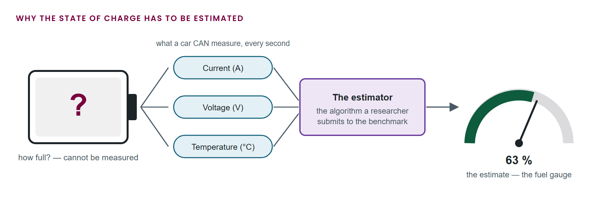

The consequences of estimation error are practical. An estimate that reads high exposes the driver to a battery that is emptier than indicated; one that reads low forces the manufacturer to reserve capacity as a safety margin, capacity the customer has paid for but can never use. Estimators are also notoriously sensitive to operating conditions: an approach that performs well at room temperature may drift severely at sub-zero temperatures, where the cell's internal resistance rises and the relationship between voltage and state of charge flattens. A substantial research literature is therefore devoted to improving estimation methods, ranging from Coulomb counting and Kalman filtering to recurrent and transformer neural networks. This benchmark exists to evaluate those methods on a common footing.

### 1.2 Drive-cycle data

A **drive cycle** is a standardised speed-versus-time profile representing a particular kind of driving. Regulatory bodies have used a small set of them for decades to certify fuel economy and emissions, which makes them well characterised and reproducible. Figure 1.2 shows the four standard cycles the benchmark uses, as published by the United States Environmental Protection Agency:

- **UDDS**, the Urban Dynamometer Driving Schedule, representing stop-and-go city driving.
- **HWFET**, the Highway Fuel Economy Test, representing steady highway driving.
- **LA92** and **US06**, more aggressive profiles with higher speeds, harder acceleration and harder braking.

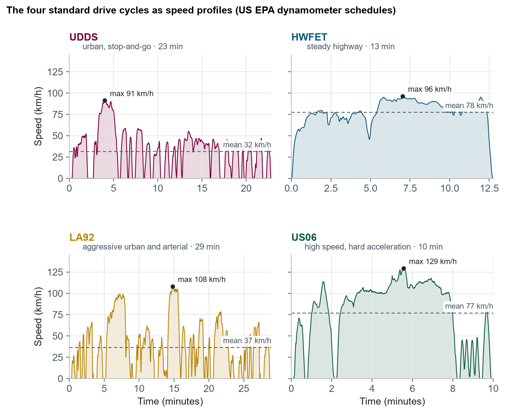

To these the laboratory added its own profiles. Eight **REORDERED** cycles were assembled by splicing randomly ordered segments of the four standard cycles into trips of several hours, so that a model cannot recognise a standard cycle by its shape. Two custom highway cycles, **HWCUST1** and **HWCUST2**, and two highway cycles with varying road grade, **HWGRADE1** and **HWGRADE2**, complete the set. One of each custom pair is published; the other is withheld.

A speed profile on its own says nothing about the battery. To turn it into a battery test, the laboratory used a vehicle model of a Tesla Model 3 standard-range car (50 kWh pack, 1612 kg curb mass) to compute, second by second, the current a single cell in that pack would deliver while following the profile: large discharge currents during acceleration, regenerative charging during braking, and no current at rest. Four cells were each assigned a different vehicle configuration, so that the same drive cycle produces four different current demands:

| Cell | Payload above curb mass | Cabin climate control | Represents |
|---|---|---|---|
| m80 | 80 kg | on | A single occupant |
| m448 | 448 kg | on | A full passenger load |
| m448N | 448 kg | off | A full passenger load, heating and cooling off |
| m1000 | 1000 kg | on | A full load with a trailer |

Figure 1.3 shows what the resulting recording looks like for one cell over one cycle.


### 1.3 How the data was produced

The dataset was produced in the McMaster Energy Storage Laboratory at the McMaster Automotive Resource Centre in Hamilton, Ontario, in 2021. The tests were carried out by Fauzia Khanum and Mina Naguib under the supervision of Dr. Phillip Kollmeyer, and the dataset and the evaluation methodology were published by Kollmeyer, Naguib, Khanum and Ali Emadi at the IEEE Transportation Electrification Conference in 2022. Version 2 of the dataset, with corrected and additional files, was released in July 2026.

The cells are four cylindrical 2170 lithium-ion cells of nickel cobalt aluminium (NCA) chemistry, manufactured by Panasonic for Tesla and taken from a Model 3 battery pack. Their nominal capacity is 4.5 Ah, and each measured approximately 4.7 Ah at the start of testing. Figure 1.4 summarises the equipment chain.

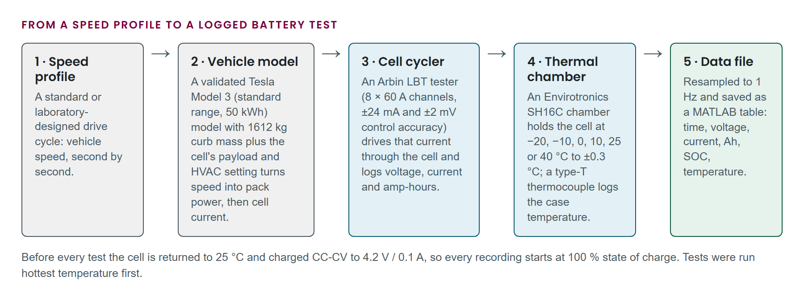

Two instruments did the work. An **Arbin LBT cell cycler** with eight 60 A channels applied the computed current to each cell (one cell per channel) and logged voltage, current and accumulated amp-hours; its stated control accuracy is ±24 mA on the 60 A range and ±2 mV on voltage, and it can log at up to 2000 samples per second. An **Envirotronics SH16C thermal chamber** held the cells at the test temperature to within ±0.3 °C, and a type-T thermocouple on each cell's case recorded its actual temperature. All recordings were resampled to one sample per second before publication.

The test campaign followed a fixed procedure for each cell:

1. Tests were run at 40, 25, 10, 0, −10 and −20 °C, in that order, hottest first.
2. Before every test, the cell was brought back to 25 °C and charged by the constant-current, constant-voltage method to 4.2 V with a 0.1 A cut-off, so that every recording begins from a fully charged cell.
3. At each temperature a set of **characterisation tests** was run first: a slow C/20 discharge at 40 °C to measure capacity, discharges at C/3, C/2 and 1C, a C/20 discharge-and-charge pair, and a hybrid pulse power characterisation (HPPC) test with discharge and charge pulses at every 5 to 10 % of state of charge. These are the tests from which equivalent-circuit and open-circuit-voltage models are parameterised.
4. The **drive cycles** followed: the four standard cycles, the eight REORDERED cycles and the four custom highway cycles, each driven from a full charge down to a cut-off determined from that temperature's HPPC test and a 60 kW vehicle power limit.

Between temperature rounds the cell rested while the chamber changed temperature. The whole campaign for one cell spans about eight months of instrument time, which is why the file names carry dates from April to December 2021.

### 1.4 The reference state of charge

Every score in the benchmark rests on the state-of-charge column in these files, so it matters how that column was obtained and how far it can be trusted. It is not a sensor reading; it is derived from two measured quantities under controlled conditions that a vehicle never enjoys.

The first quantity is the **charge removed**, which the cycler measures by integrating its own current (Coulomb counting) with an instrument whose current error is a few tens of milliamps and which is periodically re-zeroed at full charge. The second is the **capacity** of the cell, the total charge it holds. Capacity is not fixed: it depends on temperature, on the rate of discharge and on the cell's age. The laboratory therefore adopted one fixed definition, a C/20 discharge (a very gentle discharge lasting about twenty hours) performed at 40 °C, and measured it afresh at the start of every temperature round. Figure 1.5 shows one such measurement and how the reference declined over the campaign.


The state of charge in every file is then the fraction of that reference capacity still in the cell. With $I(\tau)$ the measured current in amperes (positive when charging) and $Q_{\mathrm{ref}}$ the reference capacity in ampere-hours,

$$
\mathrm{SOC}(t) = 1 - \frac{Q_{\mathrm{removed}}(t)}{Q_{\mathrm{ref}}}, \qquad Q_{\mathrm{removed}}(t) = -\frac{1}{3600}\int_{0}^{t} I(\tau)\,\mathrm{d}\tau \tag{1.1}
$$


Because the cell ages during a round, the reference capacity is not applied as a single number. It is interpolated linearly between the value measured at the start of the round, $Q^{(n)}$, and the value measured at the start of the next one, $Q^{(n+1)}$, across the twenty-three tests that make up a round:

$$
Q_{\mathrm{ref},k} = Q^{(n)} + \frac{k}{22}\left(Q^{(n+1)} - Q^{(n)}\right), \qquad k = 0, 1, \ldots, 22 \tag{1.2}
$$

For the 25 °C round of the m80 cell, for example, the reference runs from 4.530 Ah for the first test down to 4.453 Ah for the last. The final round at −20 °C has no successor, so its end value was extrapolated from the trend of the three preceding rounds.

This definition has three properties worth understanding. It is **traceable**: the raw amp-hour column is preserved in every file, so anyone can recompute the state of charge from a different capacity definition if their application calls for one. It is **consistent**: the same definition is applied to every cell, temperature and cycle, so an error of 2 % means the same thing everywhere. And it is **not something a vehicle can reproduce**: a car has no laboratory-grade current sensor, no twenty-hour capacity test and no rest periods, which is precisely why an estimator is needed, and why the benchmark's robustness tests (Chapter 5) deliberately corrupt the current signal and the starting point.

### 1.5 Why temperature matters

Figure 1.6 illustrates the single most important effect the dataset captures. The same cell was driven through the same REORDERED1 cycle at each of the six temperatures. At 40 °C the cell delivered 4.51 Ah before reaching the cut-off, close to its full reference capacity. At −20 °C it delivered 2.82 Ah, and the test ended with the reference state of charge still above 30 %, because the cold cell could no longer supply the vehicle's power demand.


The two panels show the two faces of the problem. The slope of each trace is the current draw, which the vehicle model held broadly similar across temperatures; the traces end early in the cold because the cell's internal resistance rises sharply, so the same power demand causes a larger voltage drop and the cut-off is reached sooner. An estimator must track state of charge correctly through this regime, where the relationship between terminal voltage and state of charge that many estimators rely on is at its weakest.

### 1.6 Estimation error

For every sample of every drive cycle the reference state of charge is known from the laboratory measurement described in Section 1.4. The model under test, given only current, voltage and temperature, produces its own estimate for the same sample. The difference between the two is the **estimation error**, and it is the sole quantity the benchmark measures. Every number on the leaderboard is an aggregate of it.


The error over a cycle is summarised by its **root-mean-square error** (**RMSE**). With $\widehat{\mathrm{SOC}}_k$ the model's estimate and $\mathrm{SOC}_k$ the reference at sample $k$ of a cycle of $N$ samples,

$$
\mathrm{RMSE} = \sqrt{\frac{1}{N}\sum_{k=1}^{N}\left(\widehat{\mathrm{SOC}}_k - \mathrm{SOC}_k\right)^{2}}, \qquad \mathrm{MAE} = \frac{1}{N}\sum_{k=1}^{N}\left|\widehat{\mathrm{SOC}}_k - \mathrm{SOC}_k\right| \tag{1.3}
$$

The mean absolute error (MAE) and the maximum absolute error are reported alongside it but do not enter the score. RMSE penalises large excursions more heavily than a mean absolute error would. A model that is consistently 2 % high scores an RMSE of 2 %; a model that is exact for most of a cycle but wrong by 20 % for a few minutes scores considerably worse. This weighting is deliberate, since in a vehicle a bounded, predictable error is far more useful than an occasional large one.

The conditions under which error occurs matter as much as its magnitude. A model that is accurate at 25 °C but drifts at −20 °C is of limited use in a cold climate, and a model that is accurate only when initialised with the exact starting state of charge is of limited use in a vehicle, which does not know it. The scoring methodology therefore does not simply average error over the dataset. It reports error separately by cell, temperature and cycle type, and it includes two deliberate perturbations: a wrong initial state of charge and a constant bias on the current measurement. Chapter 5 sets out the full methodology.

### 1.7 Open and withheld data

Publishing the entire dataset and inviting groups to report their own results would not produce comparable numbers. Each group would select its own test cycles and its own error definition, and a model trained on published data can memorise it and appear far better than it is. The benchmark addresses both problems with a held-out evaluation set.

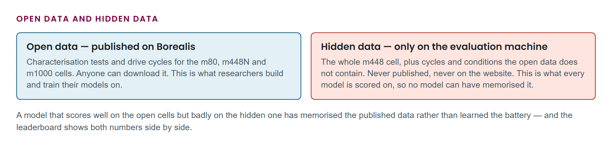

The **open dataset**, published on the Borealis research data repository under a Creative Commons Attribution licence, contains the m80, m448N and m1000 cells: every characterisation test, the eight REORDERED cycles and one of each custom highway pair at every temperature. Researchers develop and train on it without restriction. The **withheld dataset** (referred to in the code as the *blinded* data) contains the four standard cycles for every cell, the second cycle of each custom pair, the whole of the m448 cell, and the charging profiles. It has never been published and it never touches the web tier. Every submitted model is scored on the withheld data, and the leaderboard reports the withheld-cell error beside the open-cell error. A model that performs well on the open cells and poorly on the withheld one has fitted the published data rather than learned the underlying behaviour, and the comparison makes this visible.

### 1.8 What the benchmark provides

The benchmark provides a single, fixed evaluation: the same withheld data, the same evaluation code, the same error definition and the same published weights for every model. A researcher packages an estimator as a single Python or MATLAB function together with its parameter files, uploads the package, and receives within minutes a weighted score, a per-test breakdown, per-cycle traces and a PDF report. The score is placed on a public leaderboard where it is directly comparable with every other entry. The uploaded package is deleted as soon as it has been evaluated.

---

<a id="part-2"></a>
## 2. The platform in outline

> **In this chapter.** The five stages from open data to leaderboard, the three programs that implement them, the architectural rule that protects the withheld data, and where each component is hosted.

### 2.1 Five stages


The platform reduces to five stages, and its credibility rests on the separation between the first and the fourth:

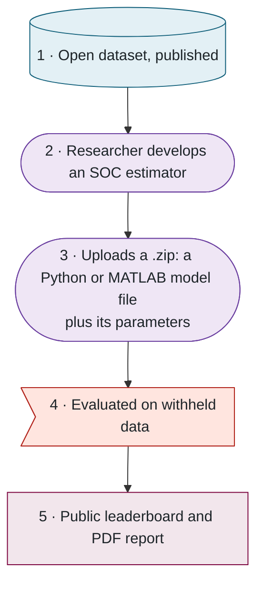
```mermaid
flowchart TB
    A[("1 · Open dataset, published")] --> B(["2 · Researcher develops an SOC estimator"])
    B --> C(["3 · Uploads a .zip: a Python or MATLAB model file<br/>plus its parameters"])
    C --> D>"4 · Evaluated on withheld data"]
    D --> E["5 · Public leaderboard and PDF report"]
    classDef data fill:#E3F0F5,stroke:#0D5D78,color:#1d2428
    classDef person fill:#EFE6F5,stroke:#6B3FA0,color:#1d2428
    classDef danger fill:#FFE5DF,stroke:#B3261E,color:#1d2428
    classDef web fill:#F2E6EC,stroke:#7A003C,color:#1d2428
    class A data
    class B,C person
    class D danger
    class E web
```

Figure 2.2. The five stages. Stage 1 is public and stage 4 is confidential; the benchmark's validity depends on keeping them apart.

### 2.2 Three programs and one rule

Behind the website are three separate programs, and the architecture follows from one rule:

> **The web tier never executes submitted code and never has access to the withheld data.**

The three programs divide the work as follows:

- **The website** serves pages and forms, records submissions, and shows results. It reads and writes the database and nothing else.
- **The worker** is a separate machine under the laboratory's control. It holds the withheld data, claims queued submissions and runs each evaluation.
- **The sandbox** is an isolated container the worker starts for every evaluation: no network access, a read-only filesystem, discarded when the run ends. It is the only place a submitted model is ever executed.

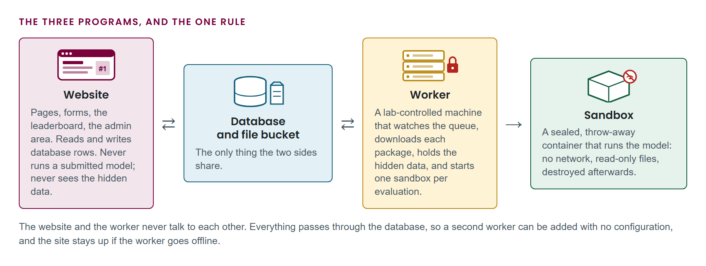

The website and the worker never communicate directly; all coordination passes through the database. Three consequences of this recur throughout the manual:

1. An additional worker can be added with no configuration, since it simply begins claiming jobs.
2. The website remains fully available when no worker is reachable, as it did during a ten-hour network outage in September 2026.
3. The job queue is an ordinary database table rather than a separate message-queue service.

### An analogy: the sealed examination

The arrangement is easier to remember as the way a university runs a written examination. Figure 2.4 draws the comparison.


- **The registrar's office is the website.** Candidates enrol, hand in a sealed script, and later read their mark on the noticeboard. The clerks never open a script and have never seen the answer key.
- **The filing room is the database.** The registrar drops each script in the IN tray; the examiner collects it from there and returns the mark to the DONE tray. The two never meet, so a second examiner can start work simply by collecting from the same tray.
- **The locked marking room is the worker.** It holds the only copy of the answer key. Nobody but the examiner enters, and the examiner never leaves with it.
- **The sealed exam booth is the sandbox.** The script is answered against the key one at a time, in a booth with no phone and no window, and is shredded the moment it has been marked. Nothing that happens in the booth can reach the outside, and nothing is kept.

A submitted model is the candidate. It is given the questions (the withheld drive cycles), writes its answers (the estimates), and is marked against the key (the reference state of charge). It never sees the key, and no copy of it survives the examination.

### 2.3 Where the components are hosted

Each program runs on a different service, chosen so that the platform costs nothing to host and so that the withheld data stays on a machine the laboratory controls. Figure 2.5 shows the four.

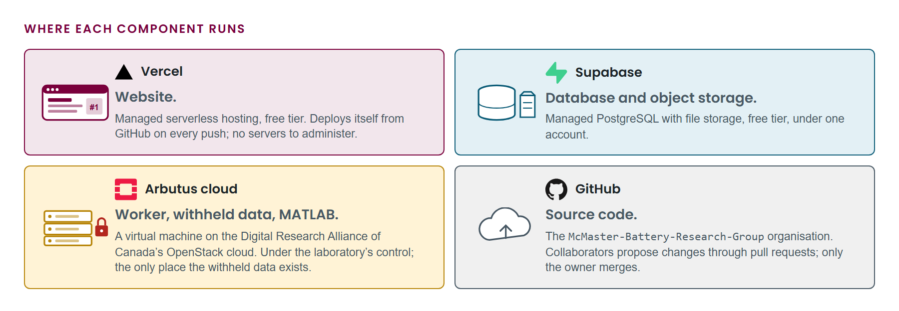

### 2.4 Visual conventions

Every diagram in this manual uses one icon, one colour and one shape for each kind of thing, so a component looks the same on every page. The pictures use the icons; the flow diagrams, which are drawn with a diagramming tool that cannot show icons, use the shapes and colours. Figure 2.6 is the key to both.

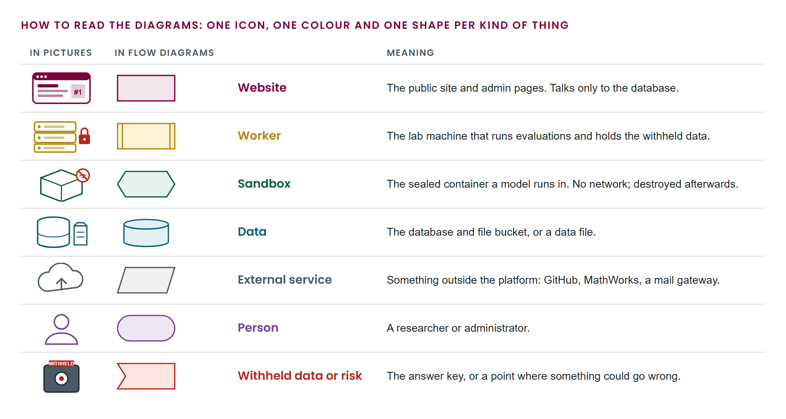

**Files to open:** [README.md](../../README.md) → [prisma/schema.prisma](../../prisma/schema.prisma) → [src/evaluator/worker.ts](../../src/evaluator/worker.ts).

---

<a id="part-3"></a>
## 3. Using the platform

> **In this chapter.** The workflow of a researcher, page by page: registering an account, validating a package before submission, submitting, interpreting the results, and locating the model on the leaderboard.

### 3.1 Registration

Registration is a four-step process:

1. The form asks for a name, an institutional affiliation, an e-mail address and a password.
2. A confirmation e-mail follows. Opening its link displays a page with a **Confirm** button.
3. Pressing that button verifies the account. Section 7.1 explains why the link alone is not sufficient.
4. The verified user signs in, and the session remains valid for fourteen days.

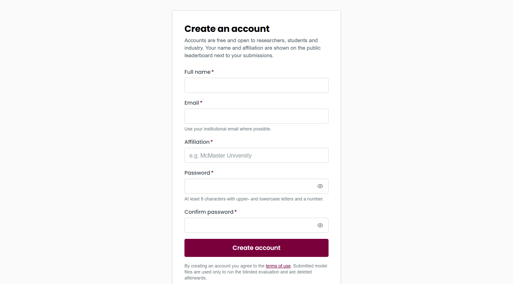

### 3.2 Validating a package before submission

Each account is limited to three submissions per day, so it is worth validating a package before spending one. The top of the submission page contains a **Test your package first** panel. Selecting a zip and pressing **Run test** executes the package through the real evaluator on one *public* drive cycle (cell m80, profile REORDERED1, 25 °C, two hours). The model's console output streams onto the page, and the error on that cycle is reported when it completes. A test run is not recorded anywhere public and does not involve the withheld data. Its purpose is to catch the defects that would otherwise waste a submission:

- a model file that is missing or incorrectly named,
- a parameter file the model attempts to load but the package does not contain,
- a model function that returns a value of the wrong shape or outside the interval 0 to 1.

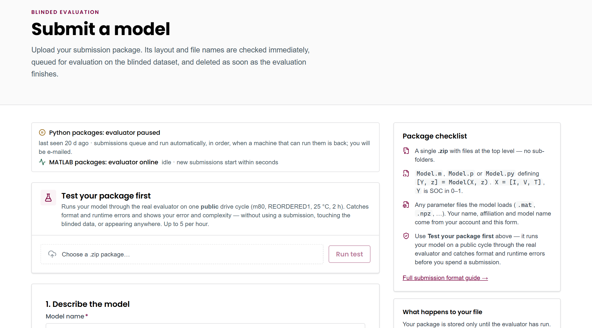

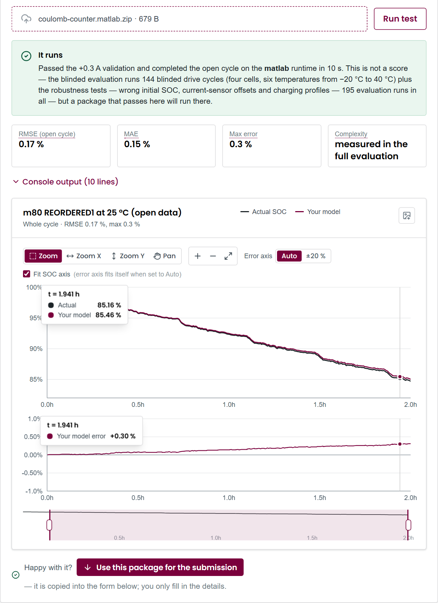

The package format is deliberately minimal:

- All files are placed at the top level of the archive, with no sub-directories.
- Exactly one file is the model: `Model.py` for Python, or `Model.m` or `Model.p` for MATLAB.
- Any parameter files the model loads (`.mat`, `.npz` and similar) are placed alongside it.

Section 5.1 specifies the model function's interface.

### 3.3 Submission

Below the test panel is the submission form. It collects:

- a model name and a short description,
- the model type (Coulomb counter, extended or unscented Kalman filter, feed-forward, LSTM or GRU network, transformer, physics-based, hybrid, or other),
- whether the model is to be private,
- an optional contest to enter,
- any co-authors.

The form is validated in the browser with the same rules the server applies, so an error is reported before the upload begins. Once a package has been submitted, the page shows its position in the queue, an estimated start time and whether a worker capable of running the package's language is currently online. When evaluation begins, the page switches to a live progress indicator and the model's console output.

### 3.4 Interpreting results

The results page is organised to present interpretation before detail. It opens with a plain-language reading of the scorecard, generated from the numbers themselves:

- which test case contributes most to the weighted score,
- whether accuracy on the withheld cell matches accuracy on the open cells, which indicates generalisation rather than memorisation,
- how accuracy varies with temperature,
- whether the model recovers from an incorrect initial state of charge,
- whether the model tolerates a biased current measurement.

Each statement can be verified against the scorecard immediately below it.

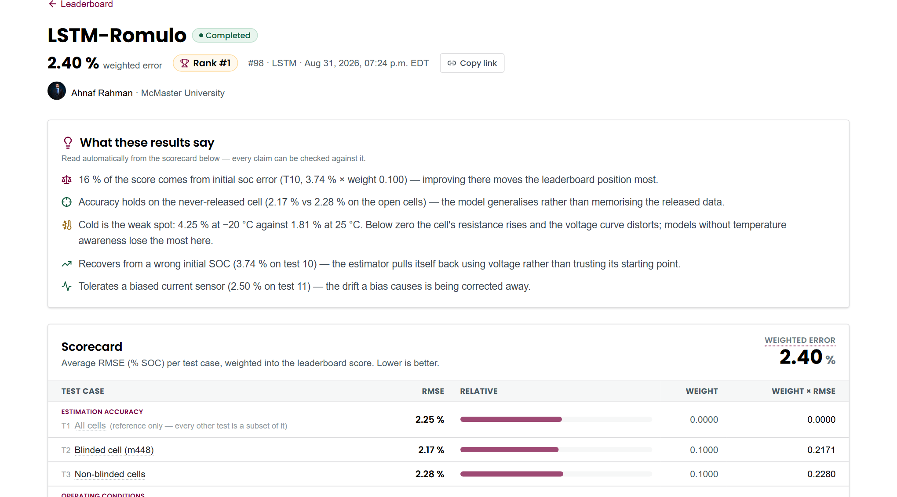

The scorecard lists the eighteen test cases with the RMSE, the weight and the product of the two. The products sum to the weighted error shown at the foot of the table, so the derivation of the score is fully visible. Below the scorecard are the key traces: the cycles that most differentiate estimators (the temperature extremes, the withheld cell and the robustness runs), each plotted against the measured state of charge with interactive zoom. The remaining material is available in collapsed sections:

- the per-cycle table covering all 144 cycles,
- the score history, recording every revision of the result,
- the downloads: the PDF report, the results as JSON, and the full-resolution traces.

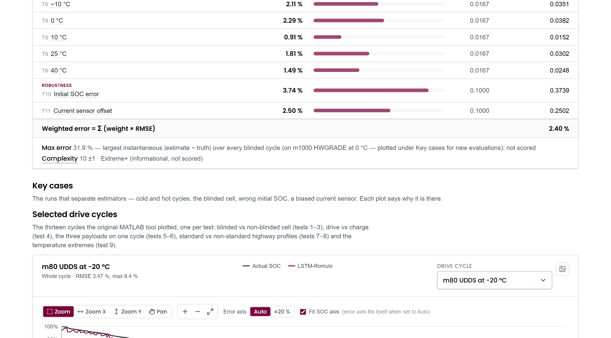

### 3.5 The leaderboard

The leaderboard ranks every public, completed model by weighted error in ascending order. Ties are broken by the all-cells error and then by submission time. The table offers:

- filters by author, affiliation and model type,
- additional columns, including the per-temperature and robustness cases, through the **Columns** control,
- export as CSV,
- a link from each model to its results page, and a **Compare** page that overlays two to four models on the same charts.

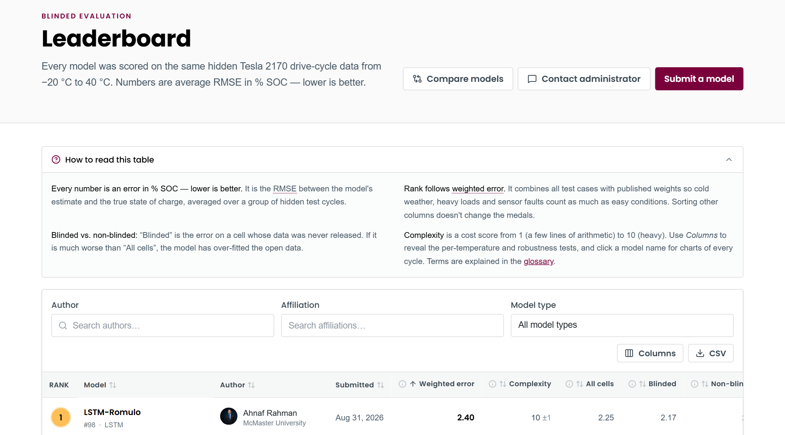

A signed-in user's private models are shown to that user with a dashed provisional rank, indicating the position the model would occupy, without displacing any public entry. Results produced by an earlier version of the scoring code remain listed but unranked, and their authors are invited to resubmit. Because packages are deleted after evaluation, a re-evaluation cannot be performed automatically.

### 3.6 Co-authors and contests

A co-author is invited by e-mail and must accept by pressing a button on the invitation page; only then is the co-author listed publicly and included in result notifications. A **contest** is a time-bounded event with its own leaderboard, frozen at the closing date. Contest entries must remain public, and their name and model type are fixed once the contest closes.

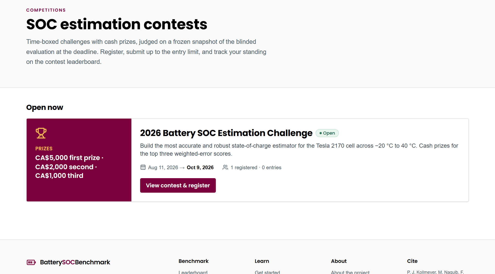

**Files to open:** [submit-form.tsx](../../src/app/(app)/submit/submit-form.tsx) → [dry-run-panel.tsx](../../src/app/(app)/submit/dry-run-panel.tsx) → [submissions/[id]/page.tsx](../../src/app/(app)/submissions/[id]/page.tsx) → [leaderboard-table.tsx](../../src/components/leaderboard/leaderboard-table.tsx).

---

<a id="part-4"></a>
## 4. The life of a submission

> **In this chapter.** The path of a package from the browser to the leaderboard: validation, queueing, atomic claiming by a worker, sandboxed execution, storage and reporting, and the handling of failure.

### 4.1 Overview

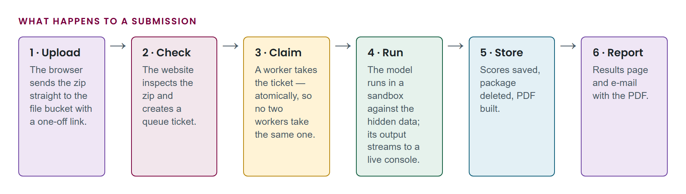

### 4.2 The stages in detail

**1. Upload.** The browser uploads the archive directly to object storage using a **signed URL**, a single-use address that authorises one upload and then expires. This bypasses the web host's 4.5 MB request limit, since packages may be up to 50 MB. The form that follows carries only the storage key of the uploaded object.

**2. Validation.** A single **server action** (a function executed on the web server in response to a form submission) performs every check, least expensive first:

- Is the user authenticated, and below the daily limit of three submissions?
- Are the model name and description well formed?
- Does the archive pass inspection? It is retrieved from storage and checked against the entry and size limits, for the absence of sub-directories and path-traversal sequences, and for exactly one model file at the top level.

Any failure deletes the upload and reports the precise reason. Success creates the `Submission` row and its `EvaluationJob` (the queue entry) in a single write, recording whether the package is Python or MATLAB.

**3. Queueing.** The submission page polls the server every 2.5 seconds and displays the queue position, an estimated start time and whether a worker for the package's language is online. All of this is derived from two tables: the job queue, and the workers' **heartbeats**, records each worker refreshes every fifteen seconds to report that it is alive and what it is doing.

**4. Claiming.** Workers poll the queue every two seconds. A job is claimed with a single conditional update, "lock this row only if it is still unlocked", so that two workers can never claim the same job:

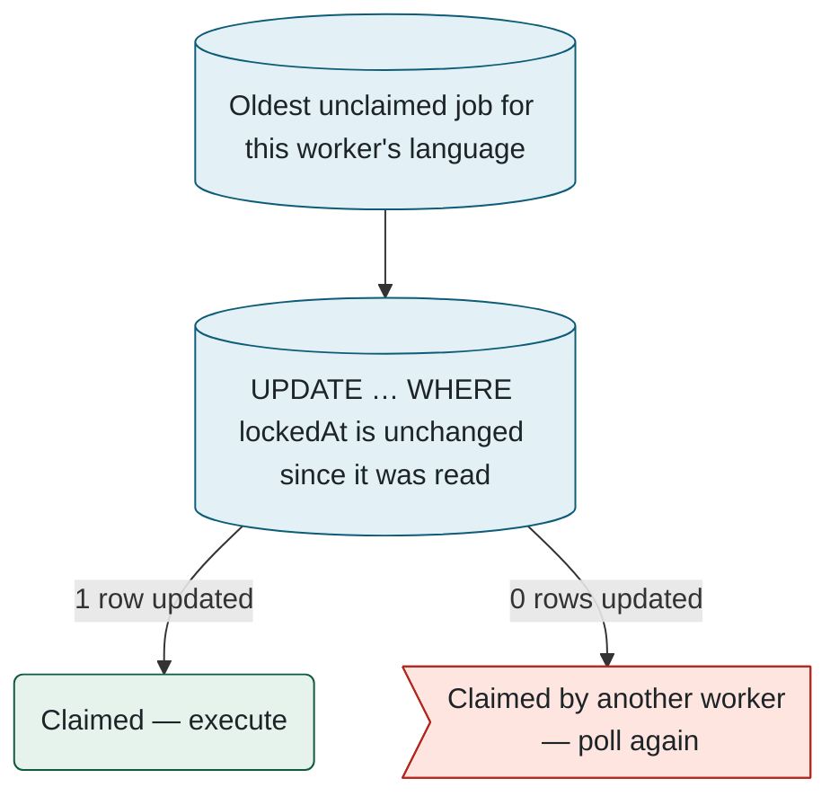
```mermaid
flowchart TB
    A[("Oldest unclaimed job for this worker's language")] --> B[("UPDATE … WHERE lockedAt is unchanged since it was read")]
    B -- "1 row updated" --> C("Claimed — execute")
    B -- "0 rows updated" --> D>"Claimed by another worker — poll again"]
    classDef data fill:#E3F0F5,stroke:#0D5D78,color:#1d2428
    classDef good fill:#E6F2EC,stroke:#0E5B3D,color:#1d2428
    classDef danger fill:#FFE5DF,stroke:#B3261E,color:#1d2428
    class A,B data
    class C good
    class D danger
```

Figure 4.2. Claiming a job by compare-and-swap. One attempt has exactly two outcomes.

Every progress line the model emits refreshes the lock, so an active job is never mistaken for an abandoned one. A job whose worker has died becomes claimable again after thirty minutes without progress, and each job is allowed two attempts in total.

**5. Execution.** The worker starts one Docker container (Docker is the runtime that creates containers) with exactly three directories mounted:

- the package, read-only,
- the withheld data, read-only,
- an output directory for the results.

Everything the container writes to its console is streamed into the job log, which the website presents as the live console. A timeout (six hours by default) and the owner's **Cancel** control both terminate the container and any MATLAB process within it.

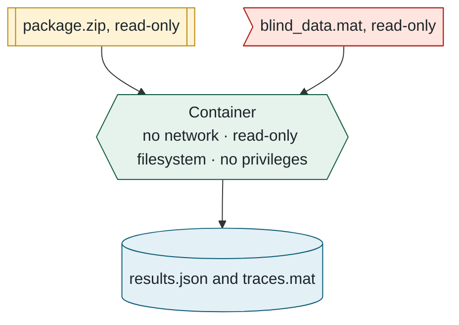
```mermaid
flowchart TB
    P[["package.zip, read-only"]] --> C
    H>"blind_data.mat, read-only"] --> C{{"Container<br/>no network · read-only filesystem · no privileges"}}
    C --> O[("results.json and traces.mat")]
    classDef worker fill:#FFF3D6,stroke:#B8860B,color:#1d2428
    classDef danger fill:#FFE5DF,stroke:#B3261E,color:#1d2428
    classDef sandbox fill:#E6F2EC,stroke:#0E5B3D,color:#1d2428
    classDef data fill:#E3F0F5,stroke:#0D5D78,color:#1d2428
    class P worker
    class H danger
    class C sandbox
    class O data
```

Figure 4.3. The sandbox's inputs and outputs. Chapter 7 covers the restrictions placed on the container.

**6. Storage and reporting.** When the container exits, the worker proceeds through a fixed sequence:

1. Verify that all eighteen metrics are finite, and recompute the weighted score from the active weights as a cross-check.
2. Write the result and mark the submission complete within one **transaction** (a group of database writes that either all succeed or all fail).
3. Upload the full-resolution traces and append an entry to the submission's score history.
4. **Delete the package** from storage.
5. Generate the PDF report and e-mail it to the owner and any confirmed co-authors.

### 4.3 Timing

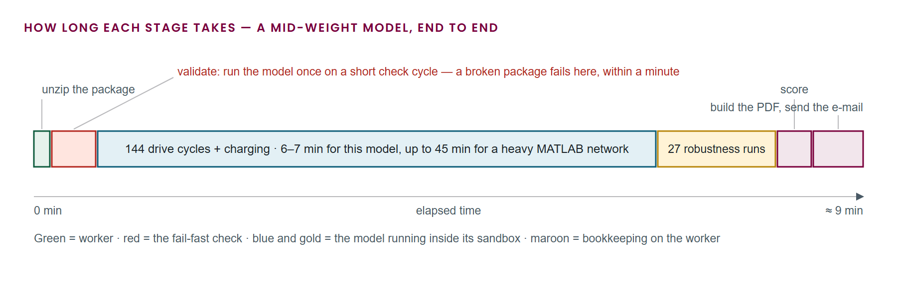

### 4.4 States and transitions

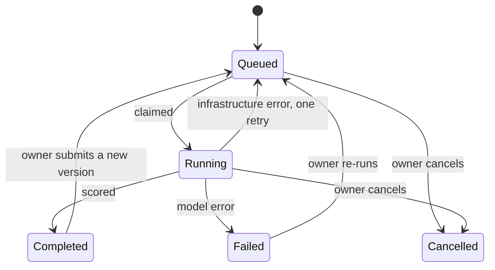
```mermaid
stateDiagram-v2
    [*] --> Queued
    Queued --> Running : claimed
    Running --> Completed : scored
    Running --> Failed : model error
    Running --> Queued : infrastructure error, one retry
    Queued --> Cancelled : owner cancels
    Running --> Cancelled : owner cancels
    Failed --> Queued : owner re-runs
    Completed --> Queued : owner submits a new version
```

Figure 4.5. Every state a submission can occupy, and the events that move it between them.

A failure attributable to the package (an exception, an invalid return value, or a timeout) is final, and the error message is stored verbatim for the author. A failure attributable to the infrastructure (the container runtime unavailable, or a defect in the worker) is retried once. Stopping a worker returns its current job to the queue without consuming an attempt.

**Files to open:** [submit/actions.ts](../../src/app/(app)/submit/actions.ts) → [package-check.ts](../../src/lib/package-check.ts) → [run-job.ts](../../src/evaluator/run-job.ts) → [python-evaluator.ts](../../src/evaluator/python-evaluator.ts).

---

<a id="part-5"></a>
## 5. Scoring methodology

> **In this chapter.** The model interface, the composition of the evaluation set, the aggregation of per-cycle errors into eighteen test cases and one weighted score, and the two auxiliary quantities reported alongside it.

The evaluator is approximately 800 lines of Python. It reimplements the laboratory's original MATLAB blind-modelling tool and reproduces its results to three decimal places on the reference models.

### 5.1 The model interface

A model is a single function invoked once per sample, in the same manner as an estimator running on a vehicle's battery controller. At each call it receives the current, voltage and temperature for that sample together with whatever state it returned from the previous call, and it returns its estimate and the state to carry forward. It has no access to future samples. The simplest admissible model is a Coulomb counter, which integrates the measured current over the rated capacity $Q$ (here 4.6 Ah) at the one-second sample interval $\Delta t$:

$$
\widehat{\mathrm{SOC}}_k = \widehat{\mathrm{SOC}}_{k-1} + \frac{I_k\,\Delta t}{3600\,Q}, \qquad \widehat{\mathrm{SOC}}_0 = 1 \tag{5.1}
$$

In code it is four lines:

```python
def Model(X, z=None):          # X = [current, voltage, temperature]
    current = float(X[0])
    soc = 1.0 if z is None else float(z) + current / 3600 / 4.6
    return soc, soc            # (estimate in 0..1, state for the next call)
```

The two supported languages are executed differently but scored identically:

- **Python** models are imported and iterated in-process.
- **MATLAB** models are executed through a single `matlab -batch` session running a forty-line driver script whose only function is the same iteration.

Both paths produce identical scores, verified against the four reference models.

### 5.2 The evaluation set

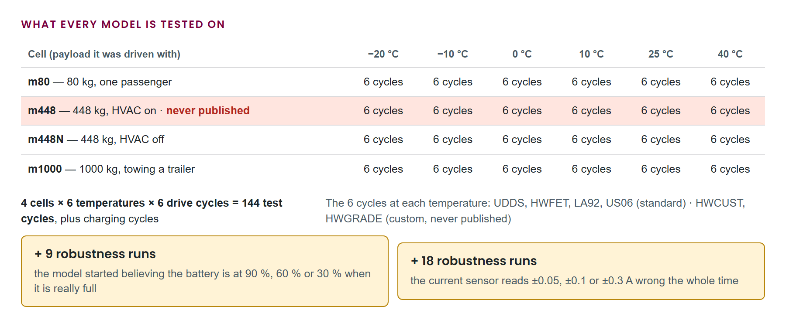

Before each cycle, one hour of its first sample is prepended as **padding**, so that filters and recurrent networks (models that carry state from one sample to the next) reach steady state before the scored portion begins; the padding is excluded from all metrics. A short **validation run** on one cycle precedes the full evaluation, so that a defective model fails within seconds rather than after forty-five minutes. In total an evaluation comprises 195 runs: the 144 drive cycles, the charging profiles, and 27 robustness runs.

### 5.3 From per-cycle errors to one score

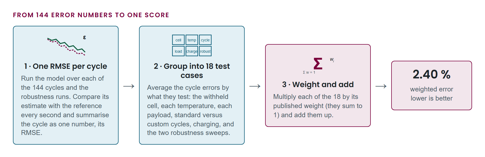

The leaderboard score is the weighted sum of the eighteen test-case errors, where $\mathrm{RMSE}_i$ is the mean RMSE of the cycles in test case $i$ and $w_i$ its published weight:

$$
E = \sum_{i=1}^{18} w_i\,\mathrm{RMSE}_i, \qquad \sum_{i=1}^{18} w_i = 1 \tag{5.2}
$$

The weights are fixed and published:

- Seven categories carry a weight of 0.1 each: the withheld cell, the open cells, charging, standard cycles, non-standard cycles, the initial-SOC perturbation and the current-offset perturbation.
- The four payload conditions together carry 0.2.
- The six temperatures together carry 0.1.
- The all-cells case is reported on every scorecard but carries a weight of zero, since every other case is a subset of it and a non-zero weight would count each cycle twice.

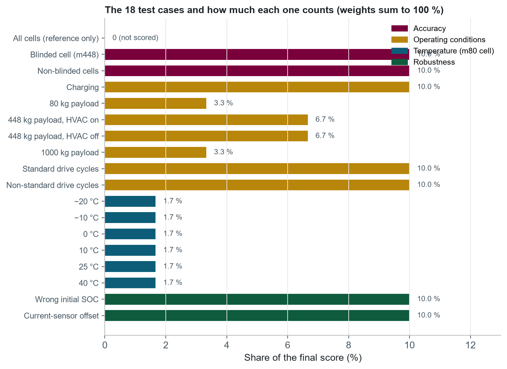

### 5.4 Auxiliary quantities

**Complexity** is reported on a scale from 1 to 10 and addresses the question of whether a model could run on an embedded battery controller. It is the model's execution time per sample relative to a Coulomb counter measured on the same machine in the same language. It is displayed on the leaderboard but has no effect on ranking.

A **suspicious** flag is raised when the mean error exceeds 25 %. The original tool suppressed such results; this implementation records them for review by an administrator.

### 5.5 Outputs

Four artefacts leave the sandbox and are written to the database and object storage:

- the eighteen metrics and the weighted score,
- one record per cycle with its RMSE, mean absolute error and maximum error,
- down-sampled traces of thirteen representative cycles, the robustness runs and the model's worst cycle, down-sampled by a method that preserves every extremum so that the plotted trace always agrees with the reported maximum error,
- a 6 MB `.mat` file containing every run at full resolution.

**Files to open:** [pipeline.py](../../evaluator/python/socbench_eval/pipeline.py) (`score`, `complexity`) → [runner.py](../../evaluator/python/socbench_eval/runner.py) → [Run_Model.m](../../matlab/Run_Model.m) → [test-cases.ts](../../src/lib/test-cases.ts).

---

<a id="part-6"></a>
## 6. The data model

> **In this chapter.** The tables on which every other component operates, the two conventions that keep them consistent, and the single schema file that defines them.

Every operation described in Chapters 4 and 5 reads or writes rows in this database. A user owns submissions. Each submission has exactly one queue entry, at most one current result, and an append-only history of every change made to it. Further tables hold contests, worker heartbeats, evaluation settings and the administrative activity log. One file, the Prisma schema, defines all of them, and both the website and the worker are generated from it.


```mermaid
erDiagram
    USER ||--o{ SUBMISSION : owns
    SUBMISSION ||--|| JOB : "queue entry"
    SUBMISSION ||--o| RESULT : "current scores"
    SUBMISSION ||--o{ HISTORY : "every change"
    SUBMISSION }o--o{ USER : "co-authors"
    CONTEST ||--o{ SUBMISSION : contains
```

Figure 6.1. The core tables. Each line reads as "has": a user has many submissions; a submission has exactly one job and at most one result.

Two conventions apply throughout:

- **Cascading deletion.** Deleting a user removes that user's submissions, jobs, results and history, so no orphaned rows can exist.
- **Append-only history.** Score revisions, weight changes and administrative events are never modified after they are written, so any past state can be reconstructed.

Several tables stand outside the diagram:

- `WorkerHeartbeat`: one row per worker, refreshed every fifteen seconds with its load, supported languages and most recent console lines.
- `EvalSettings`: a single row of timeouts and the daily submission limit, editable by administrators.
- `ScoringConfig`: weight overrides; the most recent row is authoritative.
- `AdminEvent`: the administrative activity log.
- `RateLimitHit`: counters supporting the rate limits of Chapter 7.
- `ContactMessage`: messages received through the contact form.

Column-level detail is given in the appendix.

**Files to open:** [prisma/schema.prisma](../../prisma/schema.prisma). A single top-to-bottom reading is the most efficient introduction to the system.

---

<a id="part-7"></a>
## 7. Accounts and security

> **In this chapter.** Authentication and session handling, the reason e-mail verification requires an explicit action, and the layered controls that contain a hostile submission.

### 7.1 Why verification requires a button

Corporate mail-security gateways follow every link in an incoming message before the recipient opens it. When the verification link itself performed the verification, these gateways consumed the single-use token and the recipient found it already invalid. The current design separates the two steps:

1. The link in the e-mail leads to a page and changes nothing.
2. The account is verified only when the person presses the **Confirm** button on that page.

In Figure 7.1 the gateway's visit is the third message; the account's state does not change until the person acts.

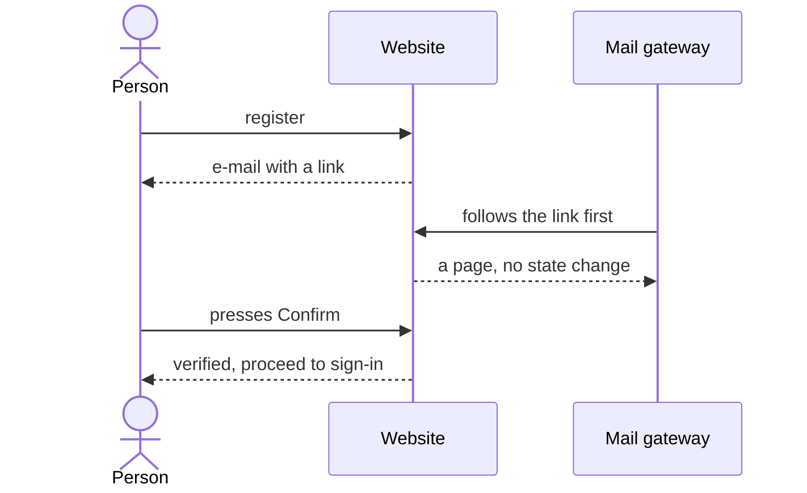
```mermaid
sequenceDiagram
    actor P as Person
    participant W as Website
    participant M as Mail gateway
    P->>W: register
    W-->>P: e-mail with a link
    M->>W: follows the link first
    W-->>M: a page, no state change
    P->>W: presses Confirm
    W-->>P: verified, proceed to sign-in
```

Figure 7.1. Verification is robust to mail gateways because following the link has no side effect.

### 7.2 Authentication and sessions

Sign-in follows four rules:

1. **Attempt limits.** An account may attempt sign-in ten times per fifteen minutes, and a network address forty times, after which further attempts are refused for the remainder of the window.
2. **Password storage.** Passwords are stored as **bcrypt** hashes, a deliberately slow one-way function: a single verification is imperceptible, but an exhaustive guessing attack is impractical.
3. **Sessions.** A successful sign-in issues a signed **session token** held in a browser cookie and valid for fourteen days. Requests are authenticated by verifying the signature, without a database lookup.
4. **Authorisation.** Routes under `/submit`, `/profile` and `/admin` redirect unauthenticated visitors before rendering, but this is a convenience only. The authoritative check is repeated inside every server action.

### 7.3 Containing a hostile submission

Secrets are held in exactly three locations: Vercel's environment configuration, a file on the virtual machine readable only by the worker's service account, and a GitHub repository secret. They appear in no repository file, container image, log or e-mail. The remaining threats, and the control that addresses each, are set out in the table below.

| Threat | Control |
|---|---|
| The model exfiltrates the withheld data | The container has read access (it must) but no network interface, and is destroyed after the run |
| The model attacks the host | Read-only filesystem, no capabilities, CPU and memory limits, execution as an unprivileged user |
| The model reads the worker's secrets | The container does not inherit the worker's environment; MATLAB receives only a 24-hour licence token |
| A decompression bomb or a path-traversal entry | Limits on entry count, unpacked size and compression ratio; no sub-directories; no `..` components; checked in the web tier and again in the evaluator |
| The model never terminates | A timeout enforced both inside and outside the container |
| Queue flooding | Three submissions per day and five test runs per hour per account |
| Password guessing | bcrypt hashing and the attempt limits above |
| Account enumeration | Password-reset and resend-verification requests respond identically whether or not the address exists |
| A compromised administrator removes the others | Administrators cannot be deleted until demoted, and no user can change their own role |

**Files to open:** [auth.ts](../../src/lib/auth.ts) → [middleware.ts](../../src/middleware.ts) → [(auth)/actions.ts](../../src/app/(auth)/actions.ts) → [rate-limit.ts](../../src/lib/rate-limit.ts) → [python-evaluator.ts](../../src/evaluator/python-evaluator.ts).

---

<a id="part-8"></a>
## 8. Administration and monitoring

> **In this chapter.** The administrative interface, the procedure for revising scoring weights without re-evaluating any model, the notification model, and the automated check that detects an unreachable worker.

### 8.1 The administrative pages


The left-hand navigation enumerates the interface:

- **Overview**: summary counts, recent submissions and the activity log.
- **Submissions**: moderation, retry and bulk deletion.
- **Users**: verification, role assignment and deletion.
- **Contests**: creation and closure.
- **Messages**: the contact-form inbox.
- **Evaluation workers**: every registered machine, the queue, and the evaluation limits.
- **Scoring weights**: the subject of Section 8.2.
- **My notifications**: each administrator's own e-mail preferences.

Every administrative action re-verifies the caller's role before proceeding, and each is subject to a safeguard. The safeguards are tabulated in the appendix.


### 8.2 Revising the weights

An administrator edits the eighteen weights, which must sum to one, previews how many stored scores would change, and saves with a written justification. Every stored result is then re-scored from its persisted per-test metrics; no model is re-executed, since the metrics were retained and the packages were deleted. Authors may optionally be notified of the previous and revised scores with a regenerated PDF. The superseded weights remain in the history.


### 8.3 Notifications

Every administrative event follows two paths, one unconditional and one configurable:

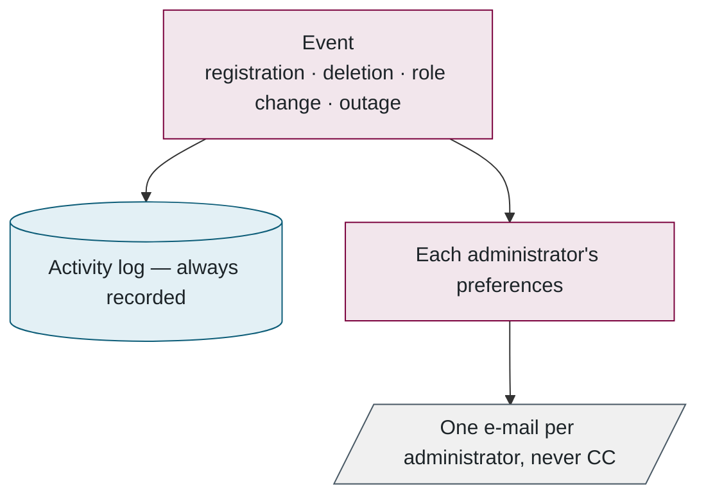
```mermaid
flowchart TB
    E["Event<br/>registration · deletion · role change · outage"] --> F[("Activity log — always recorded")]
    E --> T["Each administrator's preferences"]
    T --> M[/"One e-mail per administrator, never CC"/]
    classDef web fill:#F2E6EC,stroke:#7A003C,color:#1d2428
    classDef data fill:#E3F0F5,stroke:#0D5D78,color:#1d2428
    classDef ext fill:#F0F0F0,stroke:#495965,color:#1d2428
    class E,T web
    class F data
    class M ext
```

Figure 8.4. The activity log is the record; e-mail is a copy that each administrator enables per category.

One property of the hosting platform deserves emphasis, because it was discovered in production:

- A serverless request is frozen the instant a response is returned.
- Any e-mail dispatched asynchronously without being awaited is therefore silently lost.
- Every such dispatch is wrapped in `after()`, which keeps the request alive until the send completes.

### 8.4 The outage monitor

The monitor was introduced after an incident in which the worker remained healthy but was unable to reach the database for ten hours, with no indication to anyone. The web tier is the one component that can always observe both the database and the mail service, so it performs the check. A GitHub Actions workflow calls a health endpoint every ten minutes; the endpoint evaluates two conditions and sends an e-mail only when the answer changes.

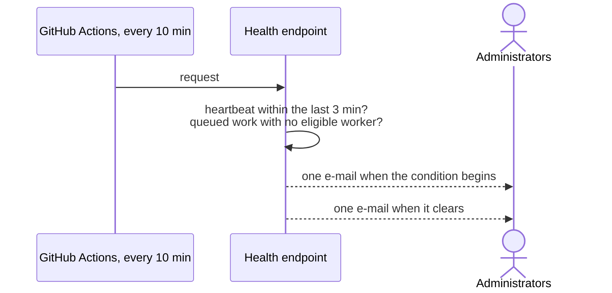
```mermaid
sequenceDiagram
    participant G as GitHub Actions, every 10 min
    participant W as Health endpoint
    actor A as Administrators
    G->>W: request
    W->>W: heartbeat within the last 3 min?<br/>queued work with no eligible worker?
    W-->>A: one e-mail when the condition begins
    W-->>A: one e-mail when it clears
```

Figure 8.5. One alert per outage and one all-clear. The state is recorded in the activity log, so it is also visible on the site.

**Files to open:** [admin/actions.ts](../../src/app/(admin)/admin/actions.ts) → [admin-notify.ts](../../src/lib/admin-notify.ts) → [worker-health/route.ts](../../src/app/api/ops/worker-health/route.ts).

---

<a id="part-9"></a>
## 9. Infrastructure

> **In this chapter.** Where the software is deployed, how the website and the worker update themselves, how MATLAB is licensed inside a container, and how the system is run on a development machine.

### 9.1 The deployed services

The two deployed programs update themselves in different ways:

- **The website** deploys automatically on every push to the repository.
- **The worker** is a Linux virtual machine in the Alliance research cloud. It pulls the repository every ten minutes, restarts only when idle, and runs MATLAB inside a container licensed through the laboratory's MathWorks account.

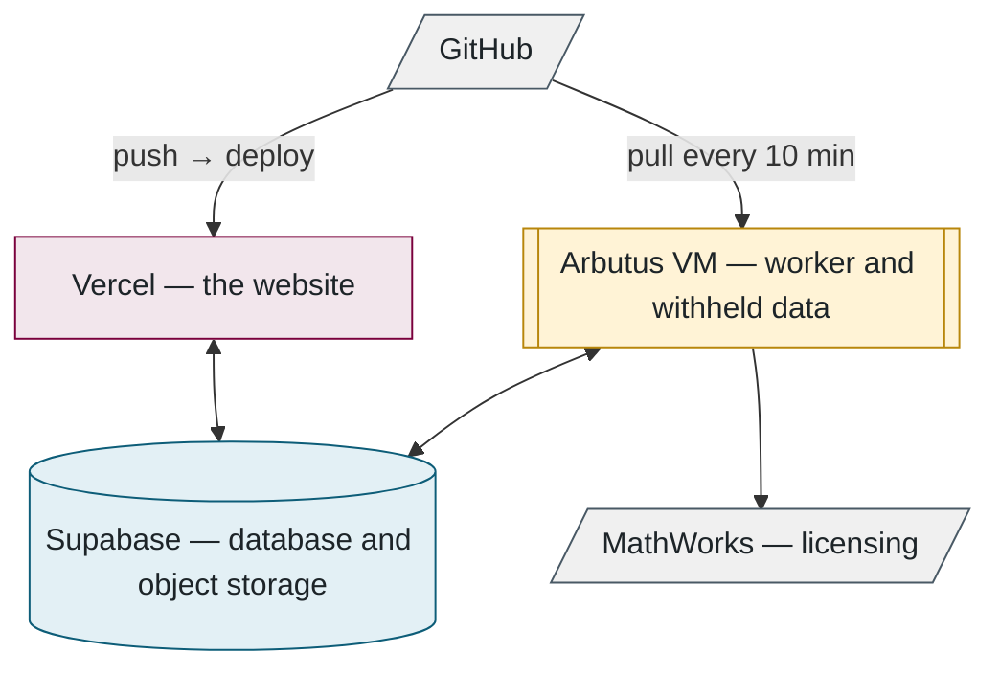
```mermaid
flowchart TB
    G[/"GitHub"/] -- "push → deploy" --> V["Vercel — the website"]
    G -- "pull every 10 min" --> M[["Arbutus VM — worker and withheld data"]]
    V <--> S[("Supabase — database and object storage")]
    M <--> S
    M --> L[/"MathWorks — licensing"/]
    classDef ext fill:#F0F0F0,stroke:#495965,color:#1d2428
    classDef web fill:#F2E6EC,stroke:#7A003C,color:#1d2428
    classDef worker fill:#FFF3D6,stroke:#B8860B,color:#1d2428
    classDef data fill:#E3F0F5,stroke:#0D5D78,color:#1d2428
    class G,L ext
    class V web
    class M worker
    class S data
```

Figure 9.1. The three programs of Chapter 2 in their hosting context.

### 9.2 The virtual machine

A single provisioning script prepares the machine. It installs and configures:

- Docker, which provides the sandboxes;
- Node.js, the runtime for the worker;
- a service account with no interactive login, whose sole purpose is to run the worker;
- a checkout of the repository using a deploy key with read-only access;
- a hardened systemd service that keeps the worker running;
- a firewall that admits SSH and nothing else.

Secrets and the withheld data are placed manually after provisioning. They are owned by the service account and readable by no other user.

**Self-update** runs every ten minutes:

1. Fetch the repository.
2. If anything changed, rebuild only the affected components: dependencies, the database client, or the sandbox images.
3. Restart the worker, but only if no evaluation is in progress; otherwise defer to the next interval.

### 9.3 MATLAB in a container

MATLAB runs inside MathWorks' own container image and is licensed through the laboratory's MathWorks account rather than a licence server. A one-time interactive sign-in produced an identity token valid for one year, which is stored on the virtual machine. Before each evaluation the worker exchanges it for a 24-hour access token, and only that short-lived token is passed into the container, as Figure 9.2 shows:

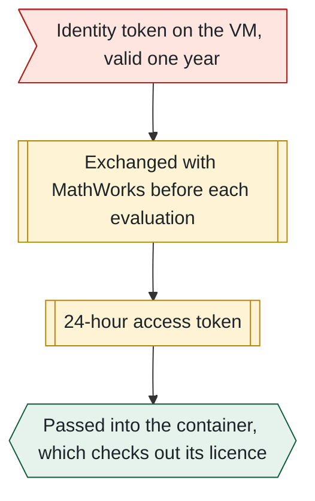
```mermaid
flowchart TB
    T>"Identity token on the VM, valid one year"] --> X[["Exchanged with MathWorks before each evaluation"]]
    X --> D[["24-hour access token"]]
    D --> C{{"Passed into the container, which checks out its licence"}}
    classDef danger fill:#FFE5DF,stroke:#B3261E,color:#1d2428
    classDef worker fill:#FFF3D6,stroke:#B8860B,color:#1d2428
    classDef sandbox fill:#E6F2EC,stroke:#0E5B3D,color:#1d2428
    class T danger
    class X,D worker
    class C sandbox
```

Figure 9.2. The licensing chain. The long-lived credential never enters the sandbox.

### 9.4 Continuous integration

A push that modifies the web tier triggers a browser test pass over the principal pages using Playwright, and the push is refused if any page fails to render. On success the site deploys automatically, and the virtual machine adopts the change within ten minutes.

### 9.5 Running the system locally

The same code runs on a development machine with different configuration. There is no simulated evaluator: a developer's worker runs the real evaluation pipeline, which requires the withheld data and the sandbox image. The repository README lists the five commands required, and the configuration differs from production in four respects:

- a local PostgreSQL instance in Docker,
- uploaded files stored on the local disk,
- e-mail delivered to a test inbox rather than to real addresses,
- a **seed** script that populates the empty database with one administrator account and one test user, and nothing else.

**Files to open:** [provision-arbutus-worker.sh](../../scripts/provision-arbutus-worker.sh) → [vm-update.sh](../../scripts/vm-update.sh) → [Dockerfile.matlab](../../evaluator/Dockerfile.matlab) → [.env.example](../../.env.example).

---

<a id="part-10"></a>
## 10. Maintenance reference

The most common maintenance tasks and where each is performed. Anything not listed can be located from the *Files to open* entries of the preceding chapters.

| Task | Procedure |
|---|---|
| Change a timeout or the daily submission limit | Admin → Evaluation workers. No deployment; effective within 15 s |
| Revise the scoring weights | Admin → Scoring weights: edit, preview, save with a justification, optionally notify authors |
| Change the scoring *computation* | Edit `pipeline.py`; re-run the reference models and confirm that only the intended scores changed; increment the benchmark version in `socbench_eval/__init__.py` and `benchmark-version.ts`; existing results become "legacy" and their authors are invited to resubmit |
| Add a metric | Add a column in `schema.prisma`, an entry in `test-cases.ts`, and its computation in `score()`; the scorecard, PDF and CSV pick it up; confirm the weights still sum to 1 |
| Add a worker machine | Provide the withheld data and `worker.env`, then `npm run worker`; the machine registers itself and begins claiming jobs |
| Rotate a secret | Rotate at the source, update Vercel and `/etc/socbench/worker.env`, restart the worker |
| Renew the MATLAB licence (annually) | The Workers page shows the expiry; repeat the interactive sign-in and `matlab-mhlm-setup.sh` |
| Grant administrator rights | Admin → Users → Make admin, or add the address to `ADMIN_EMAILS`; effective on the user's next request |

---

<a id="part-11"></a>
## 11. A ten-minute demonstration

1. **Leaderboard.** Rank, weighted error and complexity. Note that every figure is an error and that lower is better.
2. **One result.** The generated interpretation, the scorecard summing to the score, the worst-case trace, and the PDF report.
3. **Submission.** Run a test on the reference package (seconds), then submit it; observe the queue position and the progress indicator.
4. **Admin → Evaluation workers.** The machine that claimed the job: languages, load, console and licence expiry.
5. **Source, in this order.** `schema.prisma` → `claimJob` in `run-job.ts` → the `docker run` invocation in `python-evaluator.ts` → `score()` in `pipeline.py` → `Run_Model.m`.
6. **Conclude with the rule.** The web tier never executes submitted code and never has access to the withheld data.

---

<a id="part-12"></a>
## 12. Glossary

### Battery terms

| Term | Meaning |
|---|---|
| **SOC, state of charge** | The fraction of usable capacity remaining, 0–100 %. It cannot be measured directly and is estimated from current, voltage and temperature. |
| **BMS** | Battery management system: the vehicle electronics that execute the estimator, one sample at a time. |
| **Cell** | One physical battery. Four Tesla 2170 cells are used, named for the simulated vehicle payload with which they were cycled: `m80`, `m448`, `m448N`, `m1000`. `m448` is withheld in its entirety. |
| **Drive cycle** | A standard speed profile converted to the current a cell delivers. UDDS (urban), HWFET (highway), LA92 and US06 (aggressive), HWCUST and HWGRADE (laboratory-designed, unpublished). |
| **Open / withheld data** | Open data is published for model development; withheld (blinded) data is reserved for scoring. `blind_data.mat` is the reference. |
| **Coulomb counting** | Integration of current over time: the simplest estimator, and the reference for the complexity scale. |
| **EKF / UKF** | Extended and unscented Kalman filters: model-based estimators that fuse a cell model with measurements. |
| **FNN / LSTM / GRU / Transformer** | Neural-network estimator architectures. |
| **RMSE / MAE / maximum error** | Root-mean-square, mean-absolute and worst single-sample error, in percentage points of SOC. |
| **Test case** | One of the eighteen scoring categories, each with a published weight. |
| **Weighted error** | The leaderboard score: the sum over test cases of weight × RMSE. |
| **Robustness run** | A run with a deliberately incorrect initial SOC, or with a constant offset added to the current. |
| **Padding** | One hour of the first sample prepended to each cycle so that stateful models reach steady state. |
| **Complexity** | Execution time per sample relative to a Coulomb counter, binned 1–10. Informational only. |
| **Test run (dry run)** | An evaluation on open data from the submission page; not recorded on the leaderboard. |
| **Package** | The uploaded archive: `Model.py` or `Model.m`/`Model.p` together with parameter files. |

### Software terms

| Term | Meaning |
|---|---|
| **Repository / git / GitHub** | The source code with its full change history, hosted on GitHub. |
| **Serverless** | A hosting model in which a short-lived server instance handles each request and is suspended once it responds. |
| **Container / Docker / image** | An isolated execution environment; the runtime that creates it; the template from which it is created. |
| **Sandbox** | A container with the network disabled, a read-only filesystem and no privileges. |
| **Database / table / row** | PostgreSQL stores all persistent state as tables of rows. |
| **Prisma** | The typed database client; one schema file defines every table. |
| **Server Component / Server Action** | A page rendered on the server from the database; a form handler executed on the server. There is no separate API layer. |
| **Signed URL** | A pre-authorised, time-limited address that permits a browser to upload directly to object storage. |
| **Session token / JWT / cookie** | A signed token held by the browser after sign-in, proving identity on each request. |
| **bcrypt** | A deliberately slow one-way hash function for passwords. |
| **Rate limit** | A cap on the number of attempts within a time window. |
| **Queue / job / worker / heartbeat** | Pending work; one unit of it; the process that performs it; the process's periodic liveness record. |
| **Compare-and-swap** | An update applied only if the row is unchanged since it was read; the mechanism by which two workers never claim the same job. |
| **Environment variable / `.env`** | Configuration and secrets supplied to a program from outside its code. |
| **VM / Arbutus / systemd** | A cloud virtual machine; the Alliance's cloud at the University of Victoria; the Linux service manager. |
| **mode 600** | A file readable and writable only by its owner. |

### Key figures

144 test cycles (4 cells × 6 temperatures × 6 cycles) · 195 runs per evaluation · 18 test cases with weights summing to 1 · 3 submissions per day and 5 test runs per hour · 6-hour evaluation limit · worker polls every 2 s, heartbeat every 15 s · a lock expires after 30 min, 2 attempts per job · 50 MB upload limit.

---

<a id="part-13"></a>
## 13. Appendix: reference tables

### Tools

| Tool | Role | Rationale |
|---|---|---|
| TypeScript, Node.js | Language and runtime for the website and the worker | One typed language for both |
| Next.js 15, React 19 | Web framework | Pages, forms and small APIs in one project; managed hosting |
| Tailwind CSS, Radix UI | Styling; accessible dialogs, menus and tooltips | Rapid development; McMaster colours as design tokens |
| Recharts, TanStack Table | Charts; the leaderboard's headless table | SVG charts with export; sorting and column selection |
| zod | Form validation | One rule set applied in the browser and on the server |
| Auth.js, bcryptjs | Sessions; password hashing | No third-party identity provider required |
| Prisma, PostgreSQL (Supabase) | Database client; the database | One schema file; managed tier with object storage |
| nodemailer, pdfkit | E-mail; the PDF report | Provider-independent mail; vector PDFs without a browser |
| Python, numpy, scipy | The evaluation pipeline | Exact, fast, licence-free scoring; reads `.mat` files |
| MATLAB R2026a | Executes `.m`/`.p` models only | Inside MathWorks' container image, licensed online |
| Docker | The sandbox | Isolation of untrusted code |
| Playwright | Browser tests | Executed on every push that modifies the web tier |
| Vercel, Arbutus, GitHub Actions | Web hosting; the worker VM; the ten-minute health check | All on free or research tiers |

### Environment variables

| Group | Variables |
|---|---|
| Database | `DATABASE_URL` (connection pooler, port 6543), `DIRECT_URL` (port 5432, migrations only) |
| Website | `AUTH_SECRET`, `AUTH_URL`, `NEXT_PUBLIC_SITE_URL`, `ADMIN_EMAILS`, `CRON_SECRET`, `OPS_HEALTH_TOKEN` |
| Mail | `SMTP_HOST`, `SMTP_PORT`, `SMTP_USER`, `SMTP_PASS`, `MAIL_FROM`, `ADMIN_NOTIFY_EMAIL` |
| Storage | `STORAGE` (local / supabase), `UPLOAD_DIR`, `MAX_UPLOAD_MB`, `SUPABASE_URL`, `SUPABASE_SERVICE_KEY`, `SUPABASE_BUCKET` |
| Worker | `SOCBENCH_BLIND_DATA`, `SOCBENCH_PYTHON`, `MATLAB_BIN`, `WORKER_CONCURRENCY`, `WORKER_RUNTIMES` |
| Sandbox | `EVAL_SANDBOX`, `EVAL_SANDBOX_IMAGE`, `EVAL_SANDBOX_MATLAB_IMAGE`, `EVAL_MATLAB_MHLM_FILE`, `EVAL_MATLAB_NETWORK`, `EVAL_CPUS`, `EVAL_MEMORY` |
| Calibration | `SOCBENCH_CAL_PYTHON`, `SOCBENCH_CAL_MATLAB` |

Every variable is annotated in `.env.example`. Production values exist only in Vercel's configuration and in `/etc/socbench/worker.env` on the virtual machine.

### Limits

| Operation | Limit |
|---|---|
| Registration | 5 per hour per address |
| Sign-in | 10 per 15 min per account, 40 per 15 min per IP address |
| Password reset / resend verification | 3 per hour per e-mail address |
| Contact form | 5 per hour per IP address |
| Upload URLs | 30 per hour per user |
| Test runs | 5 per hour (administrators unlimited) |
| Submissions | 3 per rolling 24 h (administrators exempt) |
| Evaluation / test run | 360 min / 10 min |
| Archive | ≤ 500 entries, ≤ 512 MB unpacked, ≤ 256 MB per entry, ≤ 200 : 1 compression ratio, no sub-directories, no symbolic links |

### Administrative actions and their safeguards

| Action | Safeguard |
|---|---|
| Moderate a submission | Justification of at least 10 characters; not while RUNNING; contest entries cannot be made private (hide instead) |
| Bulk deletion | At most 100; RUNNING entries skipped; one activity-log entry; authors optionally notified |
| Delete a user | Not oneself; not an administrator (demote first); not while the user's work is RUNNING |
| Change a role | Not one's own |
| Pause, resume or stop a worker | Applied at the worker's next heartbeat |
| Release a job lock | Behind a confirmation; a live worker would evaluate the job twice |
| Evaluation settings | Timeout 10–1440 min, test run 2–60 min, submissions per day 1–100 |
| Scoring weights | Preview required; must sum to 1 |
| Contests | Only one open at a time |

### Principal columns

| Table | Columns of note |
|---|---|
| `User` | `email`, `passwordHash`, `role`, `emailVerified` (a timestamp), `adminNotify` preferences, `avatar` |
| `Submission` | `seq` (the visible number), `modelName`, `modelType`, `runtime` (python / matlab), `status`, `version`, `isPrivate`, `isHidden`, `fileKey`, `contestId` |
| `EvaluationJob` | `attempts`, `lockedAt`, `lockedBy`, `log`, `cancelRequestedAt` |
| `EvaluationResult` | `weightedError`, `complexity`, the 18 metric columns, `maxError`, `perCycle`, `timeSeries`, `robustness`, `tracesKey`, `evaluatorVersion` |
| `ScoreRevision` | `kind` (evaluation, failure, rescore, resubmission, edit, cancelled, legacy), the score and metrics at that moment, `note`, `by` |
| `WorkerHeartbeat` | `hostname`, `lastSeenAt`, `runtimes`, `busyWith`, `paused`, `command`, machine diagnostics, `log` |
| `DryRun` | its own `status`, lock and `log`; `result` JSON; never touches withheld data, never on the leaderboard |
