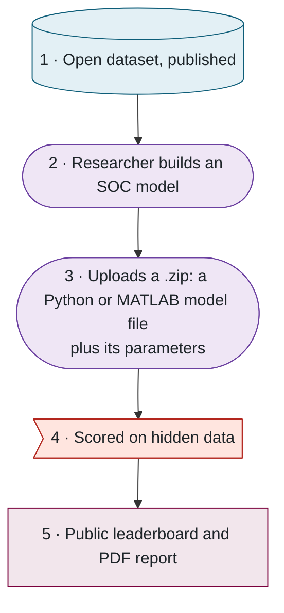
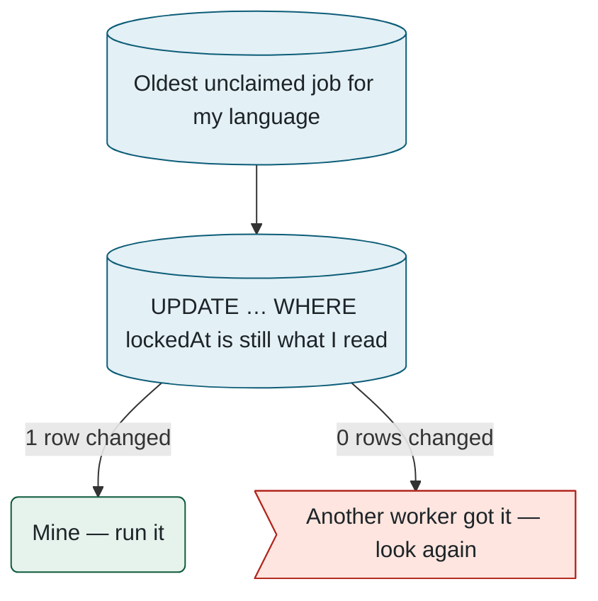
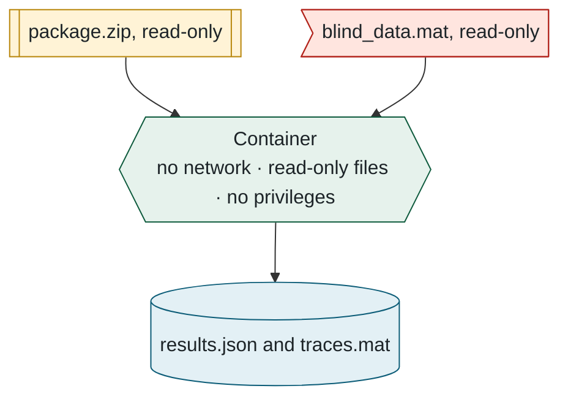
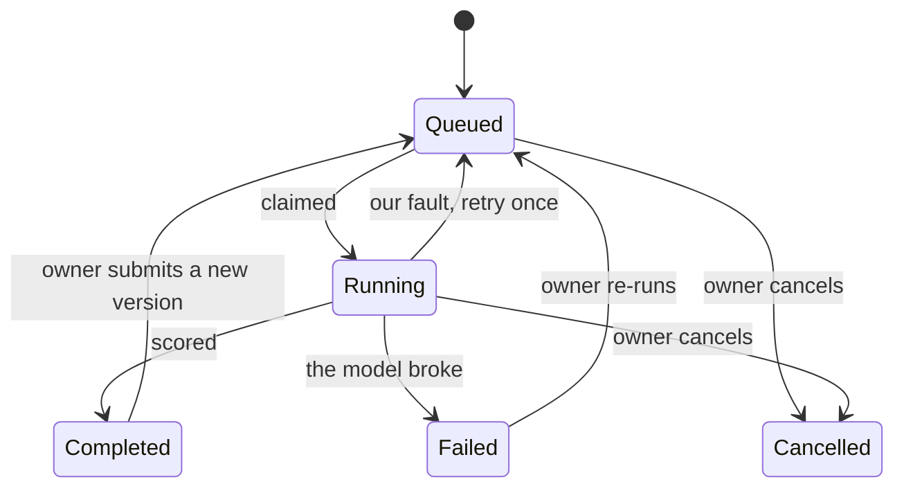
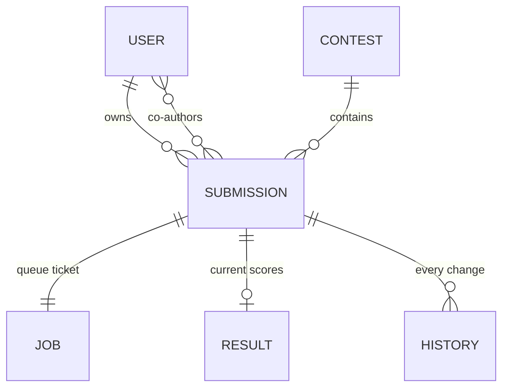
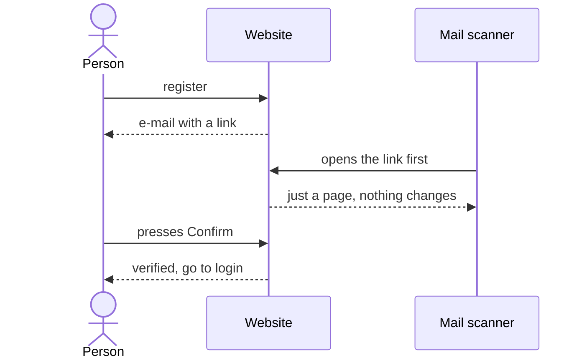
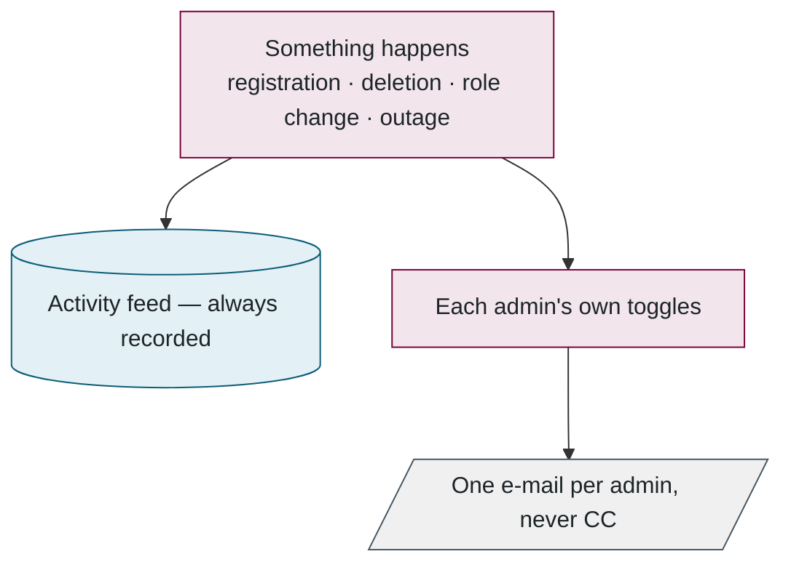
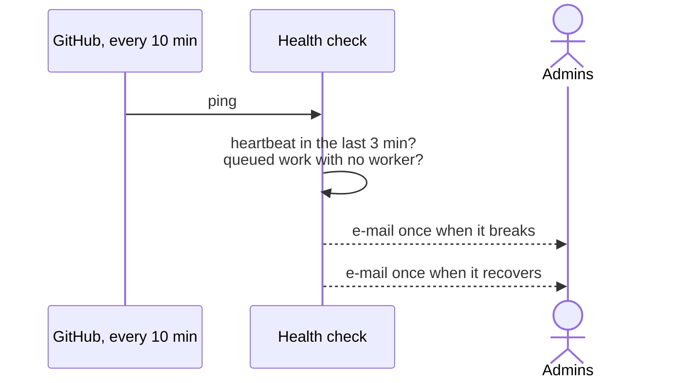
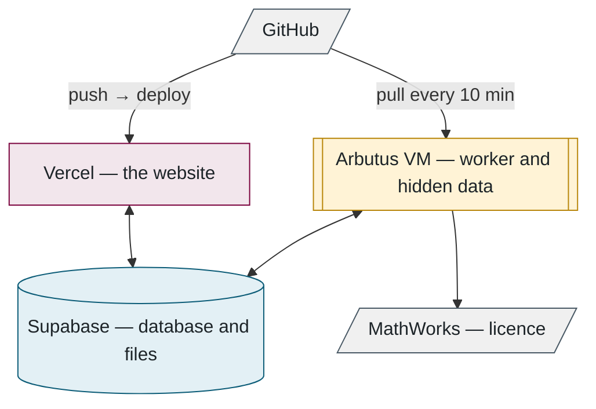

# Battery SOC Benchmark — the codebase manual

This book explains how the Battery SOC Benchmark works, from the battery problem it was built for down to the files that make it run. It is written for two readers at once: someone who wants to understand what the system does without touching code, and a developer who is about to change it. The first kind of reader can stop at the end of each chapter's opening section and the figures; the second should keep going, and will find the files to open listed at the end of every chapter.

Chapters 1 to 3 need no programming background at all. Chapters 4 to 9 go inside the machine, one layer at a time, and each one builds on the last. Chapter 10 is a lookup table for common changes, Chapter 11 is a script for demonstrating the system in ten minutes, and the glossary and appendix at the back collect every term, setting and limit so that the chapters themselves can stay readable.

Every diagram in the book uses the same colours and shapes for the same kinds of thing, so once you have read Chapter 2 you can read any figure without a key. Screenshots are of the live site as it was in September 2026.

---

## Contents

1. [The problem this benchmark solves](#part-1)
2. [The benchmark in one picture](#part-2)
3. [Using the site](#part-3)
4. [What happens to a submission](#part-4)
5. [How the score is computed](#part-5)
6. [The database](#part-6)
7. [Accounts and security](#part-7)
8. [Administration and monitoring](#part-8)
9. [Infrastructure](#part-9)
10. [Changing things](#part-10)
11. [A ten-minute demonstration](#part-11)
12. [Glossary](#part-12)
13. [Appendix: reference tables](#part-13)

---

<a id="part-1"></a>
## 1. The problem this benchmark solves

> **In this chapter.** Why a car cannot measure how full its battery is, what a drive cycle is and why the lab recorded so many of them, what "error" means when we score a model, and why some of the data is kept secret.

### 1.1 A gauge that cannot be read

A petrol car has a float in the tank. An electric car has nothing like it. The amount of charge left in a battery, which engineers call the **state of charge** or **SOC** and express as a percentage from empty to full, is not something any sensor can read directly. What the car *can* measure, many times a second, is the current flowing in and out of the battery, the voltage across it, and its temperature. From those three signals it has to work out the state of charge, and that calculation is the job of an **estimator**: an algorithm running on the car's battery computer.


Getting the estimate wrong has real consequences. A gauge that reads high strands drivers with a battery that was emptier than it said; a gauge that reads low forces the carmaker to hide part of the battery as a safety margin, so the driver paid for range they can never use. Estimators also have a habit of working well in the lab at room temperature and drifting badly in a Canadian winter. A great deal of research therefore goes into making them better, and that research is what this benchmark is for.

### 1.2 Drive cycles: the data

A **drive cycle** is a recording of a standard kind of trip. It says how fast a car goes, second by second, through a fixed pattern of driving. Some cycles are stop-and-go city traffic, some are steady highway, some are aggressive with hard acceleration and braking. The car industry has used the same handful of these for decades to measure fuel economy, so they are well known and repeatable. The standard ones in this benchmark are UDDS (urban), HWFET (highway), LA92 and US06 (both aggressive); the lab added two of its own, HWCUST and HWGRADE, which have never been published.

For the benchmark the lab took real Tesla 2170 cells, the cylindrical cells used in the Model 3, and put each one through those trips inside a thermal chamber. At every moment the test equipment drew exactly the current a Model 3 would draw from that cell: heavy current when the car accelerates, current flowing back in when it brakes, nothing when it idles. Voltage, temperature and the true state of charge were recorded the whole time. Figure 1.2 shows what one such recording looks like.


Every cycle was repeated at six temperatures from −20 °C to 40 °C, because a cold cell behaves very differently from a warm one, and on four cells that had each been driven with a different payload (one passenger, a full load with the air conditioning on or off, and a trailer). That is what makes the data valuable: a model is judged on the messy, realistic loads a battery sees in a car, at the cold temperatures where estimators usually fail, and, because the true state of charge was recorded, every guess it makes can be checked exactly.

### 1.3 Error: what is measured

For every second of every drive cycle the lab knows the true state of charge. The model, seeing only current, voltage and temperature, produces its own guess for the same second. The difference between the two is the **error**, and it is the one thing the benchmark measures. Everything on the leaderboard is some average of it.


To turn two hours of error into one number the benchmark uses the **root-mean-square error**, or **RMSE**: square the error at every second, average the squares, take the square root. Being 2 % off all the time gives an RMSE of 2. Being perfect except for one bad minute scores worse than that minute's share would suggest, because the squaring punishes large errors. That is deliberate: a model that is always slightly off is more useful in a car than one that is usually perfect and occasionally wildly wrong.

Where the error happens matters as much as its size. A model that works at 25 °C and drifts at −20 °C is not much use in Canada, and a model that is accurate only when it is told the exact starting charge is not much use either, because a real car does not know it. So the score does not just average the error; it looks at each temperature, each cell and each kind of trip separately, and it also runs the model with a deliberately wrong starting point and a deliberately faulty current sensor. Chapter 5 shows exactly how those pieces combine.

### 1.4 Open data and hidden data

The obvious way to test a model would be to publish all the data and let everyone report their own numbers. The trouble is that every group would test on its own choice of cycles with its own definition of error, and a claimed 1.5 % could not be compared with someone else's 2 %. Worse, a model trained on the published data can simply memorise it and look far better than it is.


The benchmark therefore splits the data in two. The **open data**, published on the Borealis research repository, contains the characterisation tests and drive cycles for three of the four cells. Researchers build and train on it freely. The **hidden data** contains the whole fourth cell, m448, plus cycles and conditions the open set does not include. It has never been published and it never touches the website. Every submitted model is scored on the hidden data, so no model can have seen it, and the leaderboard shows the hidden-cell score next to the open-cell score. A model that does well on the open cells and badly on the hidden one has memorised rather than learned.

### 1.5 What the benchmark promises

Put together, the promise is simple. Everyone gets the same test: the same hidden data, the same code computing the same error, the same published weights turning the errors into one score. A researcher uploads their estimator as a small program, one Python or MATLAB file zipped together with whatever parameters it needs, and a few minutes later has a score on a public leaderboard that means the same thing as everyone else's. The uploaded program is deleted the moment it has been scored.

---

<a id="part-2"></a>
## 2. The benchmark in one picture

> **In this chapter.** The five steps from open data to leaderboard, the three programs that make them happen, the one rule that keeps the hidden data safe, and where each piece physically runs.

### 2.1 Five steps


The whole benchmark is five steps, and the difference between the first and the fourth is what it rests on:



Figure 2.2. The five steps. Step 1 is public, step 4 is secret, and the benchmark's credibility is the gap between them.

### 2.2 Three programs and one rule

Behind the website there are three separate programs, and the design comes down to one rule: **the website never runs anyone's code and never sees the hidden data.** A different computer, the **worker**, does both of those things. Even the worker does not run a model directly; it hands the model to a **sandbox**, a sealed temporary environment inside the machine with the network switched off and the files locked, which is thrown away afterwards.


The website and the worker never talk to each other. Everything passes through the database, so a second worker machine needs no configuration (it simply starts taking jobs), the site stays up if the worker goes offline (as it did during a ten-hour network outage in September 2026), and the queue of work is an ordinary database table rather than a separate service.

### 2.3 Where things run

| What | Where | Why |
|---|---|---|
| Website | Vercel, a hosting service (free tier) | Runs the site with no servers of our own to look after |
| Database and file bucket | Supabase, a hosted database service (free tier) | The PostgreSQL database and file storage in one account |
| Worker, hidden data, MATLAB | A virtual machine (a rented computer in the cloud) on Arbutus, the Digital Research Alliance of Canada's research cloud | The lab controls it, and it is the only place the hidden data exists |
| Source code | GitHub, in the `McMaster-Battery-Research-Group` organisation | Collaborators can read and propose changes; only the owner merges |

### 2.4 How to read the figures

Every diagram from here on uses one set of colours and shapes, so a kind of thing looks the same on every page and still reads in black and white:

```mermaid
flowchart LR
    W["Website"] ~~~ K[["Worker"]] ~~~ S{{"Sandbox"}} ~~~ D[("Data")] ~~~ E[/"Outside service"/] ~~~ P(["Person"]) ~~~ X>"Hidden data or risk"]
    classDef web fill:#F2E6EC,stroke:#7A003C,color:#1d2428
    classDef worker fill:#FFF3D6,stroke:#B8860B,color:#1d2428
    classDef sandbox fill:#E6F2EC,stroke:#0E5B3D,color:#1d2428
    classDef data fill:#E3F0F5,stroke:#0D5D78,color:#1d2428
    classDef ext fill:#F0F0F0,stroke:#495965,color:#1d2428
    classDef person fill:#EFE6F5,stroke:#6B3FA0,color:#1d2428
    classDef danger fill:#FFE5DF,stroke:#B3261E,color:#1d2428
    class W web
    class K worker
    class S sandbox
    class D data
    class E ext
    class P person
    class X danger
```



Figure 2.4. The shapes and colours used in every diagram.

**Files to open:** [README.md](../../README.md) → [prisma/schema.prisma](../../prisma/schema.prisma) → [src/evaluator/worker.ts](../../src/evaluator/worker.ts).

---

<a id="part-3"></a>
## 3. Using the site

> **In this chapter.** What a researcher actually does, page by page: create an account, test a package for free, submit it, read the results, and find it on the leaderboard.

### 3.1 Creating an account

Registration asks for a name, an affiliation, an e-mail address and a password. A confirmation e-mail follows; opening its link shows a page with a **Confirm** button, and pressing that button is what verifies the account (Chapter 7 explains why it is a button rather than the link itself). After that, signing in gives a session that lasts fourteen days.


### 3.2 Testing a package before submitting

Every account gets three submissions a day, so it pays to check a package before spending one. The top of the submit page has a **Test your package first** panel. Choose a zip and press **Run test**: the package is run through the real evaluator on one *public* drive cycle (the m80 cell, REORDERED1, 25 °C, two hours), its console output streams onto the page, and a short while later the error and complexity appear. Nothing about a test run is recorded anywhere public and it never touches the hidden data. It catches the mistakes that would otherwise waste a submission: a mis-named file, a missing parameter file, a function that returns the wrong shape.


The zip itself is simple. Its files must sit at the top level with no sub-folders. Exactly one of them must be the model: `Model.py` for Python, or `Model.m` or `Model.p` for MATLAB. Any parameter files the model loads (`.mat`, `.npz`, and so on) go alongside it. Section 5.1 shows what the model function looks like.

### 3.3 Submitting

Below the test panel the submission form asks for a model name, a description, the model type (Coulomb counter, Kalman filter, LSTM and so on), whether the model should be private, an optional contest to enter, and any co-authors. The form checks itself with the same rules the server uses, so a mistake is shown before the upload starts. Once submitted, the page shows the queue position, an estimated start time, whether a worker for the package's language is online, and then a live progress bar as the evaluation runs.

### 3.4 Reading results

The results page is arranged to answer *why* before *what*. It opens with a plain-language reading of the scorecard: which test contributes most to the score, whether the model generalises from the open cells to the hidden one, how it copes with cold, whether it recovers from a wrong starting point and a biased sensor. Every one of those sentences can be checked against the scorecard immediately below it.


The scorecard lists the eighteen test-case rows with their RMSE, their weight, and the product of the two; the products add up to the weighted error at the bottom, so the score is never a mystery. Below that come the key traces: the drive cycles that separate estimators (cold and hot, the hidden cell, the robustness runs), each plotted against the true state of charge with zoom and pan. Everything else sits behind folds: all 144 cycles, the score history, and the downloads (the PDF report, the results as JSON, the full-resolution traces).


### 3.5 The leaderboard

The leaderboard ranks every public, completed model by weighted error, lowest first. Ties break on the all-cells error, then on which was submitted earlier. The columns can be filtered by author, affiliation and model type, more columns can be revealed with the **Columns** picker, and the table can be downloaded as CSV. Clicking a model opens its results page; the **Compare** page overlays two to four models on the same charts.


A signed-in user's private models appear in their own view with a dashed "ghost" rank, the position they *would* have, without moving anyone else. Results from an older version of the scoring maths stay listed but unranked, and their authors are asked to resubmit; packages are deleted after evaluation on purpose, so nothing can be re-run automatically.

### 3.6 Co-authors and contests

A co-author is invited by e-mail and accepts with a button; only then do they appear publicly and receive the results. A **contest** is a time-boxed event with its own leaderboard that freezes at the deadline. Entries must stay public, and their name and type freeze once the contest closes.


**Files to open:** [submit-form.tsx](../../src/app/(app)/submit/submit-form.tsx) → [dry-run-panel.tsx](../../src/app/(app)/submit/dry-run-panel.tsx) → [submissions/[id]/page.tsx](../../src/app/(app)/submissions/[id]/page.tsx) → [leaderboard-table.tsx](../../src/components/leaderboard/leaderboard-table.tsx).

---

<a id="part-4"></a>
## 4. What happens to a submission

> **In this chapter.** The path of one zip file from the browser to the leaderboard: how it is checked, queued, claimed by a worker, run in a sandbox, scored, deleted and reported, and what happens when something goes wrong.

### 4.1 The journey


### 4.2 Stage by stage

**1. Upload.** The browser sends the zip straight to the file bucket using a **signed link**, a one-off web address that permits a single upload and then expires. It does this because the website's host only accepts requests under 4.5 MB and packages can be 50 MB. The form that follows carries only the file's key, not the file.

**2. Check.** One **server action** (a function that runs on the website's server when a form is submitted) does everything, cheapest check first: is the user signed in, under the daily cap of three, with a valid name and description? Then it fetches the zip back and inspects it: size and entry limits, no folders, no path tricks, exactly one model file at the top level. Any failure deletes the upload and shows the exact reason. Passing creates the `Submission` row and its `EvaluationJob` (the queue ticket) in one write, and records whether it is a Python or a MATLAB package.

**3. Wait.** The submission page asks the server for an update every 2.5 seconds and shows the queue position, an estimated start time, and whether a worker for this language is online. All of it is derived from two tables: the job queue and the workers' **heartbeats**, a note each worker writes every fifteen seconds to say it is alive and what it is doing.

**4. Claim.** Workers check the queue every two seconds. Taking a job is a single conditional update, "lock this row only if it is still unlocked", so two workers can never take the same job:



Figure 4.2. Claiming a job. One attempt, two possible outcomes.

Every progress line the model prints refreshes the lock, so a live job is never mistaken for a dead one. A job whose worker died becomes claimable again after thirty quiet minutes, with two attempts in total.

**5. Run.** The worker starts one Docker container (Docker is the tool that creates containers) with three folders made visible inside it and nothing else: the package (read-only), the hidden data (read-only), and an output folder. Everything the container prints streams into the job log, which is what the website shows as the live console. A timer (six hours by default) and the owner's **Cancel** button both kill the container and any MATLAB inside it.



Figure 4.3. What goes into the sandbox and what comes out. Chapter 7 covers what the container is not allowed to do.

**6. Store and report.** The worker checks that all eighteen metrics are finite numbers, re-derives the headline score with the active weights as a cross-check, then writes the result and marks the submission complete in one **transaction** (a group of database writes that either all happen or none do). It uploads the full-resolution traces, appends a line to the submission's score history, and **deletes the package**. Only then does it build the PDF and e-mail the owner and any confirmed co-authors.

### 4.3 How long it takes


### 4.4 The other endings



Figure 4.5. Every state a submission can be in, and what moves it between them.

A failure caused by the package (it crashed, returned an invalid number, ran out of time) is final, and the message is stored word for word so the author can see it. A failure caused by us (Docker down, a bug in the worker) is retried once. Stopping the worker hands its job back to the queue without using up an attempt.

**Files to open:** [submit/actions.ts](../../src/app/(app)/submit/actions.ts) → [package-check.ts](../../src/lib/package-check.ts) → [run-job.ts](../../src/evaluator/run-job.ts) → [python-evaluator.ts](../../src/evaluator/python-evaluator.ts).

---

<a id="part-5"></a>
## 5. How the score is computed

> **In this chapter.** Inside the sandbox: what the model is asked to do, exactly what data it is run on, how 144 errors become 18 test cases and one score, and the two extra numbers that come out alongside it.

This is the roughly 800 lines of Python that *are* the benchmark. They reproduce the lab's original MATLAB tool to three decimal places on the reference models.

### 5.1 What the model is asked to do

A model is one function, called once per second of data, exactly the way a car's battery computer would call it. It receives the current, voltage and temperature for that second and whatever memory it handed back last time, and it returns its estimate and the memory for the next call. It cannot look ahead. The simplest possible model, a Coulomb counter that just adds up the current, is four lines:

```python
def Model(X, z=None):          # X = [current, voltage, temperature]
    current = float(X[0])
    soc = 1.0 if z is None else float(z) + current / 3600 / 4.6
    return soc, soc            # (estimate 0..1, memory for the next call)
```

Python models are imported and looped in-process. MATLAB models run through one `matlab -batch` session executing a forty-line script that does nothing but loop. Both produce identical scores, verified on the four reference models.

### 5.2 What it is run on


Before each cycle, one hour of its first sample is repeated as **padding**, so that filters and recurrent neural networks (models that carry memory from one sample to the next) have settled before the scored part begins; the padding is excluded from the metrics. A short **validation run** on one cycle goes first, so a broken model fails in seconds instead of after forty-five minutes.

### 5.3 From errors to one number


The weights are published and fixed, and they sum to one. Seven categories carry a tenth each: the hidden cell, the open cells, charging, standard cycles, non-standard cycles, the wrong-initial-SOC sweep and the sensor-offset sweep. The four payloads together carry a fifth, and the six temperatures together carry a tenth. "All cells" is shown on every scorecard but weighs nothing, because every other test is a subset of it and it would count everything twice.


### 5.4 Two more numbers

**Complexity** is a bin from 1 to 10 that answers "would this fit on a real battery controller?" It is the model's time per sample relative to a plain Coulomb counter measured on the same machine in the same language. It is shown on the leaderboard but never affects rank.

A **suspicious** flag is raised when the mean error exceeds 25 %. The original tool hid such results; this one logs them for an administrator to look at.

### 5.5 What goes back to the website

The eighteen metrics and the score; one row per cycle with its RMSE, mean absolute error and maximum error; down-sampled traces of thirteen illustrative cycles, the robustness runs and the model's own worst cycle (down-sampled so that every spike survives, so the chart always agrees with the max-error number); and a 6 MB `.mat` file of every run at full resolution for anyone who wants the raw curves.

**Files to open:** [pipeline.py](../../evaluator/python/socbench_eval/pipeline.py) (`score`, `complexity`) → [runner.py](../../evaluator/python/socbench_eval/runner.py) → [Run_Model.m](../../matlab/Run_Model.m) → [test-cases.ts](../../src/lib/test-cases.ts).

---

<a id="part-6"></a>
## 6. The database

> **In this chapter.** The tables that everything else reads and writes, the two habits that keep them tidy, and the one file that describes all of it.

Everything in Chapters 4 and 5 was reading or writing rows in this database. A person has submissions. Each submission has one queue ticket, one current result, and a history of everything that has ever happened to it. Separate tables hold contests, the workers' heartbeats, settings and the administrators' activity feed. One file, the Prisma schema, describes all of it, and the website and the worker both read that file.



Figure 6.1. The core tables. Read each line as "has": a user has many submissions; a submission has exactly one job and at most one result.

Two habits recur everywhere. **Cascade deletes:** delete a user and their submissions, jobs, results and history go with them, so nothing is ever orphaned. **Append-only history:** score revisions, weight changes and admin events are never edited, only added to, so the past can always be reconstructed.

The stand-alone tables are `WorkerHeartbeat` (one row per worker, refreshed every fifteen seconds with its load, languages and last console lines), `EvalSettings` (one row of timeouts and the daily cap, editable by administrators), `ScoringConfig` (weight overrides, newest wins), `AdminEvent` (the activity feed), `RateLimitHit` (abuse counters) and `ContactMessage` (the feedback inbox). Column-level detail is in the appendix.

**Files to open:** [prisma/schema.prisma](../../prisma/schema.prisma). Read it top to bottom once; it is the best map of the system.

---

<a id="part-7"></a>
## 7. Accounts and security

> **In this chapter.** How people get in, why the confirmation e-mail has a button, and the layers that keep a hostile submission from doing any harm.

### 7.1 Why the confirmation e-mail has a button

Corporate mail scanners open every link in an e-mail before the person does, and they used to consume the one-time verification token. So opening the link now only shows a page, and pressing the button on it is what verifies the account. In Figure 7.1 the scanner's visit is the third arrow; notice that nothing changes until the person acts.



Figure 7.1. Verification survives a mail scanner because the link alone does nothing.

### 7.2 Signing in

An account gets ten sign-in attempts per fifteen minutes (forty per network address), after which it waits. The password is checked against its **bcrypt** hash, a deliberately slow one-way scramble: one login is instant, but guessing a million passwords is ruinously slow. A verified user receives a **signed cookie**, a small token the browser keeps and sends with every request, signed so it cannot be forged and good for fourteen days; the site never looks the session up in the database. Pages under `/submit`, `/profile` and `/admin` turn signed-out visitors away before the page is even built, but that is a convenience: the real check runs again inside every action.

### 7.3 What stops a bad submission

| Worry | What stops it |
|---|---|
| The model steals the hidden data | It can read it (it must) but has no network and is destroyed afterwards |
| The model attacks the machine | Read-only filesystem, no privileges, memory and CPU caps, runs as an unprivileged user |
| The model reads our secrets | The container never receives the worker's environment; MATLAB gets only a 24-hour licence token |
| A zip bomb (a tiny file that expands to fill the disk) or a path trick (a file name that tries to write outside its folder) | Entry, size and ratio limits, no folders, no `..`, checked on the website *and* again in the evaluator |
| A model runs forever | Hard timeout inside and outside the container |
| Someone floods the queue | Three submissions per day, five test runs per hour |
| Password guessing | bcrypt plus the attempt limits above |
| Someone finds out who has an account | "Forgot password" and "resend" answer identically whether or not the address exists |
| One compromised administrator deletes the others | Administrators cannot be deleted until demoted, and nobody can change their own role |

Secrets live in exactly three places (Vercel's environment, a file on the VM that only the worker's account can read, and a GitHub secret) and never in the repository, an image, a log or an e-mail.

**Files to open:** [auth.ts](../../src/lib/auth.ts) → [middleware.ts](../../src/middleware.ts) → [(auth)/actions.ts](../../src/app/(auth)/actions.ts) → [rate-limit.ts](../../src/lib/rate-limit.ts) → [python-evaluator.ts](../../src/evaluator/python-evaluator.ts).

---

<a id="part-8"></a>
## 8. Administration and monitoring

> **In this chapter.** The administrators' pages, how the scoring weights are changed without re-running anything, how notifications work, and the robot that notices when the worker goes quiet.

### 8.1 The admin pages


The left-hand menu is the whole of it. **Overview** shows counts and the activity feed. **Submissions** moderates, retries and bulk-deletes. **Users** verifies, changes roles and deletes. **Contests** creates and closes them. **Messages** is the feedback inbox. **Evaluation workers** shows every machine, the queue and the evaluation limits. **Scoring weights** is Section 8.2. **My notifications** is where each administrator chooses which e-mails they want. Every action begins by re-checking that the caller is an administrator, and each has a safety rail; the list is in the appendix.


### 8.2 Changing the weights

An administrator edits the eighteen weights (they must sum to one), previews how many stored scores would move, and saves with a reason. Every result is then re-scored from its stored metrics; no model is re-run, because the metrics were saved and the packages were deleted. Authors can be e-mailed the old and new score with a fresh PDF, and the previous weights stay in the history.


### 8.3 Notifications

Every notable event takes two routes, one always and one optional:



Figure 8.4. The feed is the record; e-mail is a copy of it that each administrator can switch on or off by kind.

One rule that is easy to get wrong: the website's host freezes a request the instant it has answered, so an e-mail sent "in the background" without being waited for is silently dropped. Every such send is wrapped in `after()`, which keeps the request alive until it finishes. This was learned the hard way.

### 8.4 The outage monitor

This was born from a real outage: the worker was healthy but could not reach the database for ten hours, and nobody knew. The website is the one place that can always see both the database and e-mail, so it does the watching. A GitHub Action pings a health-check address every ten minutes; the check asks two questions, and e-mails once when the answer changes.



Figure 8.5. One alert per outage, one all-clear. The state lives in the activity feed, so it is visible on the site too.

**Files to open:** [admin/actions.ts](../../src/app/(admin)/admin/actions.ts) → [admin-notify.ts](../../src/lib/admin-notify.ts) → [worker-health/route.ts](../../src/app/api/ops/worker-health/route.ts).

---

<a id="part-9"></a>
## 9. Infrastructure

> **In this chapter.** Where the software physically runs, how it deploys and updates itself, how MATLAB is licensed inside a container, and how to run everything on a laptop.

### 9.1 The services

The website deploys itself whenever code is pushed. The worker is a rented Linux computer in the Alliance research cloud that updates itself every ten minutes, restarts only when idle, and runs MATLAB inside a container licensed through the lab's MathWorks account.



Figure 9.1. The same three programs as Chapter 2, with the services around them.

### 9.2 The virtual machine

One script sets the machine up: Docker; Node.js, which runs the website's language outside a browser; a service account with no login that exists only to run the worker; the code checked out with a key that can download but never change it; a hardened background service; and a firewall that allows nothing but SSH. Secrets and the hidden data are placed by hand afterwards, owned by the service account and readable by nobody else.

**Self-update** runs every ten minutes: fetch the code; if anything changed, rebuild only what it touched (packages, the database client, the sandbox images); then restart the worker, but only if no evaluation is running, otherwise wait for the next tick.

### 9.3 MATLAB inside a container

MATLAB runs inside MathWorks' own container image (the template a container is started from) and is licensed through the lab's account rather than a licence server. A one-time browser sign-in produced a year-long identity token that lives on the VM. For each evaluation the worker exchanges it for a 24-hour token, and only that short-lived token enters the container.


Figure 9.2. The licence chain. The long-lived secret never enters the sandbox.

### 9.4 Before code reaches production

A push that touches the website runs a browser test pass over the main pages (using Playwright) and is refused if any page errors. The site then deploys itself, and the VM picks the change up within ten minutes.

### 9.5 Running it on a laptop

It is the same code with different settings: a local PostgreSQL database in Docker, files on disk, e-mail to a test inbox. There is no fake scorer; a developer's worker runs the real evaluator, which needs the hidden data and the sandbox image. The **seed**, the script that fills an empty database with starter rows, creates an administrator account and one test user and nothing else. The README has the five commands.

**Files to open:** [provision-arbutus-worker.sh](../../scripts/provision-arbutus-worker.sh) → [vm-update.sh](../../scripts/vm-update.sh) → [Dockerfile.matlab](../../evaluator/Dockerfile.matlab) → [.env.example](../../.env.example).

---

<a id="part-10"></a>
## 10. Changing things

The most common changes, and where each one is made. Anything not listed here can be found from the *Files to open* lines in the earlier chapters.

| You want to… | Do this |
|---|---|
| Change a timeout or the daily cap | Admin → Evaluation workers. No deploy; takes effect within 15 s |
| Change the scoring weights | Admin → Scoring weights: edit, preview, save with a reason, optionally notify authors |
| Change the scoring *maths* | Edit `pipeline.py`; re-run the reference models and confirm only the intended scores moved; bump the benchmark version in `socbench_eval/__init__.py` and `benchmark-version.ts`; old results become "legacy" and authors are e-mailed to resubmit |
| Add a metric | A column in `schema.prisma`, an entry in `test-cases.ts`, compute it in `score()`; the scorecard, PDF and CSV pick it up; check the weights still sum to 1 |
| Add a worker machine | Hidden data, `worker.env`, `npm run worker`; it registers itself and starts taking jobs |
| Rotate a secret | Rotate at the source, update Vercel and `/etc/socbench/worker.env`, restart the worker |
| Renew the MATLAB licence (yearly) | The Workers page shows the expiry; repeat the browser sign-in and `matlab-mhlm-setup.sh` |
| Make someone an administrator | Admin → Users → Make admin, or add the address to `ADMIN_EMAILS`; effective on their next request |

---

<a id="part-11"></a>
## 11. A ten-minute demonstration

1. **Leaderboard.** Rank, weighted error, complexity. Point out that the numbers are errors and lower is better.
2. **One result.** The plain-language summary, the scorecard summing to the score, the worst-case trace, the PDF download.
3. **Submit.** Run a test on the reference package live (seconds), then submit it; watch the queue position and the progress bar.
4. **Admin → Evaluation workers.** The machine that just took it: languages, load, console, licence expiry.
5. **Code, in this order.** `schema.prisma` → `claimJob` in `run-job.ts` → the `docker run` line in `python-evaluator.ts` → `score()` in `pipeline.py` → `Run_Model.m`.
6. **Close on the rule.** The website never runs anyone's code and never sees the hidden data.

---

<a id="part-12"></a>
## 12. Glossary

### Battery terms

| Term | Meaning |
|---|---|
| **SOC, state of charge** | How full a battery is, 0–100 %. It cannot be measured, only estimated from current, voltage and temperature. |
| **BMS** | The battery management system: the electronics in a vehicle that run the estimator, one measurement at a time. |
| **Cell** | One physical battery. Four Tesla 2170 cells here, named after the vehicle mass they were driven with: `m80`, `m448`, `m448N`, `m1000`. `m448` is fully hidden. |
| **Drive cycle** | A standard speed profile converted to the current a cell sees. UDDS (urban), HWFET (highway), LA92 and US06 (aggressive), HWCUST and HWGRADE (custom, never published). |
| **Open / hidden data** | Open is published for building models; hidden is secret and used only to score. `blind_data.mat` is the answer key. |
| **Coulomb counting** | Integrating current over time: the simplest estimator, and the reference for the complexity scale. |
| **EKF / UKF** | Kalman filters: classical estimators that fuse a physics model with measurements. |
| **FNN / LSTM / GRU / Transformer** | Neural-network estimators. |
| **RMSE / MAE / max error** | Root-mean-square, mean-absolute and worst single-sample error, in % SOC. |
| **Test case** | One of the 18 scoring rows; each has a weight. |
| **Weighted error** | The leaderboard score: the sum of weight × test-case RMSE. |
| **Robustness sweep** | Starting the model at the wrong SOC, or feeding it current with a constant offset. |
| **Padding** | An hour of the first sample repeated before each cycle so models with memory settle. |
| **Complexity** | A 1–10 bin of compute per sample relative to a Coulomb counter. Informational only. |
| **Test run (dry run)** | A free run on open data from the submit page; no leaderboard entry. |
| **Package** | The uploaded zip: `Model.py` or `Model.m`/`Model.p` plus parameter files. |

### Software terms

| Term | Meaning |
|---|---|
| **Repository / git / GitHub** | The source code, every change recorded, hosted on GitHub. |
| **Serverless** | The host starts a tiny server per request and freezes it the instant it answers. Cheap; quirky. |
| **Container / Docker / image** | An isolated box a program runs in; Docker runs them; an image is the template. |
| **Sandbox** | A container locked down as far as possible: no network, read-only files, no privileges. |
| **Database / table / row** | PostgreSQL stores everything as tables of rows. |
| **Prisma** | Lets TypeScript talk to the database with typed calls; one schema file describes every table. |
| **Server Component / Server Action** | A page that reads the database on the server; a form handler that runs on the server. No API layer. |
| **Signed URL** | A temporary pre-authorised link that lets a browser upload straight to file storage. |
| **Session / JWT / cookie** | After login the browser holds a signed token proving who you are. |
| **bcrypt** | A deliberately slow one-way scramble for passwords. |
| **Rate limit** | At most N attempts per time window. |
| **Queue / job / worker / heartbeat** | Work waiting to be done; one item of it; the program that does it; its periodic "I'm alive". |
| **Compare-and-swap** | "Update this row only if it is still the way I last saw it": how two workers never take the same job. |
| **Environment variable / `.env`** | Configuration and secrets handed to a program from outside its code. |
| **VM / Arbutus / systemd** | A rented cloud computer; the Alliance's cloud at UVic; Linux's way of running a program as a service. |
| **mode 600** | A file only its owner can read. |

### Numbers worth remembering

144 test cycles (4 cells × 6 temperatures × 6 cycles) · 18 test cases, weights sum to 1 · 3 submissions per day, 5 test runs per hour · 6-hour evaluation limit · worker polls every 2 s, heartbeat every 15 s · a lock goes stale after 30 min, 2 attempts per job · 50 MB upload cap.

---

<a id="part-13"></a>
## 13. Appendix: reference tables

### Tools

| Tool | What it is | Why it was chosen |
|---|---|---|
| TypeScript, Node.js | The language and runtime for the website and the worker | One typed language for both |
| Next.js 15, React 19 | The web framework | Pages, forms and small APIs in one project; free hosting |
| Tailwind CSS, Radix UI | Styling; accessible dialogs, menus, tooltips | Fast to build; McMaster colours as tokens |
| Recharts, TanStack Table | Charts; the leaderboard's headless table | SVG charts with export; sorting and column picking |
| zod | Form validation | One rule set, used in the browser and on the server |
| Auth.js, bcryptjs | Sessions; password hashing | No third-party identity provider needed |
| Prisma, PostgreSQL (Supabase) | Database access; the database | One schema file; free managed tier with file storage attached |
| nodemailer, pdfkit | E-mail; the PDF report | Provider-agnostic mail; vector PDFs without a browser |
| Python, numpy, scipy | The benchmark maths | Exact, fast, no licence to score; reads `.mat` files |
| MATLAB R2026a | Executes `.m`/`.p` models only | Inside MathWorks' container image, licensed online |
| Docker | The sandbox | Non-negotiable isolation for untrusted code |
| Playwright | Browser tests | Runs on every push that touches the site |
| Vercel, Arbutus, GitHub Actions | Website hosting; the worker VM; the 10-minute health ping | All free tiers |

### Environment variables

| Group | Variables |
|---|---|
| Database | `DATABASE_URL` (pooler, port 6543), `DIRECT_URL` (port 5432, migrations only) |
| Website | `AUTH_SECRET`, `AUTH_URL`, `NEXT_PUBLIC_SITE_URL`, `ADMIN_EMAILS`, `CRON_SECRET`, `OPS_HEALTH_TOKEN` |
| Mail | `SMTP_HOST`, `SMTP_PORT`, `SMTP_USER`, `SMTP_PASS`, `MAIL_FROM`, `ADMIN_NOTIFY_EMAIL` |
| Storage | `STORAGE` (local / supabase), `UPLOAD_DIR`, `MAX_UPLOAD_MB`, `SUPABASE_URL`, `SUPABASE_SERVICE_KEY`, `SUPABASE_BUCKET` |
| Worker | `SOCBENCH_BLIND_DATA`, `SOCBENCH_PYTHON`, `MATLAB_BIN`, `WORKER_CONCURRENCY`, `WORKER_RUNTIMES` |
| Sandbox | `EVAL_SANDBOX`, `EVAL_SANDBOX_IMAGE`, `EVAL_SANDBOX_MATLAB_IMAGE`, `EVAL_MATLAB_MHLM_FILE`, `EVAL_MATLAB_NETWORK`, `EVAL_CPUS`, `EVAL_MEMORY` |
| Calibration | `SOCBENCH_CAL_PYTHON`, `SOCBENCH_CAL_MATLAB` |

Every line is annotated in `.env.example`. Production values live only on Vercel and in `/etc/socbench/worker.env` on the VM.

### Limits

| What | Limit |
|---|---|
| Register | 5 per hour per address |
| Login | 10 per 15 min per account, 40 per 15 min per IP |
| Password reset / resend verification | 3 per hour per e-mail |
| Contact form | 5 per hour per IP |
| Upload links | 30 per hour per user |
| Test runs | 5 per hour (administrators unlimited) |
| Submissions | 3 per rolling 24 h (administrators exempt) |
| Evaluation / test run | 360 min / 10 min |
| Zip | ≤ 500 entries, ≤ 512 MB unpacked, ≤ 256 MB per entry, ≤ 200 : 1 compression, no folders, no symlinks |

### Admin actions and their rails

| Action | Rail |
|---|---|
| Moderate a submission | Reason ≥ 10 characters; not while RUNNING; contest entries cannot be made private (hide instead) |
| Bulk delete | Up to 100; RUNNING skipped; one activity line; authors optionally e-mailed |
| Delete a user | Not yourself; not an administrator (demote first); not while their work is RUNNING |
| Change a role | Not your own |
| Worker pause / resume / stop | Picked up at the next heartbeat |
| Release a job lock | Behind a confirm; a live worker would double-evaluate |
| Evaluation settings | Timeout 10–1440 min, test run 2–60 min, per day 1–100 |
| Scoring weights | Preview first; must sum to 1 |
| Contests | Only one open at a time |

### Key columns

| Table | Columns that matter |
|---|---|
| `User` | `email`, `passwordHash`, `role`, `emailVerified` (a timestamp), `adminNotify` toggles, `avatar` |
| `Submission` | `seq` (the visible number), `modelName`, `modelType`, `runtime` (python / matlab), `status`, `version`, `isPrivate`, `isHidden`, `fileKey`, `contestId` |
| `EvaluationJob` | `attempts`, `lockedAt`, `lockedBy`, `log`, `cancelRequestedAt` |
| `EvaluationResult` | `weightedError`, `complexity`, the 18 metric columns, `maxError`, `perCycle`, `timeSeries`, `robustness`, `tracesKey`, `evaluatorVersion` |
| `ScoreRevision` | `kind` (evaluation, failure, rescore, resubmission, edit, cancelled, legacy), the score and metrics at that moment, `note`, `by` |
| `WorkerHeartbeat` | `hostname`, `lastSeenAt`, `runtimes`, `busyWith`, `paused`, `command`, machine diagnostics, `log` |
| `DryRun` | its own `status`, lock and `log`; `result` JSON; never touches hidden data, never on the leaderboard |
