> **Single-file version** for reading straight through offline or in an editor. For rendered diagrams use the numbered pages in this folder or the PDF beside this file (`codebase-walkthrough.pdf`).

# Battery SOC Benchmark — codebase walkthrough

This is the whole system explained in one place: what it does, how each part works, why it was built that way, and where to look in the code.

You don't need to be a developer to follow it. Every part starts with a short plain-English summary, and the diagrams are meant to make sense on their own, so you can read those and skip anything in `monospace`. If the codebase is new to you, read it in order once; each part ends with the files to open. Terms are defined in the glossary at the end, and the reference tables (settings, limits, tools) are in the appendix after it, so the main text stays short.

Every diagram uses the same colours: **maroon** for the website, **gold** for the worker machine, **green** for the sandbox, **blue** for data, **grey** for outside services, **purple** for a person, **red** for the hidden data or a risk.

---

## Contents

1. [The five-minute version](#part-1)
2. [How a submission is evaluated](#part-2)
3. [How the score is computed](#part-3)
4. [The database](#part-4)
5. [Accounts and security](#part-5)
6. [The website](#part-6)
7. [Administration and monitoring](#part-7)
8. [Infrastructure](#part-8)
9. [Changing things](#part-9)
10. [A ten-minute demo](#part-10)
11. [Glossary](#part-11)
12. [Appendix: reference tables](#part-12)

---

<a id="part-1"></a>
## 1. The five-minute version

> **Plain English.** Researchers upload a small program that guesses how full a battery is. We run it against battery data that has never been published, score it with a fixed public formula, and put the score on a public leaderboard. Everyone is scored on the same hidden data with the same code, so the numbers are comparable. The uploaded program is deleted the moment it is scored, and it never touches the website.

### The problem

Every battery paper reports its own accuracy on its own data, so nobody can tell whose method is actually better. The benchmark fixes the data and the test: same hidden cycles, same scoring code, every model. Read the diagram top to bottom — it is the whole idea in five steps:

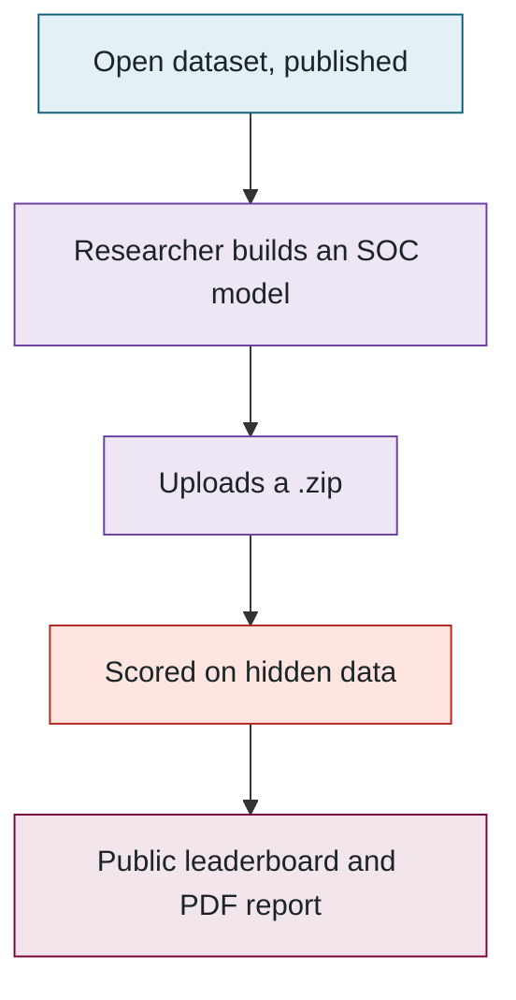

### Three programs, and what each may touch

The design comes down to one rule: **the website never runs anyone's code and never sees the hidden data.** A separate worker machine does that, and even the worker hands the model to a throw-away container. Three words will come up on every page from here on — *website*, *worker*, *sandbox* — and this is what each one is. The arrows show who is allowed to talk to whom:

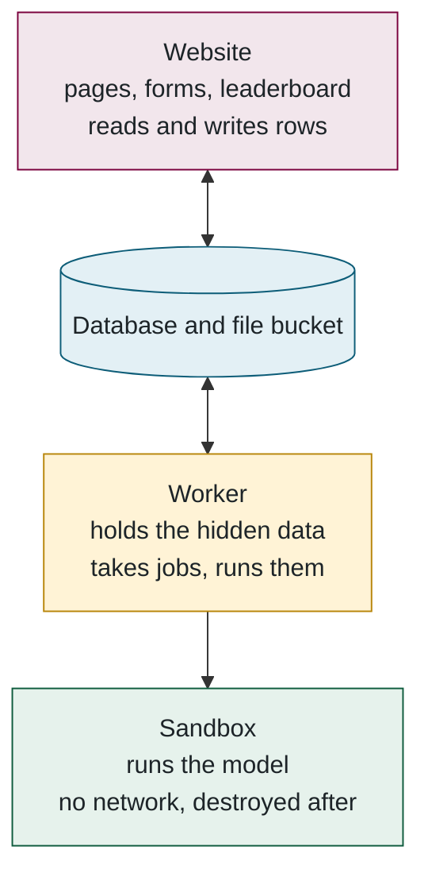

The website and the worker share nothing but the database; they never talk to each other. That is why a second worker machine needs no configuration (it just starts taking jobs), why the site stayed up during a ten-hour network outage that cut the worker off, and why the queue is a database table rather than a separate service.

### Where things run

| What | Where | Why |
|---|---|---|
| Website | Vercel (free tier) | Hosts Next.js with no servers to manage |
| Database and file bucket | Supabase (free tier) | PostgreSQL and file storage in one account |
| Worker, hidden data, MATLAB | A VM on Arbutus, the Alliance research cloud | The lab controls it; it is the only place the hidden data exists |
| Source code | GitHub, `McMaster-Battery-Research-Group` | Collaborators can read and propose; only the owner merges |

**Files to open:** [README.md](../../README.md) → [prisma/schema.prisma](../../prisma/schema.prisma) → [src/evaluator/worker.ts](../../src/evaluator/worker.ts).

---

<a id="part-2"></a>
## 2. How a submission is evaluated

> **Plain English.** A researcher uploads a zip. The website checks it and puts a ticket in a queue. A worker takes the ticket, downloads the zip, runs the model inside a sealed box against the secret data, saves the scores, deletes the zip, and e-mails a PDF. If anything goes wrong, the researcher is told exactly what.

Part 1 introduced the three programs. This part follows one submission through all three, in order; the numbered steps after the diagram explain each arrow.

### The journey

Time runs downward. Solid arrows are actions; dashed arrows are things coming back.

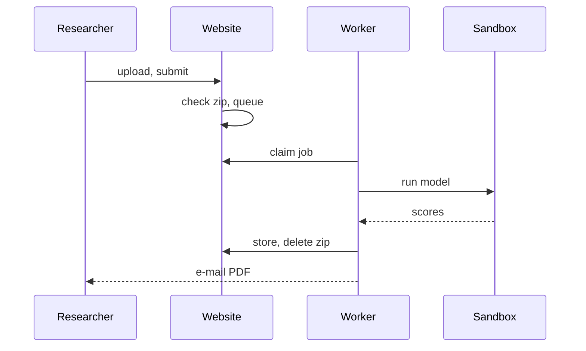

### Step by step

**1. Upload.** The browser sends the zip straight to the file bucket using a short-lived signed link, because the website's host only accepts requests under 4.5 MB and packages can be 50 MB. The form then carries only the file's key.

**2. Check.** One server action does everything, cheapest check first: signed in? under the daily cap of 3? name and description valid? Then it fetches the zip back and inspects it — size and entry limits, no folders, no path tricks, exactly one `Model.py` or `Model.m`/`Model.p` at the top level. Any failure deletes the upload and shows the exact reason. Passing creates the `Submission` and its `EvaluationJob` (the queue ticket) in one insert, and records whether it is a Python or MATLAB package.

**3. Wait.** The submission page polls every 2.5 s and shows the queue position, an estimated start time, and whether a worker for this package's language is online. All of it is derived from two tables: the workers' heartbeats and the job queue.

**4. Claim.** Workers poll every 2 s. Taking a job is a single conditional update — lock this row *only if it is still unlocked* — so two workers can never take the same job. The diagram is one attempt; the two branches are the only outcomes:

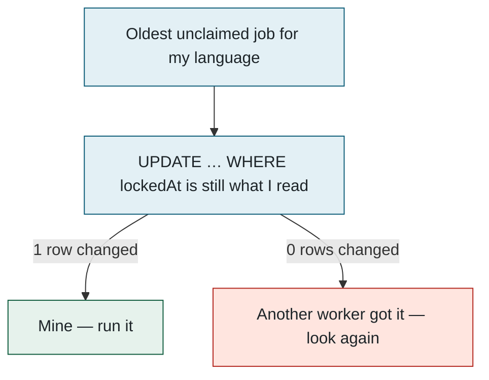

Every progress line the model prints refreshes the lock, so a live job is never mistaken for a dead one; a job whose worker died becomes claimable again after 30 quiet minutes, with two attempts in total.

**5. Run.** The worker starts one Docker container with three mounts and nothing else: the package (read-only), the hidden data (read-only), and an output folder. No network, read-only filesystem, no privileges, memory and CPU caps, none of the worker's secrets. Everything the container prints streams into the job log, which is what the website shows as the live console. A timer (default 6 h) and the owner's Cancel button both kill the container and any MATLAB inside it. Two things go in, one thing comes out:

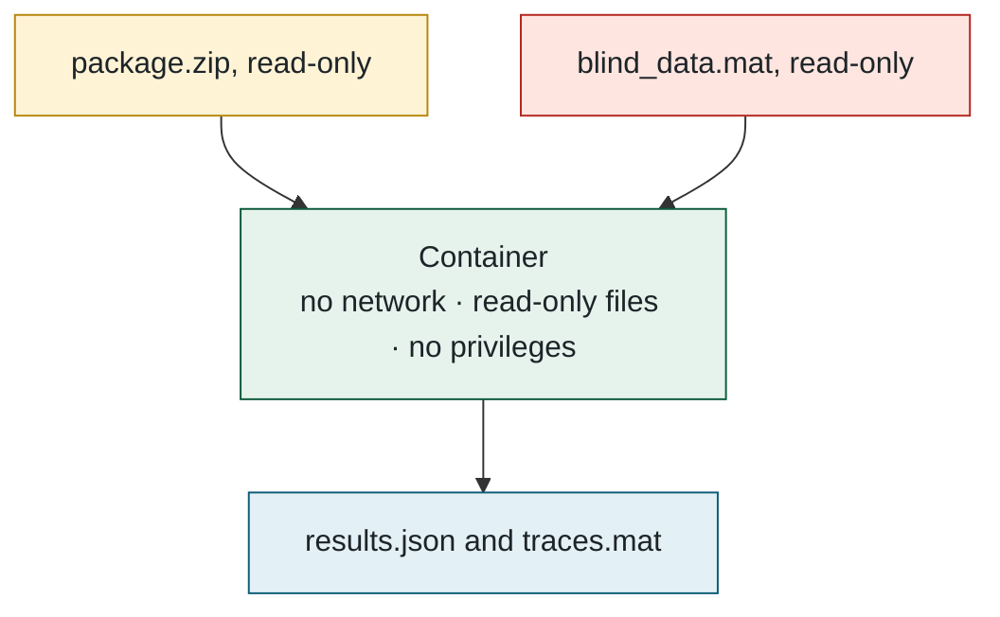

**6. Store.** The worker checks that all 18 metrics are finite numbers, re-derives the headline score with the active weights as a cross-check, writes the result and marks the submission complete in one transaction, uploads the full-resolution traces file, appends a line to the submission's score history, and **deletes the package**. Only then does it build the PDF and e-mail the owner and any confirmed co-authors.

**7. The other endings.** Every state a submission can be in, and what moves it between them:

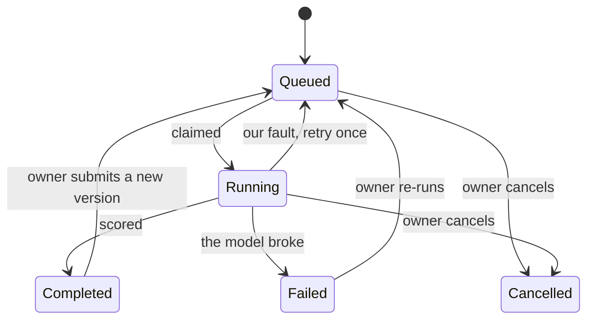

A failure caused by the package (it crashed, returned NaN, ran out of time) is final and the message is stored verbatim; a failure caused by us (Docker down, a bug) is retried once. Stopping the worker hands its job back to the queue without using up an attempt.

**Files to open:** [submit/actions.ts](../../src/app/(app)/submit/actions.ts) → [package-check.ts](../../src/lib/package-check.ts) → [run-job.ts](../../src/evaluator/run-job.ts) → [python-evaluator.ts](../../src/evaluator/python-evaluator.ts).

---

<a id="part-3"></a>
## 3. How the score is computed

> **Plain English.** The model is run over every hidden drive cycle exactly the way a car's battery computer would run it: one measurement at a time, carrying its own memory. Each cycle gives one error number. Those are grouped into 18 test cases, and the 18 are combined with published weights into one score. Lower is better. This is the ~800 lines of Python that *are* the benchmark, and they reproduce the lab's original MATLAB tool to three decimal places.

Part 2 ended with a container producing scores. This part opens that container: what the model is asked to do, what data it is run on, and how the errors turn into a single number.

### What the model is asked to do

A model is one function, called once per second of data, returning its estimate and whatever memory it wants back next time. It cannot look ahead.

```python
def Model(X, z=None):          # X = [current, voltage, temperature]
    current = float(X[0])
    soc = 1.0 if z is None else float(z) + current / 3600 / 4.6
    return soc, soc            # (estimate 0..1, memory for the next call)
```

Python models are imported and looped in-process; MATLAB models run through one `matlab -batch` session executing a 40-line script that does nothing but loop. Both produce identical scores, verified on the four reference models.

### What it is run on

| | |
|---|---|
| Cells | 4 Tesla 2170 cells: `m80`, `m448` (fully hidden), `m448N`, `m1000` |
| Temperatures | −20, −10, 0, 10, 25, 40 °C |
| Drive cycles | UDDS, HWFET, LA92, US06, plus two custom ones (HWCUST, HWGRADE) |
| Total | **144 test cycles** plus charging cycles |
| Robustness | 9 runs started at the wrong initial SOC (90 / 60 / 30 %), 18 runs with a current-sensor offset (±0.05 / 0.1 / 0.3 A) |
| Padding | One hour of the first sample repeated before every cycle so filters and RNNs settle; excluded from the metrics |

A short **validation run** goes first so a broken model fails in seconds instead of after 45 minutes.

### From errors to one number

The scoring pipeline, in four steps:

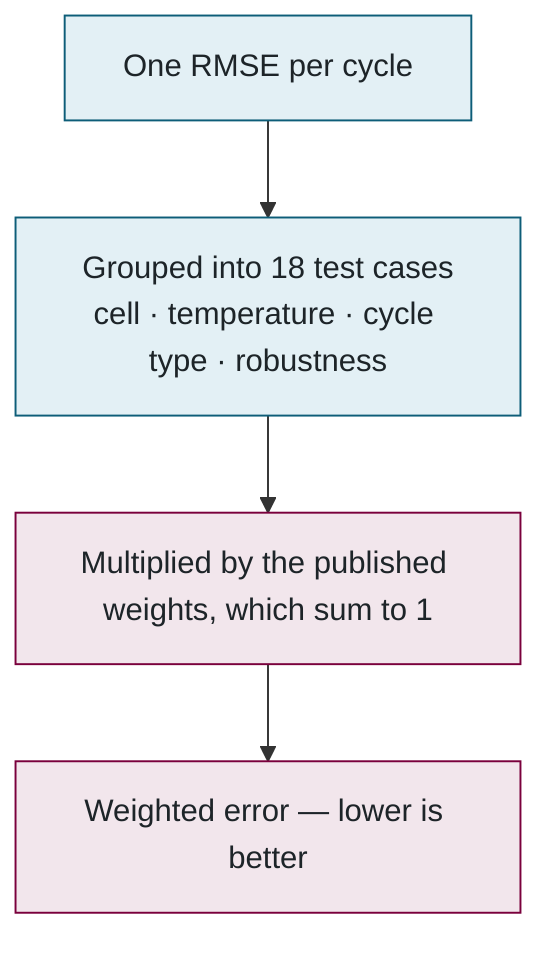

RMSE for one cycle: the estimate's distance from the true SOC at every second, squared, averaged, square-rooted. Being 2 % off all the time scores 2; being perfect except for one bad minute scores worse than that minute's share suggests, which is the point.

The weights: seven categories carry a tenth each (blinded cell, other cells, charging, standard cycles, non-standard cycles, wrong initial SOC, sensor offset); the four cells' individual scores share a fifth; the six temperatures share a tenth. "All cells" is shown but weighs zero, because it would double-count everything else. The chart shows how much of the final score each group contributes:

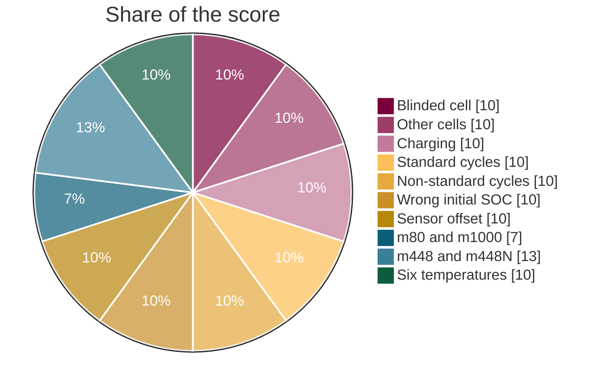

Two more things come out. A **complexity** bin from 1 to 10 — time per sample relative to a plain Coulomb counter, answering "would this fit on a real battery controller?"; it never affects rank. And a **suspicious** flag when the mean error exceeds 25 %, which is logged for an administrator rather than hidden as the old tool did.

### What goes back to the website

The 18 metrics and the score; one row per cycle (RMSE, MAE, max error); down-sampled traces of 13 illustrative cycles, the robustness runs and the model's own worst cycle — down-sampled so that every spike survives, so the chart agrees with the max-error number; and a 6 MB `.mat` of every run at full resolution for anyone who wants the raw curves.

**Files to open:** [pipeline.py](../../evaluator/python/socbench_eval/pipeline.py) (`score`, `complexity`) → [runner.py](../../evaluator/python/socbench_eval/runner.py) → [Run_Model.m](../../matlab/Run_Model.m) → [test-cases.ts](../../src/lib/test-cases.ts).

---

<a id="part-4"></a>
## 4. The database

> **Plain English.** A person has submissions. Each submission has one queue ticket, one current result, and a history of everything that ever happened to it. Separate tables hold contests, the worker machines' heartbeats, settings and the admin activity feed. One file describes all of it, and the website and the worker both read that file.

Everything in Parts 2 and 3 was reading or writing rows in this database. Read each line in the diagram as "has": a user has many submissions, a submission has exactly one job and at most one result.

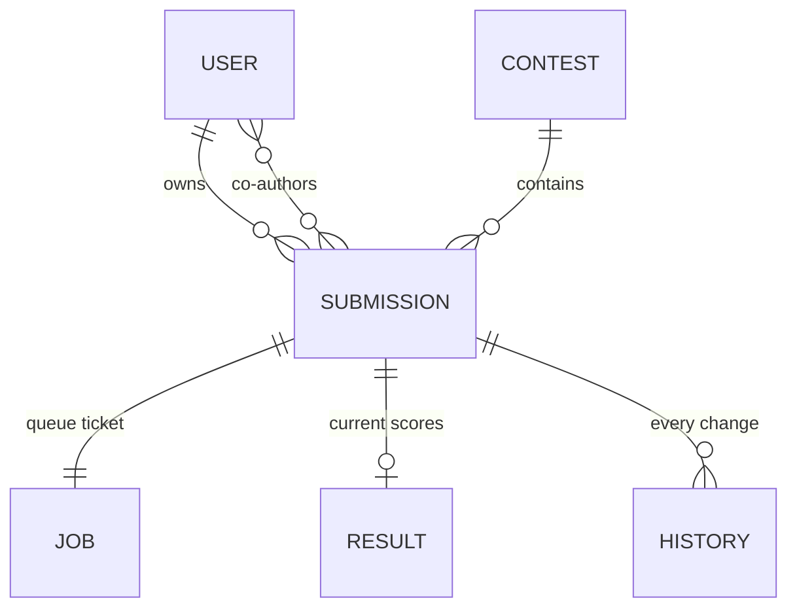

Two habits recur everywhere. **Cascade deletes:** delete a user and their submissions, jobs, results and history go with them, so nothing is ever orphaned. **Append-only history:** score revisions, weight changes and admin events are never edited, only added to.

The stand-alone tables: `WorkerHeartbeat` (one row per worker, refreshed every 15 s with its load, languages and last console lines), `EvalSettings` (one row: timeouts and the daily cap, editable by admins), `ScoringConfig` (weight overrides, newest wins), `AdminEvent` (the activity feed), `RateLimitHit` (abuse counters), `ContactMessage` (the feedback inbox). Column-level detail is in the appendix.

**Files to open:** [prisma/schema.prisma](../../prisma/schema.prisma) — read it top to bottom once; it is the best map of the system.

---

<a id="part-5"></a>
## 5. Accounts and security

> **Plain English.** Register with e-mail and password, prove you own the address by clicking a confirmation, then sign in. Passwords are stored scrambled. Sensitive actions are limited to a few attempts per hour. Submitted code runs inside several layers of protection, and the hidden data can be read by a model but never sent anywhere.

The database holds accounts as well as submissions; this part covers how people get in, and what keeps a hostile submission from doing harm.

### Why the confirmation e-mail has a button

Corporate mail scanners open every link before the person does, and used to consume the one-time token. So opening the link only shows a page; pressing its button is what verifies the account. The scanner's visit is the third arrow — notice that nothing changes until the person acts:

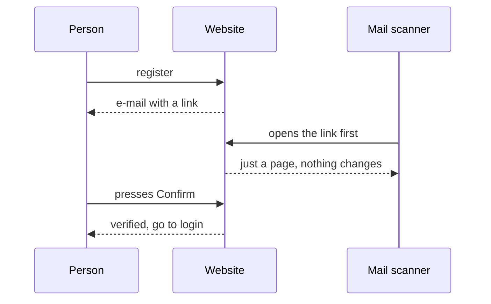

### Signing in

Ten attempts per 15 minutes per account (forty per address), then the password is checked against its bcrypt hash — a deliberately slow scramble, so guessing a million passwords is ruinous while one login is instant. A verified user gets a signed cookie good for 14 days; the site never looks the session up in the database. Pages under `/submit`, `/profile` and `/admin` redirect signed-out visitors at the edge, but that is a convenience: the real check runs again inside every action.

### What stops a bad submission

| Worry | What stops it |
|---|---|
| The model steals the hidden data | It can read it (it must) but has no network and is destroyed afterwards |
| The model attacks the machine | Read-only filesystem, no privileges, memory and CPU caps, runs as an unprivileged user |
| The model reads our secrets | The container never receives the worker's environment; MATLAB gets only a 24-hour licence token |
| A zip bomb or path trick | Entry, size and ratio limits, no folders, no `..` — checked on the website *and* again in the evaluator |
| A model runs forever | Hard timeout inside and outside the container |
| Someone floods the queue | 3 submissions per day, 5 dry runs per hour |
| Password guessing | bcrypt plus the attempt limits above |
| Someone finds out who has an account | "Forgot password" and "resend" answer identically whether or not the address exists |
| One compromised admin deletes the others | Admins cannot be deleted until demoted; nobody can change their own role |

Secrets live in exactly three places — Vercel's environment, a mode-600 file on the VM, and a GitHub secret — and never in the repository, an image, a log or an e-mail.

**Files to open:** [auth.ts](../../src/lib/auth.ts) → [middleware.ts](../../src/middleware.ts) → [(auth)/actions.ts](../../src/app/(auth)/actions.ts) → [rate-limit.ts](../../src/lib/rate-limit.ts) → [python-evaluator.ts](../../src/evaluator/python-evaluator.ts).

---

<a id="part-6"></a>
## 6. The website

> **Plain English.** The submit page lets you test a package for free before spending one of your three daily submissions. The results page explains the score in plain language first, then the numbers, then the charts. The leaderboard ranks public models; your private ones get a "ghost" rank so you can see where you would stand without displacing anyone.

With the pieces in place, this part is about what a visitor actually sees and how the pages are built.

### How pages get their data

There is no separate API. A page reads the database on the server and arrives as finished HTML; a form calls a server function directly, which validates, checks the session, writes, and re-renders what changed. The few URLs that exist under `/api/` are for things that genuinely need one: status polling, the PDF download, upload links, the health check. The two paths from a browser:

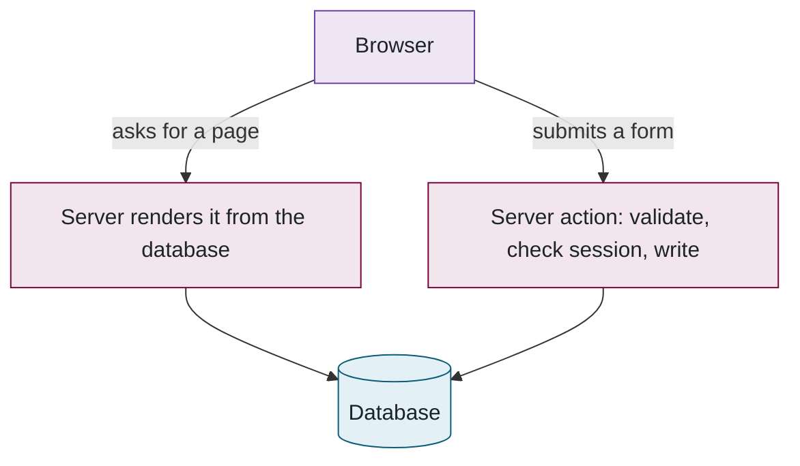

### Submitting

A **dry run** executes the package against two hours of *open* data in about twelve seconds, shows the live console and its error, and costs nothing; that is where format mistakes get caught. Submitting proper asks for a name, description, model type, whether it is private, an optional contest, and co-authors; the form checks itself with the same rules the server uses, so a rejection appears before the upload.

### Reading results

The results page is ordered *why*, then *what*, then *detail*: plain-English insights first (what drove the score, whether the model over-fits the open data, how it copes with cold and with bad sensors), then the 18-row scorecard that sums to the score, then the key traces, then everything else behind folds — all 144 cycles, the score history, the downloads (PDF, JSON, traces).

### The leaderboard

Public, completed, non-hidden models scored by the current benchmark version, ranked by weighted error; ties break on all-cells error, then earlier submission. The same ordering is applied on the server for the rank badge and in the browser for the table, so they cannot disagree. A signed-in user's private models appear with a dashed "~7" — the rank they *would* have — without moving anyone else. Results from an older version of the scoring maths stay listed but unranked, and their authors are asked to resubmit; packages are deleted after evaluation on purpose, so nothing can be re-run automatically.

### Co-authors and contests

A co-author is invited by e-mail, accepts with a button (never a plain link, for the same scanner reason), and only then appears publicly and receives the results. A contest is a time-boxed event with its own leaderboard that freezes at the deadline; entries must stay public, and their name and type freeze once the contest closes.

**Files to open:** [submit-form.tsx](../../src/app/(app)/submit/submit-form.tsx) → [submissions/[id]/page.tsx](../../src/app/(app)/submissions/[id]/page.tsx) → [queries.ts](../../src/lib/queries.ts) → [leaderboard-table.tsx](../../src/components/leaderboard/leaderboard-table.tsx).

---

<a id="part-7"></a>
## 7. Administration and monitoring

> **Plain English.** Administrators can moderate submissions, manage users and contests, change the evaluation limits and the scoring weights, and watch the worker machines. Everything they do is recorded in an activity feed; e-mail is only a copy of it, and each admin chooses which kinds they want. A robot checks every ten minutes that a worker is alive and e-mails once if it is not, and once when it comes back.

The previous parts were the researcher's view. This part is the administrators' view, and how the system tells them when something is wrong.

### The admin pages

Overview (counts and the activity feed) · Submissions (moderate, bulk delete, retry) · Users (verify, roles, delete) · Contests · Messages (the feedback inbox) · Evaluation workers (machines, queue, limits) · Scoring weights · My notifications. Every action begins by re-checking that the caller is an admin, and each has a safety rail; the list is in the appendix.

### Changing the weights

An admin edits the 18 weights (they must sum to 1), previews how many stored scores would move, saves with a reason, and every result is re-scored from its stored metrics — no model is re-run. Authors can be e-mailed the old and new score with a fresh PDF. The previous weights stay in history.

### Notifications

Every event takes two routes — one always, one optional:

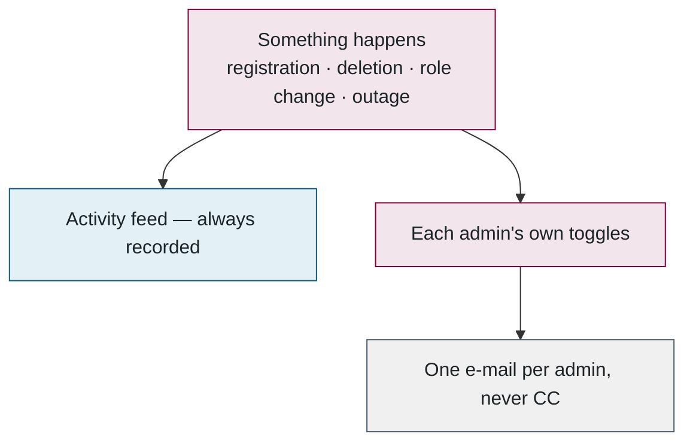

One rule that is easy to get wrong: the website's host freezes a request the instant it has answered, so an e-mail that is sent "in the background" without being waited for is silently dropped. Every such send is wrapped in `after()`, which keeps the request alive until it finishes. This was learned the hard way.

### The outage monitor

Born from a real outage: the worker was healthy but could not reach the database for ten hours, and nobody knew. The website is the one place that can always see both the database and e-mail, so it does the watching. The whole loop:

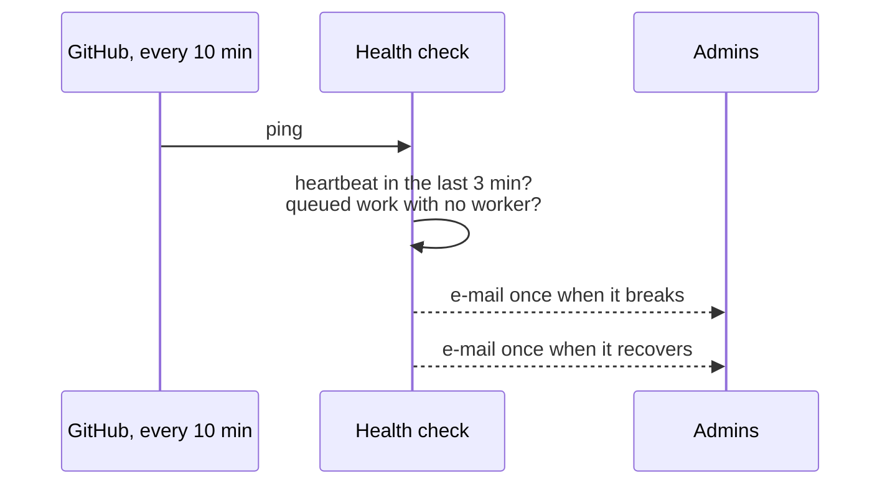

Only *changes* are e-mailed — one alert per outage, one all-clear — and the state lives in the activity feed, so it is visible on the site too.

**Files to open:** [admin/actions.ts](../../src/app/(admin)/admin/actions.ts) → [admin-notify.ts](../../src/lib/admin-notify.ts) → [worker-health/route.ts](../../src/app/api/ops/worker-health/route.ts).

---

<a id="part-8"></a>
## 8. Infrastructure

> **Plain English.** The website deploys itself whenever code is pushed. The worker is a rented Linux computer in the Alliance research cloud that updates itself every ten minutes, restarts only when idle, and runs MATLAB inside a container licensed through the lab's MathWorks account. Secrets sit in files only the worker's own account can read.

Everything so far has described the software; this part is where it physically runs, and how it keeps itself up to date. The diagram is the same three programs as Part 1, now with the services around them:

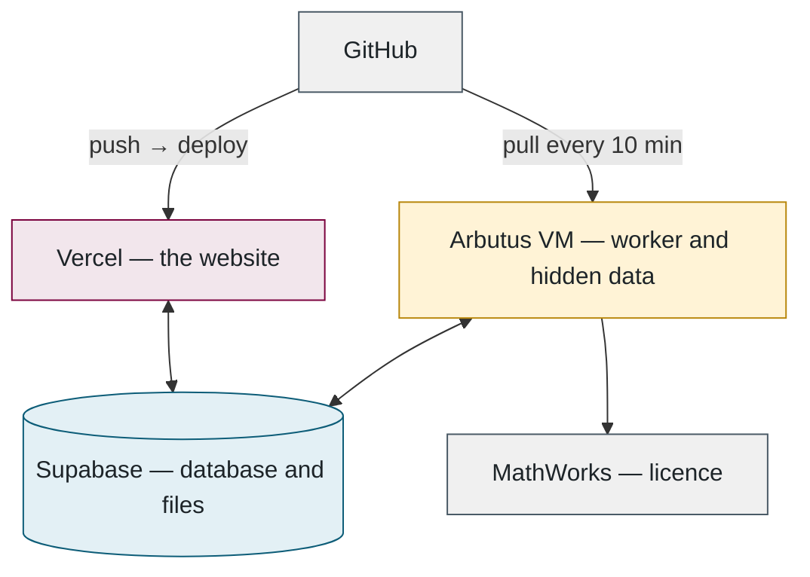

**The VM** is set up by one script: Docker, Node, a no-login service account, the repo checked out with a read-only key, a hardened background service, a firewall that allows only SSH. Secrets and the hidden data are placed by hand afterwards, owned by the service account, readable by nobody else.

**Self-update** runs every ten minutes: fetch the code; if anything changed, rebuild only what it touched (packages, the database client, the sandbox images); then restart the worker — but only if no evaluation is running, otherwise wait for the next tick.

**MATLAB** runs inside MathWorks' own container image, licensed through the lab's account rather than a licence server. A one-time browser sign-in produced a year-long identity token that lives on the VM; for each evaluation the worker exchanges it for a 24-hour token, and only that short-lived token enters the container. The chain, from the long-lived secret to the container:

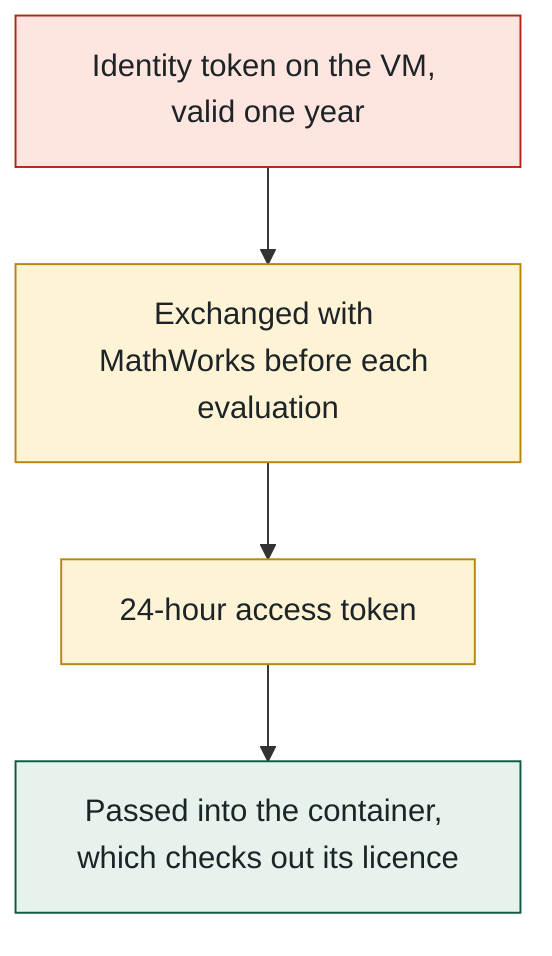

**Running it on a laptop** is the same code with different settings: a local Postgres in Docker, files on disk, e-mail to a test inbox. There is no fake scorer; a developer's worker runs the real evaluator, which needs the hidden data and the sandbox image. The seed creates an admin account and one test user, nothing else.

**Files to open:** [provision-arbutus-worker.sh](../../scripts/provision-arbutus-worker.sh) → [vm-update.sh](../../scripts/vm-update.sh) → [Dockerfile.matlab](../../evaluator/Dockerfile.matlab) → [.env.example](../../.env.example).

---

<a id="part-9"></a>
## 9. Changing things

The most common changes, and where each one is made. Anything not listed here can be found from the *Files to open* lines above.

| You want to… | Do this |
|---|---|
| Change a timeout or the daily cap | Admin → Evaluation workers. No deploy; takes effect within 15 s |
| Change the scoring weights | Admin → Scoring weights: edit, preview, save with a reason, optionally notify authors |
| Change the scoring *maths* | Edit `pipeline.py`; re-run the reference models and confirm only the intended scores moved; bump the benchmark version in `socbench_eval/__init__.py` and `benchmark-version.ts`; old results become "legacy" and authors are e-mailed to resubmit |
| Add a metric | A column in `schema.prisma`, an entry in `test-cases.ts`, compute it in `score()`; the scorecard, PDF and CSV pick it up; check the weights still sum to 1 |
| Add a worker machine | Hidden data, `worker.env`, `npm run worker`; it registers itself and starts taking jobs |
| Rotate a secret | Rotate at the source, update Vercel and `/etc/socbench/worker.env`, restart the worker |
| Renew the MATLAB licence (yearly) | The Workers page shows the expiry; repeat the browser sign-in and `matlab-mhlm-setup.sh` |
| Make someone an admin | Admin → Users → Make admin, or add the address to `ADMIN_EMAILS`; effective on their next request |

---

<a id="part-10"></a>
## 10. A ten-minute demo

1. **Leaderboard** — rank, weighted error, complexity.
2. **One result** — the plain-English insights, the scorecard summing to the score, the worst-case trace, the PDF.
3. **Submit** — run a dry run live (12 s), then submit; watch the queue position and the progress bar.
4. **Admin → Workers** — the machine that just took it: languages, load, console, licence expiry.
5. **Code, in this order** — `schema.prisma` → `claimJob` in `run-job.ts` → the `docker run` line in `python-evaluator.ts` → `score()` in `pipeline.py` → `Run_Model.m`.
6. **Close on the rule** — the website never runs anyone's code and never sees the hidden data.

---

<a id="part-11"></a>
## 11. Glossary

### Battery terms

| Term | Meaning |
|---|---|
| **SOC — state of charge** | How full a battery is, 0–100 %. It cannot be measured, only estimated from current, voltage and temperature. |
| **BMS** | The battery management system: the electronics in a vehicle that run the estimator, one measurement at a time. |
| **Cell** | One physical battery. Four Tesla 2170 cells here, named after the vehicle mass they were driven with: `m80`, `m448`, `m448N`, `m1000`. `m448` is fully hidden. |
| **Drive cycle** | A standard speed profile converted to the current a cell sees. UDDS (urban), HWFET (highway), LA92 and US06 (aggressive), HWCUST and HWGRADE (custom, never published). |
| **Open / blinded data** | Open is published for building models; blinded is secret and used only to score. `blind_data.mat` is the answer key. |
| **Coulomb counting** | Integrating current over time: the simplest estimator, and the reference for the complexity scale. |
| **EKF / UKF** | Kalman filters: classical estimators that fuse a physics model with measurements. |
| **FNN / LSTM / GRU / Transformer** | Neural-network estimators. |
| **RMSE / MAE / max error** | Root-mean-square, mean-absolute and worst single-sample error, in % SOC. |
| **Test case** | One of the 18 scoring categories; each has a weight. |
| **Weighted error** | The leaderboard score: the sum of weight × test-case RMSE. |
| **Robustness sweep** | Starting the model at the wrong SOC, or feeding it current with a constant offset. |
| **Padding** | An hour of the first sample repeated before each cycle so models with memory settle. |
| **Complexity** | A 1–10 bin of compute per sample relative to a Coulomb counter. Informational only. |
| **Dry run** | A free test on open data; no leaderboard entry. |
| **Package** | The uploaded zip: `Model.py` or `Model.m`/`Model.p` plus parameter files. |

### Software terms

| Term | Meaning |
|---|---|
| **Repository / git / GitHub** | The source code, every change recorded, hosted on GitHub. |
| **Serverless** | The host starts a tiny server per request and freezes it the instant it answers. Cheap; quirky. |
| **Container / Docker / image** | An isolated box a program runs in; Docker runs them; an image is the template. |
| **Sandbox** | A container locked down as far as possible: no network, read-only files, no privileges. |
| **Database / table / row** | PostgreSQL stores everything as tables of rows. |
| **Prisma** | Lets TypeScript talk to the database with typed calls; one schema file describes every table. |
| **Server Component / Server Action** | A page that reads the database on the server; a form handler that runs on the server. No API layer. |
| **Signed URL** | A temporary pre-authorised link that lets a browser upload straight to file storage. |
| **Session / JWT / cookie** | After login the browser holds a signed token proving who you are. |
| **bcrypt** | A deliberately slow one-way scramble for passwords. |
| **Rate limit** | At most N attempts per time window. |
| **Queue / job / worker / heartbeat** | Work waiting to be done; one item of it; the program that does it; its periodic "I'm alive". |
| **Compare-and-swap** | "Update this row only if it is still the way I last saw it" — how two workers never take the same job. |
| **Environment variable / `.env`** | Configuration and secrets handed to a program from outside its code. |
| **VM / Arbutus / systemd** | A rented cloud computer; the Alliance's cloud at UVic; Linux's way of running a program as a service. |
| **mode 600** | A file only its owner can read. |

### Numbers worth remembering

144 test cycles (4 cells × 6 temperatures × 6 cycles) · 18 test cases, weights sum to 1 · 3 submissions per day, 5 dry runs per hour · 6-hour evaluation limit · worker polls every 2 s, heartbeat every 15 s · a lock goes stale after 30 min, 2 attempts per job · 50 MB upload cap.

---

<a id="part-12"></a>
## 12. Appendix: reference tables

### Tools

| Tool | What it is | Why it was chosen |
|---|---|---|
| TypeScript, Node.js | The language and runtime for the website and the worker | One typed language for both |
| Next.js 15, React 19 | The web framework | Pages, forms and small APIs in one project; free hosting |
| Tailwind CSS, Radix UI | Styling; accessible dialogs, menus, tooltips | Fast to build; McMaster colours as tokens |
| Recharts, TanStack Table | Charts; the leaderboard's headless table | SVG charts with export; sorting and column picking |
| zod | Form validation | One rule set, used in the browser and on the server |
| Auth.js, bcryptjs | Sessions; password hashing | No third-party identity provider needed |
| Prisma, PostgreSQL (Supabase) | Database access; the database | One schema file; free managed tier with file storage attached |
| nodemailer, pdfkit | E-mail; the PDF report | Provider-agnostic mail; vector PDFs without a browser |
| Python, numpy, scipy | The benchmark maths | Exact, fast, no licence to score; reads `.mat` files |
| MATLAB R2026a | Executes `.m`/`.p` models only | Inside MathWorks' container image, licensed online |
| Docker | The sandbox | Non-negotiable isolation for untrusted code |
| Playwright | Browser tests | Runs on every push that touches the site |
| Vercel, Arbutus, GitHub Actions | Website hosting; the worker VM; the 10-minute health ping | All free tiers |

### Environment variables

| Group | Variables |
|---|---|
| Database | `DATABASE_URL` (pooler, port 6543), `DIRECT_URL` (port 5432, migrations only) |
| Website | `AUTH_SECRET`, `AUTH_URL`, `NEXT_PUBLIC_SITE_URL`, `ADMIN_EMAILS`, `CRON_SECRET`, `OPS_HEALTH_TOKEN` |
| Mail | `SMTP_HOST`, `SMTP_PORT`, `SMTP_USER`, `SMTP_PASS`, `MAIL_FROM`, `ADMIN_NOTIFY_EMAIL` |
| Storage | `STORAGE` (local / supabase), `UPLOAD_DIR`, `MAX_UPLOAD_MB`, `SUPABASE_URL`, `SUPABASE_SERVICE_KEY`, `SUPABASE_BUCKET` |
| Worker | `SOCBENCH_BLIND_DATA`, `SOCBENCH_PYTHON`, `MATLAB_BIN`, `WORKER_CONCURRENCY`, `WORKER_RUNTIMES` |
| Sandbox | `EVAL_SANDBOX`, `EVAL_SANDBOX_IMAGE`, `EVAL_SANDBOX_MATLAB_IMAGE`, `EVAL_MATLAB_MHLM_FILE`, `EVAL_MATLAB_NETWORK`, `EVAL_CPUS`, `EVAL_MEMORY` |
| Calibration | `SOCBENCH_CAL_PYTHON`, `SOCBENCH_CAL_MATLAB` |

Every line is annotated in `.env.example`. Production values live only on Vercel and in `/etc/socbench/worker.env` on the VM.

### Limits

| What | Limit |
|---|---|
| Register | 5 per hour per address |
| Login | 10 per 15 min per account, 40 per 15 min per IP |
| Password reset / resend verification | 3 per hour per e-mail |
| Contact form | 5 per hour per IP |
| Upload links | 30 per hour per user |
| Dry runs | 5 per hour (admins unlimited) |
| Submissions | 3 per rolling 24 h (admins exempt) |
| Evaluation / dry run | 360 min / 10 min |
| Zip | ≤ 500 entries, ≤ 512 MB unpacked, ≤ 256 MB per entry, ≤ 200 : 1 compression, no folders, no symlinks |

### Admin actions and their rails

| Action | Rail |
|---|---|
| Moderate a submission | Reason ≥ 10 characters; not while RUNNING; contest entries cannot be made private (hide instead) |
| Bulk delete | Up to 100; RUNNING skipped; one activity line; authors optionally e-mailed |
| Delete a user | Not yourself; not an admin (demote first); not while their work is RUNNING |
| Change a role | Not your own |
| Worker pause / resume / stop | Picked up at the next heartbeat |
| Release a job lock | Behind a confirm — a live worker would double-evaluate |
| Evaluation settings | Timeout 10–1440 min, dry run 2–60 min, per day 1–100 |
| Scoring weights | Preview first; must sum to 1 |
| Contests | Only one open at a time |

### Key columns

| Table | Columns that matter |
|---|---|
| `User` | `email`, `passwordHash`, `role`, `emailVerified` (a timestamp), `adminNotify` toggles, `avatar` |
| `Submission` | `seq` (the visible number), `modelName`, `modelType`, `runtime` (python / matlab), `status`, `version`, `isPrivate`, `isHidden`, `fileKey`, `contestId` |
| `EvaluationJob` | `attempts`, `lockedAt`, `lockedBy`, `log`, `cancelRequestedAt` |
| `EvaluationResult` | `weightedError`, `complexity`, the 18 metric columns, `maxError`, `perCycle`, `timeSeries`, `robustness`, `tracesKey`, `evaluatorVersion` |
| `ScoreRevision` | `kind` (evaluation, failure, rescore, resubmission, edit, cancelled, legacy), the score and metrics at that moment, `note`, `by` |
| `WorkerHeartbeat` | `hostname`, `lastSeenAt`, `runtimes`, `busyWith`, `paused`, `command`, machine diagnostics, `log` |
