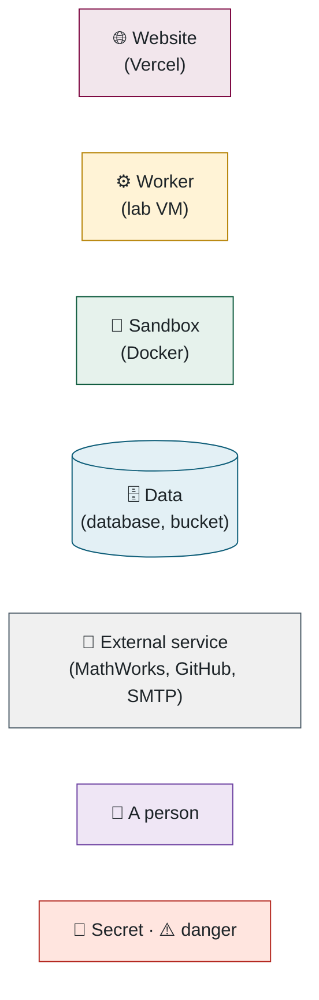

# Battery SOC Benchmark — the complete codebase walkthrough

This is the whole system explained in one place: what it does, how each part works, why it was built the way it was, and where to look in the code when you want to check something.

You don't need to be a developer to follow it. Every part starts with a short plain-English summary, and the diagrams are drawn to make sense on their own, so you can read the summaries and the pictures and skip anything in `monospace` without losing the thread. If you are a developer and the codebase is new to you, read it in order once; each part ends with a list of the files to open, and the glossary at the end covers any term you haven't met. If you already know this stack, the parts most worth your time are the submission journey, the scoring, authentication and the recipes, because those hold the decisions you couldn't guess from the code — and the questions section near the end is the list people actually ask.

Every claim points at a file so it can be checked. The diagrams are Mermaid and render on GitHub.

**Colour key used in every diagram**

---

---

## Contents

1. [⚡ The five-minute version](01-the-five-minute-version.md) — 3 diagrams
2. [🧰 The tools and libraries, and why each one](02-the-tools-and-libraries-and-why-each-one.md) — 2 diagrams
3. [📦 Life of a submission, end to end](03-life-of-a-submission-end-to-end.md) — 11 diagrams
4. [▶️ The evaluation engine — running the model](04-the-evaluation-engine-running-the-model.md) — 6 diagrams
5. [🧮 The evaluation engine — scoring, complexity and outputs](05-the-evaluation-engine-scoring-complexity-and-outputs.md) — 5 diagrams
6. [🗄️ The data model](06-the-data-model.md) — 3 diagrams
7. [🪪 Authentication and accounts](07-authentication-and-accounts.md) — 4 diagrams
8. [🖥️ The web tier: submitting, results, leaderboard](08-the-web-tier-submitting-results-leaderboard.md) — 8 diagrams
9. [🛎️ Administration, notifications, reports, monitoring](09-administration-notifications-reports-monitoring.md) — 5 diagrams
10. [🏗️ Infrastructure and operations](10-infrastructure-and-operations.md) — 7 diagrams
11. [🛡️ Security: threats and what stops them](11-security-threats-and-what-stops-them.md) — 2 diagrams
12. [❓ Questions you will probably get](12-questions-you-will-probably-get.md) — 0 diagrams
13. [🛠️ How to change things — recipes](13-how-to-change-things-recipes.md) — 1 diagram
14. [🎬 A demo order that tells the story](14-a-demo-order-that-tells-the-story.md) — 1 diagram
15. [🏷️ Glossary](15-glossary.md) — 1 diagram

Read in order the first time; each part opens with a plain-English summary and stands on its own afterwards.

**Read it as one piece:** [ALL-IN-ONE.md](ALL-IN-ONE.md) is the whole walkthrough in a single file (best in an editor or offline), and [codebase-walkthrough.pdf](codebase-walkthrough.pdf?raw=true) is the same content with every diagram rendered and a clickable contents page, for reading anywhere.
