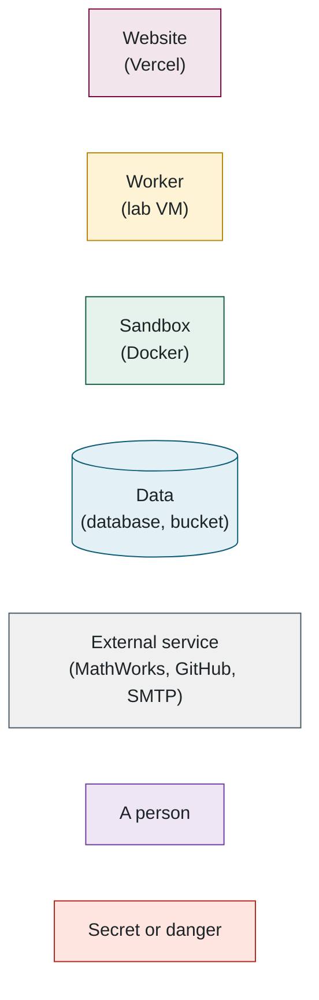

# Battery SOC Benchmark — the complete codebase walkthrough

This is the full explanation of the system: what it does, how every part works, why it was built the way it was, and where to look in the code. It is written for three readers at once.

- **Non-developers** (lab members, supervisors, collaborators from other fields): each part opens with a *Plain English* box, and the diagrams are drawn so the picture makes sense without the prose. Skip anything in `monospace`.
- **Developers new to this project**: read in order once. Every term, library and tool is defined the first time it appears, and Part 1 is a glossary to come back to. Each part ends with *Files to open, in order*.
- **Developers who know the stack**: Parts 4, 6, 8 and 14 contain the decisions you would not guess from the code alone; Part 13 is the list of questions people ask.

Every claim is anchored to a file path so it can be checked. Diagrams are Mermaid and render on GitHub.

**Colour key used in every diagram**

---

---

## Contents

1. [Glossary](01-glossary.md) — 1 diagram
2. [The five-minute version](02-the-five-minute-version.md) — 3 diagrams
3. [The tools and libraries, and why each one](03-the-tools-and-libraries-and-why-each-one.md) — 2 diagrams
4. [Life of a submission, end to end](04-life-of-a-submission-end-to-end.md) — 10 diagrams
5. [The evaluation engine — running the model](05-the-evaluation-engine-running-the-model.md) — 6 diagrams
6. [The evaluation engine — scoring, complexity and outputs](06-the-evaluation-engine-scoring-complexity-and-outputs.md) — 5 diagrams
7. [The data model](07-the-data-model.md) — 3 diagrams
8. [Authentication and accounts](08-authentication-and-accounts.md) — 4 diagrams
9. [The web tier: submitting, results, leaderboard](09-the-web-tier-submitting-results-leaderboard.md) — 8 diagrams
10. [Administration, notifications, reports, monitoring](10-administration-notifications-reports-monitoring.md) — 5 diagrams
11. [Infrastructure and operations](11-infrastructure-and-operations.md) — 7 diagrams
12. [Security: threats and what stops them](12-security-threats-and-what-stops-them.md) — 2 diagrams
13. [Questions you will probably get](13-questions-you-will-probably-get.md) — 0 diagrams
14. [How to change things — recipes](14-how-to-change-things-recipes.md) — 1 diagram
15. [A demo order that tells the story](15-a-demo-order-that-tells-the-story.md) — 1 diagram

Read in order the first time; each part opens with a plain-English summary and stands on its own afterwards.
