# Battery SOC Benchmark — codebase walkthrough

This document is for anyone who needs to understand how the benchmark works, whether you are going to change the code or just want to know what happens to a model after it is uploaded.

Each part opens with a short summary in plain language. Read those and look at the pictures and you will have the whole story; the file names and code paths are there for when you want to go deeper. If you are picking up the codebase, go through it once in order. The files worth opening are listed at the end of each part, definitions are in the glossary, and the settings, limits and tools are tabulated in the appendix so they do not clutter the explanation.

The diagrams share one colour scheme:

```mermaid
flowchart LR
    W["Website"] ~~~ K["Worker"] ~~~ S["Sandbox"] ~~~ D[("Data")] ~~~ E["Outside service"] ~~~ P["Person"] ~~~ X["Hidden data or risk"]
    classDef web fill:#F2E6EC,stroke:#7A003C,color:#1d2428
    classDef worker fill:#FFF3D6,stroke:#B8860B,color:#1d2428
    classDef sandbox fill:#E6F2EC,stroke:#0E5B3D,color:#1d2428
    classDef data fill:#E3F0F5,stroke:#0D5D78,color:#1d2428
    classDef ext fill:#F0F0F0,stroke:#495965,color:#1d2428
    classDef person fill:#EFE6F5,stroke:#6B3FA0,color:#1d2428
    classDef danger fill:#FFE5DF,stroke:#B3261E,color:#1d2428
    class W web
    class K worker
    class S sandbox
    class D data
    class E ext
    class P person
    class X danger
```

---

---

## Contents

1. [The five-minute version](01-the-five-minute-version.md) — 2 diagrams
2. [How a submission is evaluated](02-how-a-submission-is-evaluated.md) — 4 diagrams
3. [How the score is computed](03-how-the-score-is-computed.md) — 2 diagrams
4. [The database](04-the-database.md) — 1 diagram
5. [Accounts and security](05-accounts-and-security.md) — 1 diagram
6. [The website](06-the-website.md) — 1 diagram
7. [Administration and monitoring](07-administration-and-monitoring.md) — 2 diagrams
8. [Infrastructure](08-infrastructure.md) — 2 diagrams
9. [Changing things](09-changing-things.md) — 0 diagrams
10. [A ten-minute demo](10-a-ten-minute-demo.md) — 0 diagrams
11. [Glossary](11-glossary.md) — 0 diagrams
12. [Appendix: reference tables](12-appendix-reference-tables.md) — 0 diagrams

Read in order the first time; each part opens with a plain-English summary and stands on its own afterwards.

**Read it as one piece:** [ALL-IN-ONE.md](ALL-IN-ONE.md) is the whole walkthrough in a single file (best in an editor or offline), and [the PDF](https://github.com/McMaster-Battery-Research-Group/battery-soc-benchmark/raw/main/docs/walkthrough/codebase-walkthrough.pdf) is the same content with every diagram rendered and a clickable contents page.
